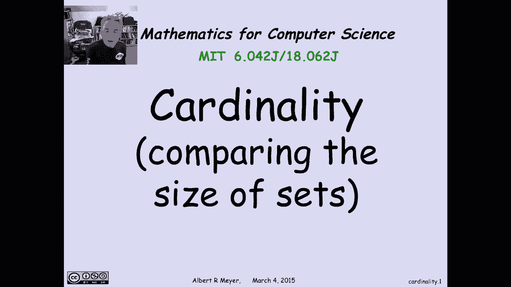
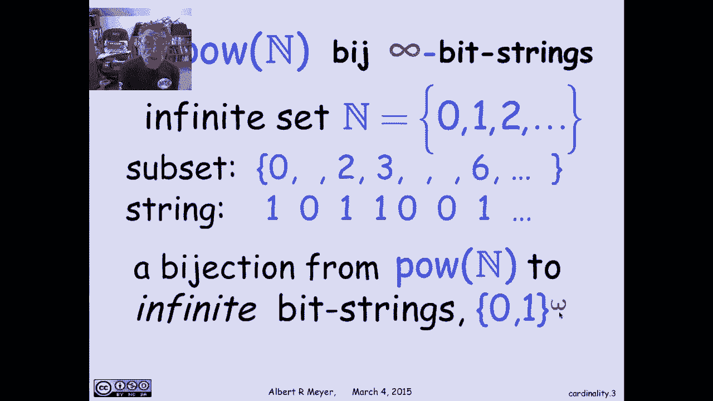
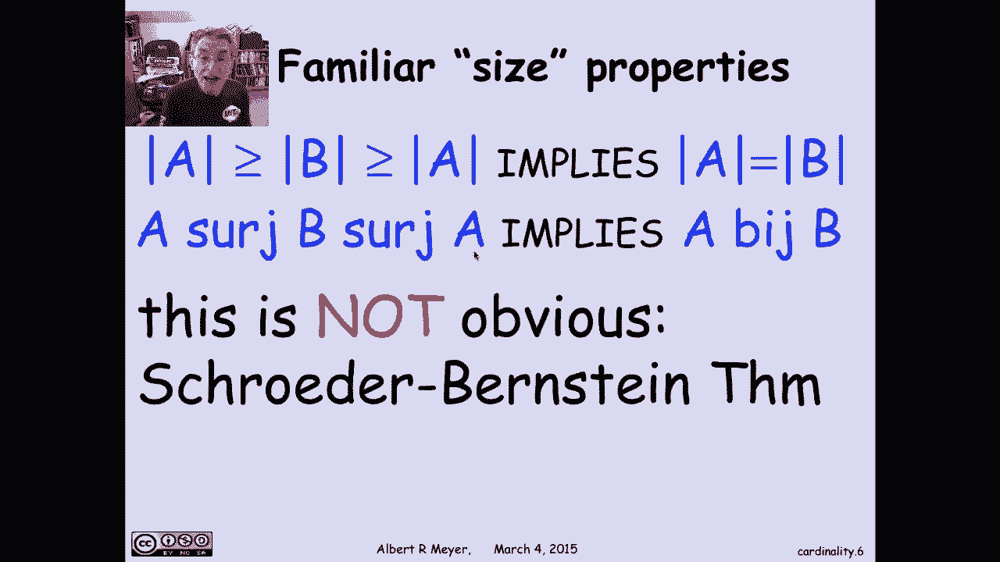
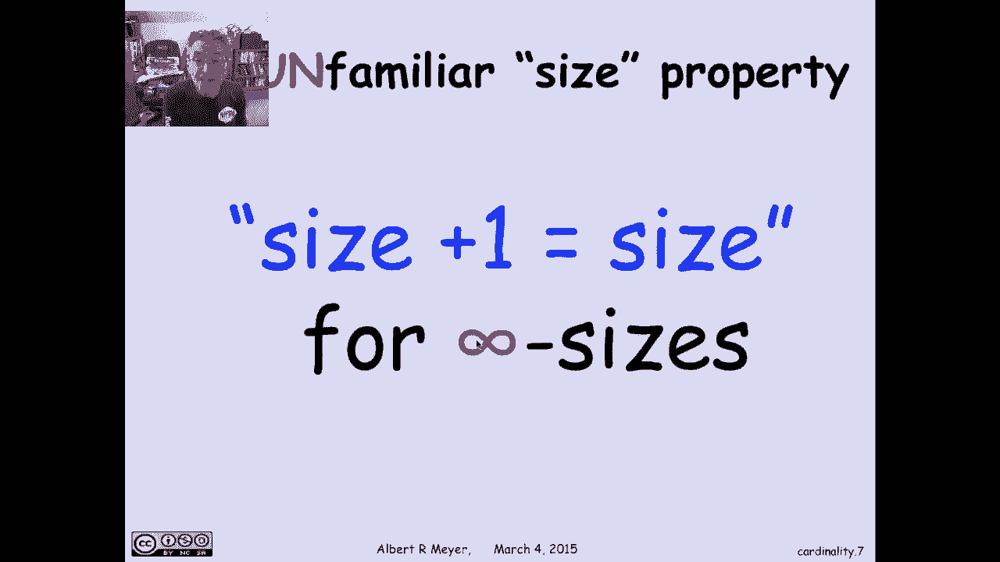
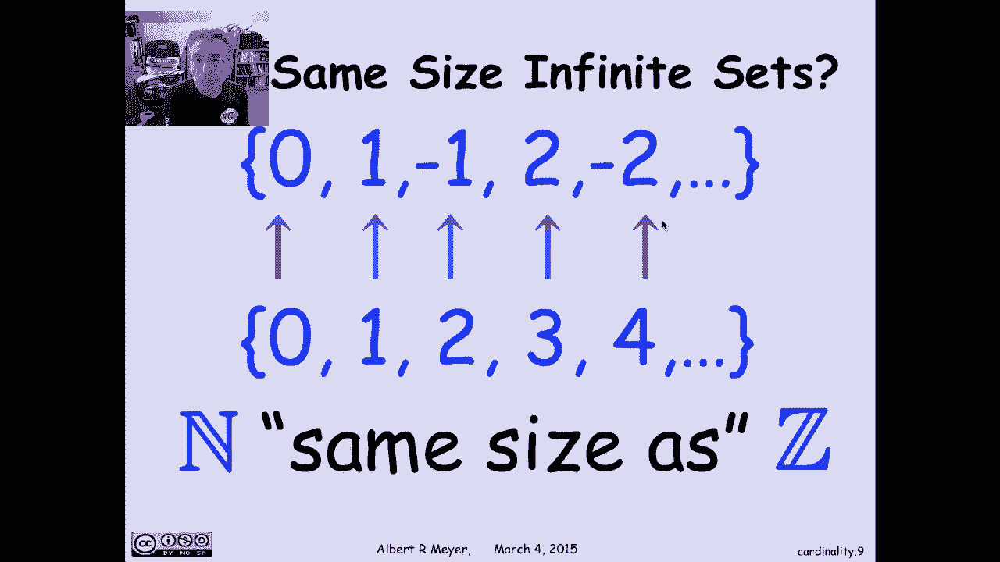
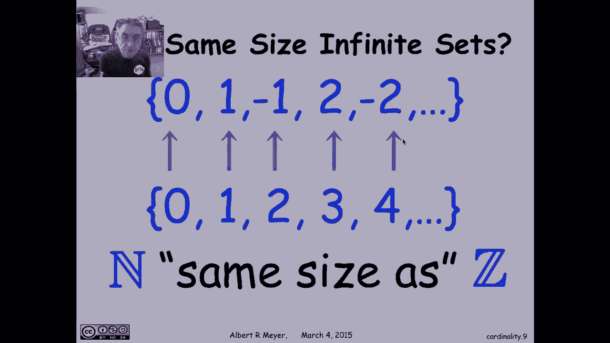

# 计算机科学的数学基础：P29：L1.11.1：集合的基数

在本节课中，我们将要学习集合的“基数”这一概念。基数用于描述集合的大小，特别是无限集的大小。我们将探讨为什么计算机科学需要关心无限集，并学习如何严谨地比较无限集的大小。

## 为什么关心无限集？

上一节我们引入了基数的概念，本节中我们来看看为什么计算机科学需要研究无限集。

虽然计算机内存中的每个数据结构都是有限的，我们计算的每个整数也是有限的，但抽象的“所有整数”的集合却是无限的。同样，所有可能被计算的矩阵的集合也是一个无限集。因此，我们经常理所当然地使用无限集并进行推理。

从教学角度看，引入无限集并严谨地推理，能迫使我们超越直觉，严格遵循数学规则。因为从有限集继承的一些性质在无限集中可能不再成立，我们必须仔细思考其背后的规则和性质。

最后，比较无限集大小的推理在计算机科学中具有深远意义，因为它引出了计算的理论极限，以及计算机无法解决的特定问题实例，我们将在后续视频中讨论。

## 康托尔的基数思想

现在，让我们回到基数的主题。19世纪末，数学家康托尔在研究级数时，为了表达其级数并非在“非常多”的无限点发散，发展出了比较无限集大小的思想。

根据映射引理，对于有限集A和B，当且仅当存在一个从A到B的**满射**函数时，A的大小大于或等于B的大小。康托尔的想法是：既然这对有限集成立，为何不将其作为定义，用于说明无限集A至少和B一样大呢？

因此，我们将 `A surge B`（存在从A到B的满射）理解为“A至少和B一样大”。对于有限集，这确实等价于A的元素数量大于等于B。

需要说明的是，谈论无限集的“大小”或“基数”本身是一个抽象且技术性的概念，实际用处不大。因此，我们不会直接讨论某个无限集的基数，而是会比较它们。我们将建立一个基础理论，来讨论一个集合的基数是否大于等于另一个集合的基数。

类似地，`A bij B`（存在从A到B的双射）将被理解为“A和B大小相同”。对于有限集，这确实意味着它们元素数量相同。对于无限集，我们采用双射关系来定义“大小相同”，即存在一个完美的、一一对应的映射。

## 一个双射的例子：幂集与无限比特串

以下是双射关系应用的一个例子：非负整数集N的幂集。

设N为非负整数集 `{0, 1, 2, ...}`，其幂集是N的所有子集。我们可以发现，N的子集与无限比特串（由0和1组成的无限序列）之间存在一个明显的双射。

具体方法如下：对于N的任意一个子集（可能是无限子集），我们用一个无限比特串来表示它。如果某个整数n在子集中，则序列的第n位为1；如果不在，则为0。

这种逻辑与我们之前建立的非负整数有限子集与有限比特串之间的双射完全相同，只是现在将其扩展到了任意子集。因此，这定义了一个双射：每个整数子集对应一个唯一的无限比特串，反之亦然。

这里，符号 `{0, 1}^ω` 表示向右无限的比特串（有起点），以区别于 `{0, 1}^*`，后者表示所有有限比特串的集合。

## 基数关系的性质

上一节我们看到了如何用双射定义“大小相同”，本节我们来探讨基数关系的一些基本性质。如果“surge”和“bij”关系真的像大小比较一样运作，它们应该满足一些性质。

### 传递性

对于有限集，如果A的大小等于B，且B的大小等于C，那么A的大小等于C。这对无限集是否成立？即，如果 `A bij B` 且 `B bij C`，是否意味着 `A bij C`？

答案是肯定的。证明如下：由 `A bij B` 可知存在双射函数 `g: A -> B`。由 `B bij C` 可知存在双射函数 `f: B -> C`。我们需要从A到C找到一个双射。这很简单，只需将 `g` 和 `f` 复合，即定义函数 `h = f ∘ g`。容易验证，如果 `g` 和 `f` 都是双射，那么它们的复合 `h` 也是双射。这就找到了所需的从A到C的双射。

类似的性质也适用于“至少一样大”的关系（即surge）。对于有限集，如果A的大小 ≥ B，且B的大小 ≥ C，那么A的大小 ≥ C。同样的复合论证对满射也有效，因为满射函数的复合仍然是满射函数。因此，如果 `A surge B` 且 `B surge C`，则 `A surge C`。

### 施罗德-伯恩斯坦定理

让我们看另一个熟悉的性质：如果A的大小 ≥ B，且B的大小 ≥ A，那么A和B大小相同。这对有限集显然成立，但对无限集呢？

我们说的是：如果存在从A到B的满射函数，并且存在从B到A的满射函数，那么A和B之间存在一个双射。问题在于，这个从A到B的满射可能不是双射，从B到A的满射也可能不是双射。那么双射从哪里来？我们必须构造它。

这个性质是成立的，它被称为**施罗德-伯恩斯坦定理**。其技巧基本上是：利用给定的从A到B和从B到A的满射（或单射），以一种巧妙的方式组合它们的一部分，从而构造出所需的双射。这个证明需要一些巧思，包含在教材的习题中。因此，这是一个对surge和bij都成立的性质，但并不显而易见。

### 无限集的特有性质：大小加一等于大小

现在，让我们看一个不熟悉的大小性质，一个在有限集中不成立、因此我们必须谨慎对待的性质：对于无限集，**大小加一等于大小**。

这是什么意思？让我们用一个例子来说明。事实上，你可以说无限集的一个定义就是其大小加一后仍等于自身大小。

看一个简单的例子：在下图底部，我们有非负整数集 `N = {0, 1, 2, ...}`。在顶部，我们有正整数集 `Z+ = {1, 2, 3, ...}`。正整数集加上元素0就得到了非负整数集，这就是“加一”的含义。一个无限集添加一个元素后，得到了另一个无限集，但它们大小相同。为了证明它们大小相同，我需要展示它们之间的一个双射。

这个双射是：将0映射到1，1映射到2，2映射到3，依此类推。这被称为“加一”函数 `f(n) = n + 1`，它将非负整数映射到正整数，并且是一个完美的双射。因此，在正整数集中添加一个元素0，并没有得到一个更大的集合，而是得到了一个大小相同的集合。

这个论证可以推广到任何无限集：如果你向一个无限集添加一个额外元素，你仍然可以在原集合和添加元素后的新集合之间找到一个双射。

### 另一个例子：整数集与非负整数集

再来看另一个例子：我可以枚举出所有整数（正、负和零）：0, 1, -1, 2, -2, ... 这给出了整数集 `Z`。而在另一边，我可以列出非负整数：0, 1, 2, 3, ... 我在顶部有序列出整数的方式，隐式地定义了一个双射：我将0映射到序列的第一个元素（0），1映射到第二个元素（1），2映射到第三个元素（-1），3映射到第四个元素（2），4映射到第五个元素（-2），依此类推。

这样，我实际上定义了非负整数集与所有整数集之间的一个双射。换句话说，你取整数的一半（非负整数），它仍然与所有整数大小相同。在 `N` 和 `Z` 之间存在一个双射。

如果你想写出一个公式来确定数字n映射到哪个整数（正或负），这涉及将n除以2并取整，但这不是关键。一旦我找到一种合理的方式将所有整数排成一行，我就可以将它们与非负整数对齐，而这种排列方式本身就定义了映射。

## 总结

本节课中，我们一起学习了集合基数的核心概念，特别是针对无限集。我们了解到：
*   基数是比较集合大小的方式，对于无限集，我们通过**满射**定义“至少一样大”，通过**双射**定义“大小相同”。
*   计算机科学关心无限集，因为它是许多抽象的基础，并且研究它能锻炼严谨的数学思维。
*   基数关系满足传递性等性质，但像“大小加一等于大小”这样的性质是无限集特有的，与有限集直觉不同。
*   我们通过具体的双射例子（如非负整数与正整数、非负整数与所有整数）加深了对这些抽象概念的理解。

理解这些内容是后续学习可计算性理论和计算极限的重要基础。