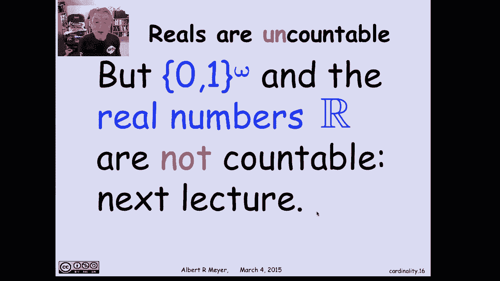

# 计算机科学的数学基础：L1.11.3：可数集合 📊

在本节课中，我们将学习**可数集合**的概念。可数集合是最常见的一类无限集合，理解它对于后续学习计算机科学中的数学基础至关重要。我们将通过定义、例子和引理来掌握如何判断一个集合是否可数。

## 可数集合的定义

上一节我们介绍了无限集合的基本概念，本节中我们来看看什么是可数集合。

一个集合被称为**可数**的，如果它的元素可以被“列出”。更正式地说，集合A是可数的，当且仅当在A与非负整数集合之间存在一个**双射**（即一一对应关系）。这意味着我们可以将A中的每个元素与一个唯一的非负整数（0, 1, 2, …）配对。

**公式**：`A` 是可数的 ⇔ 存在双射 `f: ℕ → A`，其中 `ℕ` 表示非负整数集合。

这个定义包含两种情况：
1.  **可数无限集合**：集合A是无限的，并且存在这样的双射。
2.  **有限集合**：有限集合也被认为是可数的。

## 可数集合的例子

以下是几个关键的可数集合例子，它们展示了如何构造与非负整数之间的双射。

*   **正整数集合**：我们可以将正整数 `n` 映射到非负整数 `n-1`。
*   **所有整数集合**：我们可以按 `0, 1, -1, 2, -2, 3, -3, …` 的顺序列出所有整数。
*   **有限二进制字符串集合**：所有由0和1组成的有限长度字符串（记作 `{0,1}*`）是可数的。我们可以按长度递增的顺序列出它们：
    *   空字符串
    *   所有长度为1的字符串：`0`, `1`
    *   所有长度为2的字符串：`00`, `01`, `10`, `11`
    *   以此类推。
*   **非负整数对集合**：所有形如 `(m, n)` 的序对（其中 `m` 和 `n` 是非负整数）是可数的。我们可以按照两数之和 `m+n` 递增的顺序列出它们，在每一“和”的块内按特定规则（例如按 `m` 递增）排序：
    *   `(0,0)`
    *   `(0,1)`, `(1,0)`
    *   `(0,2)`, `(1,1)`, `(2,0)`
    *   以此类推。

## 一个有用的引理

直接构造双射有时比较困难。下面这个引理提供了证明可数性的另一种更简便的方法。

**引理**：一个集合 `A` 是可数的，当且仅当存在一个从非负整数集合到 `A` 的**满射**。

**公式**：`A` 是可数的 ⇔ 存在满射 `g: ℕ → A`。

这个引理非常有用，因为描述一个满射（允许“覆盖”集合A中所有元素，但允许重复）通常比描述一个双射（要求一一对应且无重复）更容易。

**证明思路**：
*   如果 `A` 是有限的，显然可以构造满射（例如，将多余的非负整数都映射到A的最后一个元素）。
*   如果 `A` 是无限的，并且我们有一个满射 `g: ℕ → A`，它定义了一个允许重复的列表。要得到双射，我们只需从左到右遍历这个列表，**过滤掉每个元素的重复出现，只保留其第一次出现的位置**。由于A是无限的，这个过程将产生一个没有重复的无限列表，即一个双射。

## 引理的应用：有理数是可数的

现在，让我们运用这个引理来证明一个重要的结论：**所有有理数的集合是可数的**。直观上，有理数在数轴上非常“稠密”，似乎很难列出，但通过将其与已知的可数集合关联，我们可以轻松证明。

我们知道**非负整数对** `(m, n)` 的集合是可数的。现在，我们构造一个从该集合到**非负有理数**的满射：

**代码/映射描述**：`f(m, n) = m / n` （当 `n ≠ 0`）；当 `n = 0` 时，定义 `f(m, 0)` 为某个固定的有理数（例如 `1/2`）。

这个映射是满射的，因为任何非负有理数都可以表示为两个非负整数的商 `m/n`（尽管表示方式可能不唯一，例如 `1/2` 和 `2/4` 都映射到同一个有理数，这正好满足了满射允许“重复”覆盖的要求）。

因此，根据我们的引理，非负有理数是可数的。通过类似的方法（例如将负有理数与负整数对关联），可以证明**所有有理数**的集合都是可数的。

## 不可数集合的预告

与有理数形成鲜明对比的是，**实数集合是不可数的**。同样，**所有无限二进制序列的集合**（例如代表 `[0,1)` 区间内实数的二进制展开）也是不可数的。事实上，可以证明无限二进制序列的集合与**非负整数集的幂集**（即所有子集的集合）之间存在双射，而这两个都是不可数集合的经典例子。我们将在后续课程中深入探讨。

## 总结

本节课中我们一起学习了：
1.  **可数集合**的定义：存在与非负整数之间的双射。
2.  几个基本的**可数集合例子**：整数、有限二进制字符串、非负整数对。
3.  一个关键的**引理**：集合可数等价于存在从非负整数到该集合的满射。这为证明可数性提供了更便捷的工具。
4.  应用该引理证明了**有理数集合是可数的**，这是一个重要且可能反直觉的结论。
5.  了解到**实数集**和**无限二进制序列集**是**不可数**的，为后续学习奠定了基础。

掌握可数与不可数的概念，是理解计算理论中问题规模、算法复杂度以及可计算性概念的重要基石。