# 计算机科学的数学基础：L1.11.4：康托尔定理 🧮

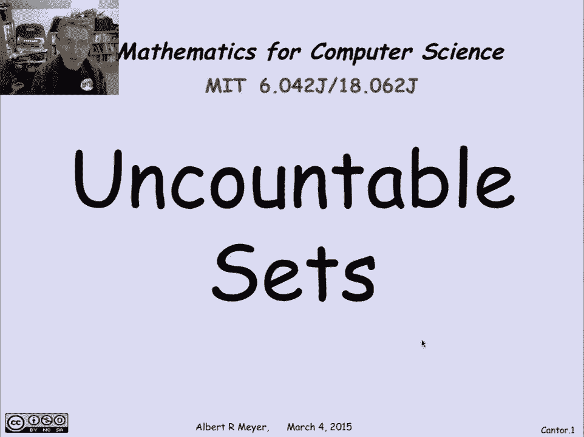

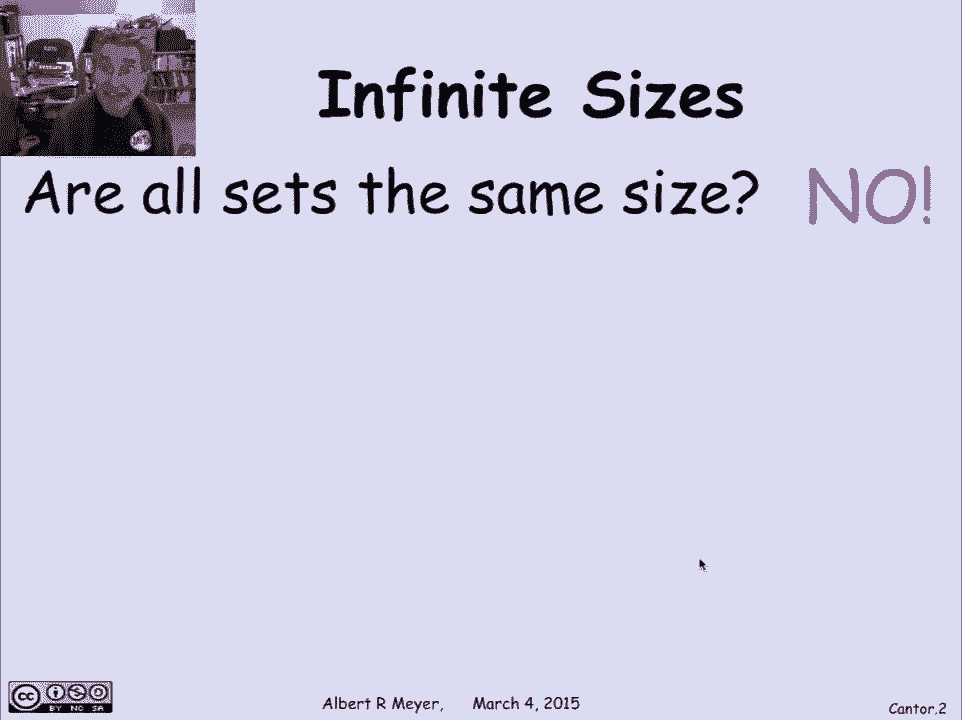

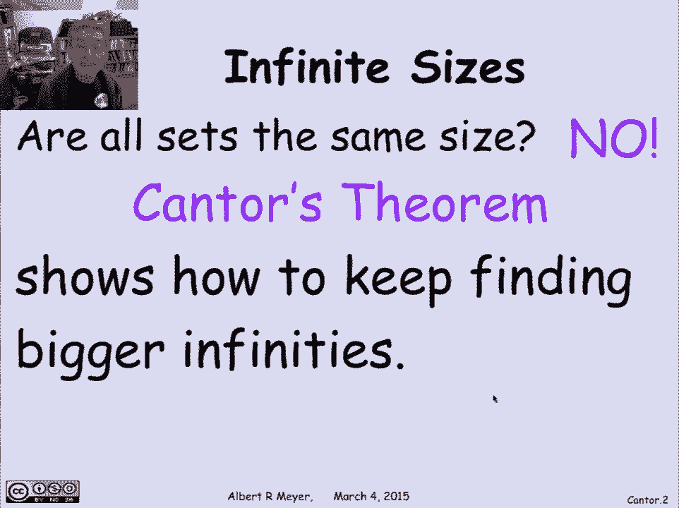

在本节课中，我们将要学习不可数集的概念，并深入探讨康托尔定理。康托尔定理是集合论中的一个核心结论，它表明对于任何集合，其幂集（即所有子集的集合）的“大小”总是严格大于原集合的“大小”。我们将通过著名的对角线论证来证明这一点，并理解其深远意义。

## 不可数集与对角线论证

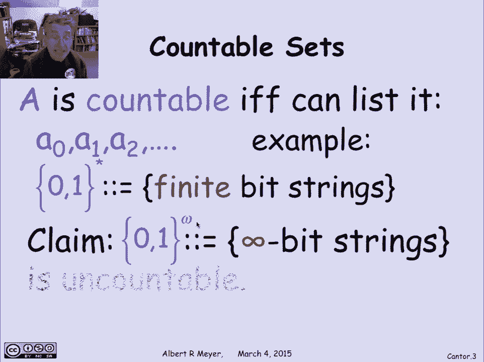

上一节我们介绍了可数集的概念。本节中我们来看看如何证明一个集合是不可数的。康托尔通过一个巧妙的方法——对角线论证——给出了明确的答案。

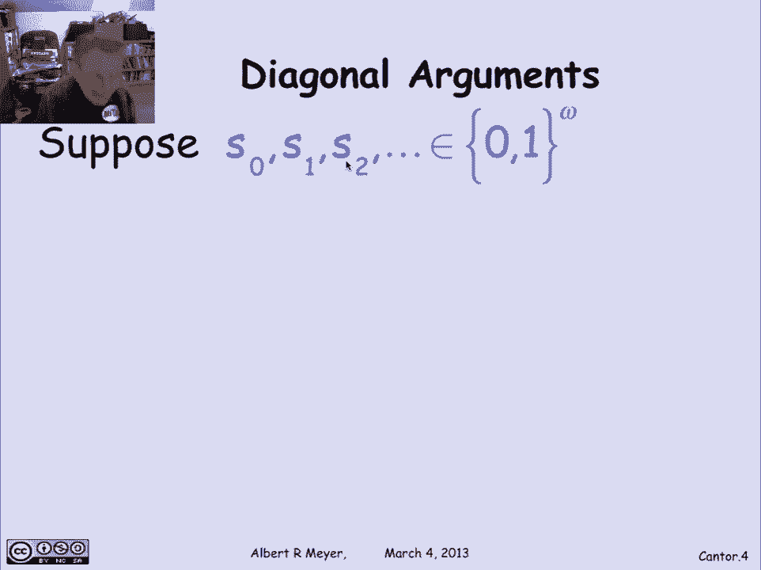

康托尔定理的核心思想是：对于任何给定的无穷大，都不存在“最大的”无穷大。你总能用一种简单的方法找到一个更大的无穷大。

让我们从最简单的形式开始，即如何使用对角线论证来证明一个集合是不可数的。回忆一下，一个集合是可数的，如果它的元素可以被列成一个序列（允许重复）。换句话说，集合A是可数的，如果存在一个序列 `a0, a1, a2, ...`，使得A中的每个元素都在该序列的某个位置出现。

例如，所有有限长度的二进制字符串（如“0”，“1”，“01”，“110”等）的集合是可数的。然而，如果我们考虑所有**无限长**的二进制序列（例如 `01101001...`，向右无限延伸），情况就不同了。我们将证明这是一个不可数集的例子。

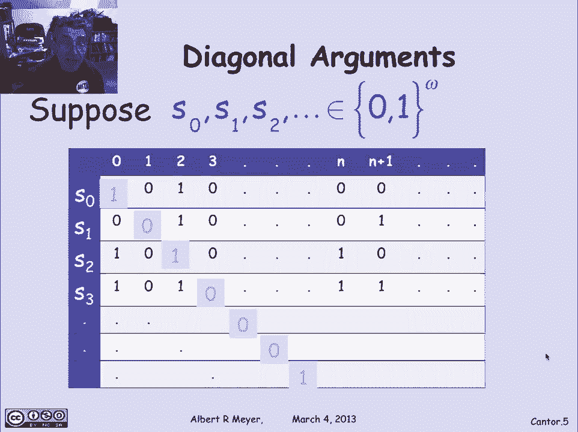

### 对角线论证详解

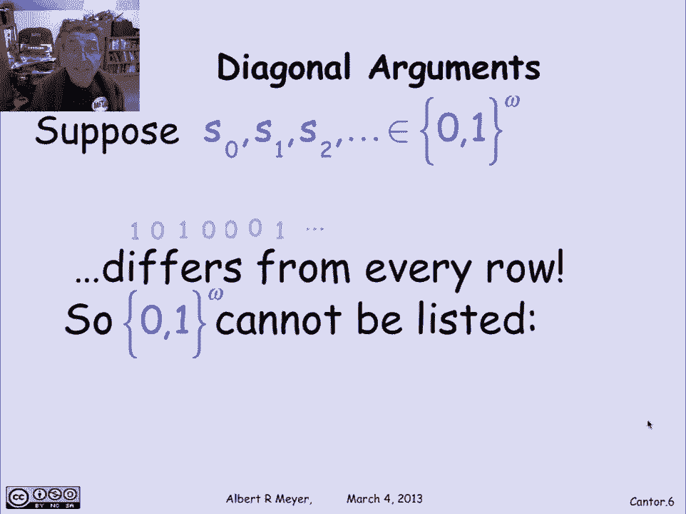

我们如何用对角线论证来证明无限二进制序列的集合 `{0, 1}^ω` 是不可数的呢？思路如下：

1.  **假设可列**：首先，为了推导矛盾，我们假设所有无限二进制序列是可列的。这意味着我们可以把它们全部列出来，形成一个无限长的列表：
    *   `S0 = (s00, s01, s02, ...)`
    *   `S1 = (s10, s11, s12, ...)`
    *   `S2 = (s20, s21, s22, ...)`
    *   ...
    这里，`sij` 表示第 `i` 个序列的第 `j` 位（0或1）。我们可以把这个列表想象成一个行和列都无限延伸的矩阵。

2.  **构造“对角线”序列**：现在，我们沿着这个矩阵的“主对角线”构造一个新的二进制序列 `D`。`D` 的第 `i` 位 `di` 定义为与第 `i` 个序列 `Si` 的第 `i` 位 `sii` **相反**。
    *   如果 `s00 = 0`，则令 `d0 = 1`。
    *   如果 `s11 = 1`，则令 `d1 = 0`。
    *   如果 `s22 = 0`，则令 `d2 = 1`。
    *   ...
    用公式表示就是：**`di = 1 - sii`** 或 **`di = NOT(sii)`**。

3.  **证明矛盾**：我们构造出的序列 `D` 不可能出现在我们假设的那个完整列表中。为什么呢？对于列表中的任何一个序列 `Sk`，`D` 在第 `k` 位上都与 `Sk` 不同（因为 `dk ≠ skk`）。因此，`D` 与列表中的每一个序列都至少有一位不同，所以它不在列表中。

4.  **得出结论**：这就产生了矛盾。我们假设可以列出所有无限二进制序列，但却构造出了一个不在列表中的序列。因此，最初的假设是错误的。**不存在从非负整数集 `N` 到无限二进制序列集 `{0, 1}^ω` 的满射**。根据定义，这意味着 `{0, 1}^ω` 是不可数的。

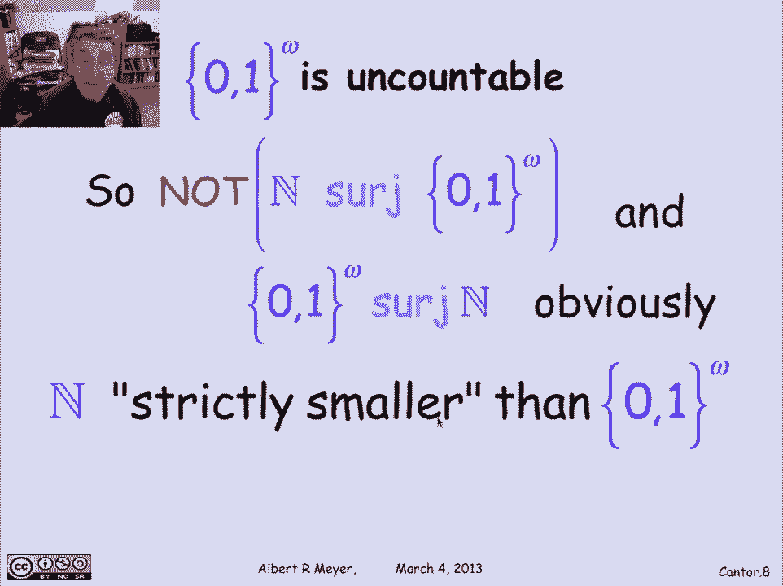

这个论证之所以被称为“对角线”论证，是因为我们沿着假设列表形成的矩阵的对角线来构造反例。

## 严格“小于”关系的定义

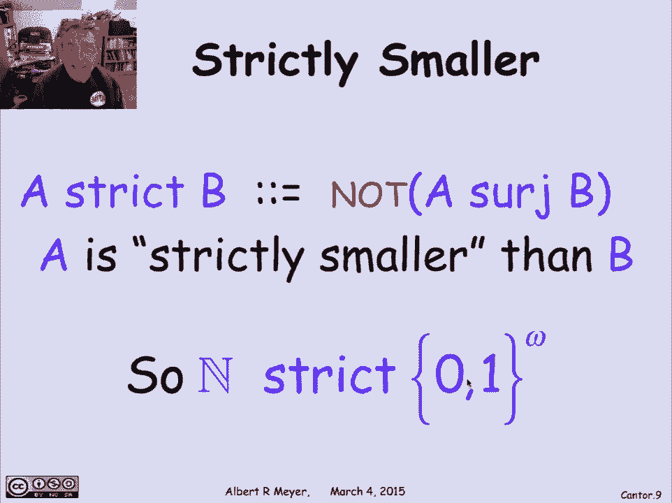

在比较无限集的大小时，我们使用满射、单射和双射的语言。上一节我们利用对角线论证证明了 `N` 和 `{0, 1}^ω` 的大小关系。本节我们来正式定义一个集合“严格小于”另一个集合的含义。

直观上，如果存在从集合 `A` 到集合 `B` 的满射，我们解读为 `A` 的“大小”大于或等于 `B` 的“大小”，记作 `|A| ≥ |B|`。

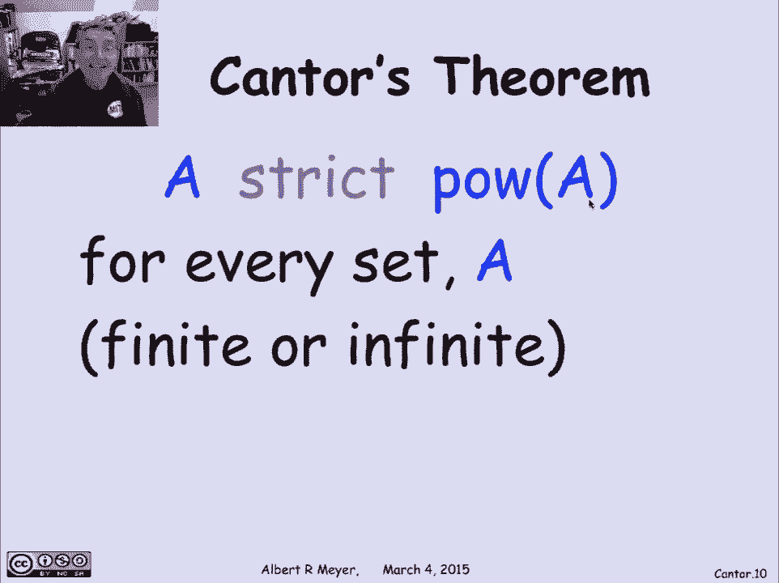

基于此，我们可以定义“严格小于”：
> 我们说集合 `A` **严格小于** 集合 `B`，记作 `|A| < |B|`，当且仅当**不存在**从 `A` 到 `B` 的满射。

根据这个定义，我们刚才证明的正是：**非负整数集 `N` 严格小于无限二进制序列集 `{0, 1}^ω`**。因为不存在从 `N` 到 `{0, 1}^ω` 的满射。

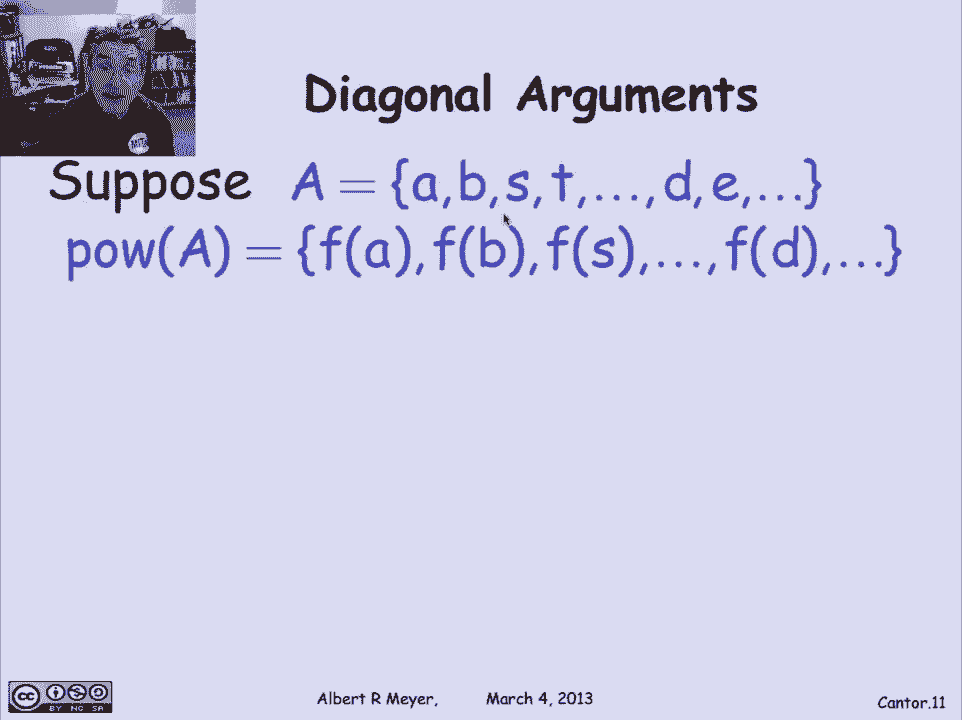

## 康托尔定理的一般形式

对角线论证的威力远不止于证明特定集合的不可数性。康托尔将其推广到了一个极其一般且优美的定理。

康托尔定理指出：**对于任意集合 `A`（无论有限还是无限），其幂集 `P(A)`（即 `A` 的所有子集构成的集合）都严格大于 `A` 本身**。用符号表示就是：**`|A| < |P(A)|`**。

对于有限集，这很容易理解：如果 `A` 有 `n` 个元素，那么 `P(A)` 有 `2^n` 个元素，并且对于所有 `n ≥ 0`，都有 `n < 2^n`。康托尔定理的非凡之处在于，它同样适用于无限集。

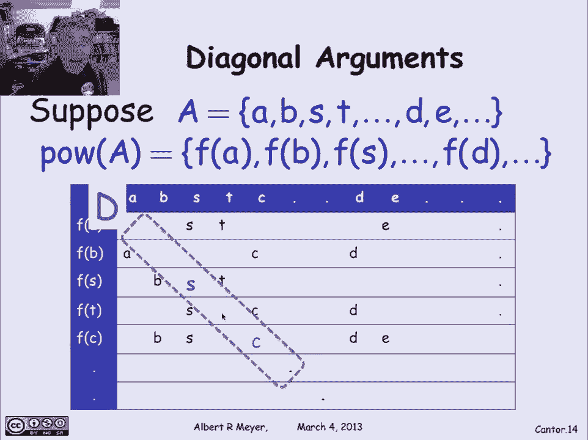

### 定理的证明（再次使用对角线论证）

证明的思路与之前证明 `{0, 1}^ω` 不可数时类似。

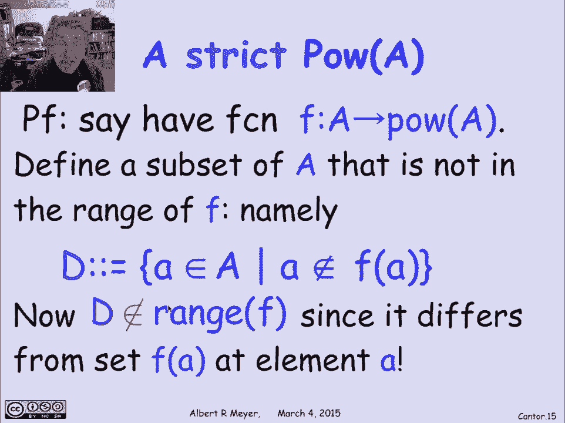

1.  **假设存在满射**：为了推导矛盾，假设存在一个从集合 `A` 到其幂集 `P(A)` 的满射 `f`。这意味着对于 `A` 中的每个元素 `a`，`f(a)` 是 `A` 的一个子集，并且 `P(A)` 中的每一个子集都是某个 `a` 的像。

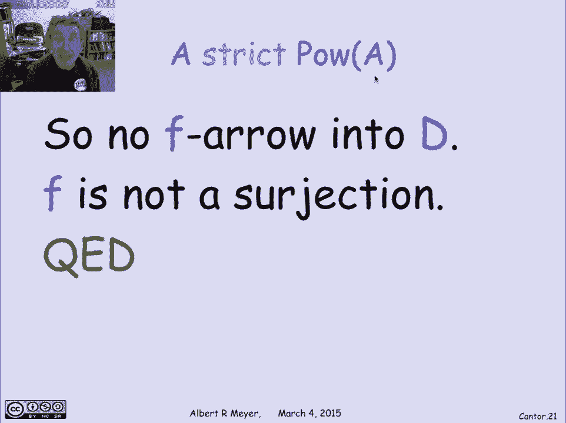

2.  **构造“对角线”集**：现在，我们利用函数 `f` 来构造一个新的集合 `D`，它是 `A` 的一个子集，定义如下：
    > **`D = { a ∈ A | a ∉ f(a) }`**
    也就是说，`D` 包含所有那些“不属于其自身像”的 `A` 的元素。

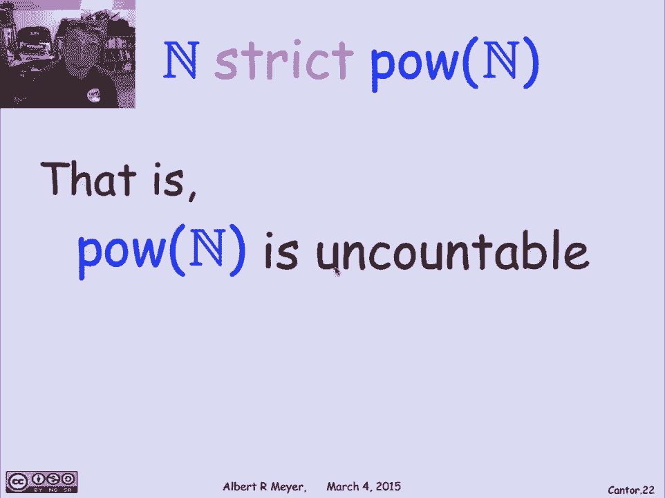

3.  **证明矛盾**：集合 `D` 显然是 `A` 的一个子集，因此 `D ∈ P(A)`。由于我们假设 `f` 是满射，那么必然存在某个 `d ∈ A`，使得 `f(d) = D`。
    现在问一个问题：`d` 本身是否属于 `D`？
    *   如果 `d ∈ D`，那么根据 `D` 的定义，必须有 `d ∉ f(d)`。但 `f(d) = D`，所以这意味着 `d ∉ D`。矛盾。
    *   如果 `d ∉ D`，即 `d ∉ f(d)`。那么根据 `D` 的定义，`d` 应该满足成为 `D` 成员的条件，即 `d ∈ D`。又产生矛盾。

4.  **得出结论**：无论如何都导致矛盾。因此，最初的假设是错误的。**不存在从集合 `A` 到其幂集 `P(A)` 的满射**。根据“严格小于”的定义，这意味着 `|A| < |P(A)|`。

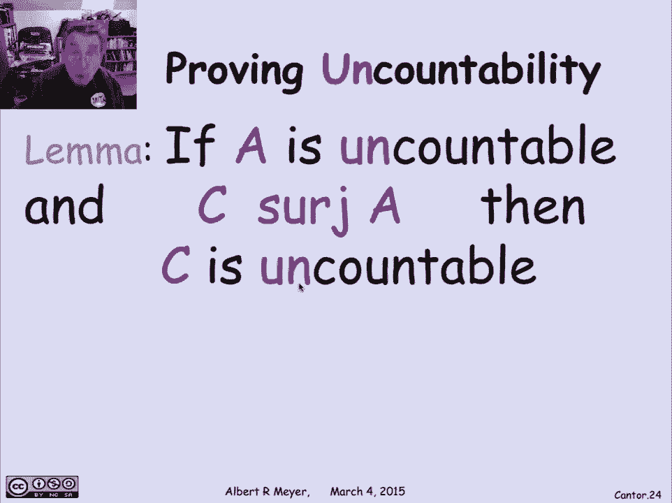

这个证明的精妙之处在于，构造对角线集 `D` 的过程，本质上等价于在二进制序列情况下将对角线上的每一位取反。在这里，“对角线”体现在我们考虑每个元素 `a` 与其像 `f(a)` 的关系 `a ∈? f(a)` 上。

## 推论与应用

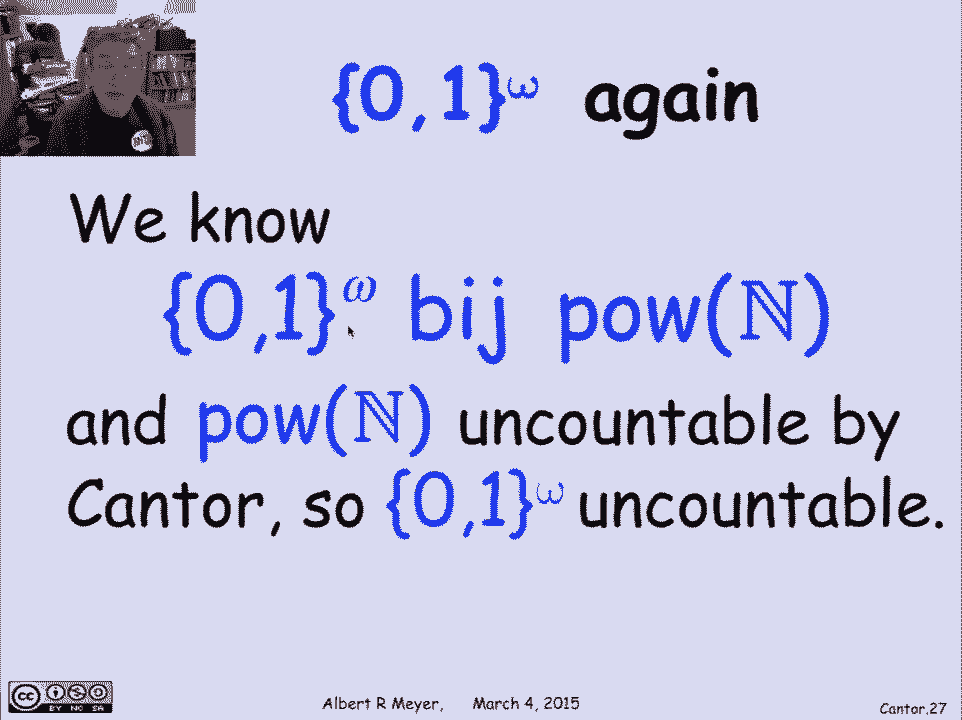

康托尔定理有许多重要的推论，帮助我们理解不同集合的“大小”。

**推论1：自然数集的幂集是不可数的。**
取 `A = N`（自然数集）。根据康托尔定理，`|N| < |P(N)|`。由于 `N` 是可数的，这意味着 `P(N)` 是不可数的。我们之前通过二进制序列间接证明了这一点，因为存在 `{0, 1}^ω` 与 `P(N)` 之间的双射。

**推论2：实数集是不可数的。**
我们可以构造一个从实数集 `R` 到无限二进制序列集 `{0, 1}^ω` 的满射（例如，通过实数的二进制表示，并小心处理表示不唯一的情况）。既然 `{0, 1}^ω` 是不可数的（由康托尔定理或其特例证明），并且存在从 `R` 到它的满射，那么根据“若有从 `C` 到不可数集 `A` 的满射，则 `C` 也不可数”的原理，可以推出实数集 `R` 也是不可数的。这为“有理数可数而实数不可数”这一事实提供了另一个证明角度。

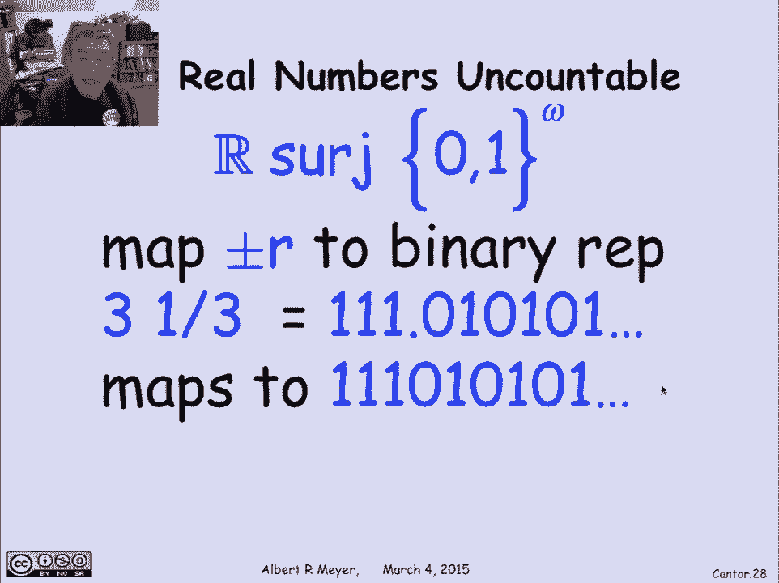

## 总结

本节课中我们一起学习了：
1.  **不可数集**的概念，以及如何使用**对角线论证**来证明一个集合（如无限二进制序列集）是不可数的。
2.  集合间“严格小于”（`|A| < |B|`）的正式定义：即不存在从 `A` 到 `B` 的满射。
3.  **康托尔定理**的核心内容：对于任何集合 `A`，其幂集 `P(A)` 总是严格大于 `A` 本身（`|A| < |P(A)|`）。我们通过一个巧妙的对角线论证一般化形式证明了这一定理。
4.  康托尔定理的重要推论，包括自然数幂集的不可数性，以及实数集的不可数性。

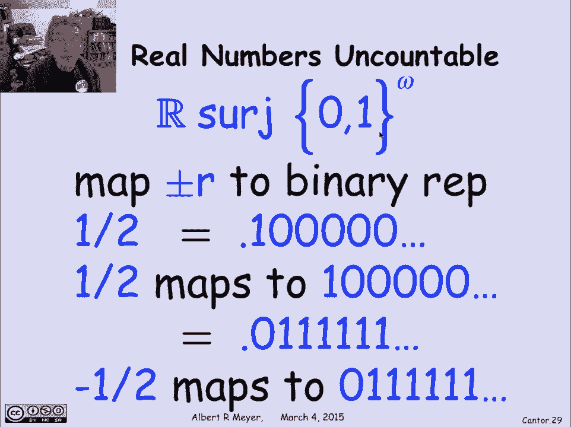

康托尔定理深刻地揭示了无穷的层次性：不存在最大的无穷集合。从一个无穷集出发，总可以取其幂集来得到一个“更大”的无穷集，这个过程可以无限进行下去，从而产生一个无穷大的阶梯。这是现代集合论的基础之一。