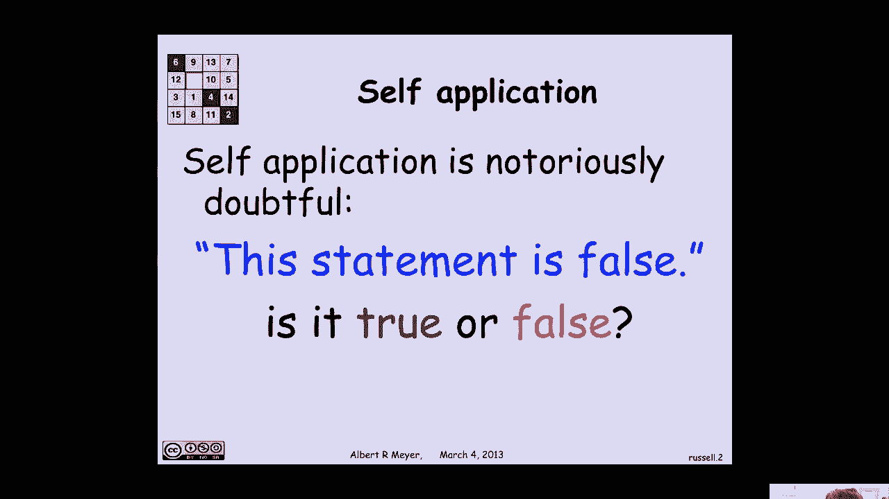
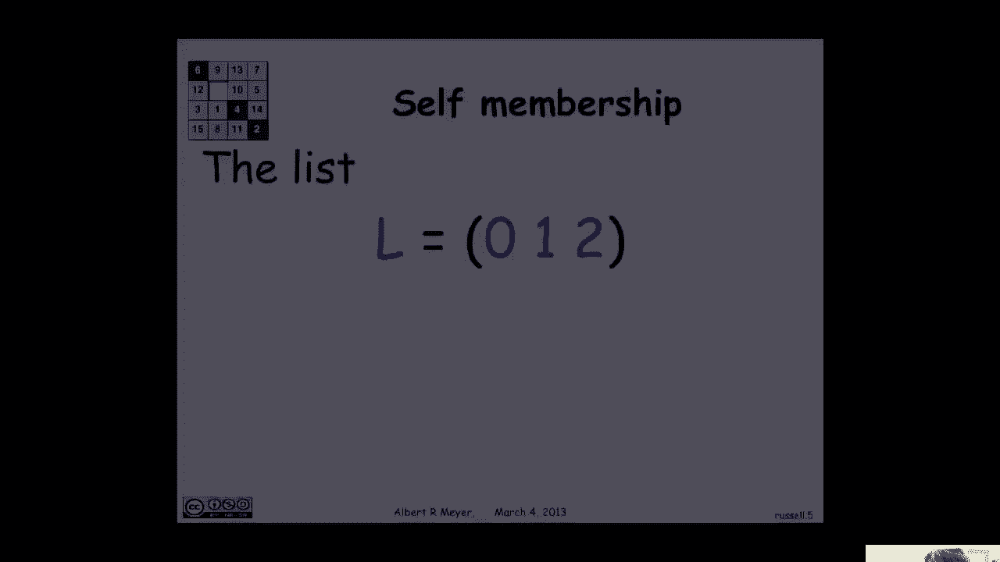
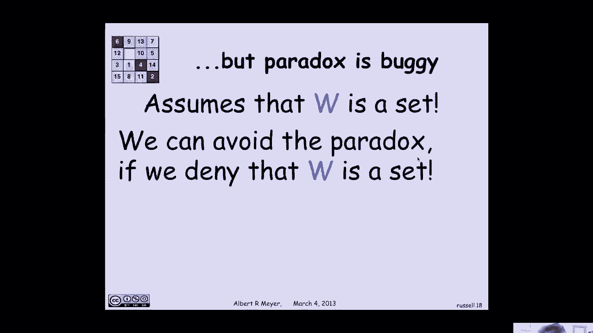

# 计算机科学的数学基础：P33：L1.11.9 - 罗素悖论 🧩

在本节课中，我们将探讨集合论的一个基础概念，并了解一个著名的逻辑悖论——罗素悖论。我们将看到，之前讨论过的对角线论证法在集合论的发展中扮演了关键角色。同时，我们也会对比计算机科学中常见的自引用操作，理解为何数学在处理此类问题时需要格外谨慎。





## 自引用与计算机科学

上一节我们介绍了对角线论证法，本节中我们来看看自引用这个概念。在计算机科学中，自引用是常见且被允许的操作，但在数学基础中，它却可能导致严重问题。

以下是计算机科学中自引用的两个例子：

1.  **自引用数据结构**：在Scheme/Lisp等语言中，可以创建包含自身作为元素的列表。通过操作指针，可以使一个列表的某个元素指向列表自身，形成一个有限的循环结构，却能表示无限的嵌套数据。
    ```scheme
    (define L (list 0 1 2))
    (set-car! (cdr L) L) ; 将L的第二个元素设置为L本身
    ```
    执行后，`L` 变成了一个形如 `(0, L, 2)` 的列表，其中 `L` 自身是其成员。

2.  **函数的自应用**：在高阶函数编程中，函数可以接受自身或其他函数作为参数，并应用于自身。
    ```scheme
    (define (compose f g)
      (lambda (x) (f (g x))))

    (define (cop2 f) (compose f f)) ; 定义函数f与自身的复合

    ; 应用示例：将平方函数与自身复合，得到四次方函数
    ((cop2 square) 3) ; 结果为 81 (即 3^4)
    ```
    我们甚至可以定义更复杂的自应用，例如 `(cop2 cop2)`，它表示将一个函数与自身复合四次。

这些操作在类型灵活或支持递归的编程语言中是完全合法且有用的。

## 罗素悖论

然而，数学家对自引用持谨慎态度，这很大程度上源于伯特兰·罗素提出的著名悖论。罗素悖论动摇了19世纪末数学家试图为数学建立严谨集合论基础的尝试。

罗素构造了一个集合 **W**，其定义如下：
> **W** = { s | s ∉ s }

用文字描述：**W** 是所有“不属于自身”的集合构成的集合。

现在，让我们思考 **W** 本身是否属于 **W**。根据定义：
*   如果 **W ∈ W**，那么 **W** 必须满足定义条件，即 **W ∉ W**。
*   如果 **W ∉ W**，那么 **W** 恰好满足了“不属于自身”的条件，因此 **W ∈ W**。

我们得到了一个逻辑矛盾：**W ∈ W** 当且仅当 **W ∉ W**。这个悖论表明，将 **W** 视为一个普通的集合会导致不一致性。

## 悖论的解决与影响

罗素悖论对当时正在构建集合论体系的数学家戈特洛布·弗雷格造成了沉重打击。弗雷格的工作几乎因此被全盘否定。

解决这个悖论的关键在于认识到：并非所有明确定义的数学对象都能构成一个“集合”。**W** 的定义虽然是清晰的，但其规模“太大”或性质太特殊，以至于不能被视为一个集合（在现代集合论中，这类对象被称为“真类”）。

因此，为了避免悖论，现代公理化集合论（如ZF系统）引入了严格的公理来限定哪些对象可以合法地称为集合，特别是限制“过大”集合的形成。这回答了“何时一个明确定义的数学对象是一个集合”这个根本的哲学问题。

## 总结



本节课中我们一起学习了自引用概念以及著名的罗素悖论。我们了解到：
1.  在计算机科学中，数据结构和函数的自引用是有效且强大的工具。
2.  在数学基础的集合论中，无限制的自引用（如“所有不属于自身的集合的集合”）会导致逻辑悖论。
3.  罗素悖论的解决促使数学家建立了更严谨的公理化集合论，通过规则区分“集合”和“真类”，从而为数学奠定了更稳固的基础。

这个历程展示了在构建严谨的逻辑系统时，明确边界和规则的重要性。