# MIT 6.042J：计算机科学的数学基础：P34：L1.11.11- 集合论公理 🧮

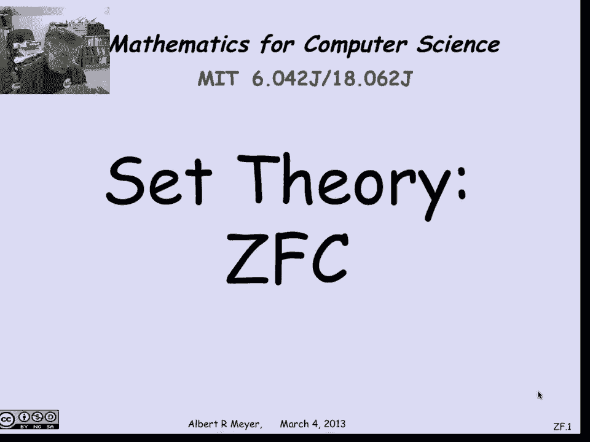

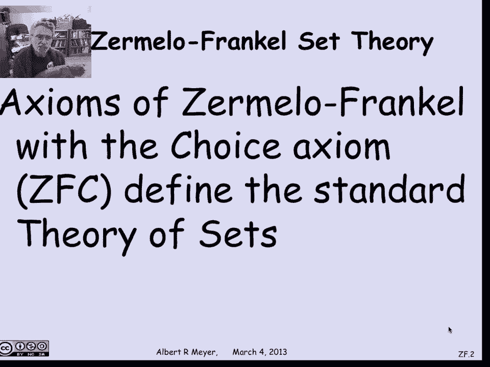

在本节课中，我们将要学习Zermelo-Fraenkel集合论公理系统（ZFC）。我们将了解几个核心公理，包括外延公理、幂集公理、分离公理模式和基础公理，并探讨它们如何帮助我们避免像罗素悖论这样的逻辑矛盾。我们将使用谓词逻辑公式来精确描述这些公理。

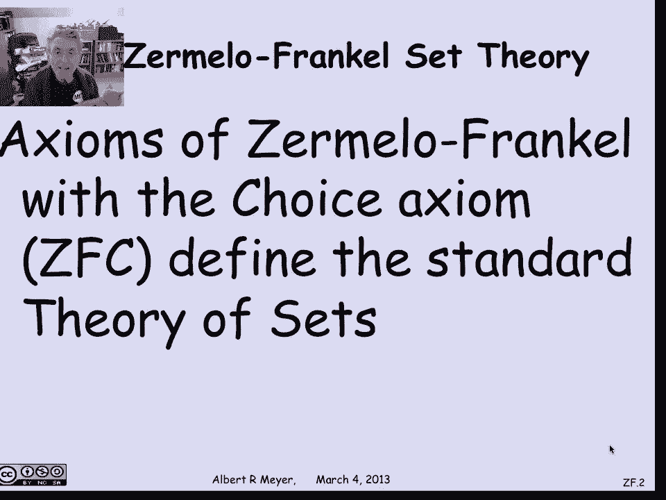

## 概述 📋

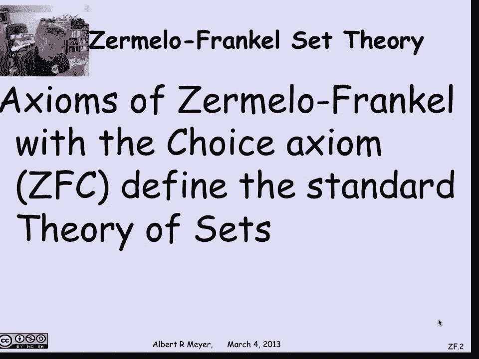

ZFC公理系统定义了集合论的标准理论，被广泛接受为发展所有数学的可靠基础。本节我们将重点介绍其中几个关键公理，并通过练习书写谓词公式来加深理解。

## 外延公理

上一节我们介绍了集合论的基础概念，本节中我们来看看第一个核心公理——外延公理。它抓住了“一个集合由其成员唯一决定”的思想。

假设有两个集合 `y` 和 `z`，断言它们具有相同的元素。我们可以用谓词公式将其表述为：
```
∀x. (x ∈ y ↔ x ∈ z)
```
这个公式可以**作为集合相等的定义**：当且仅当两个集合拥有完全相同的成员时，我们说它们是相等的。

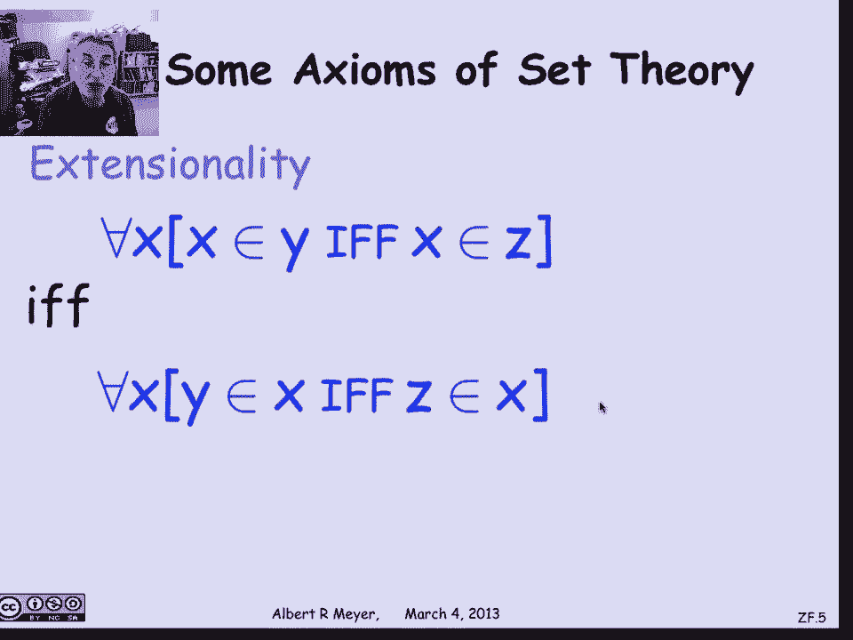

我们甚至不需要将“相等”作为逻辑语言的基本部分并为其添加公理。外延公理足以涵盖这一点，它表述为：如果两个集合有相同的成员，那么它们属于完全相同的其他集合。用公式表示是：
```
∀x, y, z. ( (∀w. (w ∈ x ↔ w ∈ y)) → (x ∈ z ↔ y ∈ z) )
```
这是集合论的一个基本起点公理。

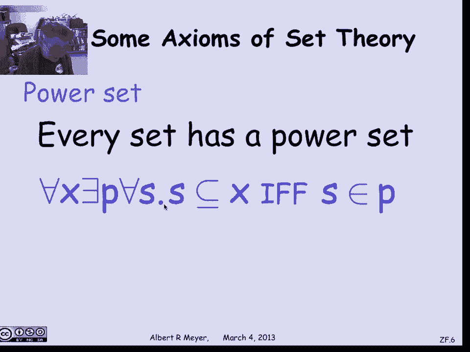

## 幂集公理

理解了集合的相等性后，我们来看看如何构造更复杂的集合。幂集公理指出：**每个集合都有一个幂集**。

用谓词集合论的语言来说，即：对于每一个集合 `x`，都存在一个集合 `p`（即 `x` 的幂集），使得对于任意集合 `s`，`s` 是 `x` 的子集当且仅当 `s` 是 `p` 的成员。我们知道如何仅用“属于”关系（`∈`）来表达“`s` 是 `x` 的子集”：`∀a. (a ∈ s → a ∈ x)`。

因此，幂集公理的公式化表述是：
```
∀x. ∃p. ∀s. ( (∀a. (a ∈ s → a ∈ x)) ↔ s ∈ p )
```
这个公理断言，确实存在一个集合 `p`，它恰好由 `x` 的所有子集组成，这个集合 `p` 就称为 `x` 的幂集。

## 分离公理模式（子集公理）

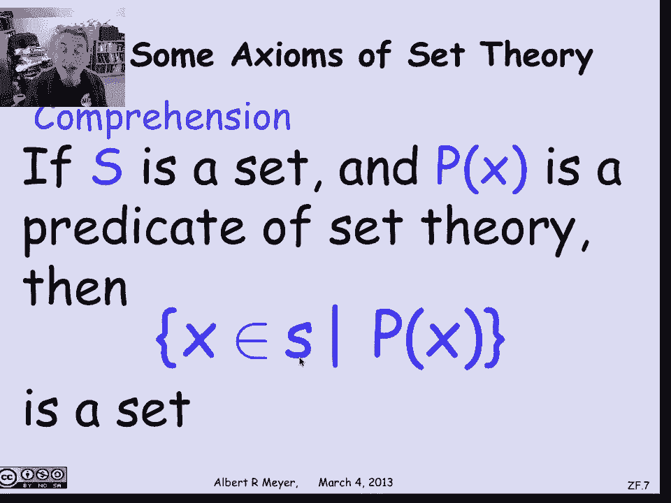

在尝试处理像“所有满足性质 P 的集合”这类定义时，我们曾遇到罗素悖论。分离公理模式提供了一个安全的方法来构造子集。

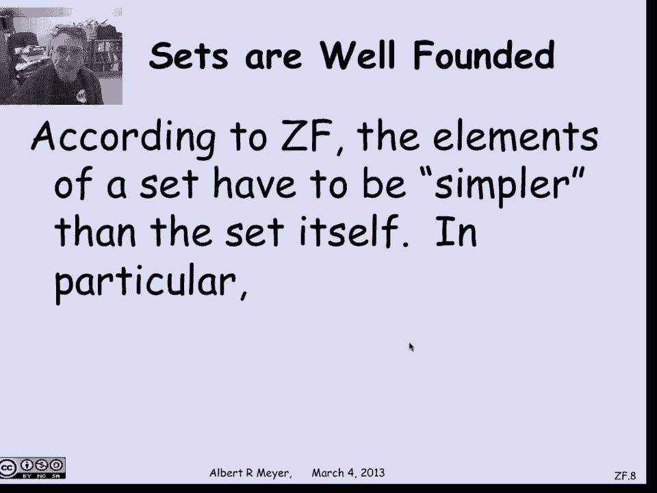

它基本上是说：如果 `S` 是一个已知的集合，`P(x)` 是集合论中的一个谓词（即使是像“x ∉ x”这样可能危险的表述），那么从 `S` 中分离出那些满足 `P(x)` 的元素，仍然构成一个集合。

换句话说，`{x ∈ S | P(x)}` 是一个集合。用公式表示：
```
∀S. ∃Y. ∀x. (x ∈ Y ↔ (x ∈ S ∧ P(x)))
```
这之所以重要，是因为它限制了概括的范围。引发罗素悖论的是无限制的概括：尝试构造所有满足 `P(x)` 的 `x` 的集合（`{x | P(x)}`）。分离公理模式通过要求 `x` 必须来自一个**预先存在的集合** `S`，从而避免了这个问题。

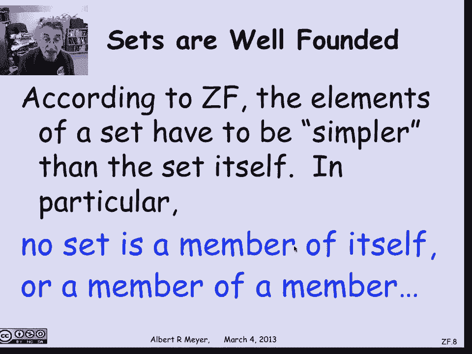

## 基础公理（正则公理）

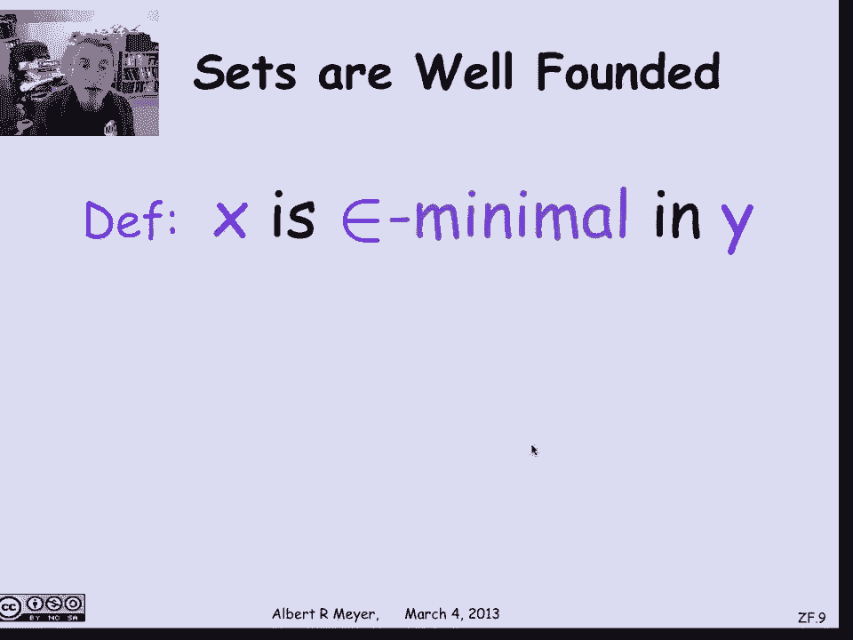

为了解决自属性和自引用的问题，集合论引入了基础公理。其直观思想是：**集合的元素必须先于集合本身存在**，或者说，集合应由更简单的元素构建。

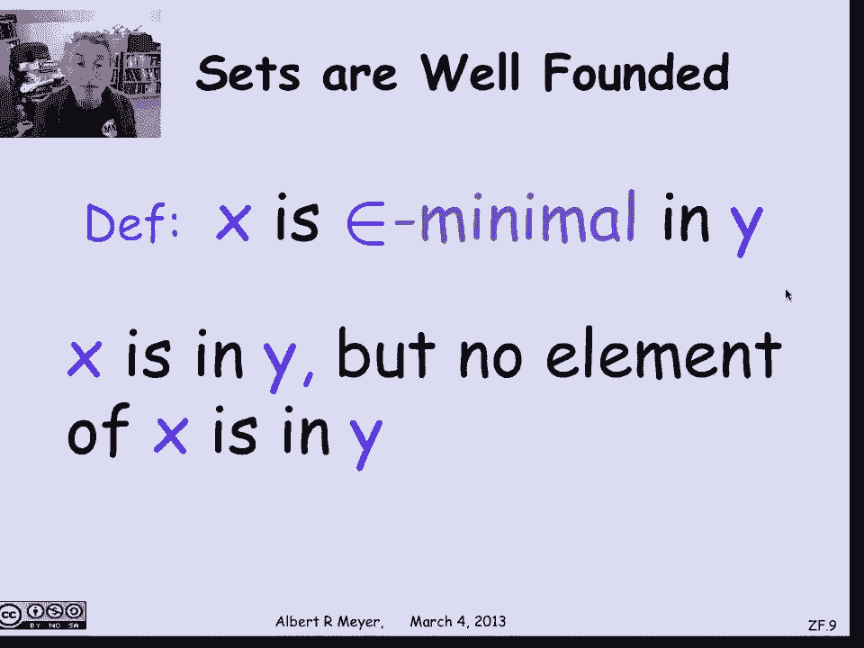

特别地，一个集合不能是它自身的成员，因为它不能由自身构建。事实上，你甚至不能有一个集合，它是其自身成员的成员（即 `x ∈ y ∈ x` 这类循环）。所有这类间接的成员资格都被禁止。

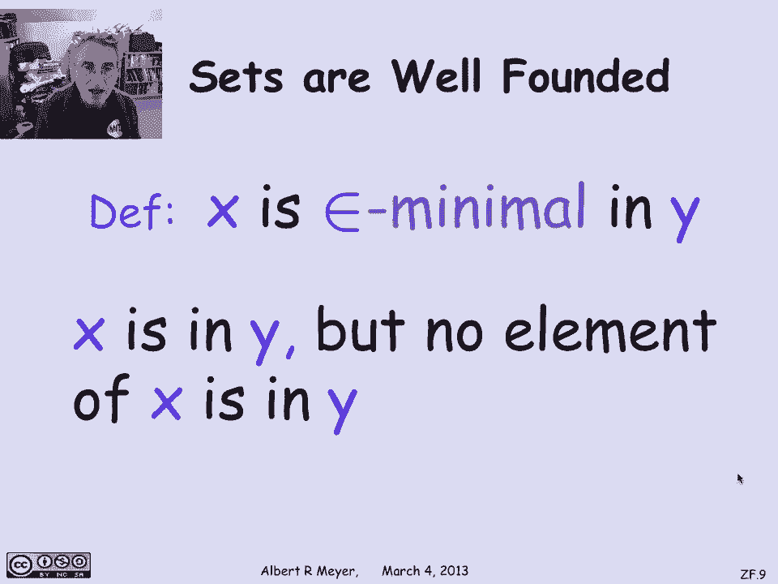

一个优雅的表述方式是：**在属于关系（∈）下，所有集合都是良基的**。这意味着你找不到一个无限的集合序列，其中每个集合都是下一个集合的成员。

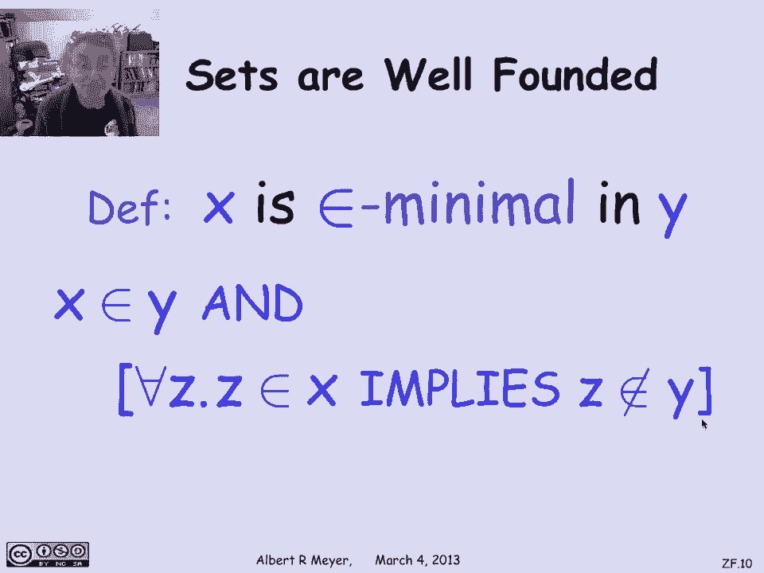

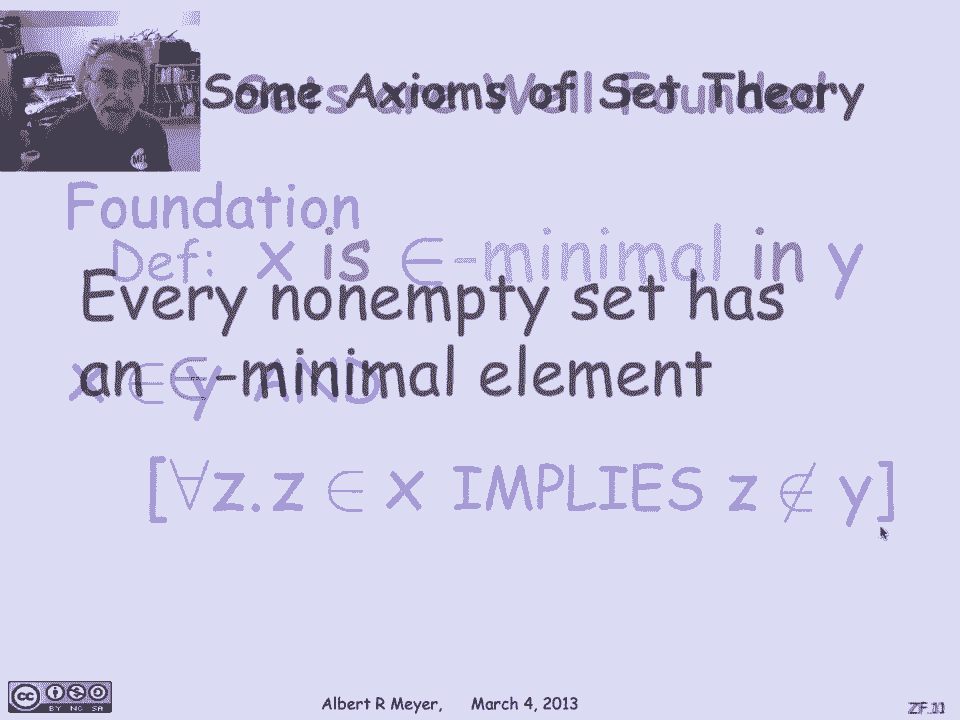

为了精确表述，我们先定义“∈-极小元”：设 `x` 是 `y` 的一个∈-极小元，表示 `x ∈ y`，但 `x` 中没有任何元素属于 `y`。换句话说，`x` 是由不属于 `y` 的东西构成的，但 `x` 本身在 `y` 中。用公式定义：
```
Min∈(x, y) ≔ (x ∈ y) ∧ (∀z ∈ x. z ∉ y)
```
基础公理则断言：**每个非空集合都有一个∈-极小元**。
```
∀x. (x ≠ ∅ → ∃y. Min∈(y, x))
```
这是整数良序原理（每个非负整数集都有最小元）的推广。基础公理意味着不存在无限递减的属于链（如 `... ∈ x₃ ∈ x₂ ∈ x₁`）。

## 基础公理的重要推论

学习了基础公理的内容后，我们来看看它能立即得出哪些重要结论。

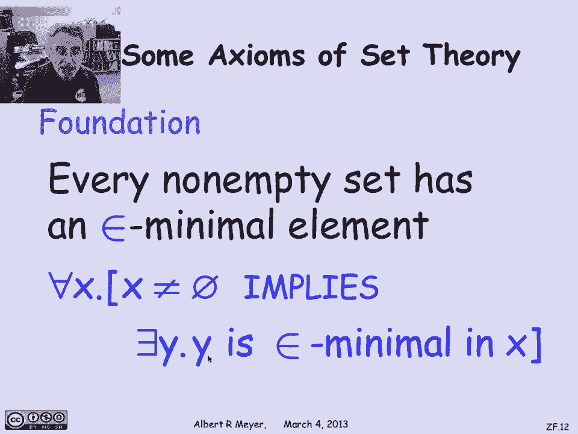

基础公理可以很快推导出：**没有集合是它自身的成员**。

证明如下：假设存在一个集合 `S`，使得 `S ∈ S`。考虑单元素集合 `R = {S}`。`R` 非空，根据基础公理，`R` 必须有一个∈-极小元。`R` 中唯一的元素是 `S`，所以这个极小元只能是 `S`。但根据∈-极小元的定义，`S` 中的任何元素都不应在 `R` 中。然而，我们假设了 `S ∈ S`，这意味着 `S` 中有一个元素（即 `S` 自身）属于 `R`（因为 `S ∈ R`）。这与 `S` 是 `R` 的∈-极小元矛盾。因此，假设不成立，`S ∉ S`。

这个论证可以推广，同样能证明不存在像 `A ∈ B ∈ A` 这样的成员循环。

从“没有集合是自身成员”这一结论，我们可以立即得到两个重要推论：

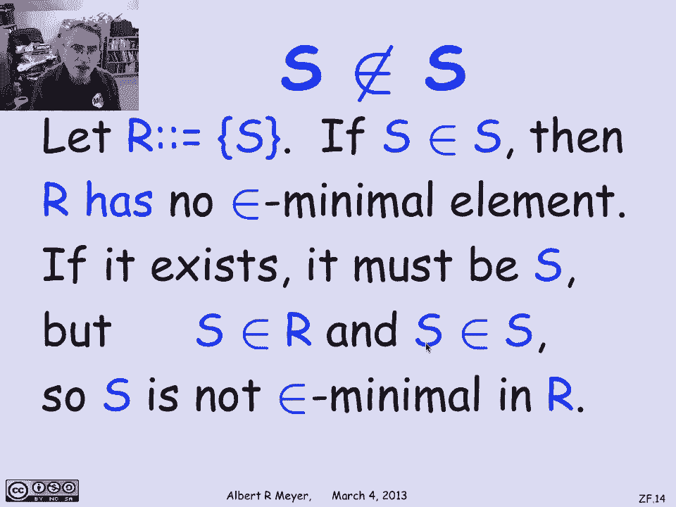

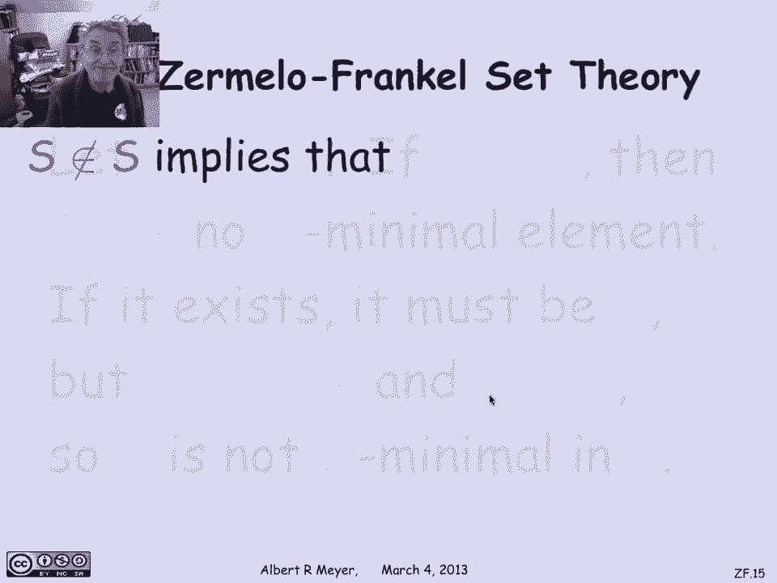

1.  **所有集合的集合**不能是一个集合。因为如果“所有集合的集合”是一个集合，那么它将是自身的一个成员，而这刚刚被证明是不可能的。
2.  回顾罗素悖论中的集合 `W`，`W = {x | x ∉ x}`。现在我们发现，由于没有集合是自身的成员，那么“不是自身成员的集合”就是**所有集合**。因此，`W` 就是“所有集合的集合”。既然“所有集合的集合”不是集合（由推论1得出），那么 `W` 也就不是一个集合。这从另一个角度解决了罗素悖论。

## 总结 🎯

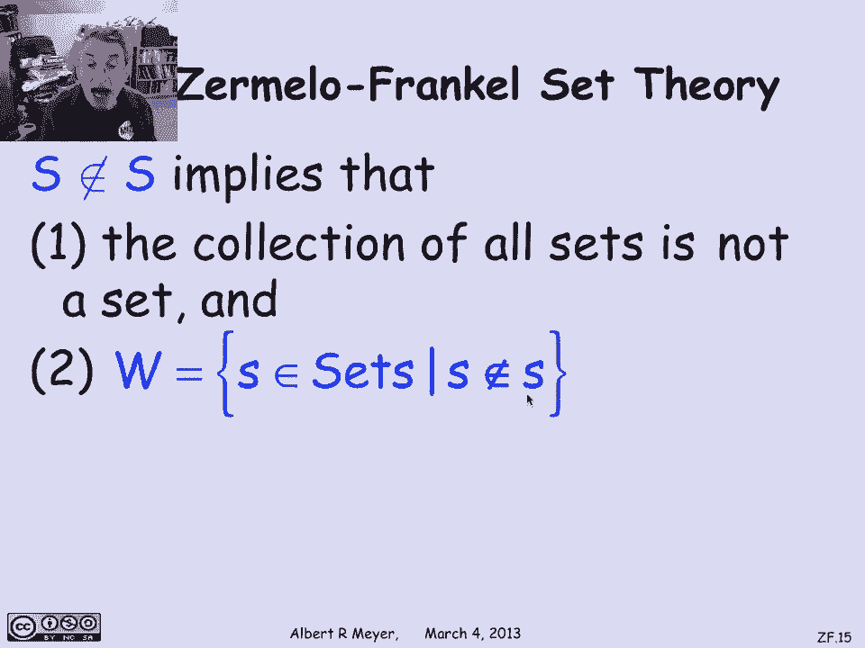

本节课中我们一起学习了ZFC集合论中的几个关键公理：
*   **外延公理**：定义了集合的相等性。
*   **幂集公理**：确保每个集合的幂集存在。
*   **分离公理模式**：允许我们从一个已知集合中安全地分离出满足特定性质的子集，从而避免了无限制概括导致的悖论。
*   **基础公理**：要求集合在属于关系下是良基的，这直接否定了集合自属性和无限属于链的可能性，并由此解决了“所有集合的集合”这类悖论。

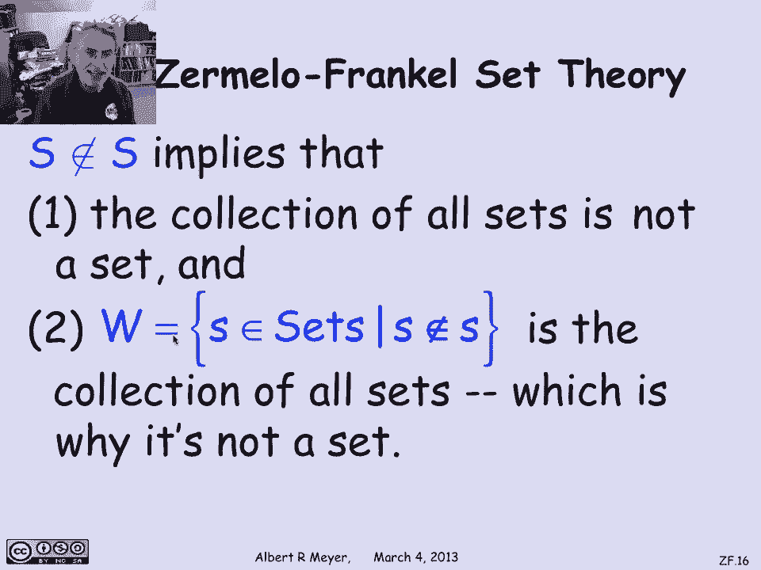

这些公理共同为数学提供了一个稳固、无矛盾的基础。