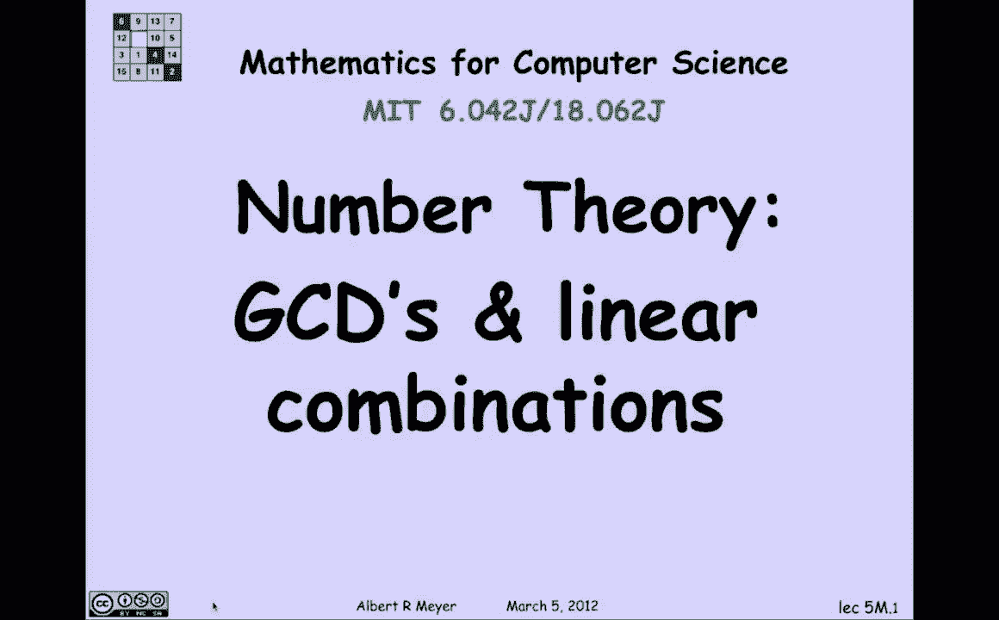
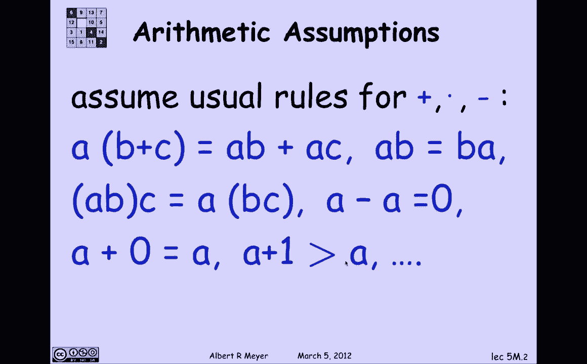
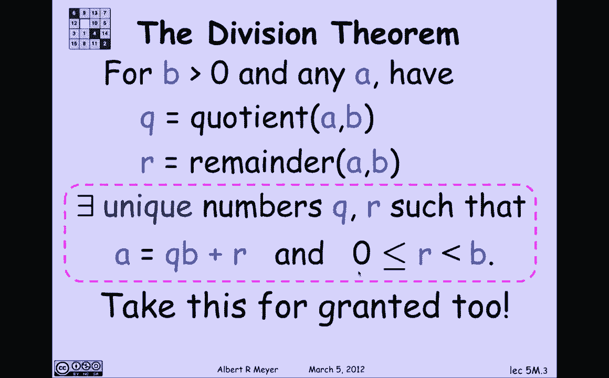
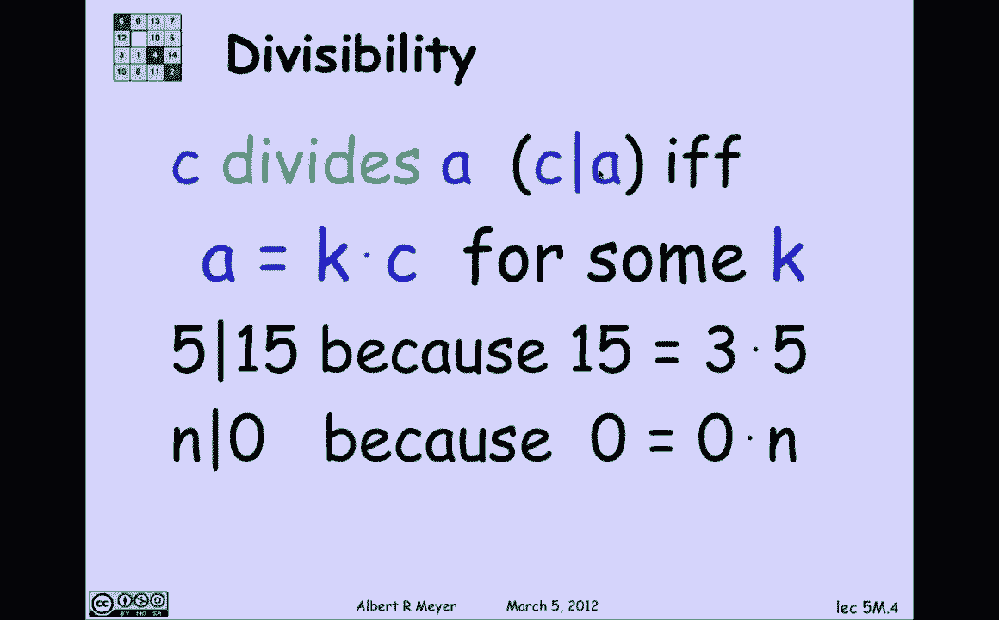
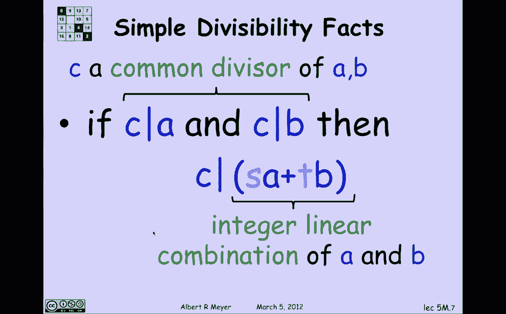
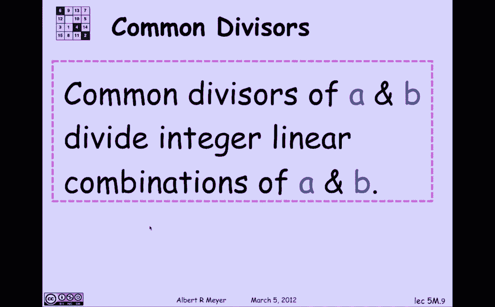
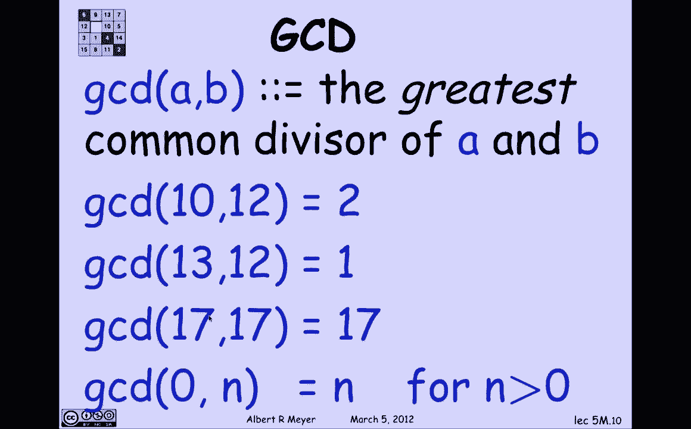
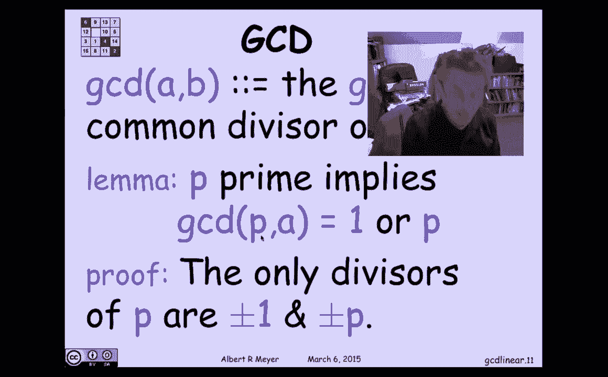

# 数论基础：1：课程概述与基本公理

在本节课中，我们将开始学习数论，并以此作为练习数学证明的绝佳领域。数论是一个自成一体的基础学科，包含许多优雅的证明和结构。我们将应用矛盾法、归纳法以及良序原理。本单元的最终目标是理解RSA密码系统的工作原理。今天，我们将建立一个关于整数质因数分解的基本事实，这是一个值得证明的定理。在作业中，我们将展示一个不具备唯一因式分解性质的数字系统。最终，我们将能彻底厘清相关概念。

## 数论基础：2：基本代数规则与除法定理



上一节我们介绍了课程目标，本节中我们来看看我们将默认使用的基本代数规则。

我们将假设所有关于加法、乘法和减法的标准代数规则都成立。例如：
*   **分配律**：`a * (b + c) = a*b + a*c`
*   **乘法交换律**：`a * b = b * a`
*   **乘法结合律**：`(a * b) * c = a * (b * c)`
*   **加法单位元**：`a + 0 = a`
*   **加法逆元**：`a + (-a) = 0`



这些是标准代数事实，我们将视为理所当然。

---

此外，我们还将接受**除法定理**作为一个公理。对于整数 `a` 和正整数 `b`，存在**唯一**的整数商 `q` 和余数 `r`，满足：
```
a = b * q + r
```
其中余数 `r` 满足 `0 ≤ r < b`。这个定理是基本的，其证明（例如通过归纳法）虽然可行，但在此我们将其作为基础接受。



## 数论基础：3：整除关系及其性质

上一节我们明确了基本规则，本节中我们来看看整数间一个核心关系：整除。

在接下来的一周左右，所有变量都默认为整数。我们定义整除关系：`c | a`（读作“c整除a”）当且仅当存在某个整数 `k`，使得 `a = k * c`。
*   **同义词**：`c` 是 `a` 的除数；`a` 是 `c` 的倍数。
*   **示例**：
    *   5 整除 15，因为 `15 = 3 * 5`。
    *   任何数 `n` 都整除 0，因为 `0 = 0 * n`。所以0是任何数的倍数。



---

从定义可以直接推导出一些简单性质：
1.  如果 `c | a`，那么对于任意整数 `s`，有 `c | (s * a)`。
2.  如果 `c | a` 且 `c | b`，那么 `c | (a + b)`。

让我们验证性质2。已知 `c | a` 意味着 `a = k1 * c`，`c | b` 意味着 `b = k2 * c`。那么：
```
a + b = (k1 * c) + (k2 * c) = (k1 + k2) * c
```
因此 `c` 整除 `(a + b)`。

综合以上，我们得到一个重要结论：如果 `c | a` 且 `c | b`，那么对于任意整数 `s` 和 `t`，`c` 都整除 `(s*a + t*b)`。形如 `s*a + t*b` 的表达式称为 `a` 和 `b` 的一个**线性组合**。

所以，我们的结论可以重新表述为：**`a` 和 `b` 的任何一个公约数，都必定整除 `a` 和 `b` 的任意线性组合**。请记住这个关键事实。



## 数论基础：4：最大公约数



上一节我们讨论了整除和线性组合，本节中我们聚焦于一个核心概念：最大公约数。

`a` 和 `b` 的**最大公约数**，记作 `gcd(a, b)`，是能同时整除 `a` 和 `b` 的最大正整数。根据良序原理，这个最大公约数总是存在的（因为公约数集合是非负整数集的一个有界子集，且至少包含1）。

以下是几个例子：
*   `gcd(10, 12) = 2`。（因为10=2×5，12=2×6，公共部分只有2）
*   `gcd(13, 12) = 1`。（因为13是质数，与12无大于1的公因数）
*   对于任意正整数 `n`，`gcd(0, n) = n`。（因为任何数都整除0，`n` 本身是最大的公约数）
*   对于质数 `p`，`gcd(p, a)` 要么是1（如果 `p` 不整除 `a`），要么是 `p`（如果 `p` 整除 `a`）。



---



本节课中我们一起学习了数论的基本起点：我们明确了将使用的代数公理和除法定理，定义了整除关系并推导出其基本性质，特别是关于线性组合的关键结论，最后引入了最大公约数的概念并观察了一些例子。这些概念是后续深入学习数论和证明的基石。