# 计算机科学的数学基础：L2.1.2：欧几里得算法 🧮

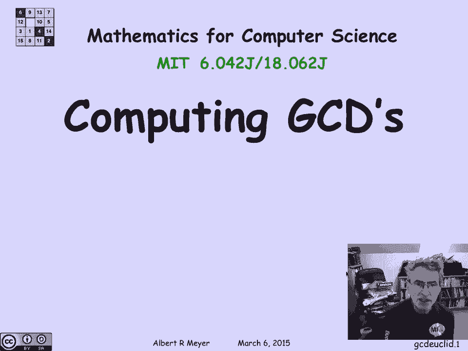

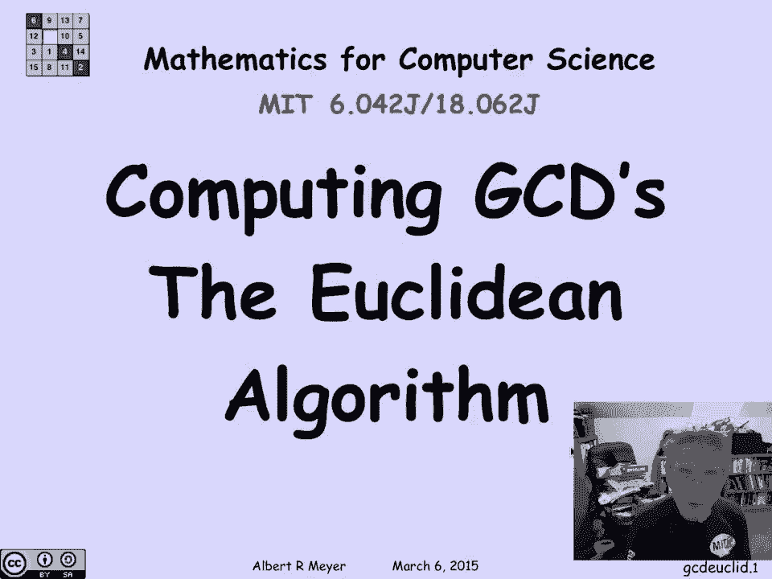

在本节课中，我们将学习如何高效地计算两个数的最大公约数。我们将重点介绍一个古老而强大的算法——欧几里得算法，并理解其背后的数学原理和运行机制。

## 核心概念：余数引理

欧几里得算法基于一个关键的数学引理，我们称之为**余数引理**。该引理指出：对于两个整数 `a` 和 `b`（其中 `b ≠ 0`），`a` 和 `b` 的最大公约数等于 `b` 和 `a` 除以 `b` 的余数的最大公约数。

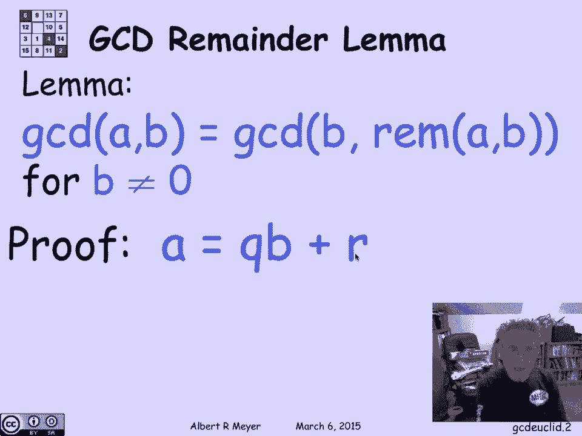

用公式表示如下：
```
gcd(a, b) = gcd(b, a mod b)
```

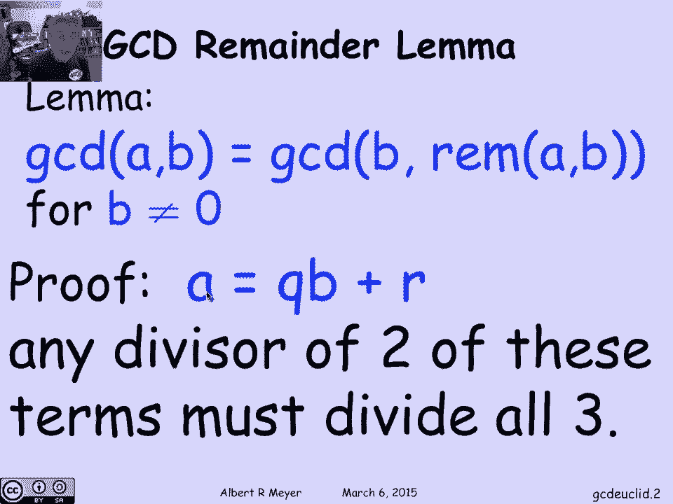

这个引理为何成立？我们可以通过除法算式来理解。根据除法运算，存在整数商 `q` 和余数 `r`，使得：
```
a = q * b + r
```
其中 `0 ≤ r < b`。

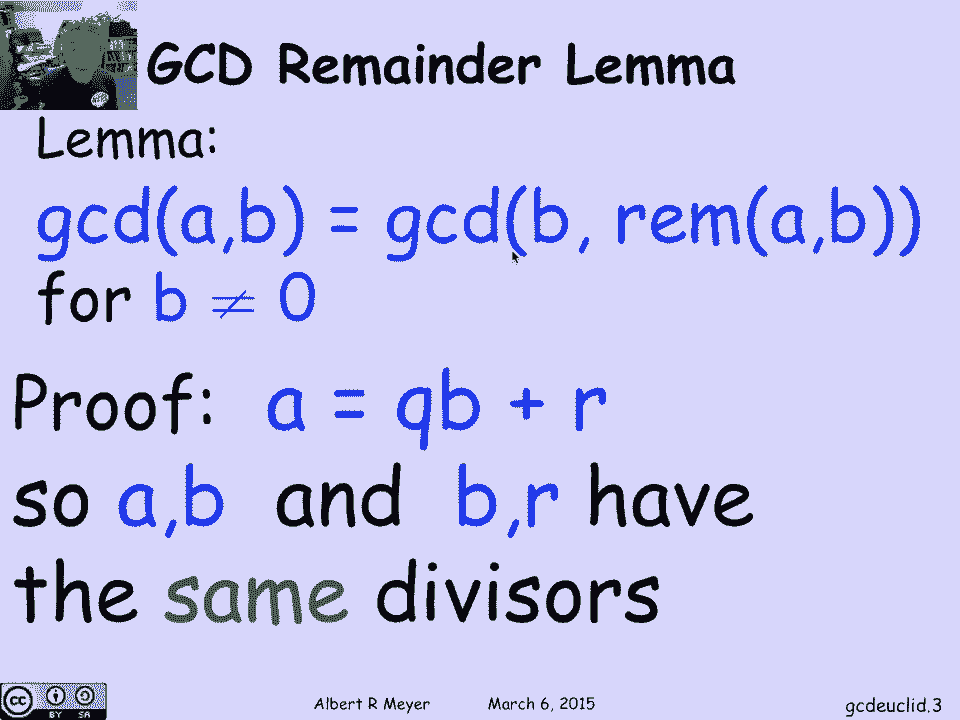

从这个等式可以看出，任何能同时整除 `b` 和 `r` 的数，也必然能整除 `a`。反之，任何能同时整除 `a` 和 `b` 的数，也必然能整除 `r`。因此，`a` 和 `b` 的公因数集合与 `b` 和 `r` 的公因数集合完全相同，它们的最大公约数自然也相同。这就证明了余数引理。

## 算法过程：一个具体例子

上一节我们介绍了余数引理，本节中我们来看看如何利用它来计算最大公约数。让我们通过一个具体例子来演示欧几里得算法的步骤。

假设我们要计算 `gcd(899, 493)`。

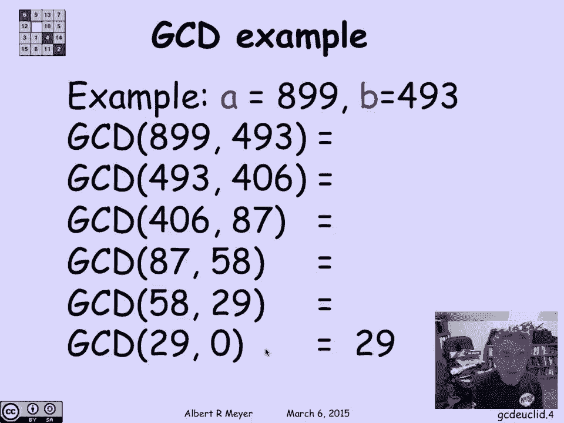

以下是计算步骤：
1.  计算 `899 ÷ 493`，商为 `1`，余数为 `406`。根据引理，`gcd(899, 493) = gcd(493, 406)`。
2.  计算 `493 ÷ 406`，商为 `1`，余数为 `87`。因此，`gcd(493, 406) = gcd(406, 87)`。
3.  计算 `406 ÷ 87`，商为 `4`，余数为 `58`。因此，`gcd(406, 87) = gcd(87, 58)`。
4.  计算 `87 ÷ 58`，商为 `1`，余数为 `29`。因此，`gcd(87, 58) = gcd(58, 29)`。
5.  计算 `58 ÷ 29`，商为 `2`，余数为 `0`。因此，`gcd(58, 29) = gcd(29, 0)`。

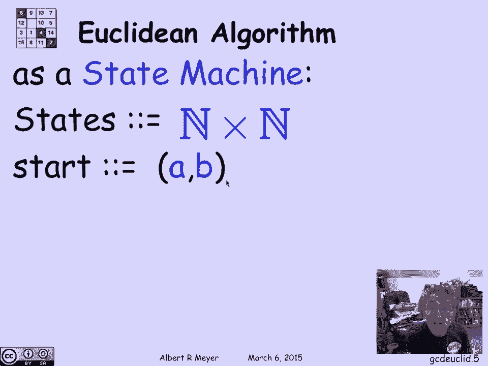

根据定义，任何非零整数 `x` 与 `0` 的最大公约数就是 `x` 本身（`gcd(x, 0) = x`）。所以，`gcd(29, 0) = 29`。

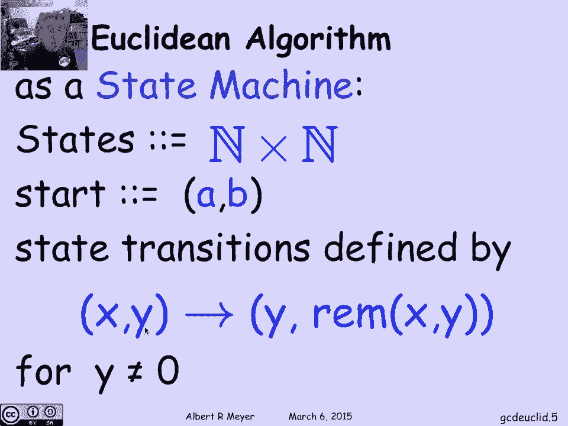

通过这一系列步骤，我们得出 `gcd(899, 493) = 29`。这个算法之所以高效，是因为每一步的余数都在快速减小。

## 状态机视角：验证算法正确性

理解了算法的计算过程后，我们可以从一个更形式化的角度——状态机模型——来审视它，并验证其正确性。

我们可以将欧几里得算法定义为一个简单的状态机：
*   **状态**：由一对非负整数 `(x, y)` 表示。
*   **起始状态**：`(a, b)`，即我们想要求最大公约数的两个原始数。
*   **状态转移规则**：如果当前状态为 `(x, y)` 且 `y ≠ 0`，则下一状态变为 `(y, x mod y)`。如果 `y = 0`，则算法终止。

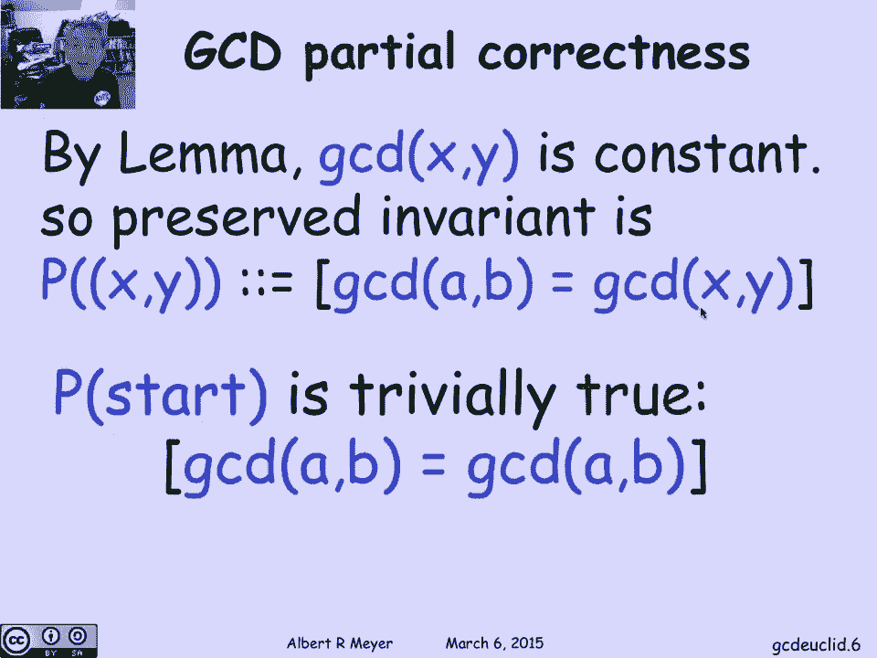

这个状态机有一个非常重要的**不变性**：在任何状态 `(x, y)` 下，`gcd(x, y)` 的值都等于起始状态的 `gcd(a, b)`。这是因为根据余数引理，每次状态转移都保持了最大公约数不变。

这个不变性在起始状态 `(a, b)` 时显然成立。根据不变性原理，如果算法终止，终止状态的不变性依然成立。算法终止时，`y` 必然为 `0`。此时，`gcd(x, 0) = x`。根据不变性，`x` 就等于我们最初要求的 `gcd(a, b)`。这就证明了算法的**部分正确性**：如果算法终止，那么它计算出的结果一定是正确的。

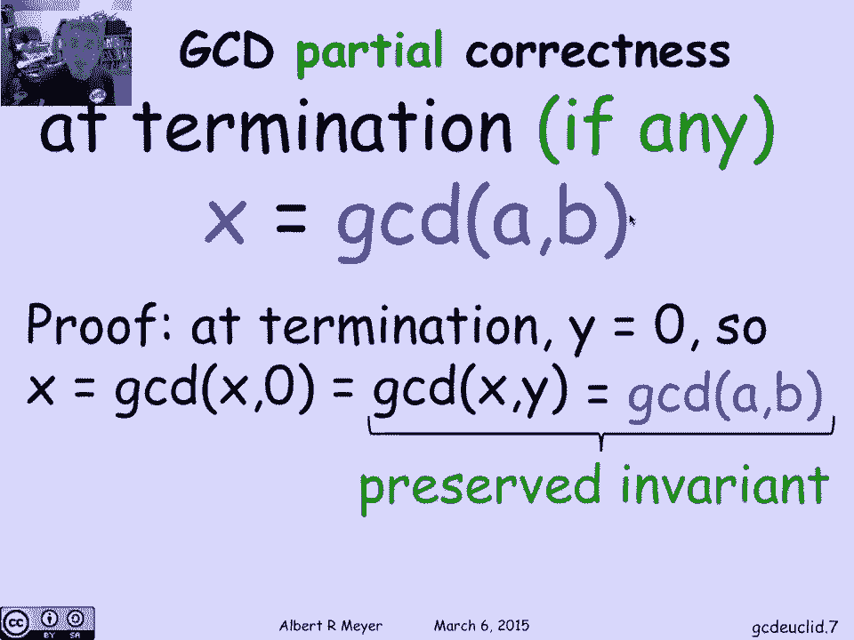

## 算法分析：为何如此高效？

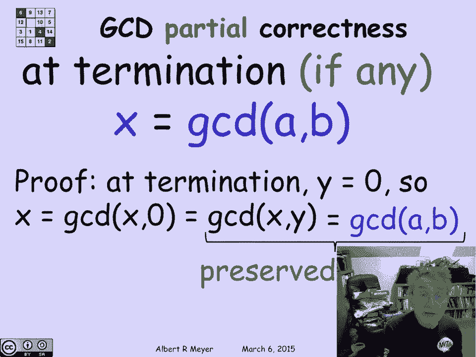

我们已经证明了算法的正确性，现在来分析它的效率。欧几里得算法为什么能快速终止？

关键在于观察每一步中数字 `y` 的变化。在状态转移 `(x, y) -> (y, x mod y)` 中：
*   **情况一**：如果 `y ≤ x/2`，那么下一步的 `x`（即当前的 `y`）已经至少减半。
*   **情况二**：如果 `y > x/2`，那么余数 `x mod y = x - y`。由于 `y > x/2`，所以 `x - y < x/2`。这意味着下一步的 `y`（即当前的余数）将小于 `x/2`。

综合来看，每经过**至多两步**，`y` 的值至少会减半。因此，算法的步骤数不会超过 `2 * log₂(b)`（其中 `b` 是起始的第二个数），这大致等于 `b` 的二进制表示的位数。所以，欧几里得算法是一个**对数时间复杂度**的算法，效率非常高。

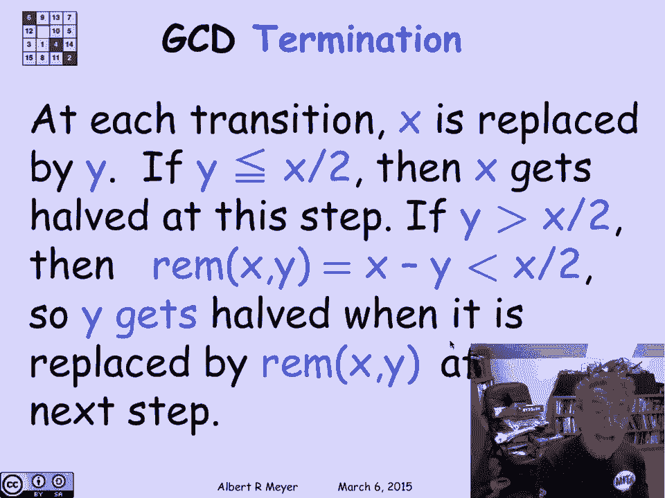

---

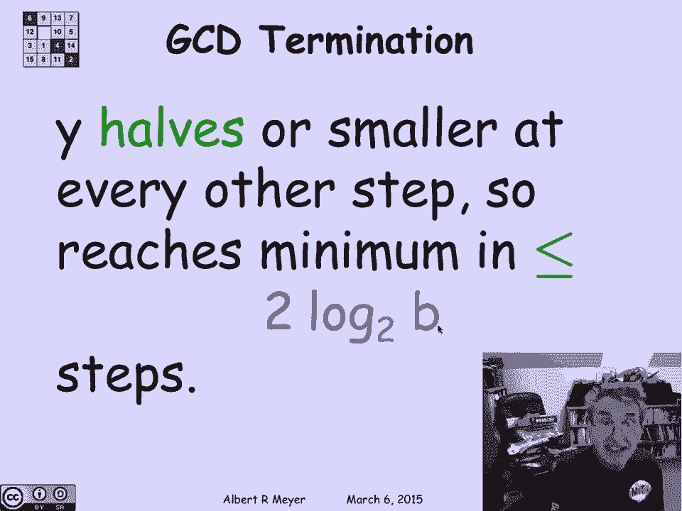

本节课中我们一起学习了欧几里得算法。我们从**余数引理**这个核心数学原理出发，通过一个例子演示了算法的计算步骤。接着，我们将其形式化为一个**状态机模型**，并利用不变性原理证明了算法的正确性。最后，我们分析了算法的效率，指出其**对数级**的时间复杂度，这使得计算大整数的最大公约数变得非常高效。这个古老的算法是许多现代密码学技术的数学基础之一。