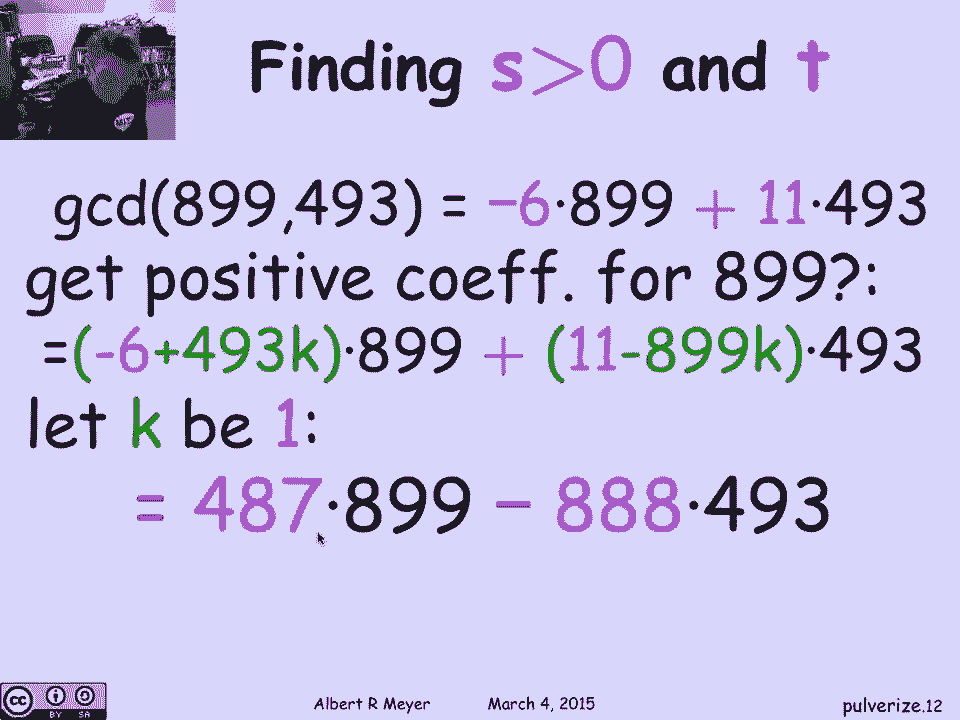
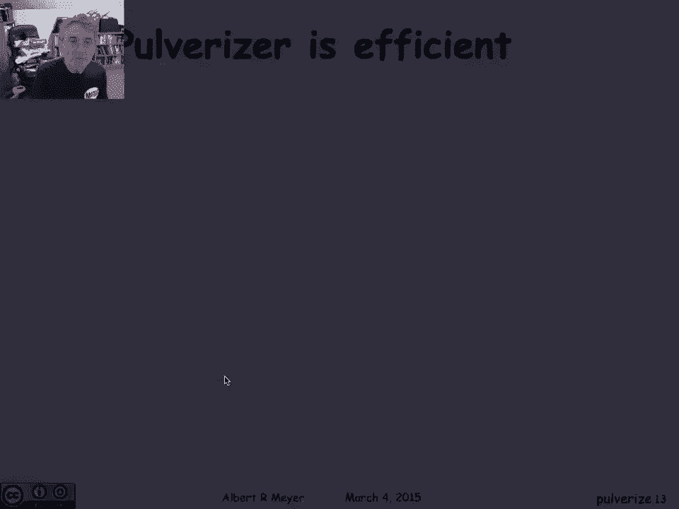
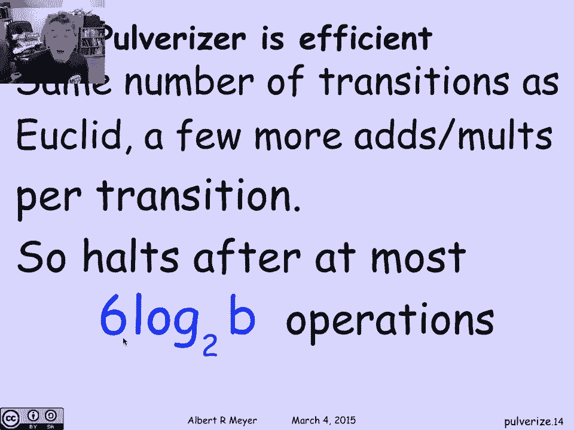

# 计算机科学的数学基础：L2.1.4：Pulverizer（扩展欧几里得算法）🔢

在本节课中，我们将要学习一个被称为 **Pulverizer（粉碎机）** 的算法，它也被称为扩展欧几里得算法。我们将看到它如何高效地找到两个整数的最大公约数（GCD），并同时计算出满足特定线性组合关系的系数 `s` 和 `t`。

## 概述

上一节我们介绍了欧几里得算法和线性组合的概念。本节中，我们将看看如何扩展欧几里得算法，使其不仅能计算最大公约数，还能找到对应的系数。这个扩展算法就是 **Pulverizer**。

## 算法目标与原理

我们的目标是证明并实现一个核心定理：对于任意两个整数 `a` 和 `b`，它们的最大公约数 `gcd(a, b)` 可以表示为 `a` 和 `b` 的线性组合。即，存在整数 `s` 和 `t`，使得：

**公式：** `gcd(a, b) = s * a + t * b`

Pulverizer 算法使我们能够高效地找到这样的系数 `s` 和 `t`。其基本思想是：在执行标准欧几里得算法的过程中，同时追踪一组额外的系数，这些系数记录了当前数值如何表示为原始 `a` 和 `b` 的线性组合。

## 算法步骤详解

以下是 Pulverizer 算法的具体执行步骤。我们将通过维护一组系数来追踪线性组合关系。

### 初始化

算法开始时，我们有两个寄存器 `x` 和 `y`，分别初始化为 `a` 和 `b`。同时，我们需要维护四个系数 `c, d, e, f`，使得以下关系始终成立：
*   `x = c * a + d * b`
*   `y = e * a + f * b`

初始状态很简单：
*   `x = a = 1*a + 0*b`，所以 `c=1`, `d=0`。
*   `y = b = 0*a + 1*b`，所以 `e=0`, `f=1`。

### 迭代更新

欧几里得算法的每一步是计算 `x` 除以 `y` 的商 `q` 和余数 `r`，然后更新 `(x, y)` 为 `(y, r)`。

在 Pulverizer 中，我们不仅要更新数值，还要更新对应的系数：
1.  新的 `x` 就是旧的 `y`。因此，新的系数 `(c新, d新)` 就等于旧的 `(e, f)`。
2.  新的 `y` 是余数 `r`，计算公式为 `r = x - q * y`。由于 `x` 和 `y` 都可以表示为 `a` 和 `b` 的线性组合，那么 `r` 也可以：
    **公式：** `r = (c*a + d*b) - q * (e*a + f*b) = (c - q*e)*a + (d - q*f)*b`
    因此，新的系数 `(e新, f新)` 就等于 `(c - q*e, d - q*f)`。

### 算法终止

当余数 `r` 为 0 时，算法终止。此时，`y` 的值就是 `gcd(a, b)`，而对应的系数 `(e, f)` 就是我们寻找的 `(s, t)`，满足 `gcd(a, b) = e*a + f*b`。

## 实例演示

让我们通过一个具体例子 `a=899`, `b=493` 来演示这个过程。下表追踪了每一步的数值和系数变化：

| 步骤 | x (值) | y (值) | 商 q | 余数 r | c | d | e | f | 说明 |
| :--- | :--- | :--- | :--- | :--- | :--- | :--- | :--- | :--- | :--- |
| 初始 | 899 | 493 | - | - | 1 | 0 | 0 | 1 | `x=1*a+0*b`, `y=0*a+1*b` |
| 1 | 493 | 406 | 1 | 406 | 0 | 1 | 1 | -1 | `r = x - q*y = 899-1*493=406`   `e新=1-1*0=1`, `f新=0-1*1=-1` |
| 2 | 406 | 87 | 1 | 87 | 1 | -1 | -1 | 2 | `r = 493-1*406=87`   `e新=0-1*1=-1`, `f新=1-1*(-1)=2` |
| 3 | 87 | 58 | 4 | 58 | -1 | 2 | 5 | -9 | `r = 406-4*87=58`   `e新=1-4*(-1)=5`, `f新=-1-4*2=-9` |
| 4 | 58 | 29 | 2 | 29 | 5 | -9 | -11 | 20 | `r = 87-1*58=29`   `e新=-1-1*5=-6`, `f新=2-1*(-9)=11` |
| 5 | 29 | 0 | 2 | 0 | -6 | 11 | - | - | `r = 58-2*29=0`，算法终止 |

算法在余数为 0 时停止。此时，`y=29` 即为 `gcd(899, 493)`。对应的系数 `e=-6`, `f=11` 满足：
**公式：** `gcd(899, 493) = 29 = (-6) * 899 + 11 * 493`

## 系数调整技巧

从例子中我们看到，得到的系数 `s = -6` 是负数。如果我们希望得到一个正系数的表达式，有一个简单的技巧：因为 `gcd(a,b) = s*a + t*b`，我们可以在 `s` 上加上 `b` 的倍数，同时在 `t` 上减去 `a` 的相同倍数，其值保持不变。

**公式：** `gcd(a,b) = (s + k*b)*a + (t - k*a)*b`，其中 `k` 是任意整数。

例如，取 `k=1`：
*   新 `s = -6 + 493 = 487`
*   新 `t = 11 - 899 = -888`
于是我们得到另一个有效的表达式：`29 = 487 * 899 + (-888) * 493`。这样我们就得到了一个正系数。

## 算法效率

Pulverizer 算法与标准欧几里得算法具有相同的效率级别。它的时间复杂度是 **O(log min(a, b))**，具体来说，所需的算术运算次数与 `a` 和 `b` 的二进制位长度成正比。这意味着即使对于非常大的数字，它也能非常高效地运行。

## 总结

本节课中我们一起学习了 **Pulverizer（扩展欧几里得算法）**。我们了解到：
1.  该算法在计算 `gcd(a, b)` 的同时，能高效地找到系数 `s` 和 `t`，使得 `gcd(a, b) = s*a + t*b`。
2.  其核心是在欧几里得算法的迭代过程中，维护并更新一组表示线性组合关系的系数。
3.  通过一个简单的数学技巧，我们可以调整得到的系数，例如获得正系数的表达式。
4.  该算法非常高效，时间复杂度是对数级的，适用于解决需要线性组合系数的数论问题。

这个算法是解决许多数论和密码学问题的基础工具，例如求解模线性方程。在接下来的课程中，我们将看到它的具体应用。