# 计算机科学的数学基础：P38：L2.1.6- 重温《虎胆龙威》💧

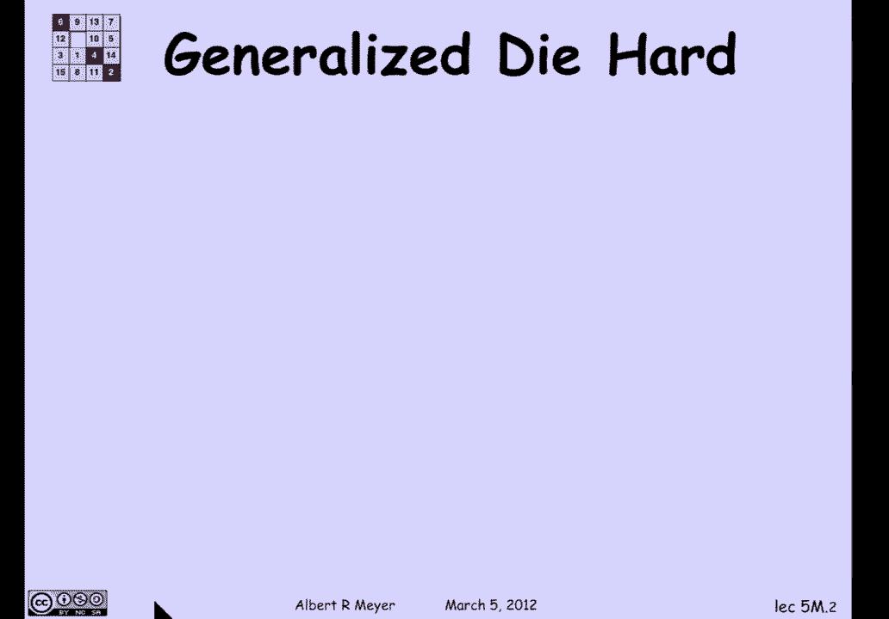

在本节课中，我们将基于《虎胆龙威》水壶问题的状态机分析，推导出两个重要的结论。我们将探讨在给定规则下，水壶中可能达到的水量范围，并理解其背后的数学原理。

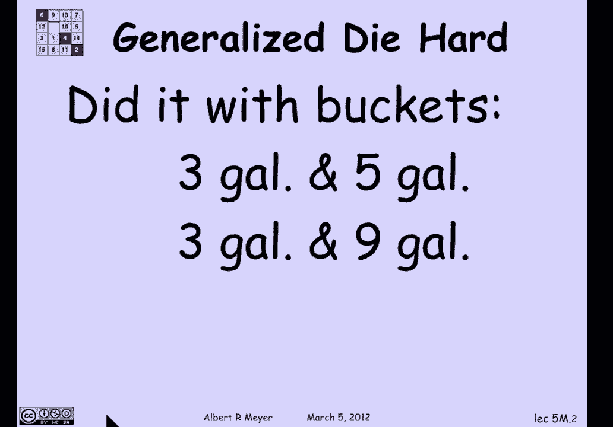

上一节我们介绍了状态机在《虎胆龙威》问题中的应用，本节中我们来看看如何从这些分析中得出一般性的结论。

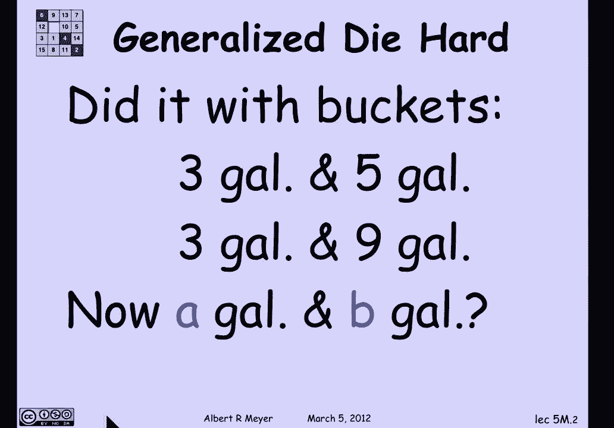

## 核心发现

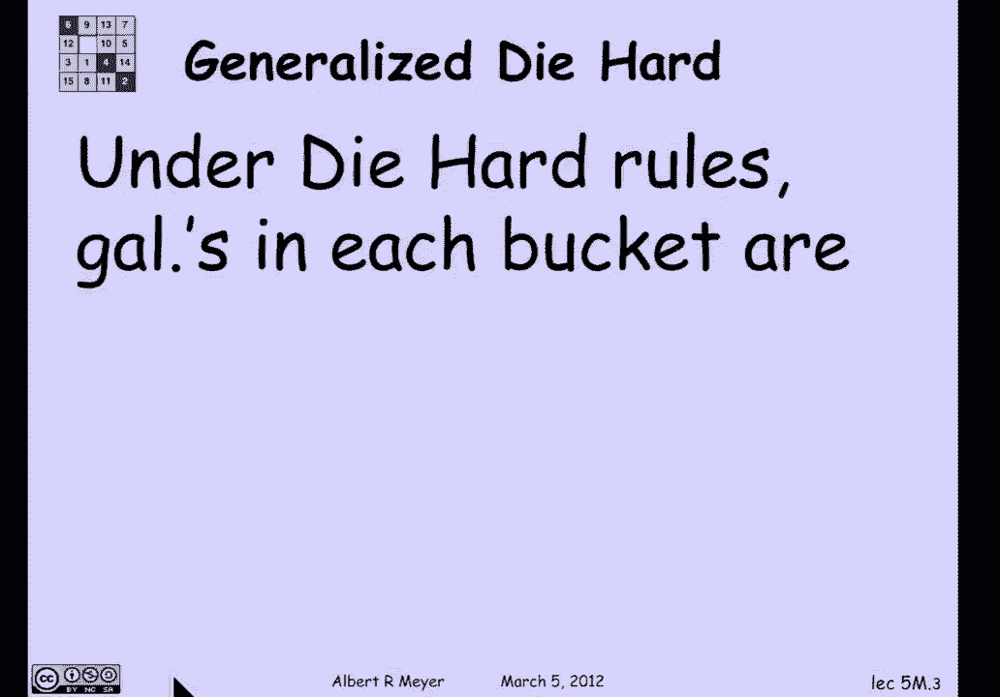

通过分析《虎胆龙威》的状态机，我们发现在其规则下，任何阶段每个水壶中的水量，都是水壶容量A和B的**线性组合**。

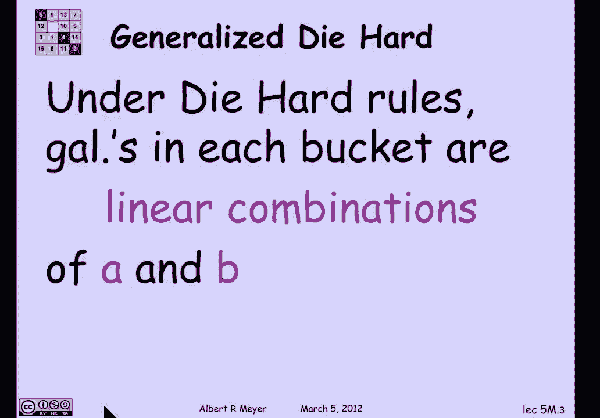

用公式表示，在任何一系列操作后，水壶中的水量可以表示为：
`水量 = s * A + t * B`
其中`s`和`t`是整数。

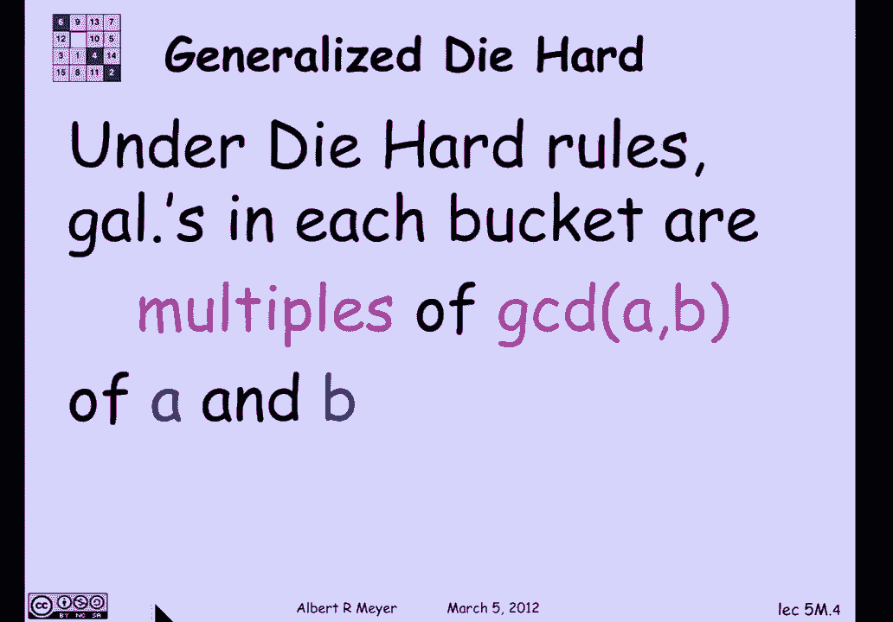

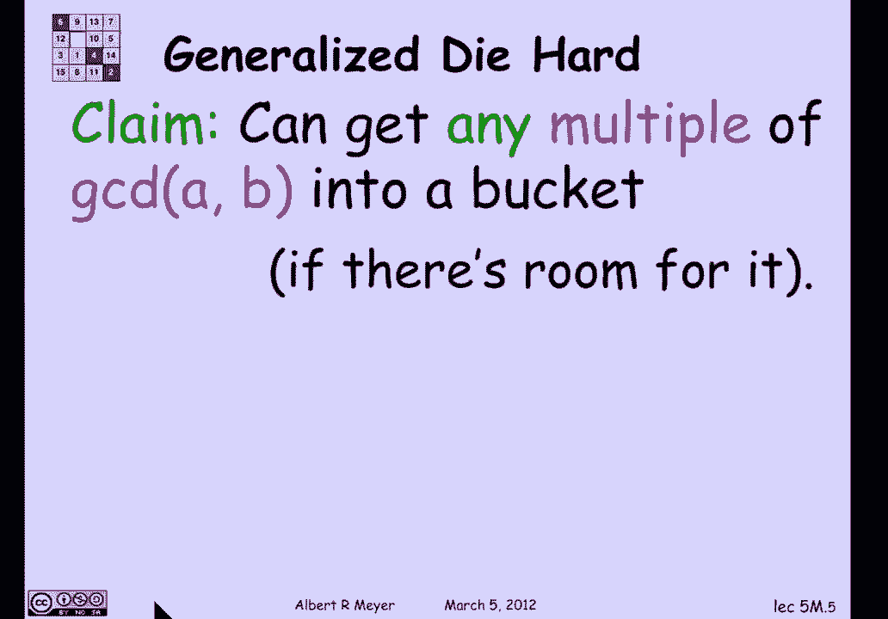

一个关键点是，**最大公约数（GCD）** 整除A和B的任何线性组合。这为我们理解可能获得的水量范围提供了重要线索。

## 可达水量的完整描述

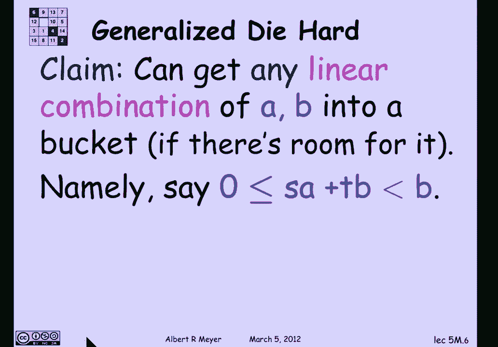

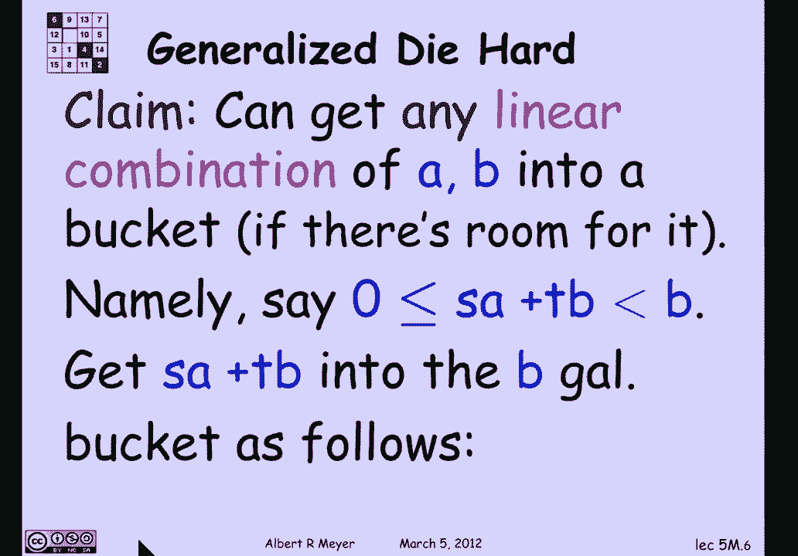

事实上，只要线性组合的结果能装进水壶（即非负且小于水壶容量），该水量就是可达的。

换句话说，你可以得到A和B的**任何线性组合**，前提是它能被容纳在某个水壶中。

让我们看看如何实现这一点。假设我们有一个线性组合 `s*A + t*B`，并且它满足 `0 ≤ s*A + t*B < B`，这意味着它可以被装进B水壶。

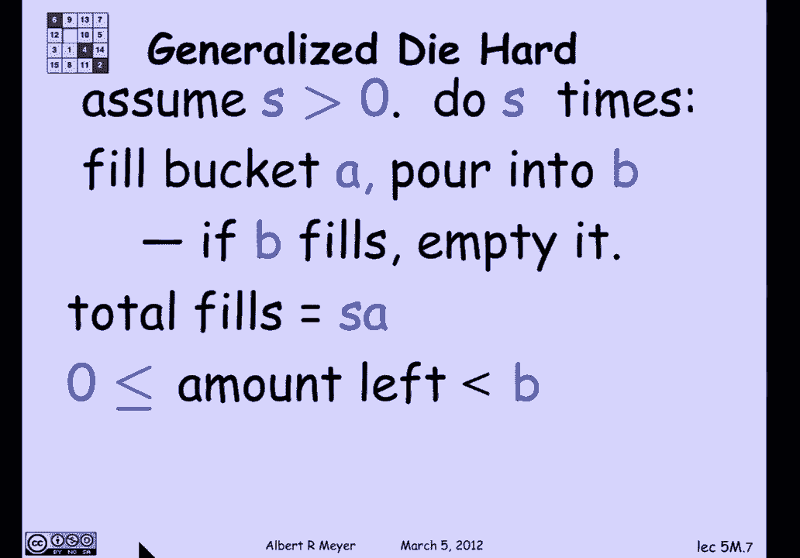

以下是实现该水量的步骤：

1.  重复将A水壶装满，然后将其中的水倒入B水壶。
2.  每当B水壶被装满时，就将其倒空。
3.  持续这个过程，直到B水壶中得到我们想要的水量。

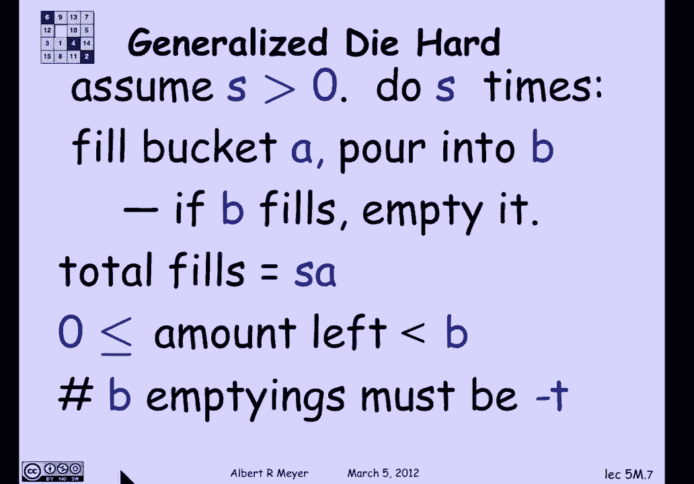

在这个过程中，装满A水壶的总次数是`s`次。从水源获得的总水量是 `s * A`。B水壶被倒空的次数必须是 `-t` 次（注意`t`是负数，所以`-t`是正数）。最终，B水壶中剩余的水量正好是 `s*A + t*B`。

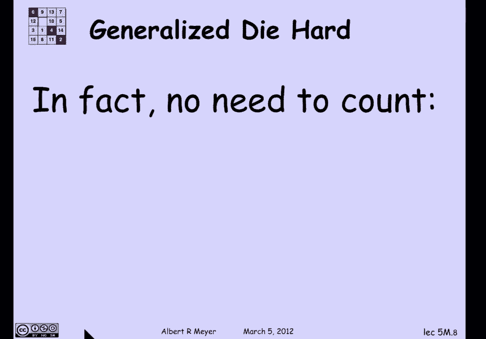

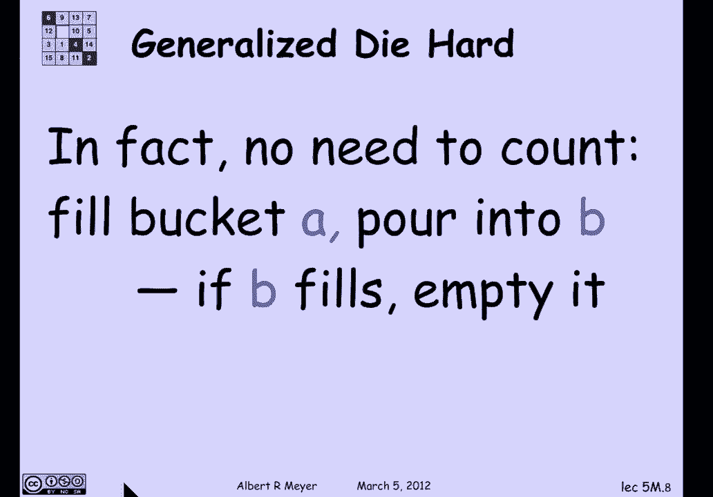

实际上，你甚至不需要预先知道`s`和`t`的具体值。你只需要持续执行“装满A，倒入B，B满则清空”的循环，并监控B水壶中的水量，直到达到目标值即可。

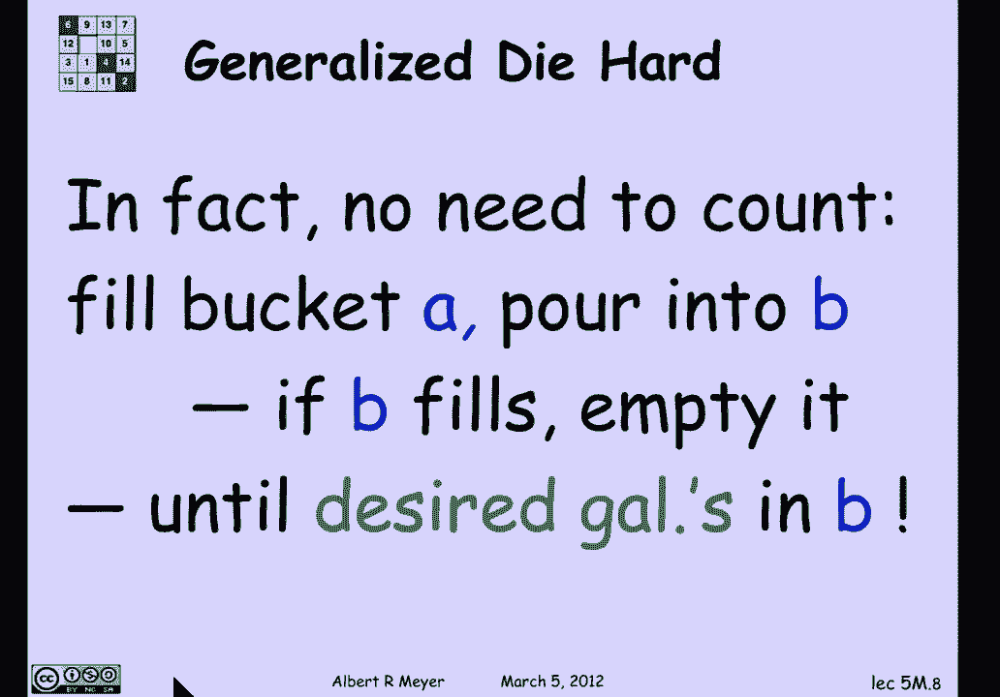

本节课中我们一起学习了如何从《虎胆龙威》水壶问题的状态机分析中，推导出水量的可达性定理。我们证明了在给定规则下，水壶中可达的水量正是其容量的线性组合，并且可以通过一个简单的迭代过程获得任何符合条件的线性组合值。这为我们理解此类问题的本质提供了清晰的数学框架。