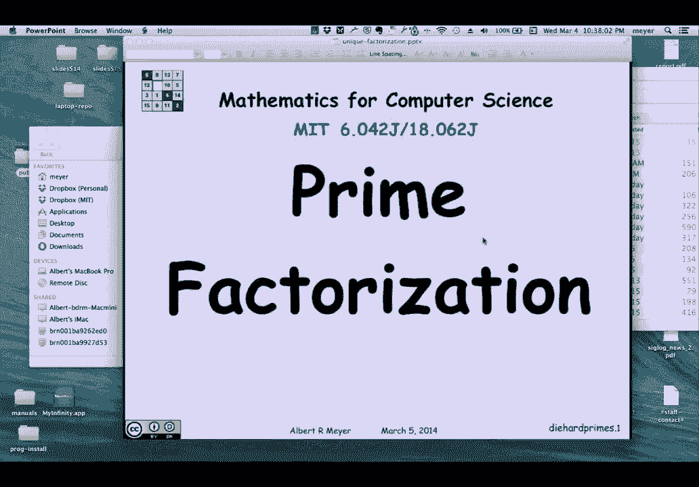
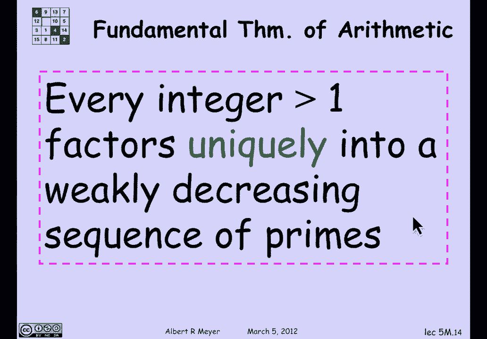
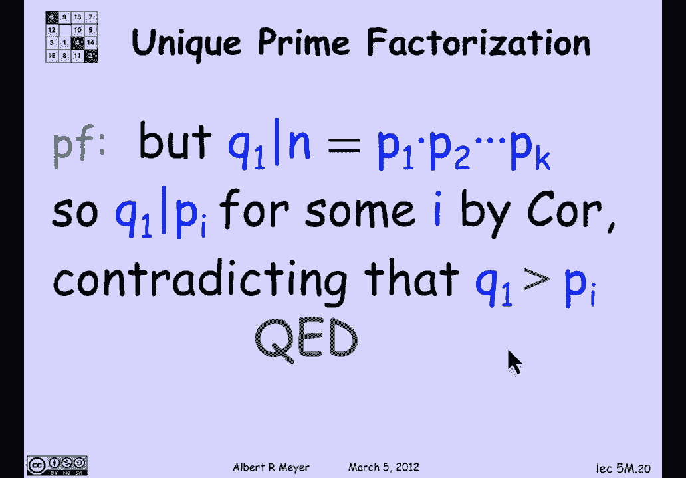

# 计算机科学的数学基础：L2.1.7：素因数分解定理

在本节课中，我们将学习算术基本定理，即素因数分解定理。我们将探讨其核心引理，并学习如何证明每个大于1的整数都可以唯一地分解为素数的乘积。



---

## 核心引理：素数整除乘积的性质

上一节我们介绍了素数的概念，本节中我们来看看素数的一个关键性质。这个引理是证明素因数分解定理的基础。

**引理**：如果 `p` 是一个素数，并且 `p` 整除两个整数 `a` 和 `b` 的乘积 `a * b`，那么 `p` 必定整除 `a` 或整除 `b`。

我们不能直接使用素因数分解来证明这个引理，因为我们正要用它来证明素因数分解定理本身。因此，我们需要基于最大公约数（GCD）的知识进行证明。

**证明**：
假设 `p` 整除 `a * b`，但 `p` 不整除 `a`。由于 `p` 是素数，其正因子只有 `1` 和 `p` 本身。既然 `p` 不整除 `a`，那么 `a` 和 `p` 的最大公约数 `gcd(a, p) = 1`。

根据裴蜀定理，存在整数 `s` 和 `t`，使得以下线性组合成立：
```
s * a + t * p = 1
```
现在，将等式两边同时乘以 `b`：
```
s * (a * b) + t * p * b = b
```
观察等式左边：
*   第一项 `s * (a * b)` 包含 `a * b`，而 `p` 整除 `a * b`，所以第一项是 `p` 的倍数。
*   第二项 `t * p * b` 显式地包含因子 `p`，所以它也是 `p` 的倍数。

因此，等式左边是 `p` 的倍数之和，所以它本身也是 `p` 的倍数。这意味着等式右边 `b` 也必须是 `p` 的倍数。由此证明，`p` 整除 `b`。

这个优雅的证明是我们证明唯一分解定理的关键。

---

## 引理的推论

基于上述引理，我们可以得到一个有用的推论。

**推论**：如果一个素数 `p` 整除多个整数的乘积 `a1 * a2 * ... * am`，那么 `p` 至少整除其中一个因子 `ai`。

这个推论可以通过数学归纳法证明，其基础情况（`m=2`）正是我们刚刚证明的引理。

---

## 算术基本定理（素因数分解定理）



现在，我们准备证明本节课的核心——算术基本定理。

**定理**：每一个大于1的整数 `n`，都可以唯一地表示为一系列弱递减（即非递增）的素数的乘积。

“弱递减”这个技术性描述是为了精确表达唯一性。它意味着，如果我们把所有素因子（包括重复出现的）按从大到小的顺序排列，那么这个序列是唯一的。

**公式表示**：
```
n = p1 * p2 * ... * pk
```
其中 `p1 ≥ p2 ≥ ... ≥ pk`，且每个 `pi` 都是素数。

**举例**：
数字 `123456` 可以分解为：
```
123456 = 2^6 * 3^1 * 643^1
```
按弱递减序列排列其素因子（考虑重复次数），我们得到序列：`643, 3, 2, 2, 2, 2, 2, 2`。这是表示 `123456` 的唯一方式。

---

## 定理的证明（反证法）

我们使用反证法来证明唯一性。

1.  **假设存在反例**：假设存在一个大于1的最小整数 `N`，它有两种不同的素因数分解方式。
    ```
    N = p1 * p2 * ... * pk = q1 * q2 * ... * qm
    ```
    其中 `p` 序列和 `q` 序列都是弱递减的素数序列，但这两个序列不相同。

2.  **比较第一个素因子**：
    *   如果 `p1 = q1`，那么我们可以从等式两边同时约去 `p1`，得到一个更小的数 `N / p1` 也具有两种不同的分解，这与 `N` 是最小反例的假设矛盾。
    *   因此，`p1` 和 `q1` 必然不相等。不妨假设 `q1 > p1`。

3.  **推导矛盾**：
    *   由于 `q1 > p1`，且 `p` 序列是弱递减的，所以 `q1` 大于 `p` 序列中的每一个素数 `pi`。
    *   观察等式 `N = p1 * p2 * ... * pk`。因为 `q1` 整除 `N`（`q1` 是 `N` 的一个因子），根据前面的**推论**，`q1` 必须整除某个 `pi`。
    *   但是，`q1` 是一个素数且 `q1 > pi`，一个较大的素数不可能整除一个较小的素数（因为素数只能被1和自身整除）。这产生了矛盾。

4.  **结论**：最初的假设是错误的。不存在这样的反例 `N`。因此，每个大于1的整数的素因数分解方式都是唯一的。

---

## 总结

本节课中我们一起学习了：
1.  **核心引理**：素数整除乘积的性质及其证明，该证明巧妙地运用了线性组合。
2.  **算术基本定理**：每个大于1的整数都有唯一（按弱递减序列排列）的素因数分解。
3.  **定理证明**：通过“最小反例”的反证法，结合核心引理，严谨地证明了分解的唯一性。



素因数分解定理是数论的基石，在计算机科学的诸多领域，如密码学、算法分析中都有根本性的应用。