# 计算机科学的数学基础：2.2.3：模n的逆元 🔢

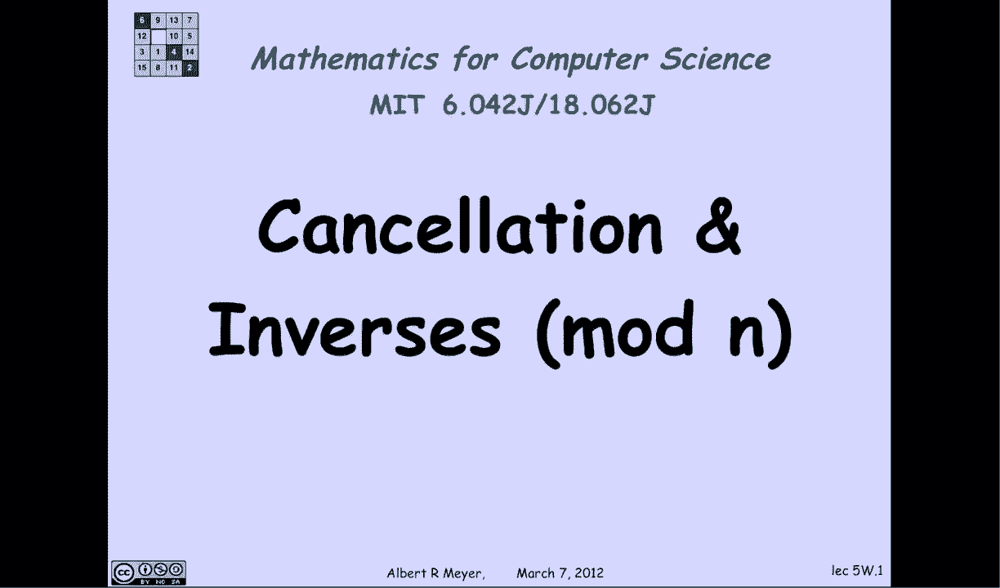

在本节课中，我们将要学习模n运算（即余数算术）中的一个核心概念——**逆元**。我们将探讨为什么在模运算中不能随意“消去”一个数，以及何时可以安全地进行消去。理解逆元是掌握模运算中乘法和除法行为的关键。

上一节我们介绍了模n运算的基本同余规则，它使得加法与乘法运算与普通算术非常相似。本节中我们来看看模运算与普通算术的一个主要区别：**消去律**并不总是成立。

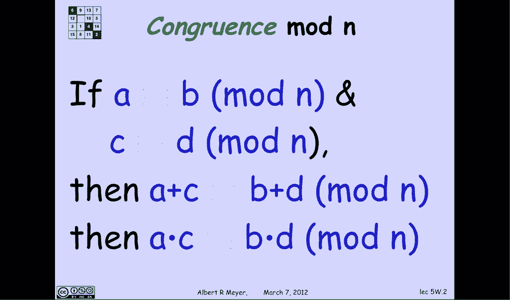

## 模运算中的消去问题

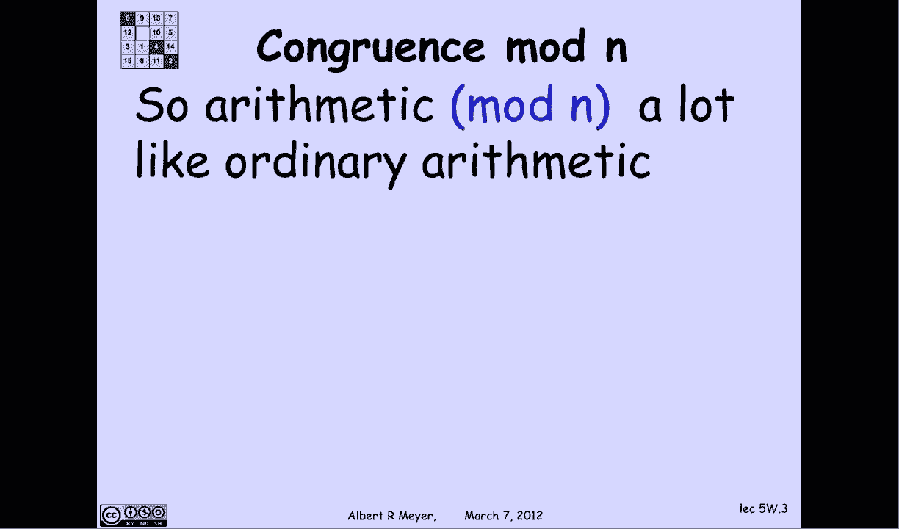

我们从一个具体的例子开始。在模10的运算中，有：
`8 * 2 ≡ 16 ≡ 6 (mod 10)`
同时：
`3 * 2 ≡ 6 (mod 10)`
因此，`8 * 2 ≡ 3 * 2 (mod 10)`。

如果像在普通算术中一样，我们尝试在等式两边消去2，就会得到 `8 ≡ 3 (mod 10)` 的结论，这显然是错误的。

**核心结论**：在模n运算中，你不能随意消去等式两边相同的乘数。

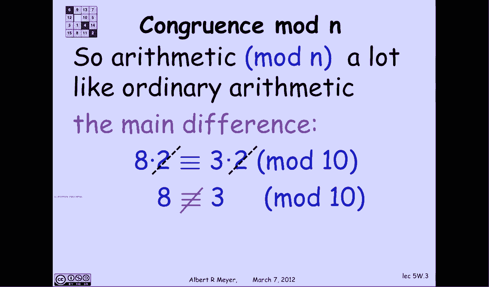

## 何时可以消去？逆元的概念

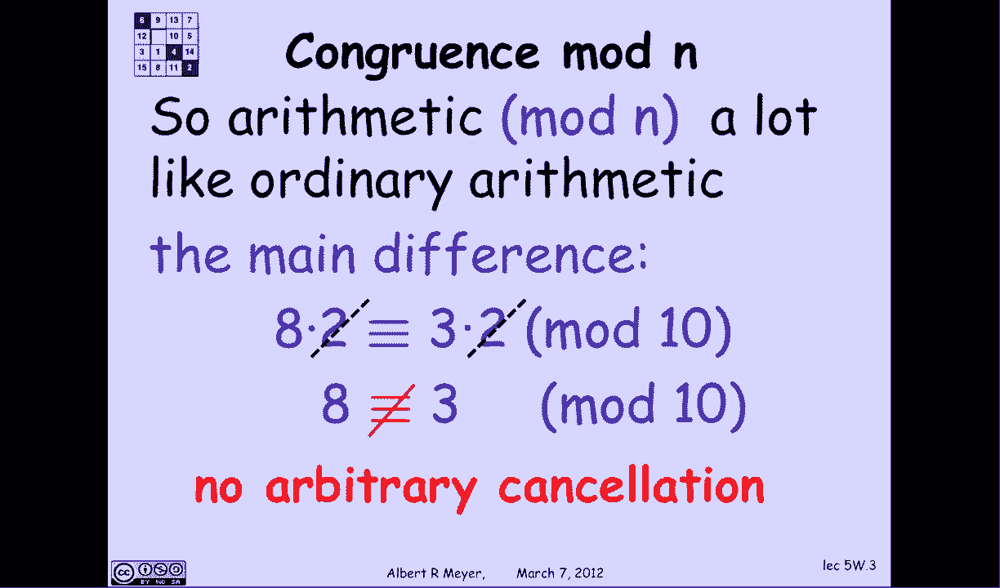

那么，关键问题来了：我们何时可以安全地消去一个数k呢？答案是：当数k在模n下有**逆元**时。

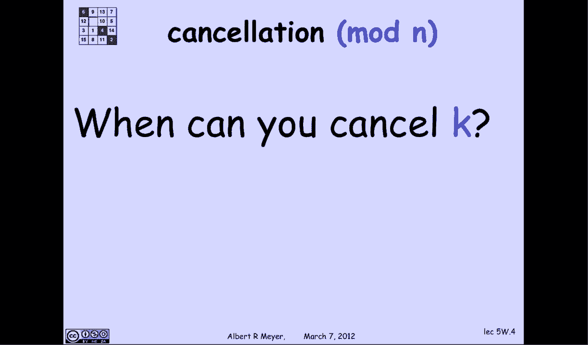

一个数k在模n下的逆元，记作 `k'`，是一个满足以下等式的整数：
`k * k' ≡ 1 (mod n)`
你可以将 `k'` 理解为模n世界里的 `1/k`，只不过它是一个整数。

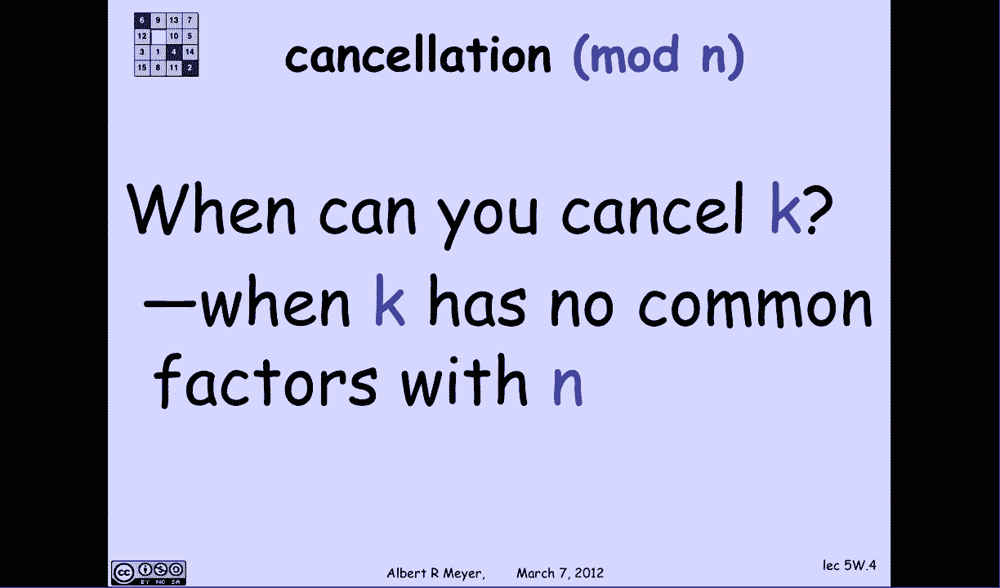

**定理**：数k在模n下存在逆元，当且仅当 `k` 与 `n` **互质**（即 `gcd(k, n) = 1`）。

## 如何找到逆元？扩展欧几里得算法

如何找到这个逆元 `k'` 呢？这基于一个重要的数论事实：如果 `k` 与 `n` 互质，那么存在整数 `s` 和 `t`，使得：
`s * k + t * n = 1`
这个等式称为**贝祖等式**，可以通过**扩展欧几里得算法**求得 `s` 和 `t`。

让我们仔细看看这个等式在模n下的含义：
1.  等式 `s*k + t*n = 1` 在整数中成立。
2.  将其转换为模n同余式：`s*k + t*n ≡ 1 (mod n)`。
3.  由于 `n ≡ 0 (mod n)`，所以 `t*n ≡ 0 (mod n)`。
4.  因此，上式简化为：`s * k ≡ 1 (mod n)`。

看！根据逆元的定义，这里的系数 `s` 就是 `k` 在模n下的逆元 `k'`。所以，**求逆元的过程就是求解贝祖等式 `s*k + t*n = 1` 中的系数 `s`**。

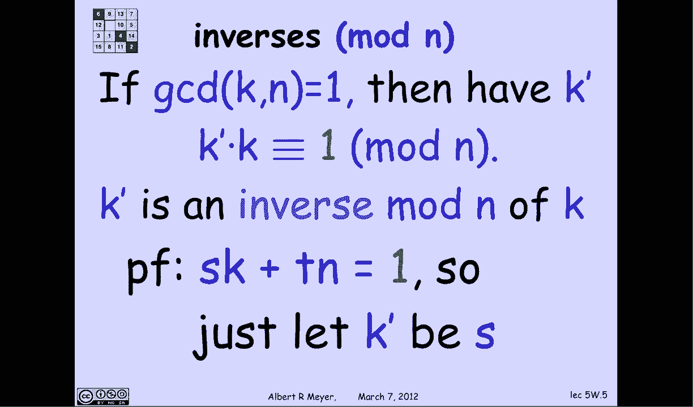

## 利用逆元进行消去

一旦我们有了逆元 `k'`，消去操作就变得合法了。假设我们有：
`a * k ≡ b * k (mod n)`
并且 `k` 与 `n` 互质，其逆元为 `k'`。

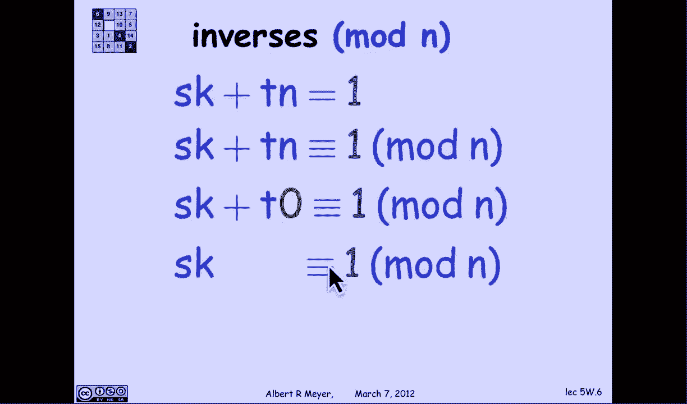

以下是消去步骤：
1.  在等式两边同时乘以 `k'`：`(a * k) * k' ≡ (b * k) * k' (mod n)`
2.  根据结合律：`a * (k * k') ≡ b * (k * k') (mod n)`
3.  因为 `k * k' ≡ 1 (mod n)`，所以得到：`a * 1 ≡ b * 1 (mod n)`
4.  最终结果：`a ≡ b (mod n)`

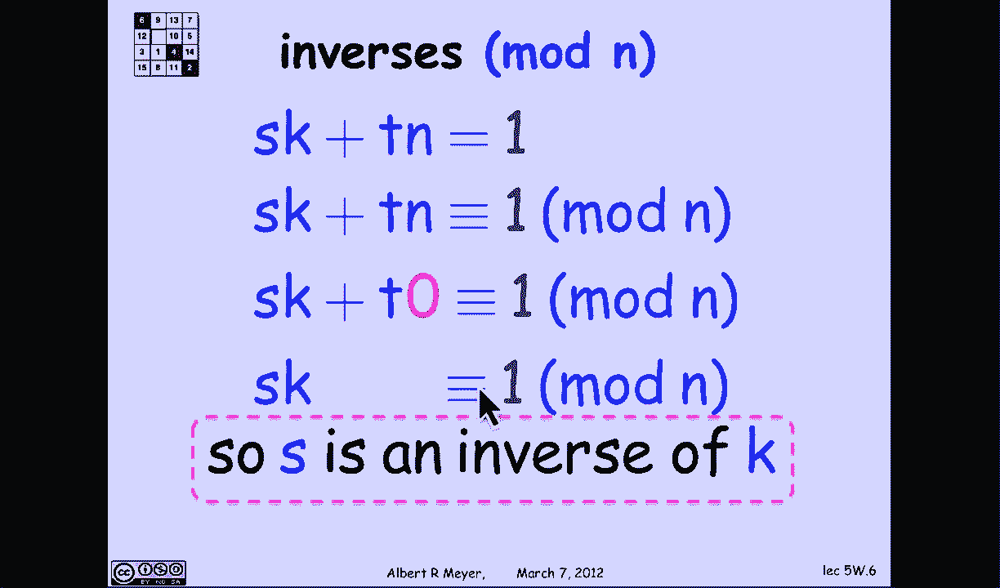

这样，我们就成功地消去了 `k`。

## 核心规则总结

以下是关于模n运算中消去律的核心要点：

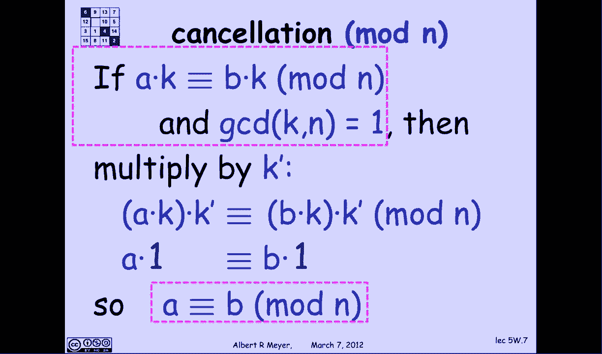

*   **可消去条件**：一个数 `k` 可以在模n运算中被消去，当且仅当 `k` 在模n下存在逆元。
*   **等价表述**：`k` 可消去当且仅当 `k` 与 `n` 互质（即 `gcd(k, n) = 1`）。
*   **求逆方法**：通过解贝祖等式 `s*k + t*n = 1`（使用扩展欧几里得算法），得到的 `s` 即为 `k` 模n的逆元。
*   **消去操作**：当 `a*k ≡ b*k (mod n)` 且 `k` 与 `n` 互质时，在等式两边乘以 `k` 的逆元，即可得到 `a ≡ b (mod n)`。

---

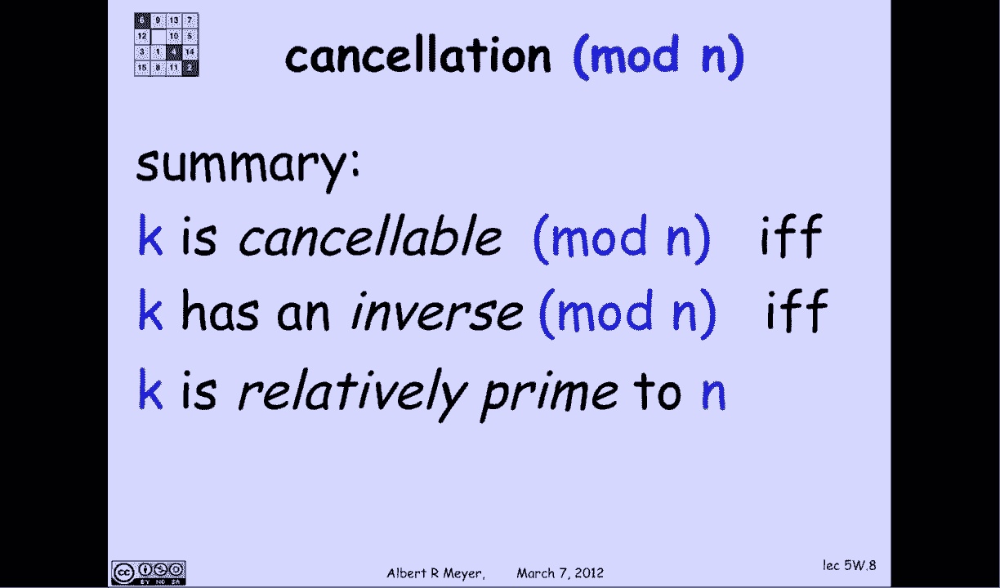

本节课中我们一起学习了模n运算中**逆元**的概念及其重要性。我们明白了为什么不能随意消去，并掌握了判断一个数是否可消去的方法（检查是否与模数n互质），以及如何通过扩展欧几里得算法找到逆元来执行合法的消去操作。这是理解模运算代数结构的基础。