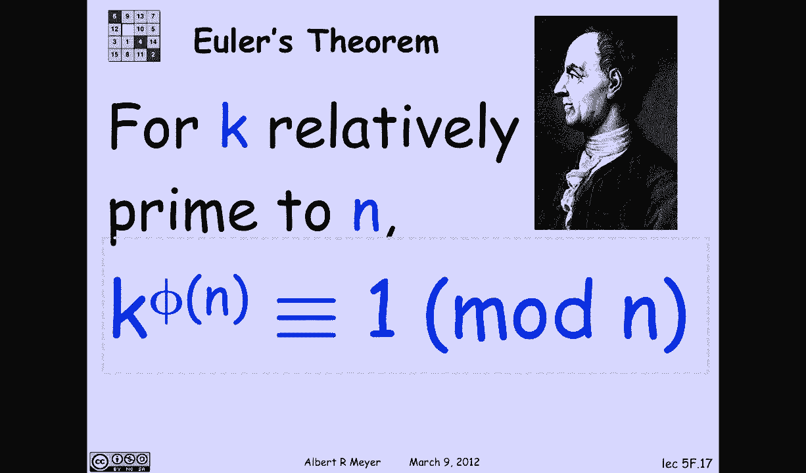

# 计算机科学的数学基础：2.3：模幂运算与欧拉函数

## 概述


在本节中，我们将学习模运算中一个非常重要的概念——欧拉函数。我们将了解它的定义、如何计算，并初步认识它在欧拉定理中的作用。理解欧拉函数是掌握后续模幂运算和密码学基础的关键。

## 欧拉函数的定义

上一节我们讨论了模运算中的逆元。具有模逆元的元素对我们特别重要，因此第一个问题是：这样的元素有多少个？这就是欧拉函数告诉我们的。

设 `n` 为一个正整数。`n` 的欧拉函数 `φ(n)` 定义为：在从 `0` 到 `n-1` 的余数区间内，与 `n` 互质的整数 `k` 的数量。

另一种说法是，`φ(n)` 计算的是与 `n` 互质的数的个数。我们定义一组我们感兴趣的数字：`{k | 0 ≤ k < n 且 gcd(k, n) = 1}`。这个集合的大小就是 `φ(n)`。

`φ(n)` 也称为欧拉函数，我们常称之为 `phi` 或欧拉 `φ` 函数。

## 计算欧拉函数：示例

让我们通过几个例子来理解如何计算 `φ(n)`。

**示例1：`n = 7`**
因为 `7` 是质数，所有小于 `7` 的正整数（即 `1` 到 `6`）都与 `7` 互质。因此，`φ(7) = 6`。

**示例2：`n = 12`**
我们需要找出在 `0` 到 `11` 中，哪些数与 `12` 没有公因子（除了1）。这些数是 `1, 5, 7, 11`。其他数（如 `2, 3, 4, 6, 8, 9, 10`）与 `12` 有公因子。因此，`φ(12) = 4`。

## 计算欧拉函数的规则

了解了基本定义后，我们来看看如何系统地计算 `φ(n)`。以下是针对不同情况的规则。

### 规则1：当 `n` 是质数时

如果 `p` 是质数，那么所有小于 `p` 的正整数都与 `p` 互质。因此：
```
φ(p) = p - 1
```

### 规则2：当 `n` 是质数的幂时

让我们看一个更重要的例子：计算 `φ(9)`。候选数字是从 `0` 到 `8`。一个数 `k` 与 `9` 互质，当且仅当它与 `3` 互质（因为 `9 = 3²`）。在 `0` 到 `8` 的区间内，哪些数不与 `3` 互质？每三个数中就有一个能被 `3` 整除（即 `0, 3, 6`）。这些是“坏”的数。所以，“好”的（与 `9` 互质的）数的数量就是总数减去坏的数量。

这推广到任意质数的幂。如果 `p` 是质数，`k` 是正整数，那么：
```
φ(p^k) = p^k - p^{k-1}
```
推导：一个数相对于 `p^k` 是互质的，当且仅当它对 `p` 是互质的。在 `0` 到 `p^k - 1` 的区间内，每 `p` 个数中就有一个能被 `p` 整除（即不与 `p` 互质）。这样的数有 `p^k / p = p^{k-1}` 个。因此，互质的数的数量为 `p^k - p^{k-1}`。

### 规则3：欧拉函数的乘性

假设你处理的数字不是质数的幂。关于 `φ` 函数有一个非常优雅的性质，它解释了如何处理非质数幂的情况。

如果 `a` 和 `b` 互质（即 `gcd(a, b) = 1`），那么：
```
φ(a * b) = φ(a) * φ(b)
```
这个性质称为**乘性**。在数论中，如果一个函数在互质的输入上的值等于各输入值的乘积，则该函数是乘法的。`φ` 函数就是乘法的。

这个性质的证明会在习题集或后续关于计数与容斥原理的课程中看到。现在，让我们利用这个性质来计算任意数字的 `φ` 值。

## 应用乘性计算欧拉函数

让我们利用 `φ` 的乘性来计算之前看起来复杂的 `φ(12)`。

因为 `12 = 3 * 4`，且 `gcd(3, 4) = 1`，所以：
```
φ(12) = φ(3) * φ(4)
```
现在问题简化了：
*   `3` 是质数，所以 `φ(3) = 3 - 1 = 2`。
*   `4` 是质数 `2` 的幂（`2²`），所以 `φ(4) = 2² - 2^{2-1} = 4 - 2 = 2`。

因此：
```
φ(12) = 2 * 2 = 4
```
这与我们之前通过列举得到的结果一致。

## 欧拉函数的重要性：通向欧拉定理

我们为什么要关心欧拉函数 `φ(n)` 呢？关键在于**欧拉定理**。

欧拉定理告诉我们，与 `n` 互质的数的幂在模 `n` 下的行为。具体来说：
> 如果整数 `k` 与 `n` 互质（即 `gcd(k, n) = 1`），那么将 `k` 提升到 `φ(n)` 次方后，其结果与 `1` 模 `n` 同余。
> 用公式表示为：如果 `gcd(k, n) = 1`，则 `k^{φ(n)} ≡ 1 (mod n)`。

这个定理是RSA加密算法等现代密码学技术的基石，它引导我们进入下一节关于模幂运算和其应用的深入学习。

## 总结

本节课我们一起学习了欧拉函数 `φ(n)`。我们首先明确了它的定义：小于 `n` 且与 `n` 互质的正整数的个数。接着，我们掌握了计算 `φ(n)` 的三个关键规则：
1.  对于质数 `p`，`φ(p) = p - 1`。
2.  对于质数的幂 `p^k`，`φ(p^k) = p^k - p^{k-1}`。
3.  对于互质的两个数 `a` 和 `b`，`φ` 函数具有乘性：`φ(a*b) = φ(a) * φ(b)`。



最后，我们了解到欧拉函数的核心价值在于它是欧拉定理的关键组成部分，该定理描述了互质数在模幂运算中的周期性，为后续的密码学应用奠定了重要的数学基础。