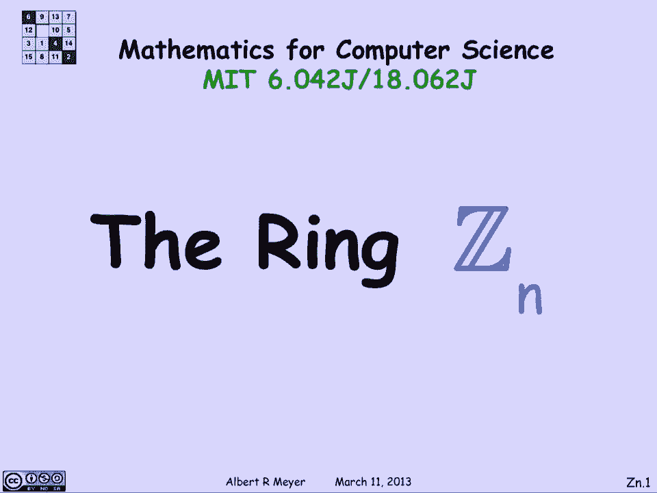
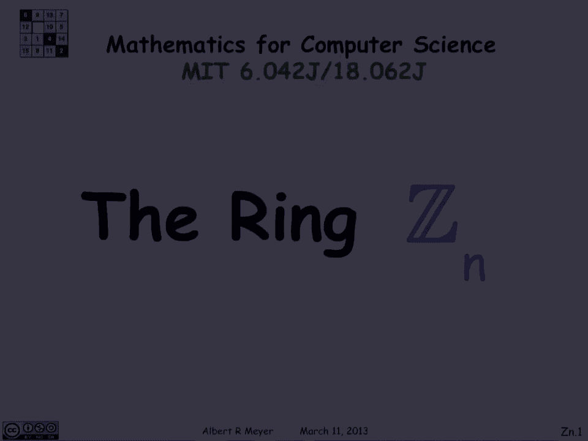
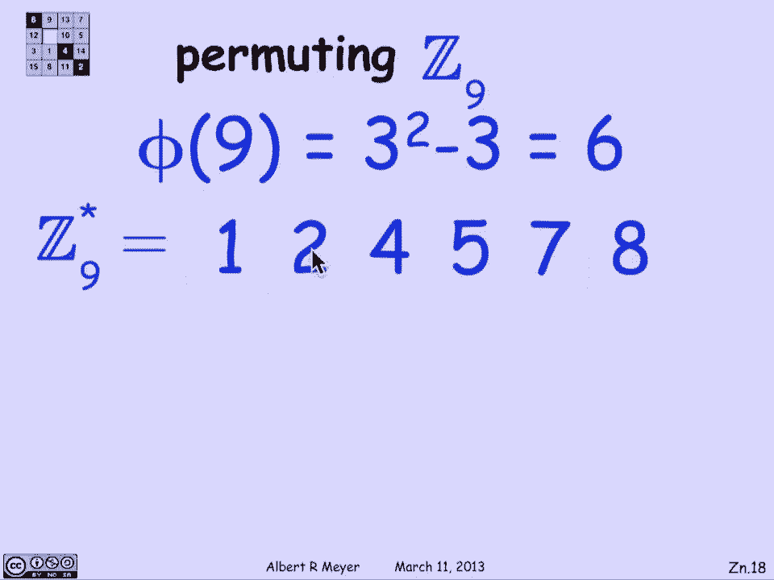
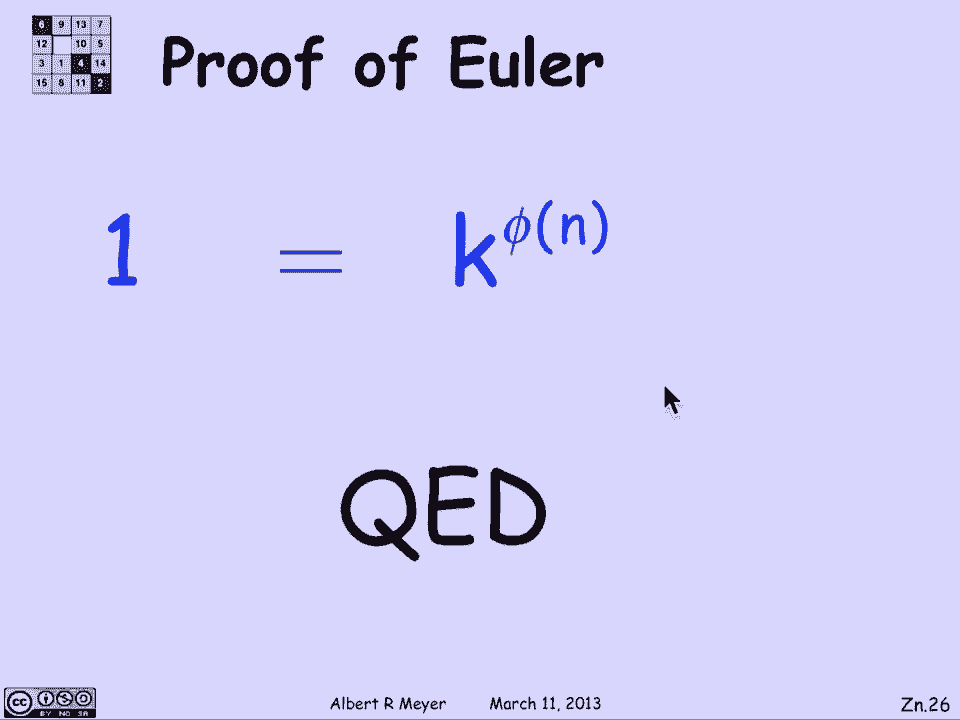

# 计算机科学的数学基础：L2.3.3：整数环 Z_n 🔢

在本节课中，我们将学习“整数环 Z_n”这一重要概念。我们将看到如何通过余数算术来构建一个自洽的数学系统，并利用它来更简洁地证明欧拉定理。

## 概述

上一节我们讨论了同余关系。本节中，我们将引入整数环 Z_n，它将同余算术转化为一个关于“相等”的系统，从而简化推理和证明过程。

## 从余数算术到整数环 Z_n

谈论同余关系的另一种方式是严格地与余数一起工作。这样做的好处是事情会简单一点，因为你无需担心两个余数的乘积可能太大而超出范围，需要再次取余数来“打回”范围内。

整数环 Z_n 以一种优雅的方式捕捉到了这种模 n 的抽象概念。它允许我们严格地谈论“相等”，而不是“同余”。使用余数算术的基本思想是，每当得到一个太大而不是余数的数字时，我们只需再次应用取余操作，使其回到范围内。

Z_n 中的运算正是这样工作的。Z_n 的元素是余数，即从 0 到 n-1（包含 0，不包含 n）的整数。因此，Z_n 中有 n 个元素：0, 1, 2, ..., n-1。

以下是 Z_n 中运算的定义：

*   **加法**：`(i + j) mod n`
*   **乘法**：`(i * j) mod n`

这并非一个戏剧性的新想法，但其回报在于让一些事情的表述更容易，因为我们谈论的是相等而非同余。这个由区间 `[0, n)` 内的整数（方括号 `[` 表示包含，圆括号 `)` 表示排除）在模 n 加法和乘法下组成的数学结构，称为**整数环 Z_n**。

## Z_n 中的算术

Z_n 中的算术本质上就是同余算术，只不过现在使用“等于”而非“同余于”。例如，在 Z_7 中，`3 + 6 = 2`，因为 `(3 + 6) mod 7 = 2`。同样，`9 * 8 = 11 * 6` 在 Z_n 中可能成立，因为两边取模 n 后相等。

整数集合 Z 与环 Z_n 之间的联系可以通过一个称为**同态**的概念来抽象描述。具体来说，取余数操作 `r(k) = k mod n` 定义了一个从 Z 到 Z_n 的同态。这意味着：
*   `r(i + j) = r(i) + r(j)` （在 Z_n 中）
*   `r(i * j) = r(i) * r(j)` （在 Z_n 中）

同余关系与 Z_n 中等式的关系很简单：`i ≡ j (mod n)` 当且仅当 `r(i) = r(j)` 在 Z_n 中。这只是“两数同余当且仅当它们有相同的余数”这一事实的重新表述。

## Z_n 的代数性质

有了 Z_n 这个自洽的系统，我们可以讨论它满足的代数规则。这些规则以等式形式成立，并且非常熟悉。

以下是加法满足的一些基本规则：
*   **结合律**：`(i + j) + k = i + (j + k)`
*   **单位元**：存在元素 `0`，使得 `0 + i = i`
*   **逆元**：对于每个元素 `i`，存在一个元素 `-i`，使得 `i + (-i) = 0`
*   **交换律**：`i + j = j + i`

乘法也满足几乎相同的规则：
*   **结合律**：`(i * j) * k = i * (j * k)`
*   **单位元**：存在元素 `1`，使得 `1 * i = i`
*   **交换律**：`i * j = j * i`

一个明显的遗漏是乘法逆元（即对于任意 `i`，不一定存在 `j` 使得 `i * j = 1`）。最后，还有一个连接加法和乘法的规则：
*   **分配律**：`i * (j + k) = i*j + i*k`

需要注意的一点是，**在 Z_n 中不能随意消去公因子**。例如，在 Z_12 中，`3 * 2 = 2 * 8`（因为 `6 mod 12 = 16 mod 12 = 6`），但消去公因子 `2` 会得到错误的结论 `3 = 8`。这与我们之前关于同余式不能随意消去的结论相对应。

## Z_n* 与欧拉定理

当我们可以在 Z_n 中消去一个元素时，这个元素具有特殊的性质。这里有一个标准的缩写：`Z_n*` 表示 Z_n 中所有与 n 互素的元素组成的集合。

以下是关于 `Z_n*` 的等价描述：
1.  元素 `i` 在 `Z_n*` 中。
2.  `i` 与 `n` 互素（即 `gcd(i, n) = 1`）。
3.  `i` 在 Z_n 中是可消去的（即若 `i*a = i*b`，则 `a = b`）。
4.  `i` 在 Z_n 中存在乘法逆元（即存在 `j` 使得 `i*j = 1`）。

`Z_n*` 是一个值得关注的坚固子集。我们还知道，**欧拉函数 φ(n)** 的定义就是区间 `[0, n)` 内与 n 互素的整数的个数，这正好等于 `Z_n*` 集合的大小，即 `φ(n) = |Z_n*|`。

现在，我们可以用一种更方便的方式重述欧拉定理，不再提及同余，而是谈论 Z_n 中的等式：

**欧拉定理**：对于任意属于 `Z_n*` 的元素 `k`（即与 n 互素），有 `k^(φ(n)) = 1` （在 Z_n 中）。

## 欧拉定理的证明（基于 Z_n*）

欧拉定理的证明可以从几个简单的观察出发，只需几步即可完成。

**引理 1（乘以可逆元保持集合大小）**：设 S 是 Z_n 的任意子集，k 是 Z_n* 中的任意元素（即可消去/可逆）。令 `k * S = {k * s | s ∈ S}`。则集合 `k * S` 与 S 大小相同。
**证明思路**：因为 k 可消去，所以如果 S 中的 `s1 ≠ s2`，则 `k*s1 ≠ k*s2`。因此，乘法操作只是将 S 中的元素一一对应地映射到新集合，没有重合。

**引理 2（Z_n* 对乘法封闭）**：如果 `i` 和 `j` 都属于 `Z_n*`，那么它们的乘积 `i*j` 也属于 `Z_n*`。
**证明思路**：如果 i 和 j 都与 n 没有公因子，那么它们的乘积显然也与 n 没有公因子，因此其模 n 的余数也与 n 互素。

**推论**：对于任意 `k ∈ Z_n*`，有 `k * Z_n* = Z_n*`。
**证明**：
1.  根据引理 2，`k * Z_n*` 中的每个元素都属于 `Z_n*`，所以 `k * Z_n* ⊆ Z_n*`。
2.  根据引理 1，集合 `k * Z_n*` 与 `Z_n*` 大小相同 (`= φ(n)`)。
3.  由于前者是后者的子集且大小相等，所以两者必然相等。

这意味着，用 `Z_n*` 中的任意元素 k 去乘整个 `Z_n*` 集合，只是将集合中的元素重新排列（构成一个置换）。

**证明欧拉定理**：
1.  根据推论，对于 `k ∈ Z_n*`，有 `Z_n* = k * Z_n*`。
2.  考虑这两个相等集合中所有元素的乘积：
    *   左边： `∏_{a ∈ Z_n*} a`
    *   右边： `∏_{a ∈ Z_n*} (k * a)`
3.  右边的乘积可以改写为：`∏_{a ∈ Z_n*} (k * a) = (∏_{a ∈ Z_n*} k) * (∏_{a ∈ Z_n*} a) = k^(φ(n)) * (∏_{a ∈ Z_n*} a)`
    （因为共有 φ(n) 个 k 相乘）。
4.  因此我们得到等式：`∏_{a ∈ Z_n*} a = k^(φ(n)) * (∏_{a ∈ Z_n*} a)` （在 Z_n 中）。
5.  注意到 `∏_{a ∈ Z_n*} a` 是 `Z_n*` 中元素的乘积，根据引理 2，这个乘积本身也属于 `Z_n*`，因此它是**可消去的**。
6.  在等式两边消去 `∏_{a ∈ Z_n*} a`，即得：`1 = k^(φ(n))` （在 Z_n 中）。

证毕。

## 总结

本节课中，我们一起学习了整数环 Z_n 的概念。我们了解到 Z_n 通过取余运算将模 n 同余算术转化为一个关于相等的代数系统，从而简化了表述和证明。我们探讨了 Z_n 的基本代数性质，并重点介绍了其中可逆元素组成的子集 Z_n*。最后，我们利用 Z_n* 的性质，特别是“用可逆元相乘相当于重排集合”这一关键引理，给出了欧拉定理一个简洁而优雅的证明。这个证明展示了将数论问题置于适当的代数结构中进行思考的威力。