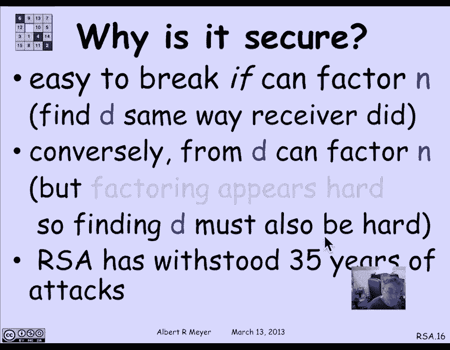

# 计算机科学的数学基础：L2.4.1：RSA公钥加密 🔐

在本节课中，我们将要学习RSA公钥加密系统。这是一个将数论应用于计算机科学的重要实例，它允许任何人仅使用公开信息向指定接收者发送加密的私密消息。

## 概述

RSA是一种公钥加密系统，它拥有一个惊人的特性：任何人无需事先联系，仅使用公开可用的信息，就能向指定接收者发送加密的私密消息。这意味着你可以向亚马逊发送一条只有亚马逊能读的消息，即使全世界都知道你发送了什么。这听起来有些矛盾，但它的存在确实带来了一些令人费解的后果。

上一节我们介绍了数论的基础概念，本节中我们来看看如何利用这些概念构建一个实用的加密系统。

## 公钥加密的“悖论”

公钥加密系统的存在似乎违背直觉。一个经典的类比是“脑力扑克”。想象一下，两个人不借助任何实体工具，仅通过对话就能玩一局公平的扑克牌。这听起来不可能，但利用公钥加密技术，这实际上是可行的。Rivest和Shamir的一篇著名论文就阐述了如何实现“脑力扑克”。

其核心思想在于**单向函数**的存在。单向函数是指正向计算容易，但逆向求解极其困难的函数。一个关键的洞察是：知道如何计算一个函数，并不代表能轻易地找到它的逆。

## RSA的工作原理

现在，让我们具体看看RSA协议是如何工作的。整个过程涉及两个角色：**接收者**（准备接收加密消息）和**发送者**（发送加密消息）。

### 接收者的准备工作

接收者需要先生成并公布其公钥，同时秘密保存私钥。以下是具体步骤：

以下是接收者生成密钥对的步骤：

1.  **生成两个大素数**：随机选择两个大素数 **P** 和 **Q**。在实际应用中，它们通常有数百位长。
2.  **计算模数 N**：计算 **N = P * Q**。这个 **N** 将成为公钥的一部分。
3.  **选择加密指数 e**：选择一个整数 **e**，使得 **e** 与 **(P-1)*(Q-1)** 互质（即最大公约数为1）。这个 **e** 也将成为公钥的一部分。
4.  **计算解密指数 d**：计算 **e** 在模 **(P-1)*(Q-1)** 下的乘法逆元 **d**。即找到 **d** 使得 **e * d ≡ 1 (mod (P-1)*(Q-1))**。这个 **d** 就是**私钥**，必须严格保密。

最终，接收者将 **(e, N)** 作为**公钥**公开，而将 **(d, P, Q)** 作为**私钥**秘密保存。

### 发送者的加密过程

当发送者想发送一条消息 **M** 给接收者时，他需要执行以下操作：

以下是发送者加密消息的步骤：

1.  **获取公钥**：从公开目录中获取接收者的公钥 **(e, N)**。
2.  **准备消息**：将消息 **M** 转换为一个小于 **N** 的整数。如果消息很长，可以将其分割成多个块。
3.  **加密计算**：在模 **N** 的算术下，计算密文 **C**：**C ≡ M^e (mod N)**。
4.  **发送密文**：将计算得到的密文 **C** 发送给接收者。

### 接收者的解密过程

接收者收到密文 **C** 后，使用自己的私钥进行解密：

接收者只需在模 **N** 的算术下，计算 **C^d (mod N)**。根据欧拉定理（当 **M** 与 **N** 互质时）以及更一般的理论，这个计算结果恰好等于原始消息 **M**。这样，接收者就成功解密了消息。

## 可行性分析

为了使RSA系统可行，各方必须能够高效地执行其任务。让我们逐一分析。

### 接收者的任务

接收者需要完成几项关键操作：

以下是接收者需要高效完成的任务：

*   **寻找大素数**：根据素数定理，在 **n** 位数中，大约每 **log n** 个数中就有一个素数。因此，随机测试几百个数字就很可能找到一个素数。关键在于如何快速测试一个数是否为素数。
*   **测试素数**：一个实用且高效的方法是**费马素性测试**。其原理基于费马小定理：如果 **n** 是素数，那么对于任意与 **n** 互质的整数 **a**，有 **a^(n-1) ≡ 1 (mod n)**。如果这个等式对某个随机选择的 **a** 不成立，则 **n** 一定是合数。如果成立，则 **n** 很可能是素数。通过多次随机选择 **a** 进行测试，可以将误判概率降到极低。
*   **寻找互质的 e**：随机选择一个中等大小的 **e**，并使用欧几里得算法检查其是否与 **(P-1)*(Q-1)** 互质。由于互质的数很常见，通常很快就能找到合适的 **e**。
*   **计算逆元 d**：使用扩展欧几里得算法（辗转相除法）可以高效地计算出 **d**。

### 系统的安全性

RSA的安全性基于一个公认的数学难题：**大整数分解的困难性**。

*   **攻击方式**：如果攻击者能够将公开的 **N** 分解为 **P** 和 **Q**，那么他就能轻易计算出 **(P-1)*(Q-1)**，进而利用公钥 **e** 计算出私钥 **d**，从而破解整个系统。
*   **安全信念**：目前，没有已知的算法能在多项式时间内分解大整数的乘积。尽管这在理论上（与P vs NP问题相关）尚未被证明，但经过数十年的研究和最强大的计算资源的攻击，RSA算法（在正确实施参数的情况下）依然保持稳固。整个金融、政府和商业世界都将安全赌注压在了分解大整数的难度之上。
*   **安全性证明**：可以证明，如果攻击者能够获取私钥 **d**，那么他也能分解 **N**。因此，在“分解是困难的”这一前提下，获取私钥也是困难的。不过，最强的安全性定理——即“任何破解RSA的方法都等价于分解 **N**”——仍然是一个开放问题。

## 总结

本节课中我们一起学习了RSA公钥加密系统。我们从其看似“悖论”的特性讲起，理解了单向函数的核心概念。随后，我们详细拆解了RSA的三个核心流程：接收者的密钥生成、发送者的消息加密以及接收者的消息解密。最后，我们分析了该系统的可行性，包括如何高效寻找大素数，并深入探讨了其安全性的基石——大整数分解问题的计算困难性。尽管存在更强的安全性证明这一开放问题，但RSA凭借其数十年来经受住的实践考验，已成为现代安全通信不可或缺的基石之一。