# 计算机科学的数学基础：L2.4.3：将因数分解归约到SAT问题 🔧

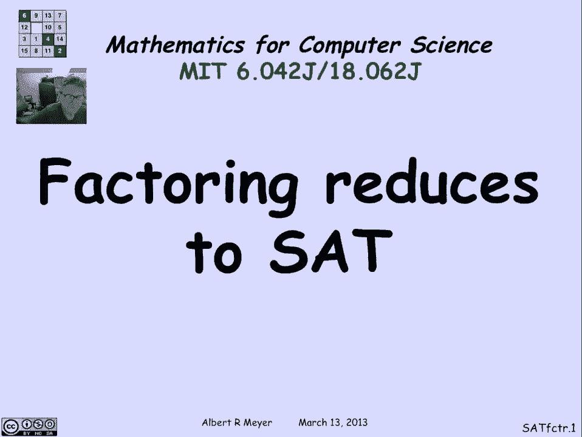

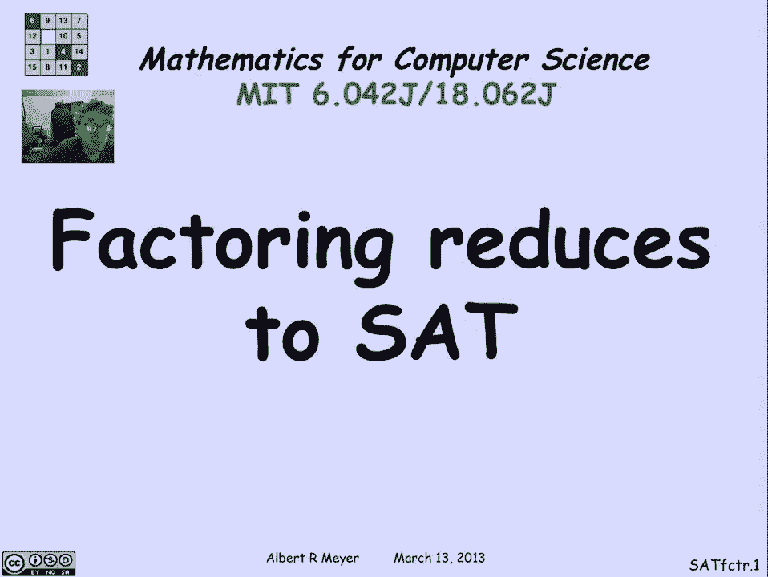

在本节课中，我们将学习如何将因数分解问题归约到命题逻辑的可满足性问题。我们将看到，如果能高效地解决SAT问题，就能高效地进行因数分解。这解释了为什么SAT问题在理论计算机科学中占据核心地位。

## 概述

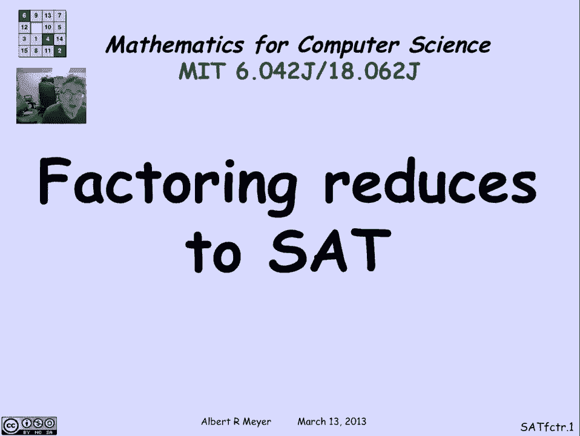

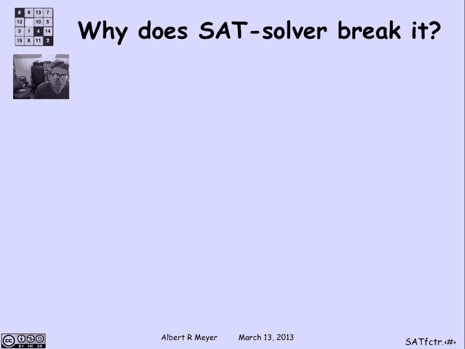

我们曾多次提及P与NP问题，这是理论计算机科学中最重要的问题之一。该问题的一种表述方式是：是否存在一种高效的多项式时间算法，能够判断一个命题逻辑公式是否可满足。为什么这个问题如此重要？我们不仅仅是逻辑学家，关心公式是否可满足。SAT问题之所以具有巨大重要性并应用于众多领域，是因为许多问题都可以归约到它。通过展示如何利用SAT求解器进行高效因数分解，我们可以理解为什么众多问题都能归约到SAT，以及它为何如此核心。

## 构建乘法电路

假设我们有一个SAT求解器，并想用它来分解一个数字N。首先，我们需要理解如何使用SAT求解器。我们可以设计一个执行算术乘法的数字电路。这个电路有K位输入X，K位输入Y，以及2K位输出，用于表示X乘以Y的结果。这是一个乘法器电路。

**乘法器电路**：输入K位的X和K位的Y，输出2K位的乘积。这个电路的规模不大，其门和线的数量大约是K的二次方。具体来说，其规模可以限制在`5 * K^2 + 常数`以内。因此，给定位数K，我们可以轻松构建这个乘法器电路。

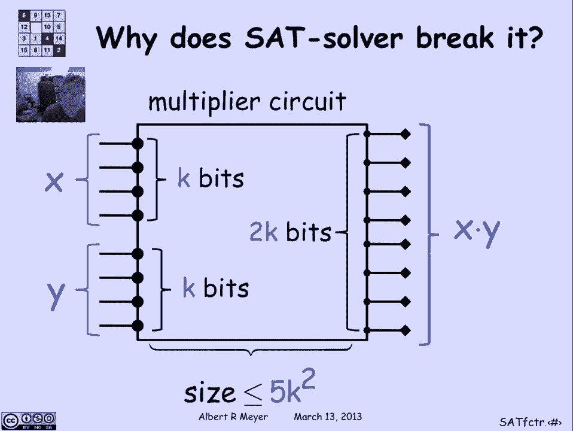

## 结合等式测试器

现在，假设我们有一个测试电路可满足性的方法。如何利用这个乘法器电路进行因数分解呢？首先，假设我们要分解的数字N是两个素数P和Q的乘积，这正是RSA加密中使用的N。

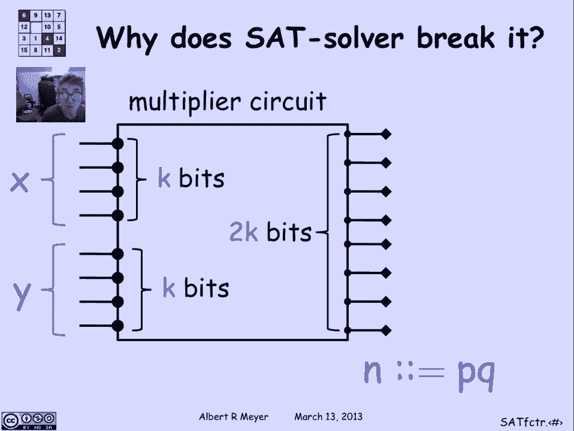

接下来，我们可以设计一个等式测试器。这是一个小型数字电路，它有2K个输入线，当输入是数字N的二进制表示时，其唯一的输出线会输出1。

**等式测试器**：输入2K位，当且仅当输入等于N的二进制表示时，输出为1。这也是一个容易构建的电路。

现在，我们将乘法器电路和等式测试器连接起来。乘法器的输出（2K位）作为等式测试器的输入。这样，整个组合电路在输出为1时，意味着存在两个K位数X和Y，使得`X * Y = N`。

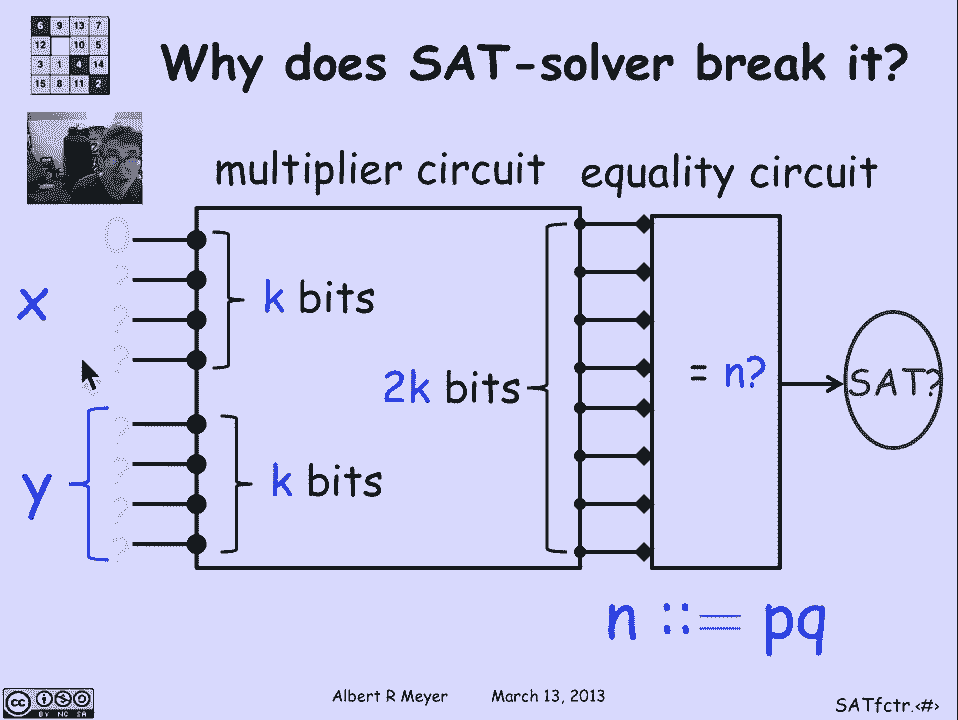

## 利用SAT求解器寻找因数

现在，我们固定组合电路的第一个输入位（例如，设为0），然后询问SAT求解器：是否存在一种方式设置剩余的输入位，使得电路的最终输出为1？如果SAT求解器回答“是”，则意味着存在一个因数（X或Y）以0开头。

接着，我们尝试将第二个输入位也设为0，并再次询问SAT求解器。如果这次回答“否”，则意味着第二个输入位必须为1，才能存在满足`X * Y = N`的因数对。

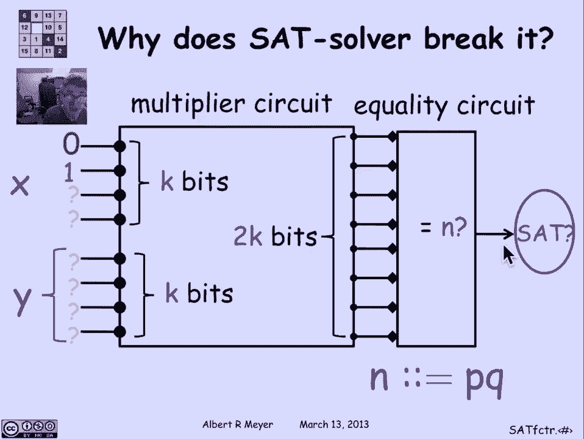

我们重复这个过程，对每一位进行测试。对于第i位，我们将其设为0，然后询问SAT求解器电路是否可满足（即输出能否为1）。根据回答，我们可以确定该位是0还是1。

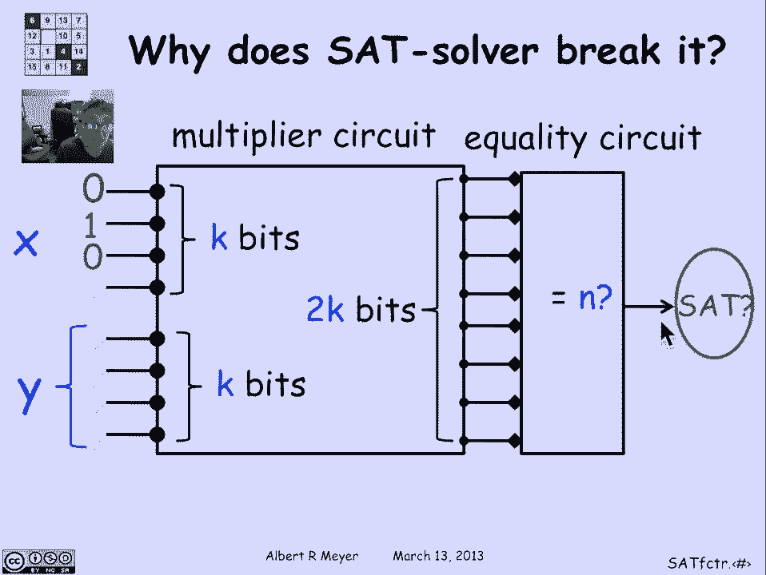

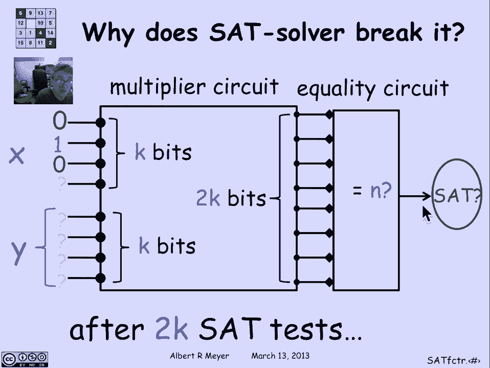

**过程总结**：通过最多进行2K次SAT测试（因为X和Y各有K位），我们可以逐位确定X和Y的值，从而找到N的因数P和Q。如果每次SAT测试的时间复杂度是K的多项式，那么整个因数分解过程的时间复杂度也是K的多项式。

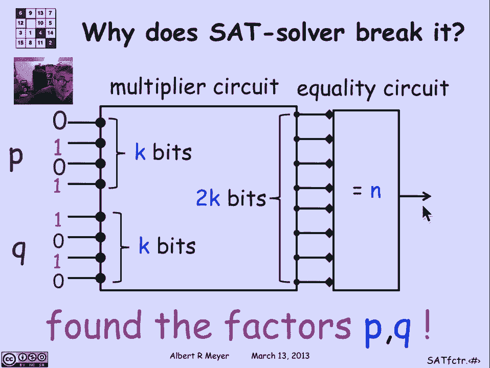

## 从电路到命题公式

我们之前将SAT问题定义为关于命题逻辑公式的问题：给定一个公式，判断它是否可满足。然而，我们刚才讨论的是电路的满足性。如何将两者联系起来呢？

我们可以为电路中的每一条线分配一个新的命题变量。然后，为电路中的每一个逻辑门（如与门、或门、非门）编写一个小公式，描述该门的输入线和输出线之间的关系。这个小公式编码了该门的逻辑功能。

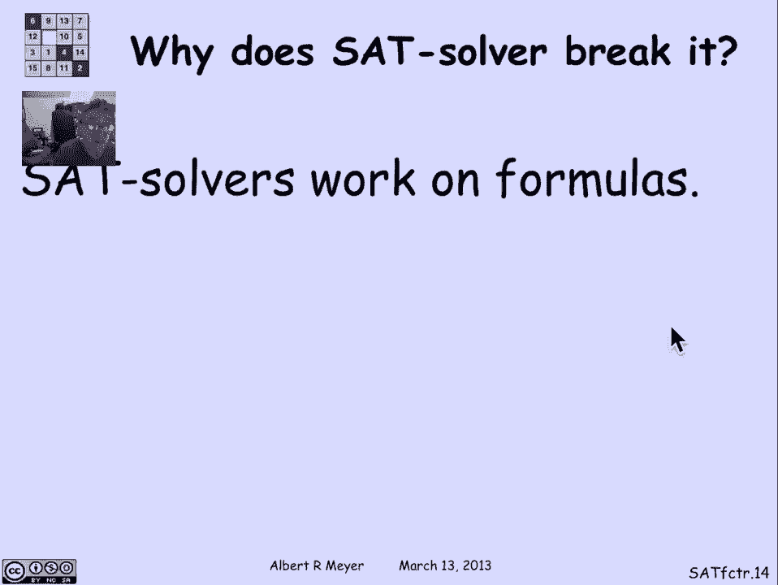

**公式构建**：将所有门对应的小公式进行逻辑与（AND）操作，就得到了一个描述整个电路结构的命题逻辑公式。这个公式是可满足的，当且仅当原始电路能够输出1。

因此，如果我们假设能够高效测试公式的可满足性，那么我们就能高效测试电路的可满足性，进而就能高效进行因数分解。这是一个简单的技巧，可以找到一个与电路规模大致相同的命题公式，其可满足性与电路能否输出1等价。

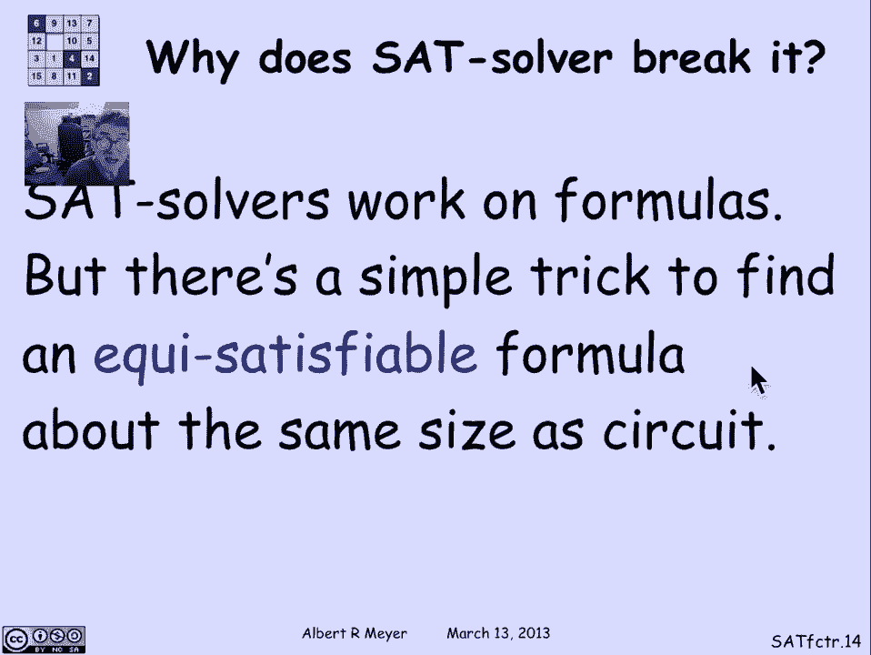

## 总结

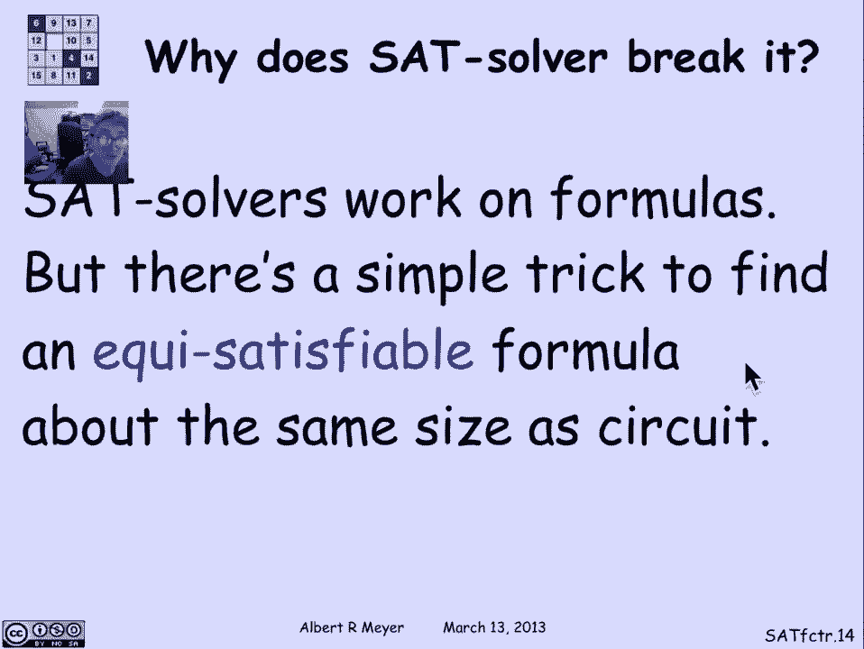

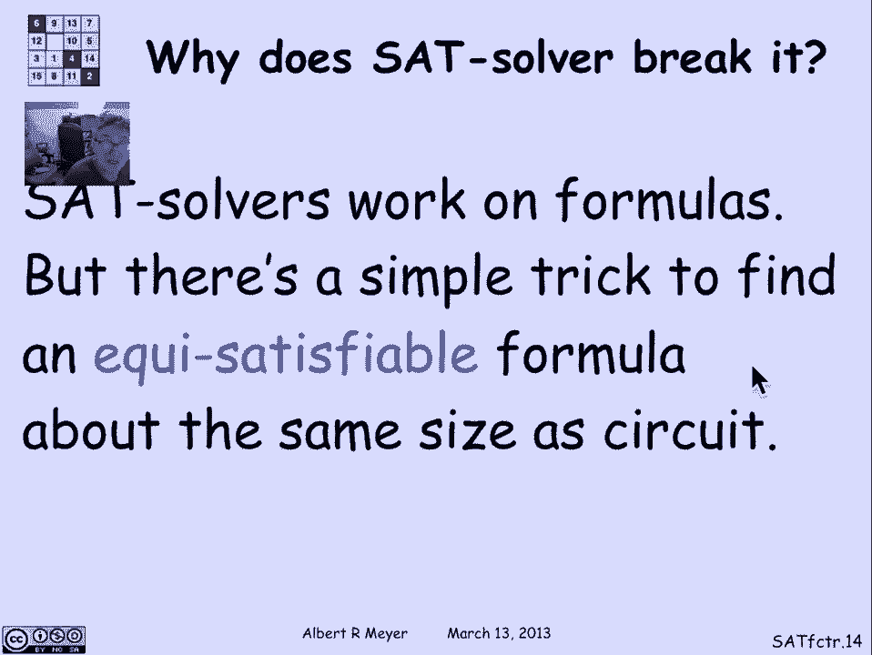

本节课中，我们一起学习了如何将因数分解问题归约到命题逻辑的可满足性问题。我们首先构建了一个乘法器电路和一个等式测试器，并将它们组合。然后，我们展示了如何通过逐位询问SAT求解器，来确定构成乘积N的两个因数。最后，我们解释了如何将任何数字电路转化为一个等价的命题逻辑公式，从而将电路的可满足性问题归约到公式的SAT问题。这个归约过程清晰地展示了SAT问题的核心地位：如果能高效解决SAT，就能高效解决包括因数分解在内的许多重要计算问题。