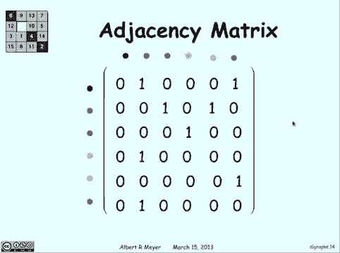

# 计算机科学的数学基础：L2.5.1：有向图 - 行走与路径 🧭

在本节课中，我们将要学习有向图的基本概念，包括其定义、表示方法，以及如何描述图中的行走与路径。

---

## 有向图简介

在之前的课程中，你可能认为“图”是类似 `Y = f(X)` 在XY平面上的图像。但这不是我们所要讨论的。计算机科学中的图，是由一系列顶点和连接顶点的边构成的。

更具体地说，一个有向图包含一个顶点集合 **V** 和一个边集合 **E**。每条边由两个顶点组成，写作 `(v, w)`，表示一条从顶点 **v** 指向顶点 **w** 的边。在图中，它看起来是这样的：

需要注意的是，边是有方向的。从 **v** 到 **w** 的边与从 **w** 到 **v** 的边是不同的。例如，上图就是一个有向图。你可以将顶点集合 **V** 写为图中所有顶点的集合，而边集合 **E** 则是顶点对的集合。

同时，有向图等价于顶点集合 **V** 上的一个二元关系。因为每条边都定义了一个顶点到另一个顶点的关系。因此，任何二元关系都可以绘制成一个有向图：将集合中的每个元素作为顶点，并用边表示从一个元素到另一个元素的关系。

---

## 行走与路径

上一节我们介绍了有向图的基本结构，本节中我们来看看如何在图中移动，即“行走”与“路径”的概念。

一个“行走”是指沿着连续的边前进，它可以重复经过顶点或边。例如，从图中的黑色顶点出发，可以走到红色、蓝色、黄色、红色，然后再回到蓝色。这没有任何限制。

行走的长度不是经过的顶点数，而是经过的边数。在上面的例子中，长度是5（黑→红→蓝→黄→红→蓝），而不是经过的6个顶点。需要注意这个“差一”的区别。

另一方面，“路径”是一种特殊的行走，它不允许重复经过任何一个顶点。例如，从蓝色顶点出发，可以走到黄色、红色、粉色、绿色，然后就无法继续了，因为不能再回到已经访问过的红色顶点。这就是一条路径的终点。这条路径的长度是4（蓝→黄→红→粉→绿），对应5个顶点。

---

## 图的矩阵表示

每个有向图都可以用一个矩阵来表示，这种表示法称为邻接矩阵。

以下是构建邻接矩阵的方法：我们画一个矩阵，行和列都对应图中的顶点。如果存在一条从行顶点指向列顶点的边，我们就在该位置填入 **1**；否则填入 **0**。

例如，如果存在一条从黑色顶点到红色顶点的边，就在黑色行、红色列的位置填入 **1**。同样，如果存在从黑色到绿色的边，就在黑色行、绿色列填入 **1**，以此类推，为图中所有边进行标记。其余位置则用 **0** 填充。

如上图所示，这个矩阵唯一地定义了一个图。每条边都在矩阵中有所体现，每个顶点也都有对应的行和列。因此，任何有向图都可以用这样一个邻接矩阵来完整描述。

---

## 总结

本节课中我们一起学习了有向图的核心概念。我们首先定义了有向图，它由顶点集和边集构成，并且边具有方向。接着，我们区分了“行走”和“路径”：“行走”允许重复顶点和边，而“路径”则不允许重复顶点。最后，我们介绍了如何使用邻接矩阵来清晰地表示一个有向图的结构，其中矩阵的行和列对应顶点，矩阵中的 **1** 和 **0** 表示边是否存在。