# 计算机科学的数学基础：L2.5.3：有向图 - 连接的顶点 🔗

在本节课中，我们将学习有向图中顶点之间的连接性。我们将探讨如何定义和计算顶点间的“游动”关系，并理解最短游动与路径之间的关系，以及如何高效地计算这些连接。

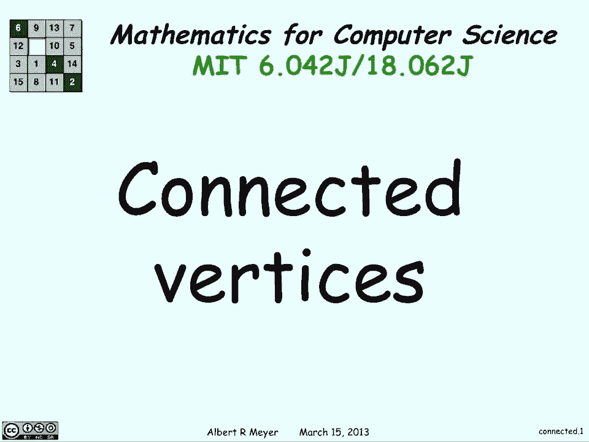

---

上一节我们介绍了有向图的基本概念，本节中我们来看看顶点之间如何通过边建立连接。

## 最短游动与路径 🛤️

首先，我们将证明：两个顶点之间的最短游动必然是一条路径。我们将使用反证法来证明这一点。

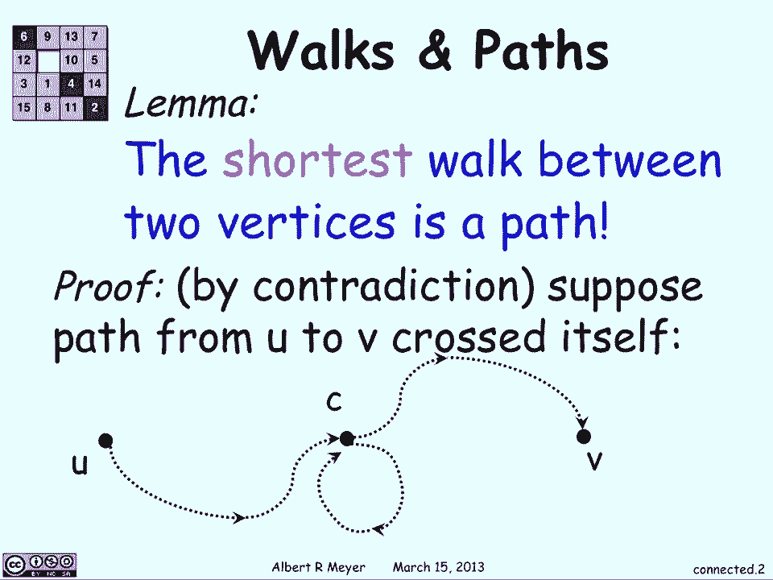

假设存在一条从顶点 `u` 到顶点 `v` 的游动，但它并非一条路径，这意味着它在某个顶点 `c` 处穿过了自身。即，游动从 `u` 出发，到达 `c`，之后又再次回到 `c`，最后才到达 `v`。

如果你想找到从 `u` 到 `v` 的最短路径，那么为什么要经历这个循环呢？为什么不直接从 `c` 走到 `v`？因此，从 `c` 回到自身的这段游动是冗余的。如果我们去掉这个绕回来的部分，我们仍然有一条从 `u` 到 `v` 的游动，并且它更短。

因此，从 `u` 到 `v` 的最短游动必然是一条路径。

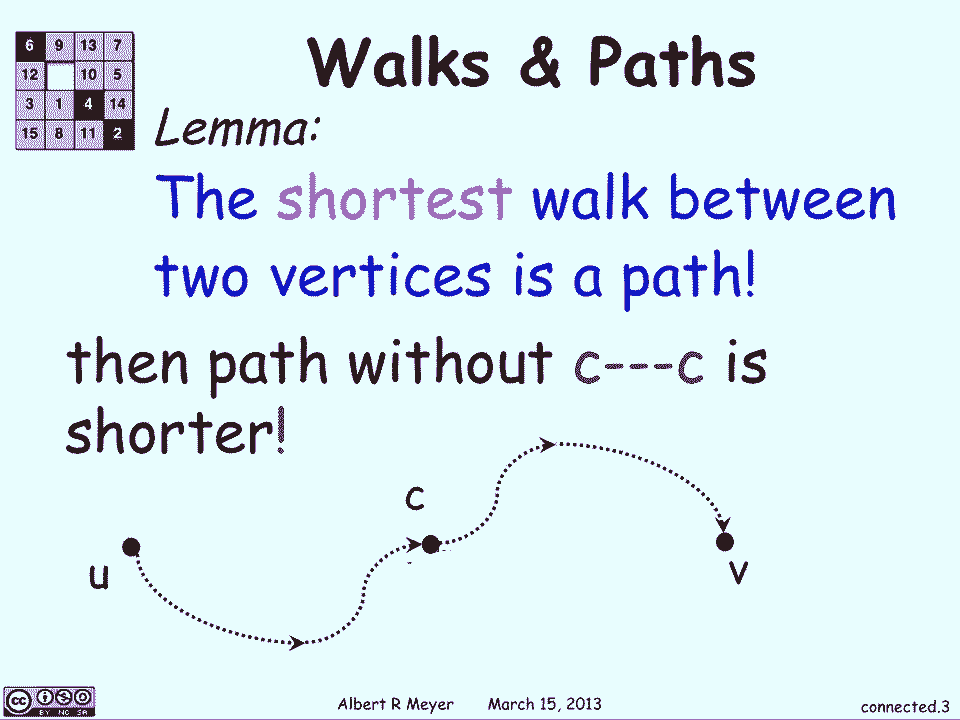

---

理解了最短游动后，我们来正式定义顶点间的连接关系。

## 长度 n 的游动关系 🧮

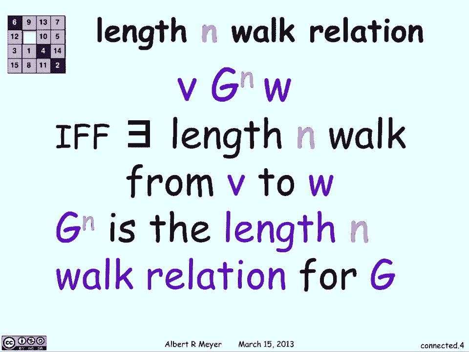

我们定义 **Gⁿ** 关系：对于图 `G` 中的两个顶点 `v` 和 `w`，如果存在一条从 `v` 到 `w` 的长度为 `n` 的游动，则称 `v` 和 `w` 具有 **Gⁿ** 关系。`Gⁿ` 被称为图 `G` 的 **长度为 n 的游动关系**。

本质上，如果你能在 `n` 步内从 `v` 走到 `w`，那么 `Gⁿ` 关系就适用于 `v` 和 `w`。

当 `n=1` 时，`G¹` 就是图 `G` 本身的邻接关系，即如果两个顶点之间有一条边，则它们具有 `G¹` 关系。

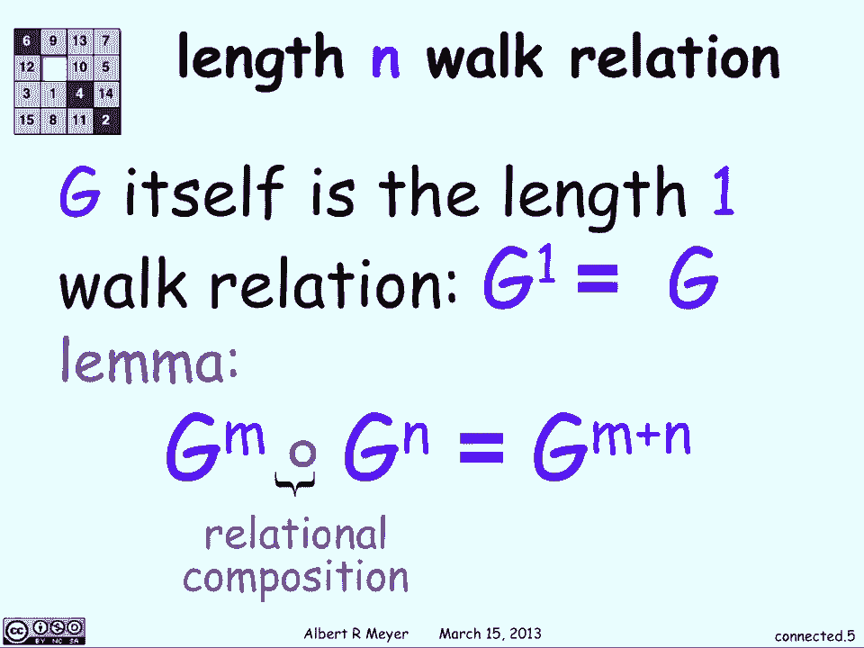

---

现在，我们来看一个关于这些关系组合的重要引理。

## 关系组合引理 🔗

引理指出：`Gᵐ` 和 `Gⁿ` 的关系组合等于 `Gᵐ⁺ⁿ` 关系。用公式表示如下：

**`Gᵐ ∘ Gⁿ = Gᵐ⁺ⁿ`**

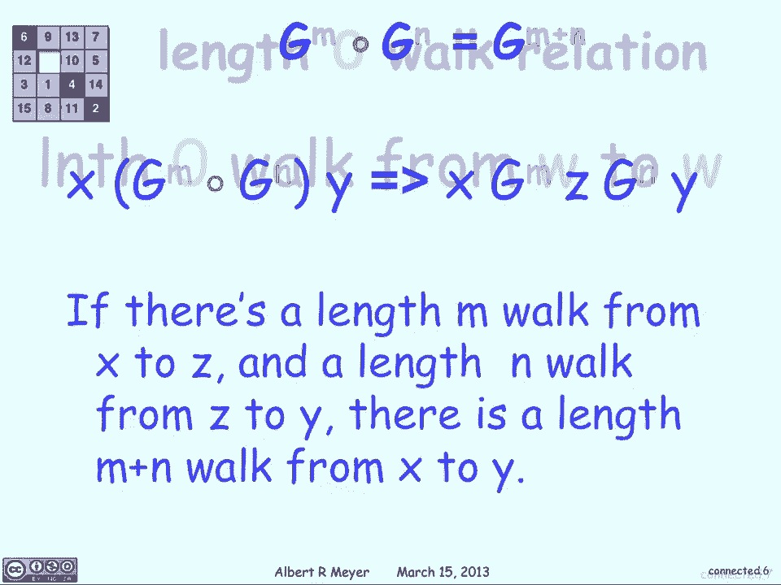

让我们解释一下这意味着什么。关系组合 `Gᵐ ∘ Gⁿ` 从 `x` 到 `y` 成立，当且仅当存在某个顶点 `z`，使得有一条从 `x` 到 `z` 的长度为 `m` 的游动（即 `Gᵐ` 关系），以及一条从 `z` 到 `y` 的长度为 `n` 的游动（即 `Gⁿ` 关系）。

这与 `Gᵐ⁺ⁿ` 的定义是一致的：从 `x` 出发，走 `m` 步到 `z`，再走 `n` 步到 `y`，总共就是一条从 `x` 到 `y` 的长度为 `m+n` 的游动。

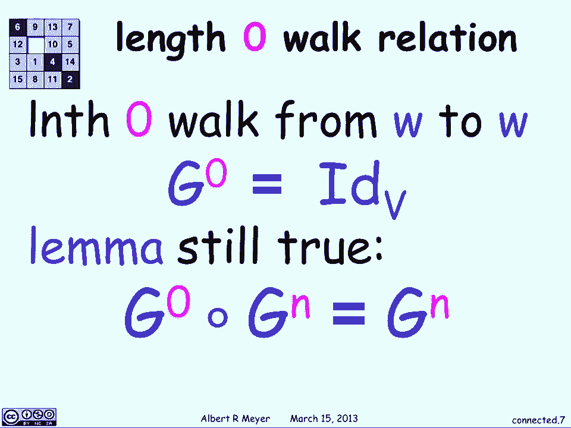

长度为零的游动关系 `G⁰` 是自反关系，它使每个顶点指向自身。引理在这种情况下依然成立，例如 `G⁰ ∘ Gⁿ = Gⁿ`。

---

为了计算这些关系，我们需要将其与矩阵运算联系起来。

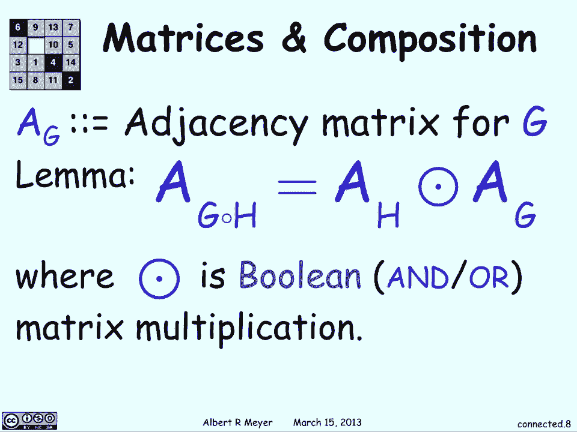

## 矩阵表示与布尔运算 🧮

如果我们用邻接矩阵 `A` 来表示图 `G`，那么关系 `Gᵐ` 和 `Gⁿ` 的组合可以通过矩阵的 **布尔乘法** 来计算。

布尔乘法与普通矩阵乘法类似，但将加法替换为逻辑“或”（∨），将乘法替换为逻辑“与”（∧）。因此，`Gᵐ⁺ⁿ` 对应的矩阵可以通过计算 `A` 的 `(m+n)` 次布尔幂来获得。

---

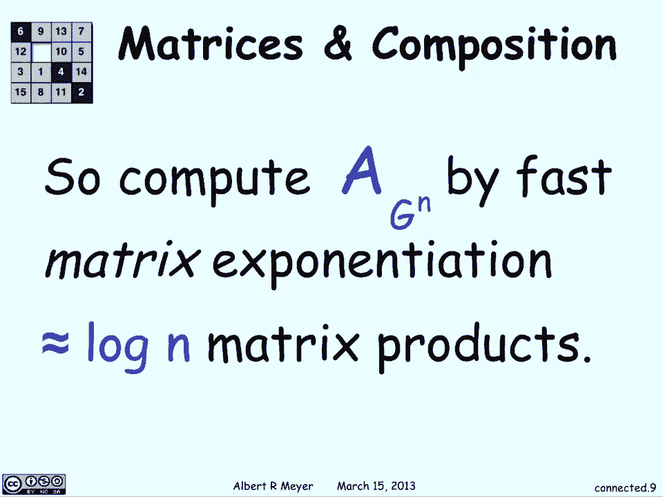

有了矩阵表示，我们可以高效地计算高次幂。

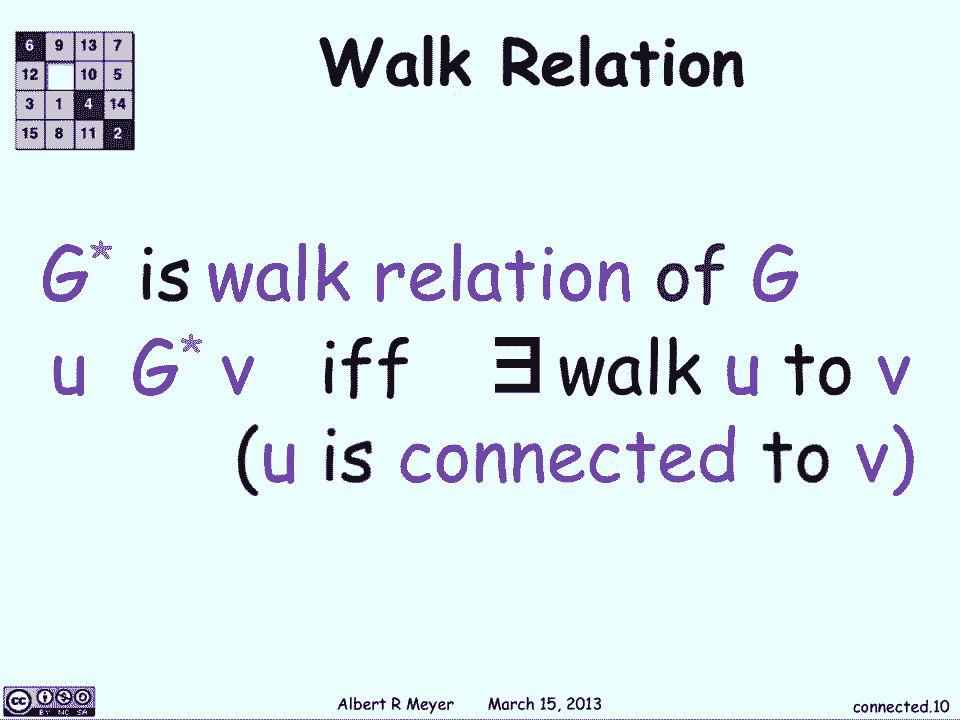

## 快速矩阵幂运算 ⚡

我们可以使用快速幂算法来计算 `Aⁿ`（即 `Gⁿ` 的矩阵表示）。基本思想是：

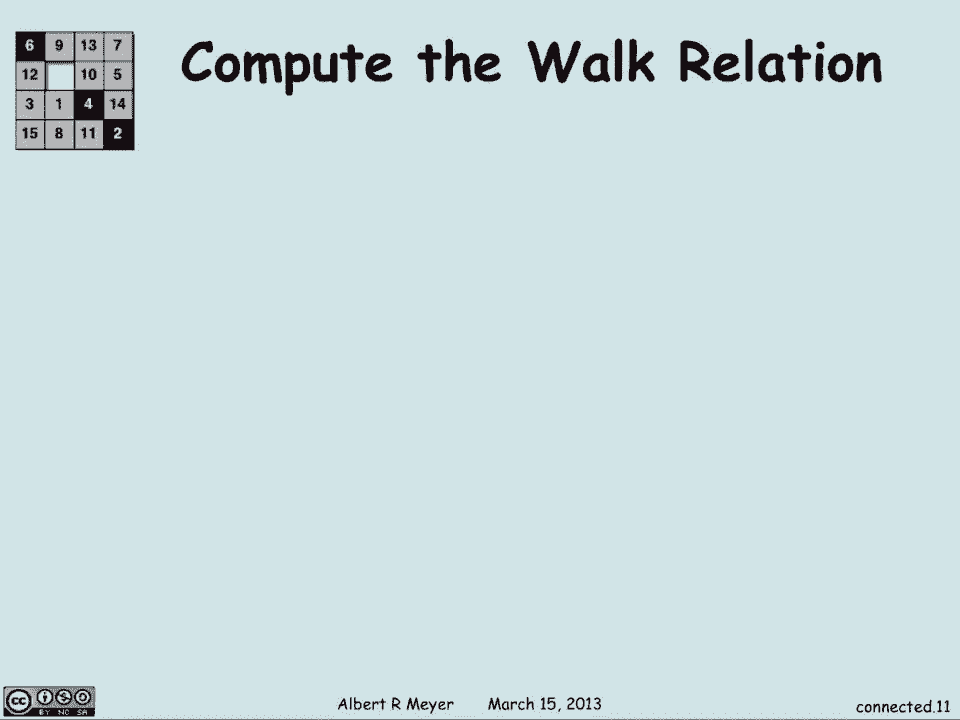

**`Aⁿ = (A^(n/2))²`** （当 `n` 为偶数时）

通过不断将指数减半并平方结果，我们可以在 `O(log n)` 次矩阵乘法内计算出 `Aⁿ`，这比连续乘 `n` 次要高效得多。

---

最后，我们定义图中最重要的连接关系。

## 游动闭包关系（G*） 🌟

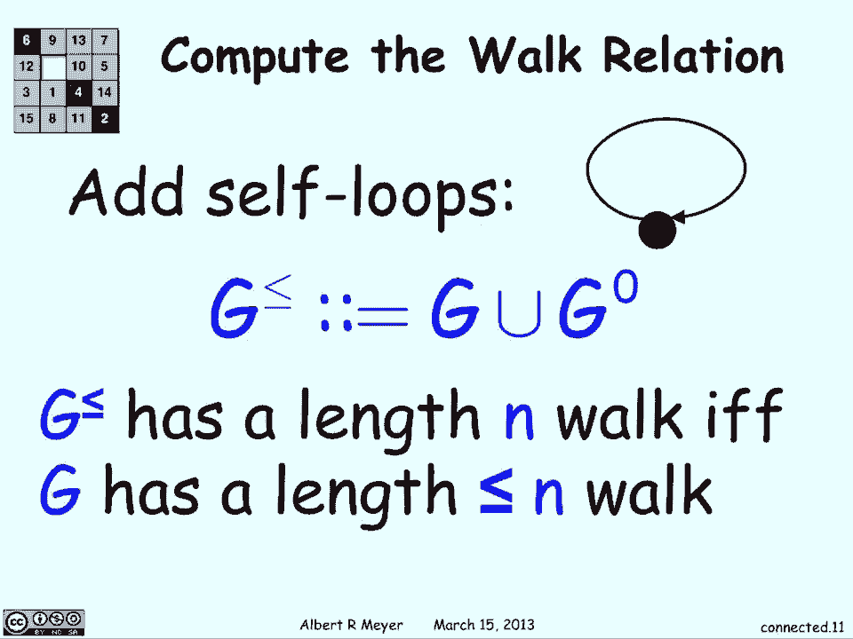

我们定义 **G*** 关系，称为图 `G` 的 **游动关系** 或 **可达关系**。对于顶点 `u` 和 `v`，如果存在 **任意长度** 的从 `u` 到 `v` 的游动（即它们是连通的），则 `u` 和 `v` 具有 **G*** 关系。

**`u G* v ⇔ ∃k ≥ 0, u Gᵏ v`**

如何计算 `G*` 呢？考虑一个具有 `n` 个顶点的图。任何路径的长度最多为 `n-1`（因为穿过所有 `n` 个顶点最多需要 `n-1` 条边）。因此，如果我们考虑图 `G≤`，它是在原图 `G` 的基础上，为每个顶点添加一条指向自身的边（即包含 `G⁰` 关系），那么：

**`G* = (G≤)ⁿ⁻¹`**

这意味着，要得到所有顶点对之间的可达性，我们只需要计算 `G≤` 的 `(n-1)` 次布尔幂。这可以通过矩阵运算在 `O(n³)` 时间内完成（或者使用更高效的算法）。

---

以下是本讲核心概念总结：

*   **最短游动即路径**：两个顶点间的最短游动不会包含循环，因此是一条路径。
*   **Gⁿ 关系**：表示长度为 `n` 的游动可达性。
*   **关系组合**：`Gᵐ ∘ Gⁿ = Gᵐ⁺ⁿ`，可通过布尔矩阵乘法计算。
*   **快速幂算法**：可高效计算 `Aⁿ`，时间复杂度为 `O(log n)` 次矩阵乘法。
*   **游动闭包 G***：表示所有可能的游动连接（即可达性），可通过计算 `(G≤)ⁿ⁻¹` 获得。

---

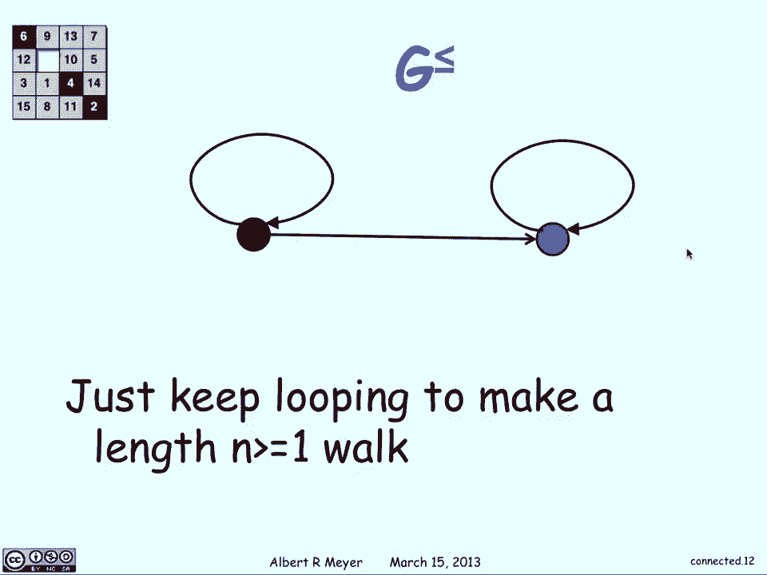

本节课中我们一起学习了有向图中顶点连接性的形式化定义与计算方法。我们证明了最短连接即是路径，引入了基于游动长度的关系 `Gⁿ` 及其组合性质，并展示了如何用邻接矩阵和布尔运算来高效计算这些关系，最终定义了表示全局连通性的游动闭包 `G*`。这些概念是分析图算法和网络结构的基础。