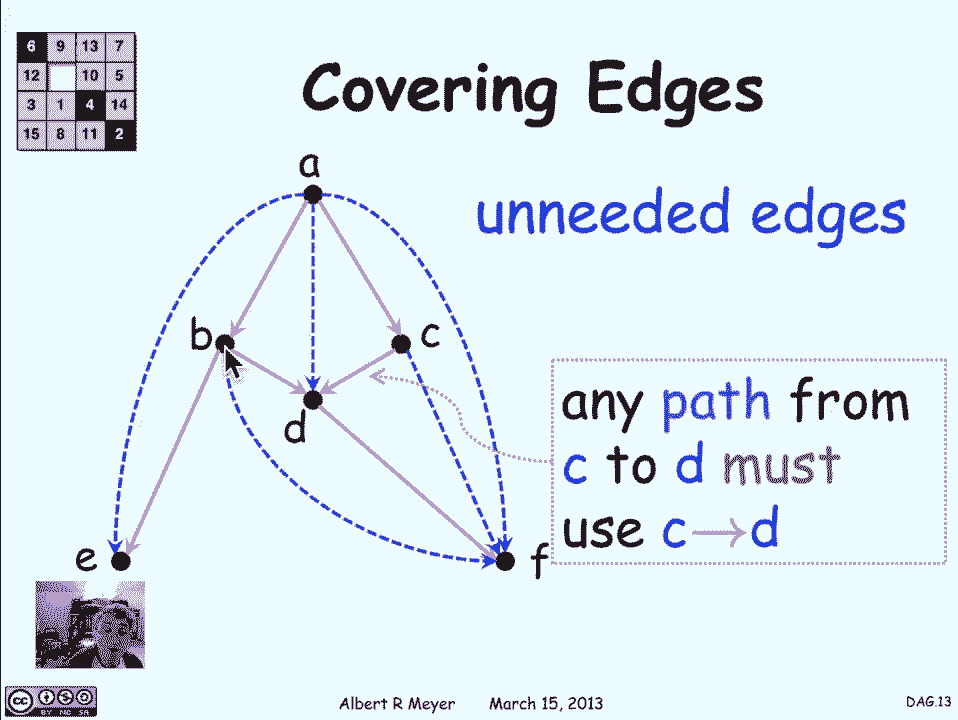

# 计算机科学的数学基础：L2.6.1：有向无环图 (DAGs) 📊

在本节课中，我们将学习一种特殊的图——有向无环图。这种图在计算机科学和许多其他领域中都非常重要，例如课程先修关系、任务调度等。我们将了解它的定义、特性以及如何找到其最简洁的表示形式。

---

## 什么是 DAG？

有向无环图是一类特殊的图。顾名思义，它是有向的，并且不包含任何环。由于“有向无环图”这个词组较长，通常简称为 **DAG**。

这类图之所以无处不在，是因为它能很好地表示具有先后依赖关系的事物。让我们看一个熟悉的例子。

---

## 一个典型例子：课程先修图

下图展示了麻省理工学院电气工程与计算机科学系 6-3 项目中必修课程的先修结构。其他专业或院系也有类似的图表。

这个图是什么意思呢？让我们看顶点 `1801`（第一学期的微积分课程）。有一条边指向 `6042`。这是因为在课程目录中，`6042` 将 `1801` 列为其先修课程。

如果我们看算法入门课 `6006`，目录中列出了两个先修课：`6042` 和 `601`。正因为目录中明确列出了这些先修关系，所以图中存在从 `601` 和 `6042` 指向 `6006` 的箭头。

如果你想上 `6006`，你不仅需要先上 `6042` 和 `601`，还需要上这些先修课的先修课。因此，在上 `6006` 之前，你必须先上 `1801` 和 `82`。图中还有一些“共同先修”关系，我们暂时忽略它们，将其视为先修关系，以免分散注意力。

这个图表就是一个 **DAG**。它由一系列顶点（课程标签）和表示目录中先修关系的箭头组成。

---

## 间接先修关系与可达性

在规划课程时，你真正关心的是**间接先修关系**。一门课程 `u` 是另一门课程 `v` 的间接先修课，意味着存在一个从 `u` 到 `v` 的先修序列。这意味着你必须在某个时间点上过 `u` 之后才能上 `v`，这是在规划课程表时需要考虑的关键事实。

用有向图的语言来说，`u` 是 `v` 的间接先修课，意味着在表示先修关系的有向图 `D` 中，存在一条从 `u` 到 `v` 的**正长度通路**。

因此，我们关心的是有向图 `D` 的**正长度通路关系**，记作 `D+`。`u D+ v` 表示存在一条从 `u` 到 `v` 的正长度通路。

---

## 为什么不能有环？

现在，考虑一个**闭通路**，即起点和终点是同一个顶点的通路。假设存在一条从 `6042` 开始并结束于 `6042` 的闭通路，那么需要多久才能毕业呢？

答案是：永远不能。因为你无法在上 `6042` 之前先上完 `6042`。这显然是个问题。我们绝对不希望院系的课程先修结构中存在正长度的闭通路。

事实上，通常有专门的委员会来检查这类问题。在规划包含数十甚至上百门课程的复杂项目时，偶尔会出现这种错误。委员会的工作就是确保提议的课程要求满足规则。

闭通路的一个特例是**环**。环是一条通路，其中除了起点和终点是同一个顶点外，没有其他重复顶点。

需要说明的是，单个顶点本身构成一个长度为 0 的环。我们无法消除长度为 0 的环，因为它们就是顶点本身。但我们希望确保没有正长度的环。

如果要用路径表示一个环，可以展示顶点和边的序列 `v0, v1, v2, ..., vn`，其中从 `v0` 到 `vn-1` 的所有顶点都互不相同，而最后一个顶点 `vn` 等于 `v0`，这是环中唯一允许的重复。我们可以将其画成一个圆圈。

关于环和闭通路，有一个简单的引理：**从一个顶点到其自身的、最短的正长度闭通路，就是一个以该顶点为起点和终点的正长度环**。证明思路与“两点间最短通路是路径”的证明类似：如果一个闭通路中存在除起点外的重复顶点，就可以剪掉重复部分之间的路径，从而得到一个更短的闭通路。因此，最短的闭通路不能有任何重复，它必须是一个正长度的环。

---

## DAG 的正式定义

基于以上讨论，**有向无环图** 正式定义为：**不包含任何正长度环的有向图**。

由于环是闭通路的特例，我们也可以等价地定义为：**不包含任何正长度闭通路的有向图**。

---

## DAG 的其他例子

DAG 的例子有很多：
1.  **课程先修图**：如上所述。
2.  **任务约束图**：任何描述任务间“必须先于”关系的集合，都会定义一个 DAG 结构。
3.  **后继关系图**：考虑整数集上的后继关系，从 `n` 到 `n+1` 有一条有向边。这个图的通路关系恰好表示了“小于”关系（`n < m`）。由于“小于”关系不具有对称性（如果 `a < b`，则不可能有 `b < a`），所以这个图中不可能有环，因此它是一个 DAG。
4.  **真子集关系图**：在集合之间，如果集合 `A` 是集合 `B` 的真子集（`A ⊂ B` 且 `A ≠ B`），则从 `A` 向 `B` 画一条有向边。同样，因为一个集合不可能是其自身的真子集，所以这个图中也不可能有环，它也是一个 DAG。

从这些例子中，希望你能开始理解为什么 DAG 在数学和其他领域如此普遍和重要。

---

## DAG 的最小表示：覆盖边

当我们研究一个 DAG 时，通常只关心它的通路关系。如果两个 DAG 具有相同的通路关系，那么它们是等价的。很自然地，我们会问：**对于一个给定的通路关系，是否存在一个最精简（边数最少）的 DAG 来表示它？**

让我们看一个例子。下图是一个简单的 DAG，你可以验证它没有环。

与这个 DAG 具有相同通路关系的最小 DAG 是什么？我们可以通过逐一检查每条边来找到它，判断是否可以删除某条边而不影响顶点间的可达性。

*   观察路径 `A -> B -> E`。这条路径的存在意味着直接从 `A` 到 `E` 的边对于连通性没有贡献，因为总可以通过 `B` 从 `A` 走到 `E`。因此，可以删除边 `A->E`。
*   观察路径 `A -> C -> D`。同样，可以直接删除边 `A->D`，因为可以通过 `C` 到达。
*   观察路径 `C -> D -> F`。可以删除边 `C->F`。
*   观察路径 `A -> C -> D -> F`。可以删除边 `A->F`。
*   观察路径 `B -> D -> F`。可以删除边 `B->F`。

经过这些删除操作后，剩下的边被称为**覆盖边**。覆盖边的特性是：如果删除一条覆盖边 `u->v`，那么从 `u` 到 `v` 将不再可达。换句话说，从 `u` 到 `v` 的唯一直接方式就是通过这条覆盖边（虽然可能还有其他更长路径，但这条边是关键的直接连接）。

如果存在其他不经过边 `u->v` 就能从 `u` 到达 `v` 的路径，那么 `u->v` 就不是覆盖边。覆盖边是定义通路关系所必需的最小边集，所有其他边都是冗余的。

---

## 总结

本节课中，我们一起学习了**有向无环图**。

1.  我们首先通过**课程先修图**的例子，直观理解了 DAG 如何表示依赖关系。
2.  然后，我们定义了**间接先修关系**，对应于图中的**正长度通路关系 (`D+`)**。
3.  我们探讨了为什么 DAG 中不能有**环**或**正长度闭通路**，并用“最短闭通路是环”的引理进行了说明。
4.  接着，我们给出了 DAG 的正式定义，并列举了包括**后继关系**和**真子集关系**在内的其他例子。
5.  最后，我们讨论了如何寻找 DAG 的**最小表示**，即通过识别和保留**覆盖边**，删除所有冗余边，而不改变顶点间的可达性。

DAG 是计算机科学中表示层次结构、依赖关系和偏序的强大工具，理解其基本概念对后续学习至关重要。