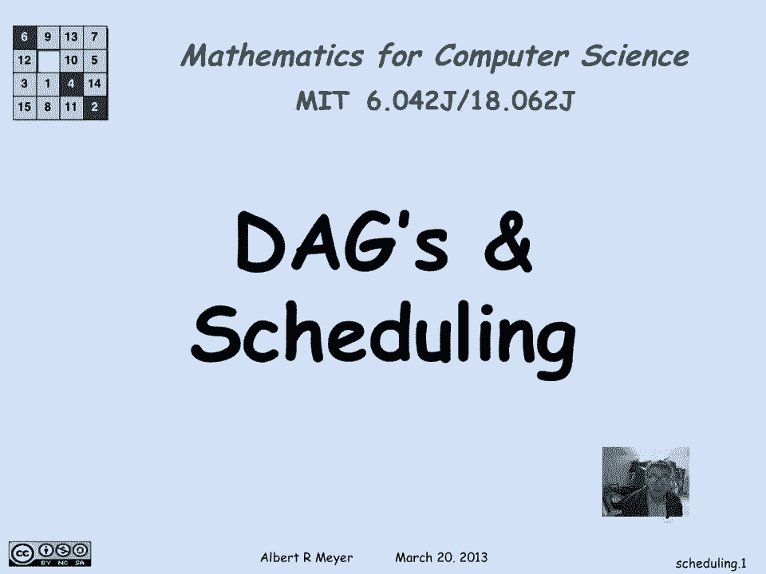
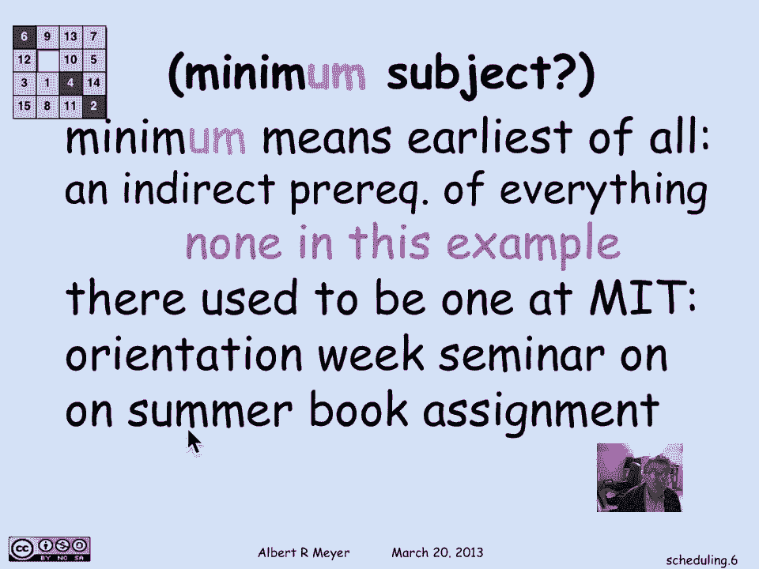
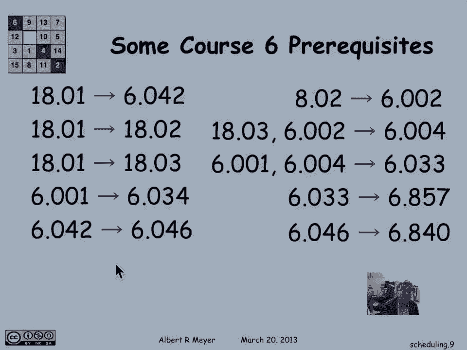
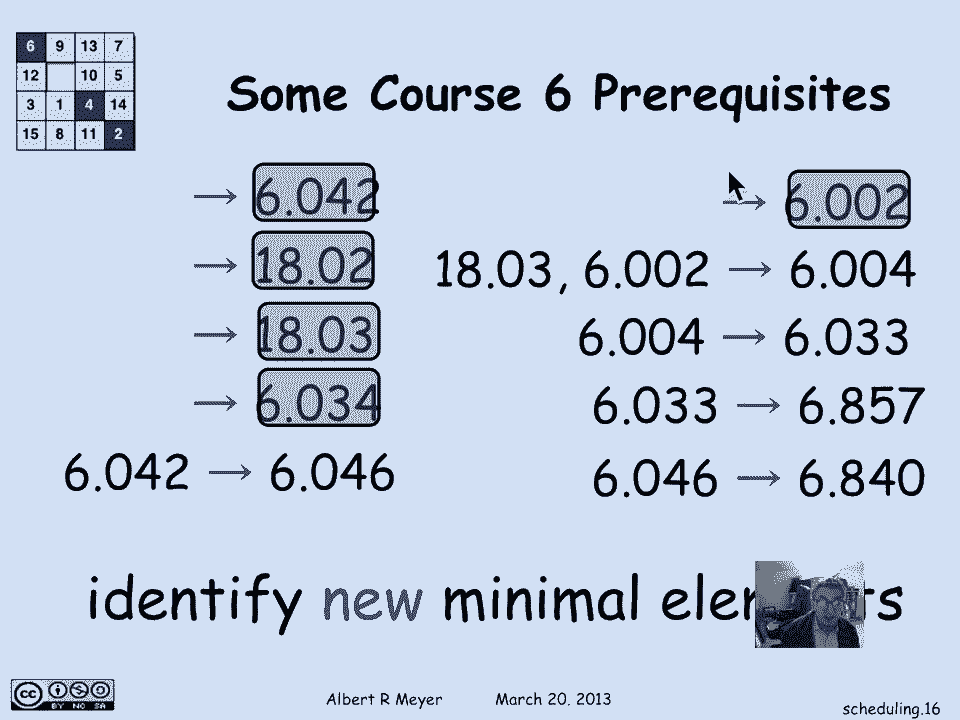
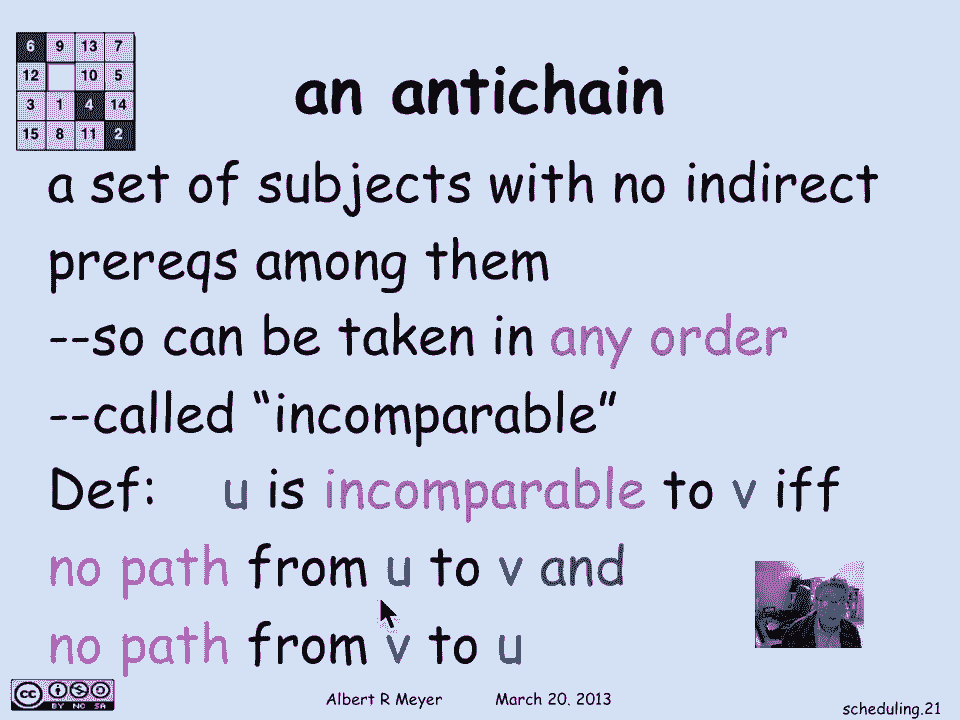
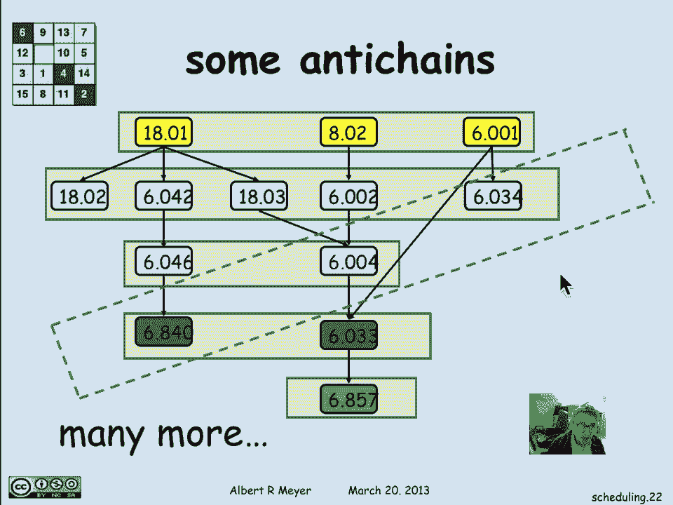
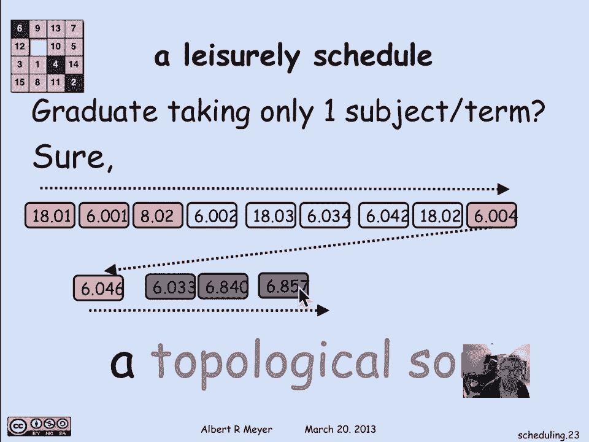
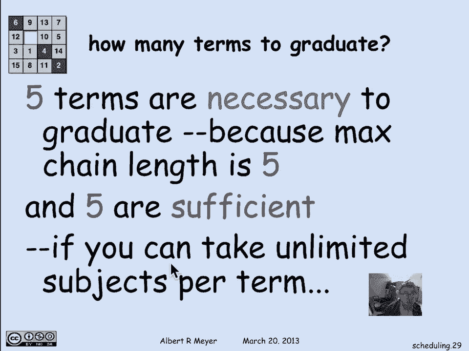
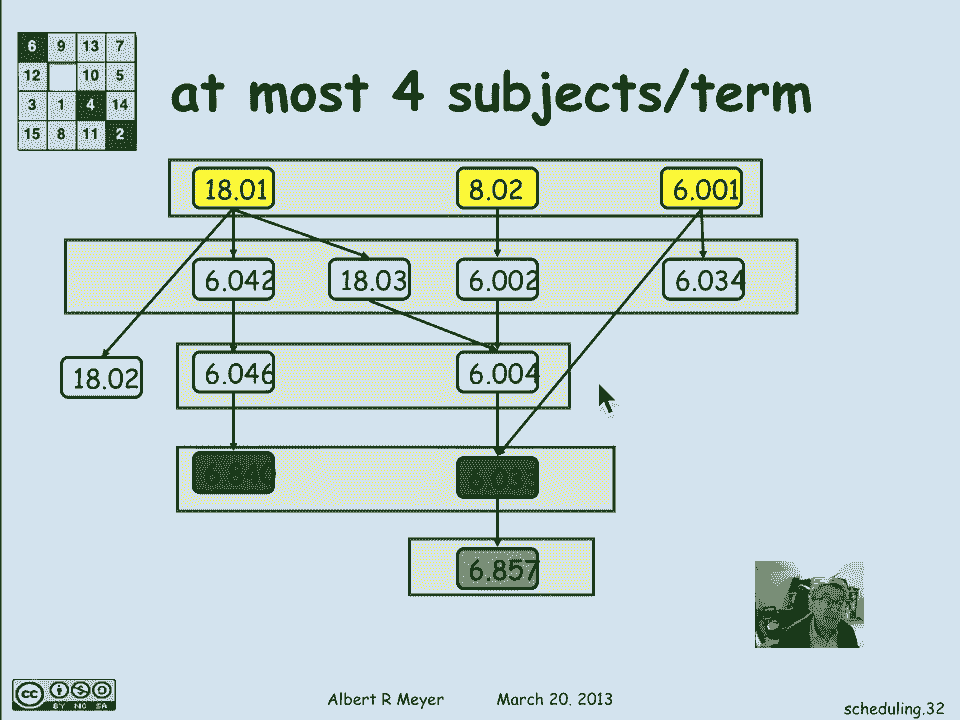
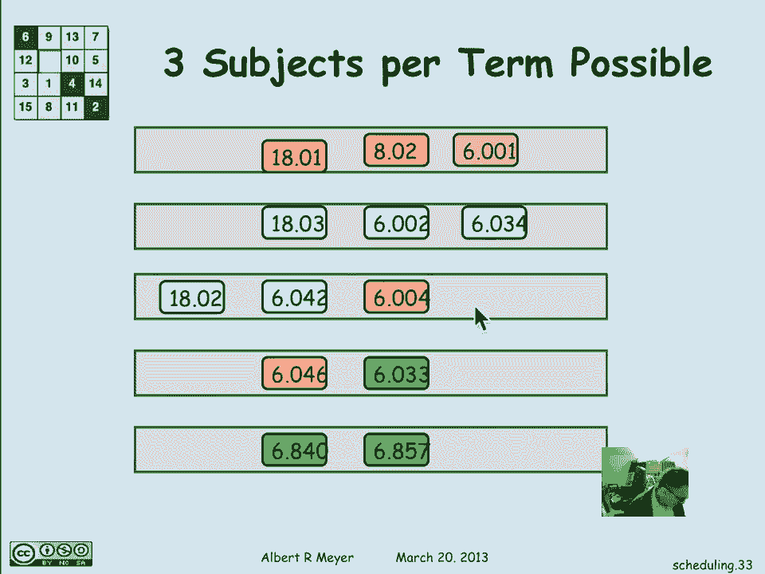

# 计算机科学的数学基础：L2.6.3：调度问题详解 📅

在本节课中，我们将要学习如何利用有向无环图（DAG）来表示和解决课程调度问题。我们将从理解先决条件图开始，逐步介绍极小元素、反链、链等核心概念，并最终学习如何制定一个可行的课程学习计划。

---

## 图表示与间接先决条件

在上一节中，我们了解到用图表表示课程之间的调度约束非常关键，并且那张图表实际上是一个**有向无环图（DAG）**。

现在让我们更详细地看看这个由DAG表示的调度问题。下图展示了一个课程选择的图表，其中包含了六个先决条件。虽然有些信息可能已经过时，但它作为一个说明性的例子非常有用。图中的小箭头指示了课程之间的直接先决关系。

例如，箭头告诉我们 `18.01` 是 `6.042` 的直接先决条件。同时，`18.01` 也是 `18.02` 的直接先决条件。此外，`6.001` 和 `6.004` 都是 `6.003` 的先决条件。

这里我们遇到了之前提到的**间接先决条件**问题。尽管课程目录中只列出 `6.046` 是 `6.840` 的先决条件，但实际上，要学习 `6.046`，你必须先学习 `6.042`。因此，`6.042` 是 `6.840` 的间接先决条件。

用图论的语言来描述：科目 `u` 是科目 `v` 的间接先决条件，当且仅当在描述课程先决条件结构的图中，存在一条从 `u` 到 `v` 的**正长度路径**。

使用关系符号表示，设 `R` 为有向图中的直接先决关系，`R+` 表示其传递闭包（即正长度路径关系）。那么 `u R+ v` 就读作“存在一条从 `u` 到 `v` 的正长度路径”。

---

## 极小元素与贪婪策略 🎯

接下来，我们将研究一个关键概念：**极小元素**。

**极小元素**的定义是：一个没有先决条件的科目。在图中，这意味着没有箭头指向它。在前面的图表中，极小元素是 `18.01`、`8.02` 和 `6.001`。

“极小”这个术语来源于偏序理论。在DAG所表示的偏序关系中，我们可以认为后面的科目“大于”前面的科目。因此，一个极小科目就是一个没有比它“更小”的科目。图中可能存在多个极小元素，因为它们彼此之间没有先后关系。

现在，我们可以讨论如何进行调度。我们要做的第一件事就是识别出所有的极小元素。在上例中，我们识别出了三个。

我们将采用一种**贪婪策略**：在任何学期，只要条件允许，就尽可能多地学习课程。因此，我们可以在第一学期选修所有新生课程（即极小元素），因为它们没有先决条件。

安排完这些课程后，我们就可以将它们从考虑中移除，因为它们已经“完成”了。这不仅移除了这些课程本身，也移除了所有以它们为先决条件的事件（箭头）。这样，我们就得到了一个简化后的新图。

---

## 层级调度与反链

在简化后的新图中，一些原本不是极小的元素现在变成了新的极小元素。这些就是“第二级”的极小元素。

以下是识别出的第二级极小元素列表：
*   `6.042`
*   `18.02`
*   `6.002`
*   `6.004`
*   `6.003`

我们接下来安排这些课程。它们构成了我们第二学期可以学习的科目集合。同样地，在移除这些第二级课程后，我们会发现 `6.046` 和 `6.020` 变成了新的极小元素，可以将它们安排在第三学期。以此类推，我们可以得到完整的学期安排。

当然，存在许多其他的安排方法，但这里描述的是一种特别有序的贪婪策略。

在讨论调度时，值得引入**反链**这个概念。在这个例子中，一个反链指的是一组**彼此之间没有间接先决条件关系**的科目。这意味着它们可以以任何顺序学习，因为学习其中一门并不依赖于学习组内的其他科目。

用技术语言描述：如果两个元素 `u` 和 `v` 之间既没有从 `u` 到 `v` 的正长度路径，也没有从 `v` 到 `u` 的正长度路径，则称它们是**不可比的**。一个反链就是一组两两不可比的元素。

让我们看一些反链的例子。我们每个学期安排的课程集合就是一个反链。例如，第一学期的新生课程之间没有路径，所以它们构成一个反链。第二学期安排的“第二级极小元素”之间也没有路径，是另一个反链。

但并非所有的反链都出现在我们的时间表中。例如，`6.840`、`6.020` 和 `6.034` 之间没有路径，因此它们也构成一个反链。这意味着在满足它们所有先决条件（位于图左上角）后，有可能在同一学期学习这三门课。

---

## 链、拓扑排序与最短毕业时间 ⏱️

现在，让我们探讨各种可能的调度模式。我们发现了上述绿色的贪婪调度方案。但假设我每学期只想选一门课。我能做到吗？

答案是肯定的。只要首先按任意顺序安排所有极小元素（每学期一门），然后安排所有第二级极小元素，以此类推。这完全是可行的。这种为DAG中所有节点生成一个线性顺序（使得所有边都从前指向后）的过程，称为**拓扑排序**。

“排序”一词源于将路径关系视为一种“小于或等于”的关系。因此，我们按照这种“大小”顺序来排列事物。

与反链相对的概念是**链**。链是一系列**必须按特定顺序进行**的科目。对于链中的任何两个科目，你都知道哪个必须先学。这意味着在链中，任意两个元素之间都存在一条路径（从一个到另一个）。

例如，图中存在一条包含五门课程的垂直链。这里也有一条长度为四的垂直链。并非所有链都是垂直的。例如，你必须先学 `18.01`，然后学 `18.03`，最后才能学 `6.004`，它们也形成了一条链。

重要的是，一条链不一定包含所有可能的元素。即使只包含 `8.02` -> `6.020` -> `6.857` 这三个科目，它仍然是一条链，因为存在从 `8.02` 到 `6.020` 以及从 `6.020` 到 `6.857` 的路径。

**最大长度链**（即尽可能长的链）在理论上很重要。图中存在一条长度为5的最大链（它不唯一）。这就引出了一个关键问题：**毕业最少需要多少个学期？**

我们看到，你可以在五个学期内毕业。但考虑到存在一条最大长度为5的链，这意味着你**不可能用更少的时间毕业**，因为这五门课必须连续学习，每一门都必须在上一门被选修后的学期才能选修。

**定理**：毕业所需的学期数至少要和图中最大链的长度一样大。
因此，五个学期是必要的。而通过我们的贪婪极小策略，我们证明了五个学期也是足够的（假设每学期可以选修不限数量的课程）。

---

## 负载均衡与调整

当然，一个结果是，在我大一的第二学期，我可能需要上五门课（因为贪婪策略允许这样做）。但这可能导致学期负载不均衡，例如最后一个学期可能只有一门课。

实际上，我们可以调整时间表来实现负载均衡。例如，完全可以将 `18.02` 从第二学期移到第三学期，因为它在第一学期后就已经满足了所有先决条件。这样做可以将第二学期的负担减轻到四门课，同时将第三学期的课程增加到三门。

通过进一步调整，你甚至可以找到一个每学期最多只选三门课的毕业时间表。

---

## 总结 📝

本节课中，我们一起学习了如何利用DAG来建模和解决课程调度问题。我们定义了**极小元素**，并介绍了通过贪婪策略进行层级调度的过程。我们学习了**反链**（可并行学习的课程组）和**链**（必须顺序学习的课程序列）的概念，并理解了**最大链的长度决定了毕业所需的最小学期数**。最后，我们还探讨了在满足先决条件的前提下，如何调整时间表以实现学期间的负载均衡。掌握这些概念，是理解和设计高效调度方案的基础。