# 计算机科学的数学基础：L2.6.5：时间与处理器 ⏱️💻

在本节课中，我们将学习任务调度中的一个核心问题：在存在先后依赖关系（即部分任务必须按顺序执行，部分可以并行执行）的情况下，如何确定完成任务所需的最短时间以及所需的最少处理器数量。我们将通过课程安排的例子引入关键概念，并探讨一个有趣的数学引理及其应用。

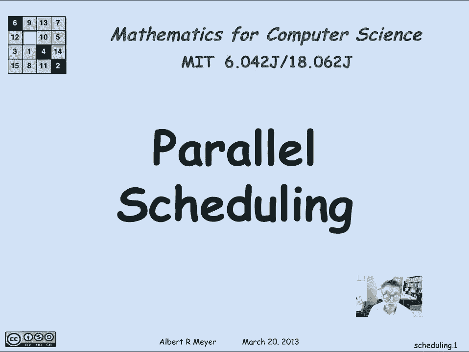

## 概述 📋

任务调度是计算机科学和许多其他领域的常见问题。我们经常面临一组任务，其中一些任务必须在其他任务完成后才能开始。如果允许并行处理，我们关心两个核心指标：完成所有任务所需的最短时间，以及为实现这个最短时间所需的最少处理器数量。本节将形式化这些问题，并利用有向无环图（DAG）的理论给出答案。

## 最短并行时间与最大链 ⛓️

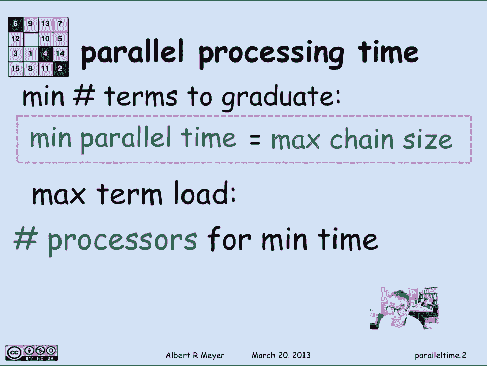

上一节我们介绍了课程安排的例子，它是一般任务调度问题的特例。在这个问题中，任务间的依赖关系构成了一个约束图（通常是一个DAG）。

我们能对一组有约束的任务说些什么呢？假设并行处理能力不受限制（即可以使用任意多的处理器同时工作），那么完成所有任务所需的最短时间，简单地等于约束图中**最大链**的大小。

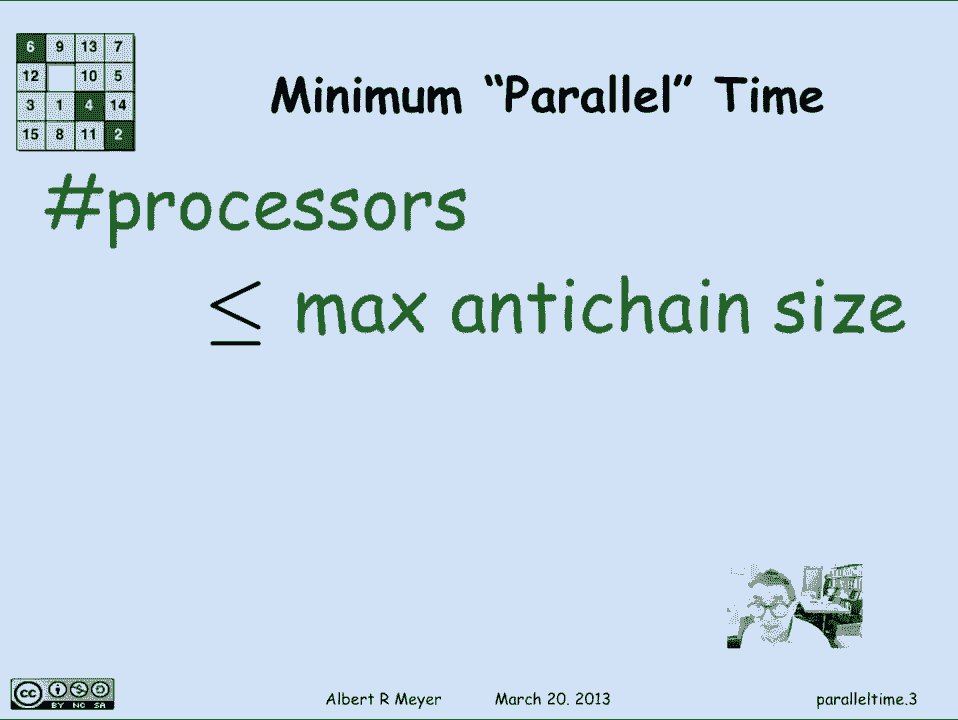

*   **链**：在DAG中，一条链是一系列顶点，其中每个顶点都有一条边指向链中的下一个顶点。这代表了一系列必须严格按顺序执行的任务。
*   **最大链**：图中所有链中包含顶点最多的那条链。它代表了整个任务流程中无法被并行的、最长的关键路径。

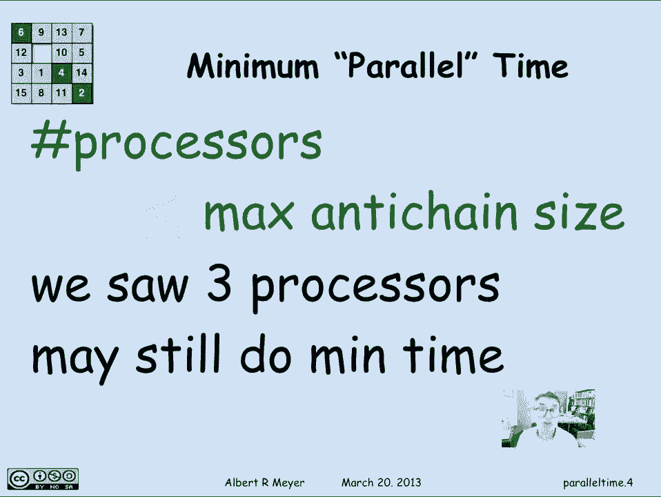

**公式**：`最短并行时间 = 最大链尺寸`

在课程安排的例子中，最大链尺寸为5，这意味着学生至少需要5个学期才能毕业。

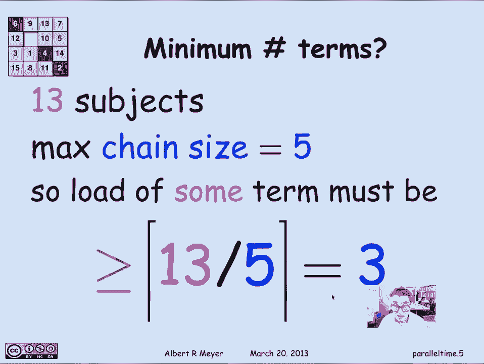

## 所需处理器数量与最大反链 🔗

接下来，我们看看为实现这个最短时间，需要多少个处理器（或在课程例子中，一个学期最多需要修多少门课）。这与图中**最大反链**的尺寸有关。

*   **反链**：在DAG中，一个反链是一组顶点，其中任意两个顶点之间都没有路径相连（即它们互相不可比）。这代表了一组可以完全并行执行的任务。
*   **最大反链**：图中所有反链中包含顶点最多的那个反链。它代表了理论上可以同时进行的最大任务量。

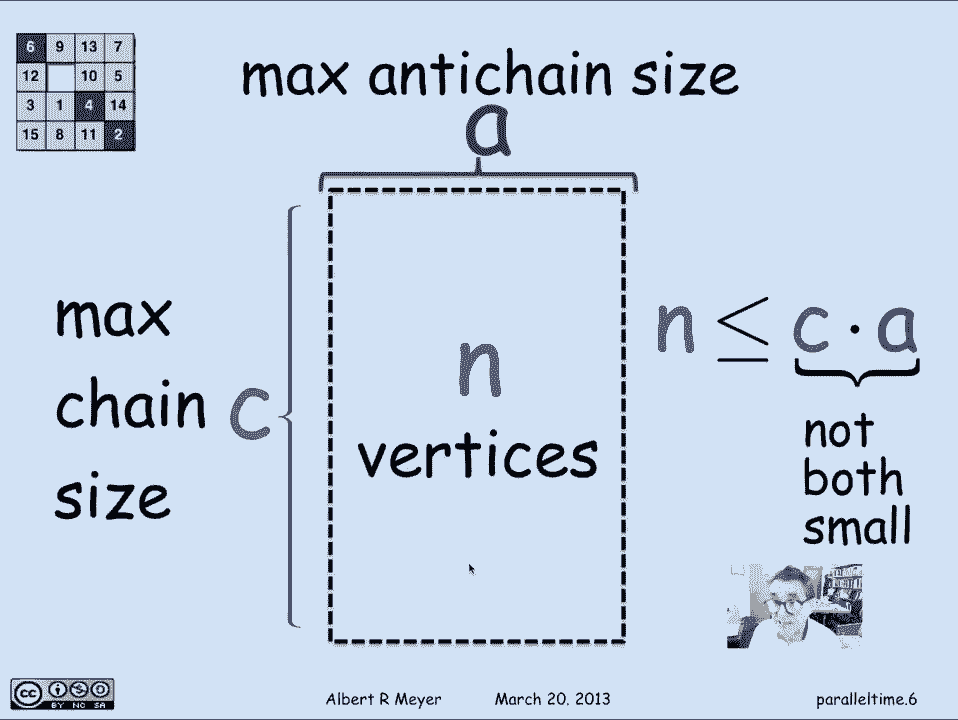

**公式**：`所需处理器数 ≤ 最大反链尺寸`

在课程例子中，最大反链尺寸是5。但这只是一个**上限**。实际上，我们可能不需要那么多处理器就能在最短时间内完成任务。例如，在之前的课程安排中，我们实际上只需要每学期安排3门课（即3个“处理器”），就能在5个学期内完成所有13门课。

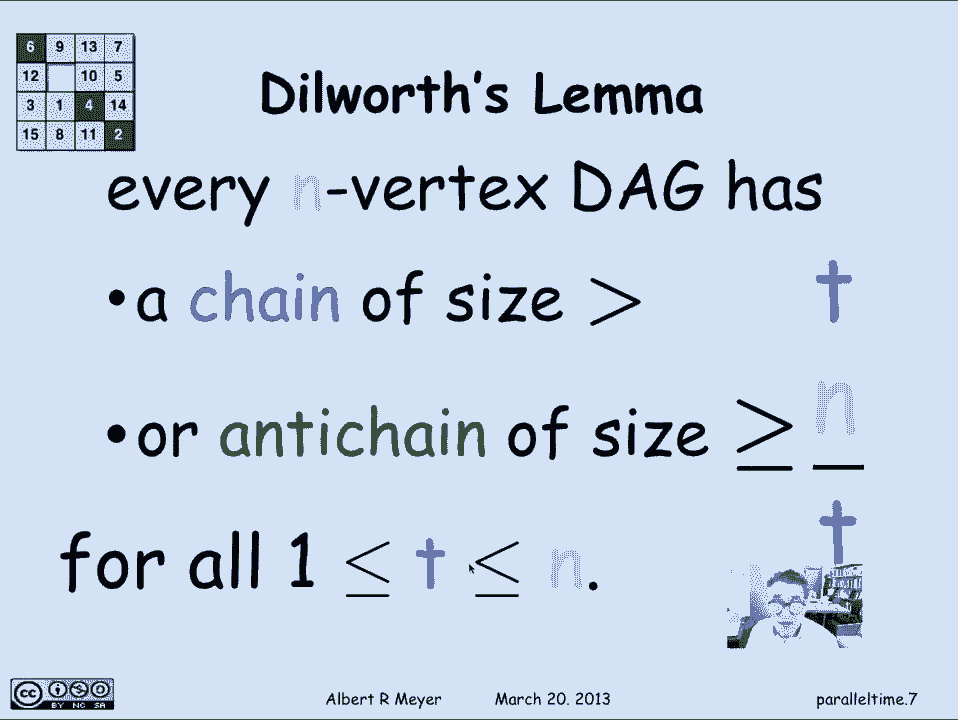

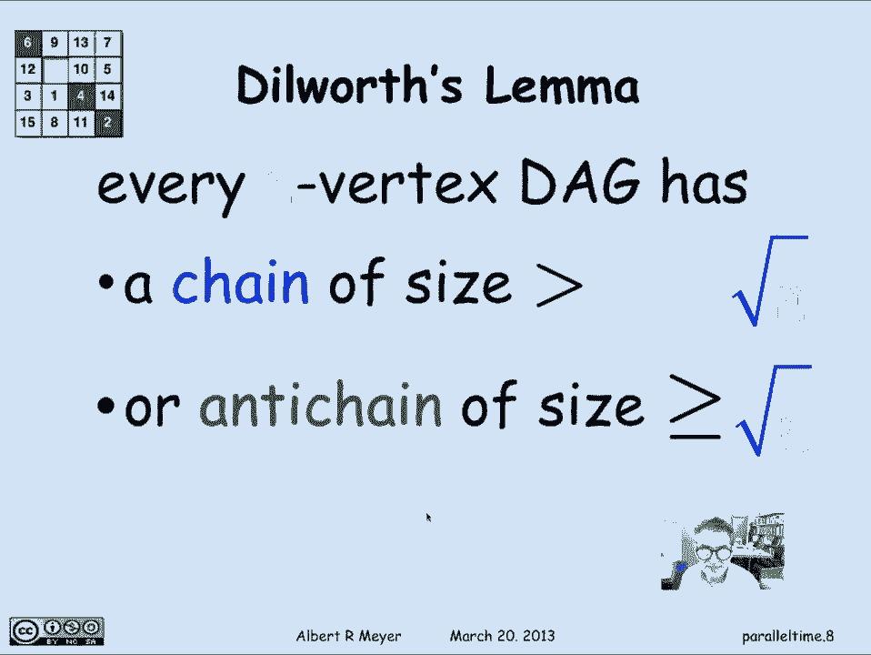

## 迪尔沃斯引理及其含义 🧮

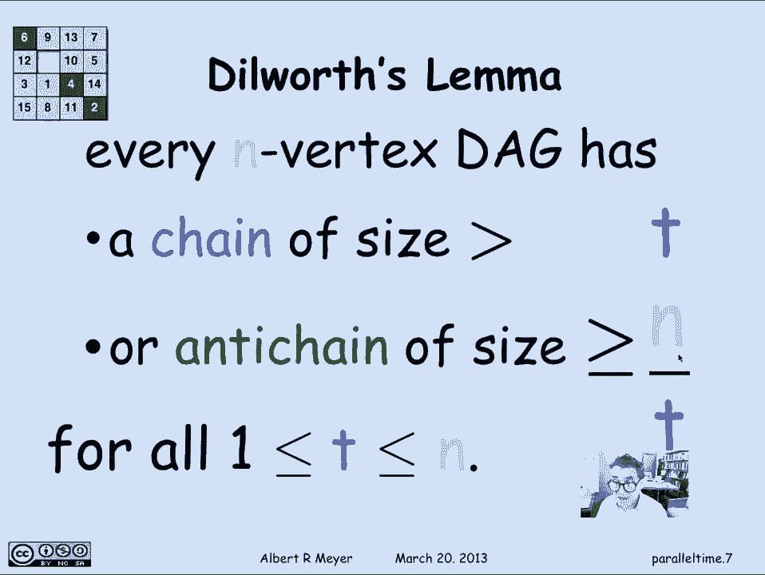

那么，我们能否做得比3门课/学期更好呢？一个简单的论证表明不能。我们有13门课（n=13），最大链尺寸为5（c=5）。要在5个学期内分配13门课，根据鸽巢原理，至少有一个学期需要安排 `ceil(13/5) = 3` 门课。这是一个普遍现象。

更一般地，对于一个有 `n` 个顶点的DAG，设其最大链尺寸为 `c`，最大反链尺寸为 `a`。那么顶点总数 `n` 最多为 `c * a`。

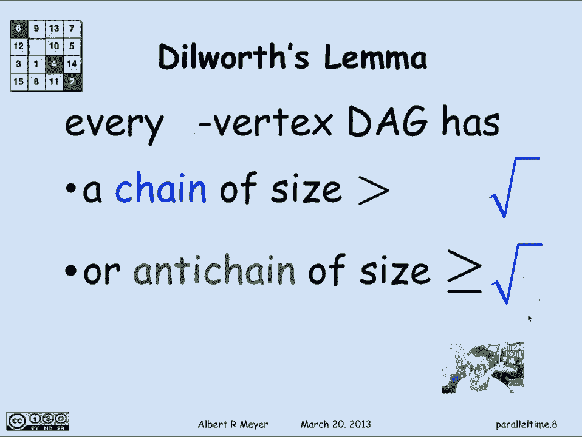

**公式**：`n ≤ c * a`

这个关系可以重新表述为著名的**迪尔沃斯引理**（Dilworth‘s Lemma）的一个特例：
> 对于一个有 `n` 个顶点的DAG和任意数 `t`（1 ≤ t ≤ n），该图要么包含一个尺寸大于 `t` 的链，要么包含一个尺寸至少为 `n/t` 的反链。

**公式**：`存在链尺寸 > t` **或** `存在反链尺寸 ≥ n/t`

## 一个有趣的应用：身高与年龄的例子 👥

让我们看一个迪尔沃斯引理的简单应用。假设我们有一个班级，有141名学生。我们为每名学生记录身高（精确到微米）和年龄（精确到微秒），以确保没有完全相同的两人。

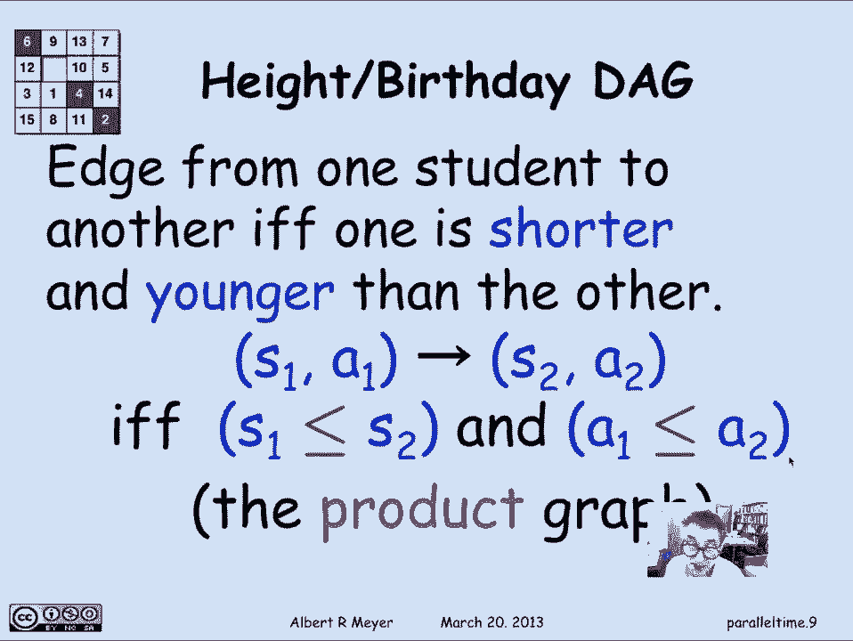

我们构造一个DAG：如果学生A的身高和年龄都**小于等于**学生B，则从A到B画一条有向边。这个图是“身高DAG”和“年龄DAG”的乘积图。

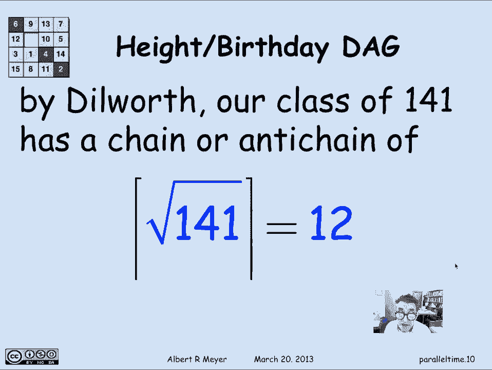

根据迪尔沃斯引理，取 `t = sqrt(141) ≈ 12`，我们可以得出结论：在这个有141个顶点的乘积DAG中，**要么存在一个至少包含12人的链，要么存在一个至少包含12人的反链**。

*   **链**的含义：如果存在一个12人的链，意味着我们可以找到12名学生，他们随着身高的**增加**，年龄也**增加**（或不变）。
*   **反链**的含义：如果存在一个12人的反链，意味着我们可以找到12名学生，当他们按身高从高到矮排列时，他们的年龄会随之**增加**（因为反链中任意两人不可比，所以更矮的人必须更老，否则就会产生可比性）。

在实际的课堂数据中，我们恰好发现了一个包含12名学生的反链：当按身高从高到矮排列时，他们的出生日期确实越来越早（即年龄越来越大）。这验证了迪尔沃斯引理的结论。

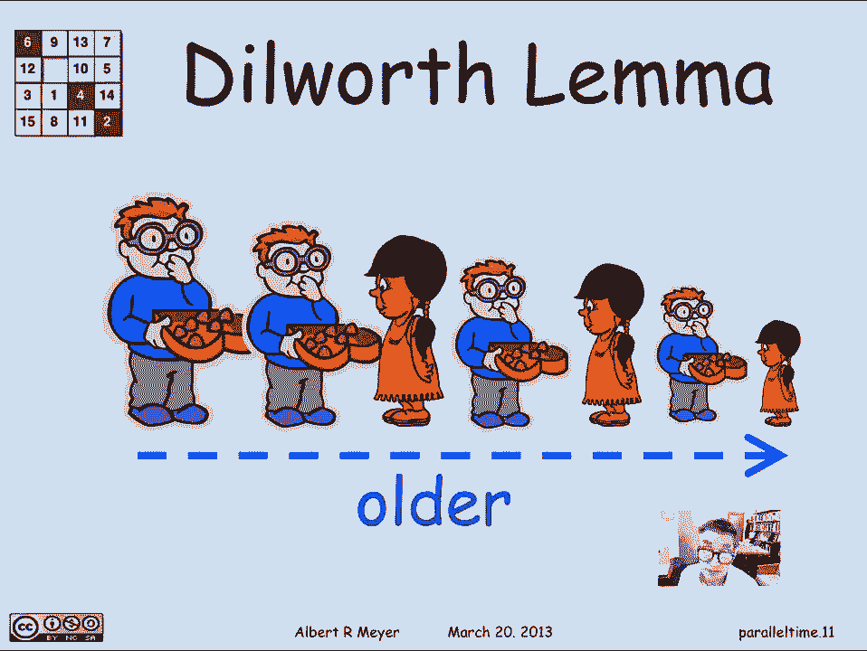

## 总结 🎯

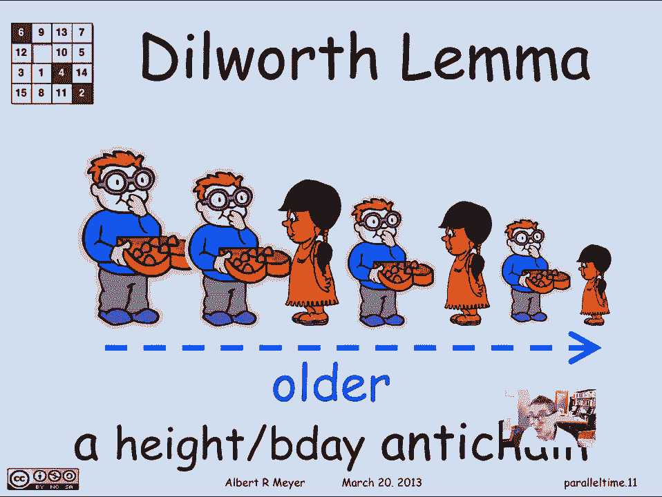

本节课我们一起学习了任务调度中的核心概念：
1.  **最短并行时间**由约束图中的**最大链尺寸**决定。
2.  **所需处理器数量的上限**由**最大反链尺寸**决定，但实际所需可能更少。
3.  链与反链的尺寸受**迪尔沃斯引理**约束，该引理揭示了它们与任务总数 `n` 之间的基本关系：`n ≤ c * a`。
4.  我们通过一个**身高-年龄的乘积DAG**例子，看到了迪尔沃斯引理的一个具体应用，它保证了在一个足够大的集合中，总能找到一定规模的链或反链。

这些概念不仅适用于课程安排，也广泛适用于项目管理、并行计算以及任何需要处理依赖关系的调度场景。