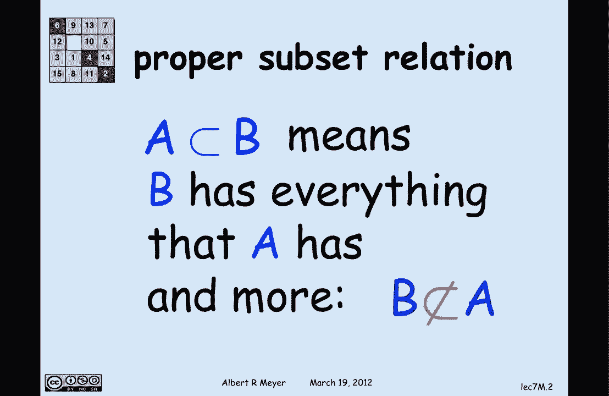
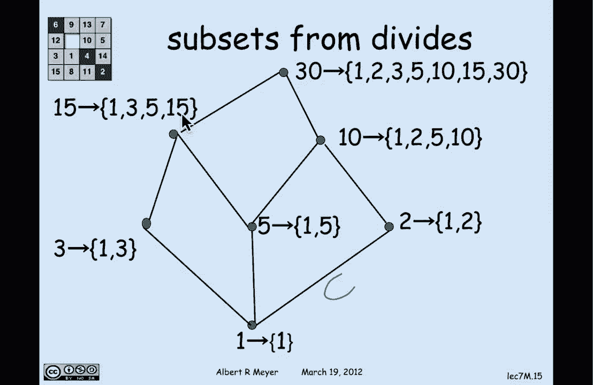

# 计算机科学的数学基础：P52：L2.7.3- 将偏序关系表示为子集关系 📚

在本节课中，我们将学习偏序关系的一个重要性质：**表示定理**。我们将看到，任何严格的偏序关系在结构上都等同于某个集合族在真包含关系下的偏序。这为我们理解抽象的偏序关系提供了一个非常直观的模型。

---

## 回顾与引入




上一节我们介绍了偏序关系及其在**有向无环图**中的表示。本节中，我们来看看偏序关系的另一种理解方式——将其与集合的包含关系联系起来。

## 从例子出发：真子集关系

我们首先关注**真子集关系**。集合 `A` 是集合 `B` 的真子集，记作 `A ⊂ B`，其含义是 `B` 包含了 `A` 中的所有元素，并且还包含一些额外元素。因此，`B` 不可能是 `A` 的子集（更不用说真子集）。

考虑以下七个集合，箭头（图中向上指）表示它们之间的真子集关系（即正路径关系）：

```
{1} ⊂ {1,5} ⊂ {1,2,5,10}
{5} ⊂ {1,5} ⊂ {1,2,5,10}
{2} ⊂ {1,2,5,10}
{1,2,5,10} 是最大的集合。
```

这种图被称为**哈斯图**，其中高度暗示了箭头的方向（向上）。例如，从集合 `{1}` 到集合 `{1,5}` 有一条向上的路径，因为 `{1,5}` 包含了 `{1}` 中的元素 `1` 以及额外元素 `5`。同样，从 `{1}` 到 `{1,2,5,10}` 也有路径。

## 一个相似的例子：真整除关系

现在，让我们看一个结构非常相似的例子：**真整除关系**。我们说 `a` 真整除 `b`，如果 `a` 整除 `b` 且 `a ≠ b`。

考虑在以下七个数字上的真整除关系：`{1, 2, 3, 5, 10, 15, 30}`。其哈斯图如下：

```
1 → 2, 3, 5
2 → 10
3 → 15
5 → 10, 15
10 → 30
15 → 30
```

这个图的关键在于，**这七个数字在真整除关系下的结构图，与之前那七个集合在真子集关系下的结构图形状完全相同**。我们可以将一个图叠加在另一个图上，它们能完美匹配。

## 同构的概念

当两个图具有“相同形状”时，我们在数学上称它们为**同构**的。同构意味着我们只关心顶点之间的连接关系，并且存在一个顶点间的一一对应（双射），使得连接关系得以保持。

以下是同构的正式定义：

> 设有向图 `G1 = (V1, E1)` 和 `G2 = (V2, E2)`。我们说 `G1` 与 `G2` 同构，当且仅当存在一个双射函数 `f: V1 → V2`，满足以下条件：
> 对于 `V1` 中的任意两个顶点 `u` 和 `v`，`(u, v) ∈ E1` 当且仅当 `(f(u), f(v)) ∈ E2`。

用公式表示即：
```
∃ f: V1 → V2 (f 是双射 ∧ ∀ u,v ∈ V1 [(u, v) ∈ E1 ⇔ (f(u), f(v)) ∈ E2])
```

## 核心定理：偏序的表示定理

我们通过真整除和真子集的例子所展示的，实际上是一个普遍定理的特例。这个定理就是**表示定理**：

> **每一个严格的偏序关系都同构于某个集合族在真包含关系 `⊂` 下构成的偏序。**

这意味着，如果你想理解偏序关系是什么，答案就是：**一个严格的偏序关系看起来就像一堆集合在包含关系下的排序**。任何严格的偏序关系都可以通过一种方式，被“看作”是一组集合之间的包含关系。

## 定理的证明思路

这个定理的证明是直观的。给定任意一个严格的偏序关系 `R`（定义在集合 `D` 上），我们可以构造一个同构映射 `f`，将 `D` 中的每个元素映射到一个集合。

以下是构造映射的方法：
- 对于 `D` 中的任意元素 `a`，将其映射到这样一个集合：该集合包含所有在关系 `R` 下“小于或等于” `a` 的元素。
- 由于 `R` 是严格的（`a` 不 `R` 于 `a`），我们需要特意把 `a` 本身也加入这个集合。

用公式定义这个映射 `f`：
```
f(a) = { b ∈ D | (b, a) ∈ R } ∪ {a}
```
或者等价地，`f(a) = R^{-1}(a) ∪ {a}`，其中 `R^{-1}(a)` 表示所有与 `a` 有 `R` 关系的元素集合。

## 用例子说明映射构造

让我们用之前的真整除关系例子来演示这个映射是如何工作的。我们有偏序集 `D = {1, 2, 3, 5, 10, 15, 30}`，关系 `R` 是“真整除”。

以下是映射 `f` 的构造结果：
- `f(1) = {1}` （没有数真整除1，所以只包含自身）
- `f(2) = {1, 2}` （1真整除2）
- `f(3) = {1, 3}`
- `f(5) = {1, 5}`
- `f(10) = {1, 2, 5, 10}` （1, 2, 5 真整除10）
- `f(15) = {1, 3, 5, 15}`
- `f(30) = {1, 2, 3, 5, 10, 15, 30}`

现在，观察这些像集合 `{f(a) | a ∈ D}`：
```
{1}, {1,2}, {1,3}, {1,5}, {1,2,5,10}, {1,3,5,15}, {1,2,3,5,10,15,30}
```
它们在真包含关系 `⊂` 下形成的结构，与原始数字在真整除关系 `R` 下的结构是完全同构的。例如，`2` 真整除 `10`，对应地 `f(2) = {1,2}` 是真包含于 `f(10) = {1,2,5,10}`。

这个构造普遍适用于任何严格的偏序关系，从而证明了表示定理。

---

## 总结

本节课中我们一起学习了偏序关系的一个深刻性质——**表示定理**。我们了解到：
1.  通过**真子集关系**和**真整除关系**的例子，我们发现了不同偏序结构可能具有相同的形状（即同构）。
2.  我们正式定义了图的**同构**概念，它要求顶点间存在一个保持边关系的双射。
3.  我们学习并解释了核心的**表示定理**：**任何严格的偏序关系都同构于某个集合族在包含关系下构成的偏序**。
4.  我们探讨了定理证明的核心思路，即通过将每个元素映射到其“下界”集合（包括自身）来构造同构映射。



这个定理非常重要，因为它将抽象的偏序关系与非常具体、直观的集合包含关系联系了起来，为我们理解和分析偏序结构提供了一个强大的工具。在后续学习中，你可以尝试将其他偏序（如任务依赖关系）也想象成集合的包含，这常常能带来新的洞察。