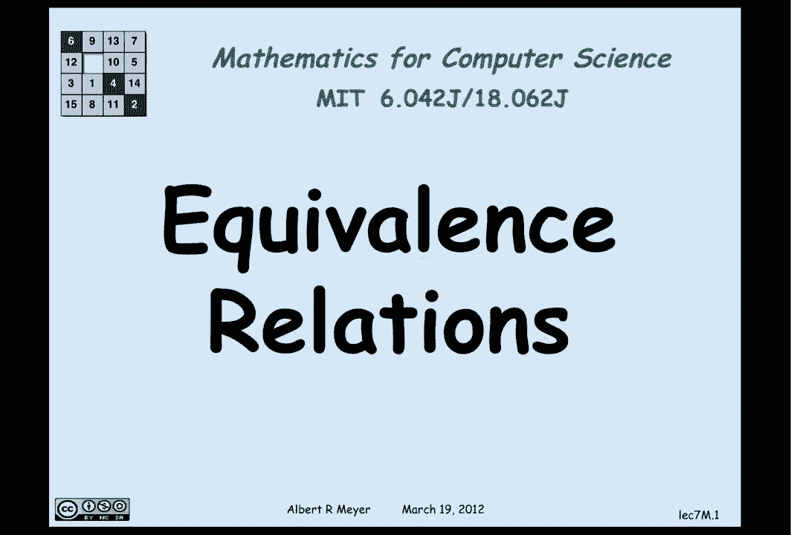
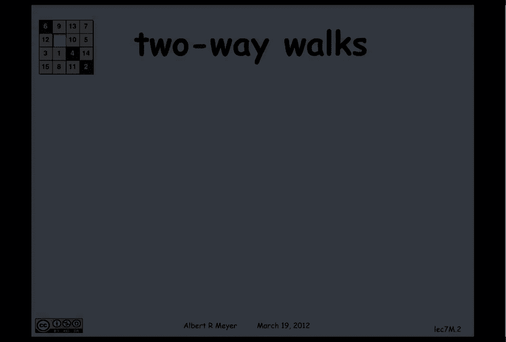
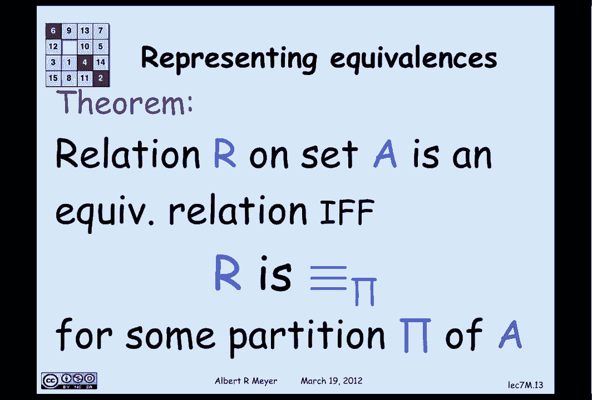

# 计算机科学的数学基础：2.7.4：等价关系 🔗



在本节课中，我们将要学习等价关系。等价关系是定义在集合上的一种二元关系，它在数学和计算机科学中扮演着至关重要的角色。我们将从有向图的角度和公理的角度来解释等价关系，并探讨其多种表示方式。



## 有向图视角下的等价关系

上一节我们介绍了二元关系的基本概念，本节中我们来看看如何用有向图来理解等价关系。

等价关系可以理解为有向图中顶点之间的“双向可达”关系。具体来说，如果从顶点 `u` 到顶点 `v` 存在一条路径，并且从顶点 `v` 到顶点 `u` 也存在一条路径（包括长度为0的路径），那么 `u` 和 `v` 就被称为**强连通**的。这种强连通关系就是等价关系的一个例子。

用路径关系（包括零长度路径）的符号表示，即 `u G* v` 且 `v G* u`。

## 等价关系的公理定义

从公理的角度看，等价关系是一种同时满足**对称性**、**传递性**和**自反性**的二元关系。

以下是这些性质的定义：

*   **对称性**：一个定义在集合 `A` 上的关系 `R` 是对称的，当且仅当 `a R b` 蕴含 `b R a`。
*   **传递性**：关系 `R` 是传递的，当且仅当 `a R b` 且 `b R c` 蕴含 `a R c`。
*   **自反性**：关系 `R` 是自反的，当且仅当对于集合 `A` 中的每个元素 `a`，都有 `a R a`。

因此，有向图中的强连通关系是一个等价关系，因为它天然满足这三个性质：它是对称的（双向可达），是传递的（如果 `u` 和 `v` 双向可达，`v` 和 `w` 双向可达，那么 `u` 和 `w` 也双向可达），并且是自反的（每个顶点到自身都有长度为0的路径）。

反之，任何等价关系都可以看作是某个有向图的强连通关系。

## 等价关系的例子

为了加深理解，我们来看几个等价关系的具体例子：

*   **相等关系**：最基础的等价关系。任何元素都等于其自身（自反），如果 `a = b` 则 `b = a`（对称），如果 `a = b` 且 `b = c` 则 `a = c`（传递）。
*   **模 `n` 同余**：两个整数 `a` 和 `b` 模 `n` 同余（记作 `a ≡ b (mod n)`），当且仅当 `n` 整除 `(a - b)`。这个关系也满足自反、对称和传递性。
*   **集合等势**：对于有限集，如果两个集合的元素个数相同，则它们等势。这也是一个等价关系。
*   **颜色相同**：定义在一组有颜色的物体上，如果两个物体颜色相同，则它们具有该关系。这同样是一个等价关系。

## 性质的有向图表示

我们可以用有向图来直观地记忆这些性质：

*   **自反性**：图中每个顶点都有一个指向自身的环（自环）。
*   **传递性**：如果图中存在一条从 `u` 到 `v` 再到 `w` 的长度为2的路径，那么必然存在一条从 `u` 直接到 `w` 的边。
*   **对称性**：如果图中存在一条从 `u` 到 `v` 的边，那么必然存在一条从 `v` 回到 `u` 的边。

## 等价关系的其他表示法

除了用有向图表示，等价关系还有两种非常重要的等价表示方式。

**1. 通过函数定义**

给定一个从集合 `A` 到陪域 `B` 的**全函数** `f`，我们可以定义一个等价关系 `Equiv_f`：
```
a Equiv_f a' 当且仅当 f(a) = f(a')
```
即，两个元素等价当且仅当它们在函数 `f` 下的像相同。由于“相等”是等价关系，`Equiv_f` 自然继承了自反、对称和传递性。

**定理**：集合 `A` 上的一个关系 `R` 是等价关系，当且仅当存在某个函数 `f`，使得 `R` 等于 `Equiv_f`。

例如，模 `n` 同余关系就可以通过函数 `f(k) = k mod n`（`k` 除以 `n` 的余数）来定义。两个数同余当且仅当它们被 `n` 除的余数相同。

**2. 通过划分定义**

一个集合 `A` 的**划分**，是将 `A` 分割成若干个互不相交的非空子集（称为**块**），使得 `A` 中的每个元素都恰好属于其中一个块。

给定一个划分，我们可以定义一个等价关系：两个元素等价，当且仅当它们属于划分中的同一个块。

反之，**定理**：集合 `A` 上的一个关系 `R` 是等价关系，当且仅当它是 `A` 的某个划分的“属于同一块”关系。

从函数表示到划分表示的思路是：将元素映射到它所属的块，这个映射本身就是一个函数。反之，从一个等价关系出发构造其对应的划分，是一个基础的公理化推理练习。

---



本节课中我们一起学习了等价关系。我们首先从有向图中“强连通”的概念引入，然后给出了等价关系必须满足的三个公理：**自反性**、**对称性**和**传递性**。接着，我们探讨了等价关系的多种表示方法，包括有向图表示、通过函数定义以及通过集合划分定义。理解等价关系的这些不同视角，对于后续学习数学和计算机科学中的许多概念（如商集、同余类等）至关重要。