# 图论基础：2.8.1：顶点的度 📊


在本节课中，我们将学习图论中的一个新主题——简单图，并重点介绍一个核心概念：顶点的度。我们将从简单图的定义开始，逐步理解度的概念，并学习一个重要的定理——握手定理。最后，我们将通过一个有趣的社会学应用，展示图论如何帮助我们分析现实世界的数据。

---

## 简单图与有向图

上一节我们讨论了有向图，其中有向边具有起点和终点。本节中，我们来看看一种更简单的图结构。

简单图比有向图更简单。它的边没有方向，只代表一种对称的、相互的连接关系。下图展示了一个简单图，其边没有箭头。

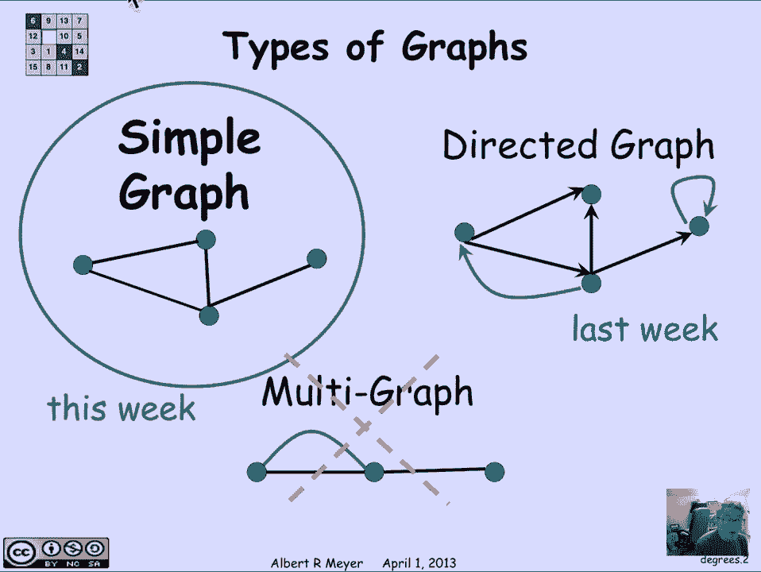


有向图的一个特点是，两个顶点之间可以存在两个方向相反的箭头。但在简单图中，由于边是无向的，这种情况不会发生。因此，在简单图中，一对顶点之间最多只有一条边。

此外，有向图允许存在自环，即一条边从同一个顶点出发并结束。简单图则不允许自环。当然，存在允许自环和多条边的“多重图”，但为了不使问题复杂化，我们目前只讨论简单图。

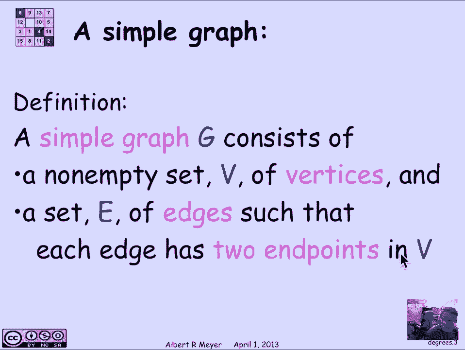

---

## 简单图的正式定义

简单图是一个对象 **G**，它包含两个部分：
1.  一个非空的顶点集合 **V**。
2.  一个边集合 **E**。

由于边没有方向，一条边只有两个端点，且这两个端点没有顺序之分。下图展示了一个包含6个蓝色顶点和7条绿色边的简单图。


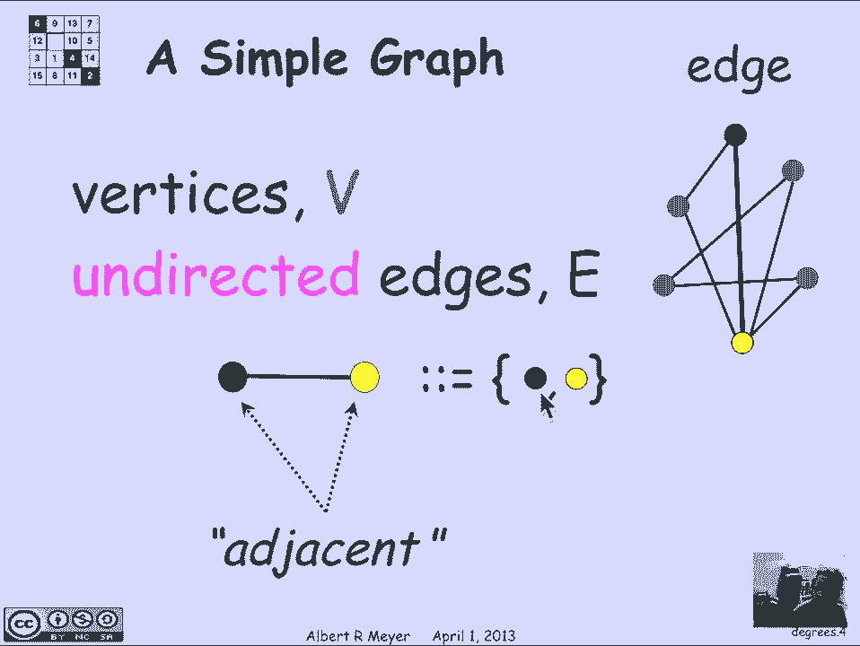

图中，我们用黄色和红色高亮了一条边（深绿色）。在形式上，这条边可以表示为它的两个端点组成的集合：`{红， 黄}`。在文本中，我们常用一条横线连接两个顶点来表示，例如 `红—黄`。必须记住，顶点的顺序无关紧要，因为它本质上是一个集合。

当两个顶点被一条边连接时，我们称它们是**相邻**的。同时，这条边**关联于**它的两个端点。

---

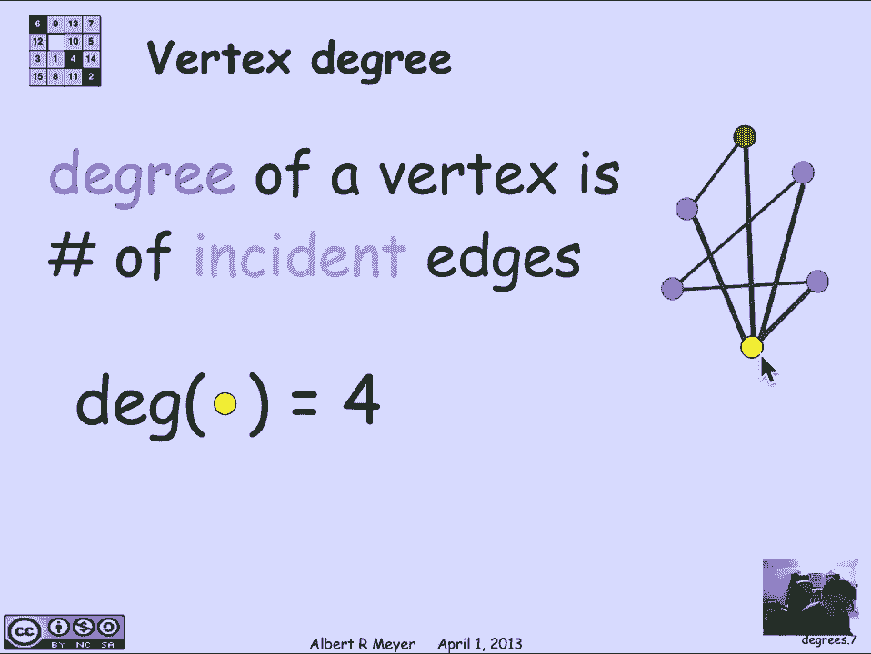

## 顶点的度

图论中的一个基本概念是顶点的**度**。一个顶点的度，就是**关联于该顶点的边的数量**，即连接到该顶点的边的条数。

让我们来看图中的例子：
*   红色顶点有两条边与之相连，所以它的度是 **2**。
*   黄色顶点有四条边与之相连，所以它的度是 **4**。


---

## 握手定理

现在，让我们探讨顶点度的一个基本性质，这引出了一个非常重要的定理。

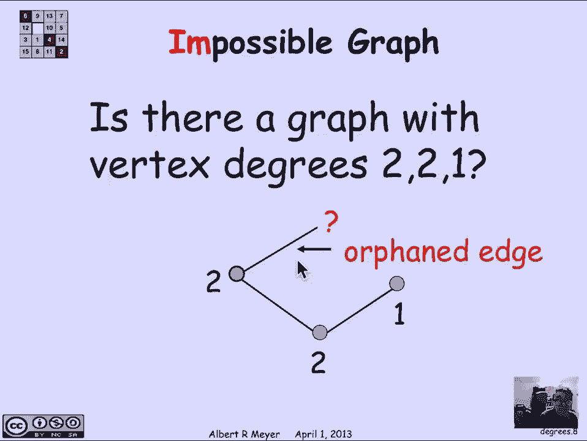

假设我们有一个包含三个顶点的图，其度数分别为 2、2 和 1。我们能画出这样的图吗？通过尝试，我们会发现这是不可能的。我们可以用一个更通用的定理来证明这一点，而无需具体画图。

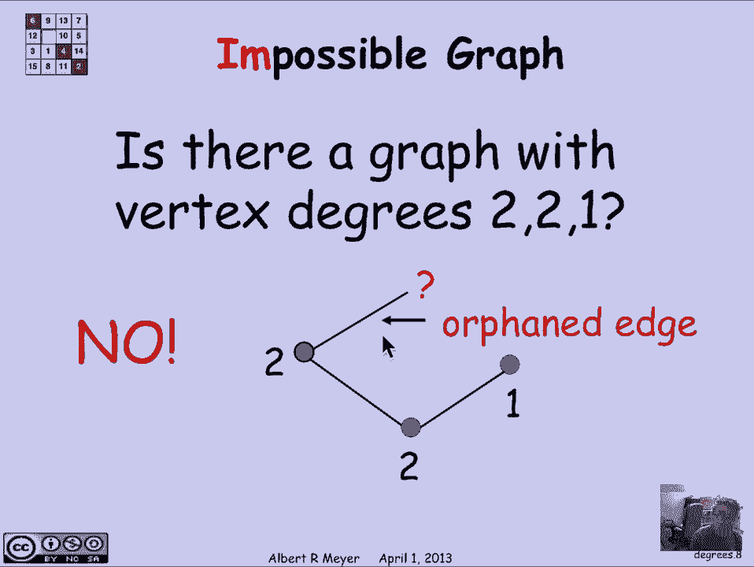

这个定理被称为**握手定理**。它指出：**一个图中，所有顶点的度数之和，等于边数的两倍**。

用公式表示如下：

```
∑_{v ∈ V} deg(v) = 2 * |E|
```

其中：
*   `∑_{v ∈ V} deg(v)` 表示对所有顶点 `v` 的度数 `deg(v)` 求和。
*   `|E|` 表示边集合 `E` 的大小，即边的数量。

**为什么这个定理成立？**
因为每条边都关联两个顶点。在计算所有顶点的度数之和时，每条边都被计算了两次（分别在其两个端点的度数中各计一次）。因此，总和必然是边数的两倍。

回到我们之前的例子：度数 2、2、1 的和是 5，这是一个奇数。根据握手定理，这个和必须是偶数（因为它是边数的两倍）。所以，我们立刻可以断定，不可能存在一个顶点度数为 2、2、1 的图。

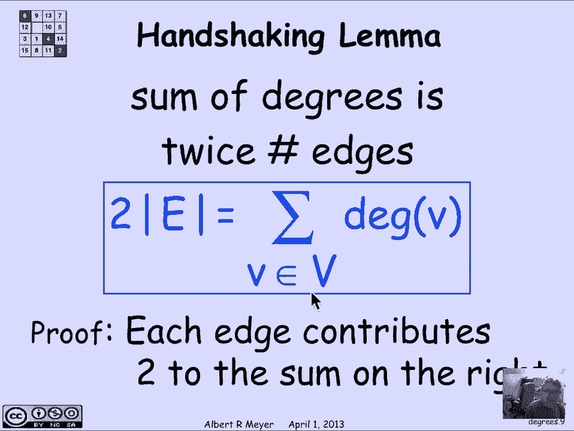

---

## 应用：一个社会学问题

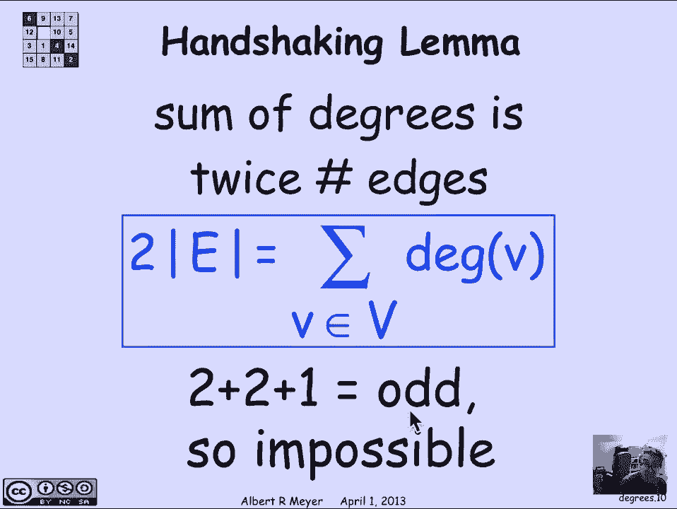

现在，让我们应用握手定理来分析一个有趣的社会学问题：**男性是否比女性拥有更多的性伴侣？**

多项调查反复显示，男性报告的平均性伴侣数量比女性多出30%到数倍。这看起来很奇怪，我们将用一个简单的图论模型来论证这个结果在数学上是不可能的。

### 构建模型

我们用一种特殊的简单图——**二分图**来建模两性关系。
*   我们有两组顶点：集合 **M**（代表男性）和集合 **F**（代表女性）。
*   如果一位男性和一位女性发生过性关系，我们就在他们对应的顶点之间连一条边。

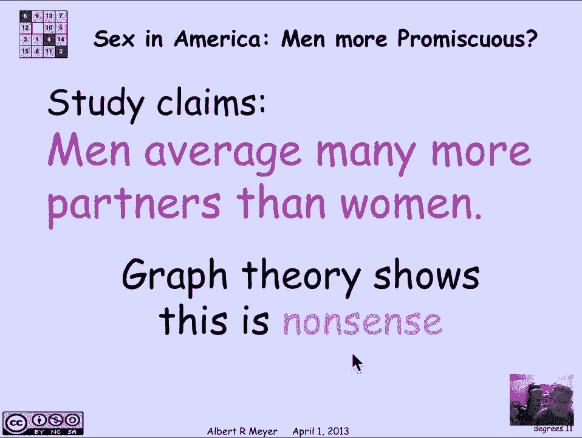

在这个模型中，每条边都连接一个男性顶点和一个女性顶点。


### 应用握手定理

现在，我们分别对男性顶点和女性顶点应用握手定理的思想：
*   所有男性顶点的度数之和，等于图中的总边数（因为每条边恰好连接一位男性）。
*   所有女性顶点的度数之和，也等于图中的总边数（因为每条边恰好连接一位女性）。

因此，我们得到以下等式：

```
∑_{m ∈ M} deg(m) = |E| = ∑_{f ∈ F} deg(f)
```

即：**男性度数之和 = 女性度数之和**。

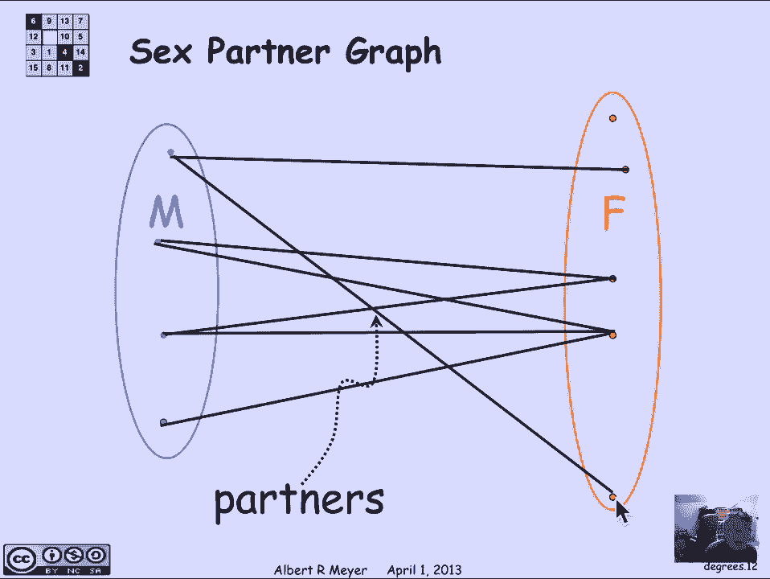

### 推导平均伴侣数

接下来，我们在这个等式两边做一些简单的算术变换。首先，等式两边同时除以男性总人数 `|M|`：

```
(∑_{m ∈ M} deg(m)) / |M| = (∑_{f ∈ F} deg(f)) / |M|
```

左边 `(∑_{m ∈ M} deg(m)) / |M|` 正是**男性平均拥有的伴侣数**，记作 `Avg_deg(M)`。

为了处理右边，我们引入女性总人数 `|F|`：

```
(∑_{f ∈ F} deg(f)) / |M| = [(∑_{f ∈ F} deg(f)) / |F|] * (|F| / |M|)
```

这里，`(∑_{f ∈ F} deg(f)) / |F|` 是**女性平均拥有的伴侣数**，记作 `Avg_deg(F)`。`|F| / |M|` 是**女性与男性的人口比例**。

于是，我们得到了一个关键公式：

```
Avg_deg(M) = Avg_deg(F) * (|F| / |M|)
```

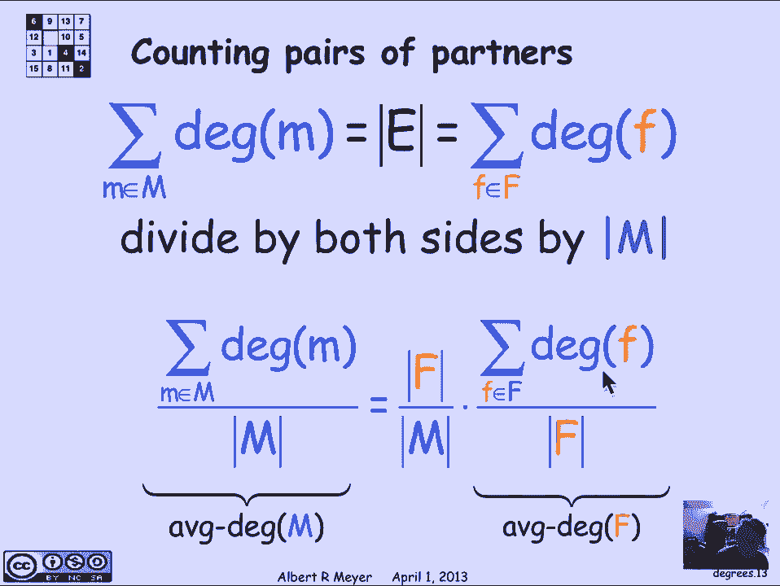

**男性平均伴侣数 = 女性平均伴侣数 × (女性人口 / 男性人口)**

### 结论分析

这个公式告诉我们，两性平均伴侣数的差异，完全由人口性别比例决定，而与行为差异无关。

以美国为例，女性与男性的比例约为 1.035 : 1。代入公式：
*   如果女性平均有 10 个伴侣，那么男性平均应有 10 × 1.035 = 10.35 个伴侣。
*   男性平均伴侣数仅比女性高出约 **3.5%**，远非调查中显示的 30% 或更高。

因此，那些显示男性伴侣数远高于女性的调查数据，在数学上是不可能的。数据矛盾的原因很可能在于报告偏差：例如，男性可能夸大了数量，而女性可能少报了数量。但无论如何，图论模型清晰地揭示了原始数据中的逻辑谬误。

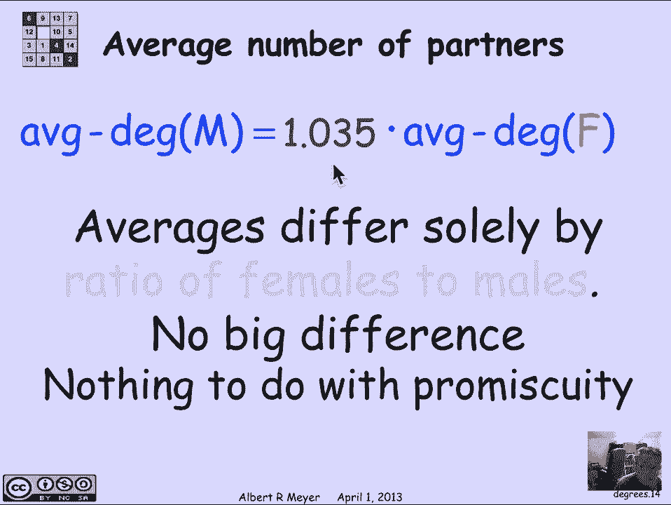

---

## 总结

本节课中，我们一起学习了：
1.  **简单图**的定义：由顶点集和无向边集构成，没有重边和自环。
2.  顶点的**度**：关联于该顶点的边的数量。
3.  **握手定理**：所有顶点度数之和等于边数的两倍，即 `∑ deg(v) = 2|E|`。
4.  一个精彩的应用：利用二分图和握手定理，我们证明了关于两性伴侣数量的某些流行调查数据在数学上不成立，并推导出平均伴侣数只与人口性别比例相关的结论。


这个例子生动地展示了，图论不仅是抽象的数学工具，也能为分析现实世界的社会现象提供清晰而有力的逻辑框架。