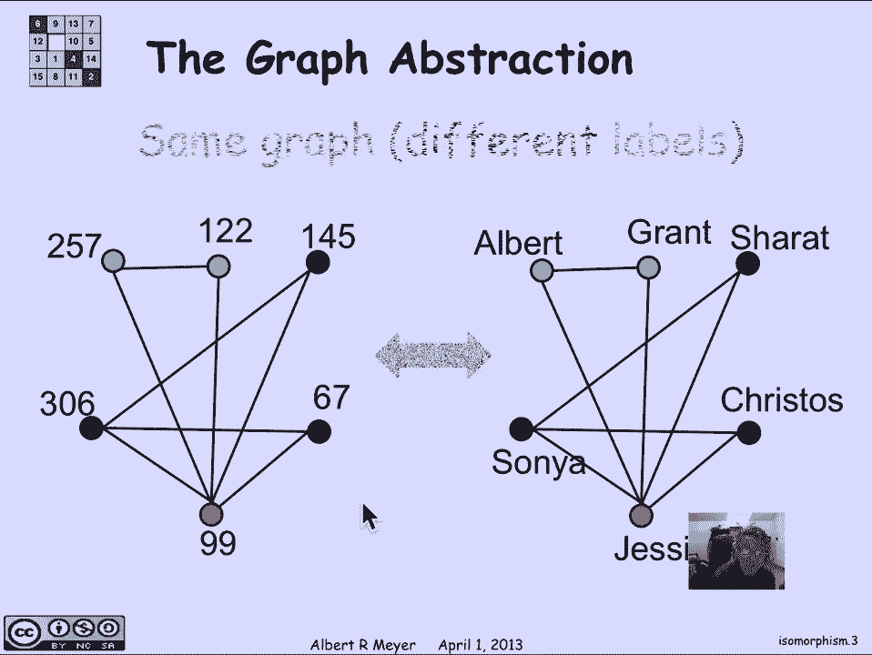
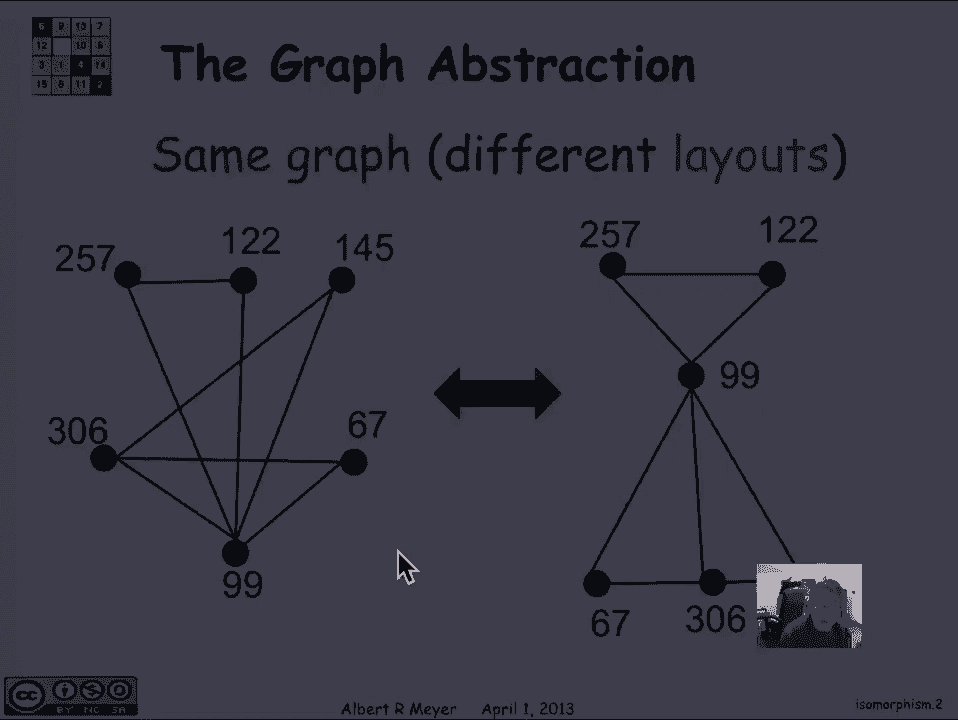
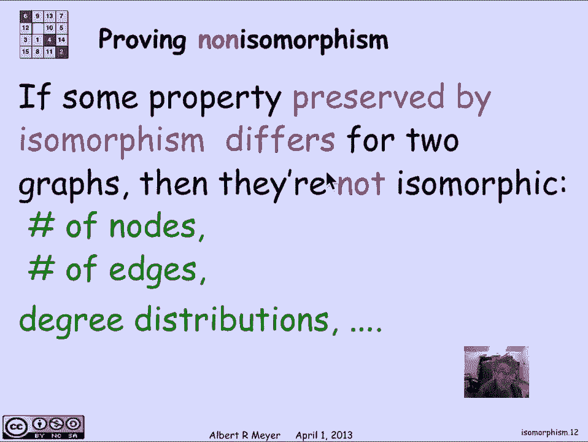
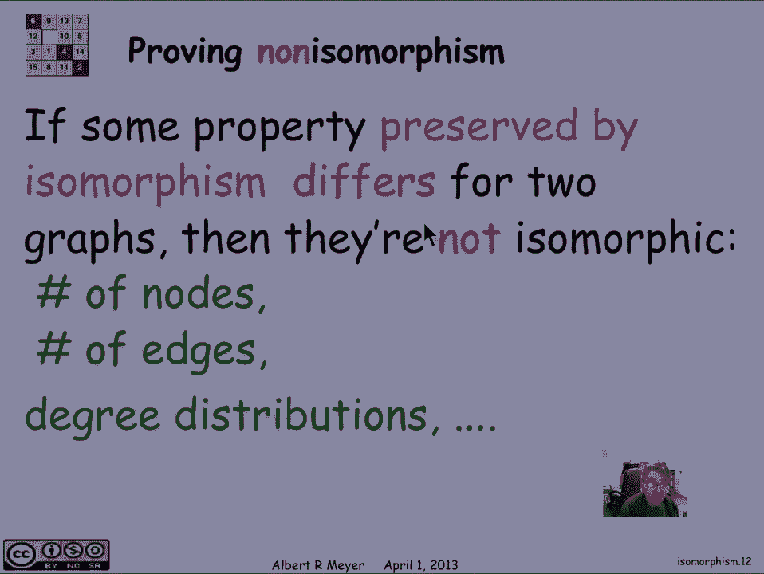
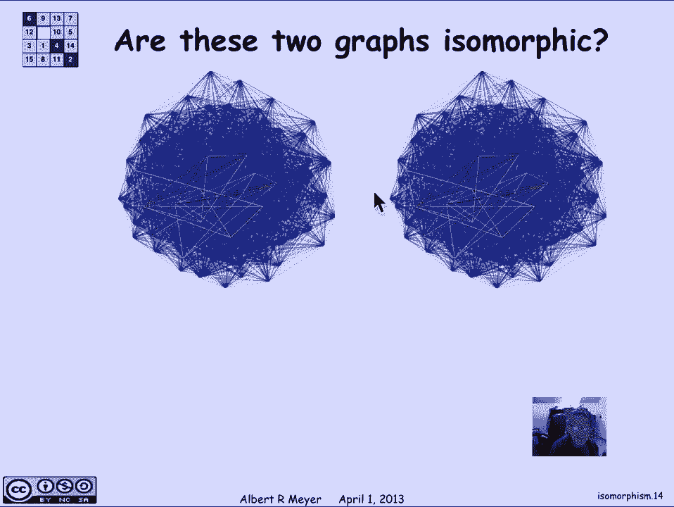

# 计算机科学的数学基础：2.8.3：图的同构 📊

在本节课中，我们将要学习图论中的一个核心概念——图的同构。我们将了解如何判断两个看似不同的图在结构上是否完全相同，以及如何证明它们不同。

## 概述

图是描述节点（顶点）和它们之间连接（边）的数学结构。有时，同一个图可以用不同的方式绘制，或者给顶点赋予不同的标签。图的同构概念帮助我们判断两个图在本质上是否“相同”，即它们是否具有完全相同的连接结构，而忽略其外观或标签的差异。

## 什么是图的同构？

上一节我们介绍了图的基本概念，本节中我们来看看如何定义两个图的“相同性”。

图本身只由顶点集和边集组成。考虑以下两个图，它们虽然画法不同，但顶点和边的连接关系完全一致，因此是同一个图的不同布局。

现在看另一个例子。下图中的两个图，布局完全相同，但顶点的标签不同。左边的顶点是整数，右边的顶点是人名。

这两个图被称为**同构**的。同构意味着两个图具有相同的连接模式。更正式的定义是：

两个图 **G1** 和 **G2** 是同构的，当且仅当存在一个从 **G1** 顶点集到 **G2** 顶点集的**双射函数 f**，并且该函数**保持边的关系**。即，在 **G1** 中，顶点 **u** 和 **v** 之间有边，当且仅当在 **G2** 中，顶点 **f(u)** 和 **f(v)** 之间也有边。

用公式表示如下：
> 对于图 **G1 = (V1, E1)** 和图 **G2 = (V2, E2)**，若存在双射 **f: V1 → V2**，使得对于任意 **u, v ∈ V1**，都有：
> **(u, v) ∈ E1 ⇔ (f(u), f(v)) ∈ E2**
> 则称 **G1** 与 **G2** 同构。

## 同构示例

让我们通过一个具体的例子来理解同构。考虑以下两个图：
*   左图：顶点是动物（狗、猫、牛、猪）。
*   右图：顶点是动物食物（牛肉、金枪鱼、干草、玉米）。

我声称这两个图是同构的。我们可以定义一个双射函数 **f**：

以下是顶点之间的映射关系：
*   **f(狗) = 牛肉**
*   **f(猫) = 金枪鱼**
*   **f(牛) = 干草**
*   **f(猪) = 玉米**

现在，我们需要验证这个映射是否“保持边”。这意味着左图中相连的顶点，其映射在右图中也必须相连；左图中不相连的顶点，其映射在右图中也必须不相连。

*   **检查边**：左图中，狗和猪之间有边。映射后，牛肉和玉米之间在右图也有边，符合条件。
*   **检查非边**：左图中，牛和猪之间没有边。映射后，干草和玉米之间在右图也没有边，符合条件。

逐一检查所有顶点对后，可以确认这个双射 **f** 满足同构定义，因此这两个图是同构的。

## 如何证明两个图不同构？

要证明两个图同构，只需找到一个满足条件的双射并验证即可。但要证明两个图**不同构**，则需要证明**不存在**这样的双射。

一个有效的方法是寻找**在同构下保持不变的性质**。如果图 **G1** 具有某个性质，而图 **G2** 不具有该性质，那么它们就不可能同构。

以下是一些在同构下保持不变的性质：

*   **顶点数量**：同构的图必须有相同数量的顶点。
*   **边的数量**：同构的图必须有相同数量的边。
*   **顶点的度数序列**：每个顶点的连接数（度数）必须相同。例如，一个图中有一个度数为2的顶点，另一个图中也必须有一个度数为2的顶点与之对应。
*   **子图结构**：是否存在特定长度的环（圈）、路径等。

让我们看一个例子。考虑以下两个图：

它们都有四个顶点。但是，左图有两个度数为2的顶点（用红色标出），而右图所有顶点的度数都是3。由于“顶点的度数”是一个在同构下保持不变的性质，这两个图不可能同构。左图的2度顶点在右图中找不到对应的2度顶点来映射。

## 图同构问题的复杂性

对于小型图，我们可以通过观察或系统性的尝试来寻找同构。然而，对于具有数百甚至数千个顶点的大型图，判断它们是否同构是一个非常困难的问题。

*   从理论上讲，**图同构问题**目前既未被证明是多项式时间可解的（P问题），也未被证明是NP完全问题。它是一个具有特殊计算地位的难题。
*   从实践上讲，存在一些非常高效的算法和程序，能够在大多数实际情况下快速判断两个图是否同构。这些算法利用了图的许多结构性质（如前面提到的度数、邻接关系等）来大幅缩小搜索空间。

尽管如此，在最坏情况下，还没有一个已知的算法能保证对所有图都在多项式时间内解决同构问题。下图展示了一个复杂网络的例子，判断这样的两个图是否同构非常具有挑战性。

## 总结

本节课中我们一起学习了图的同构。
*   我们理解了**图的同构**定义了图在结构上的“相同性”，它只关心顶点之间的连接关系，而忽略图的绘制方式或顶点标签。
*   我们学习了同构的**正式定义**，即存在一个保持边关系的顶点双射。
*   我们掌握了证明两个图同构的方法（构造双射并验证），以及证明两个图不同构的方法（寻找在同构下不变的性质差异）。
*   最后，我们了解了图同构问题的计算复杂性，知道它在理论上的困难性和在实际中的可处理性。

理解同构是图论的基础，它帮助我们抓住图的本质结构，是后续学习图分类、图算法等内容的重要工具。