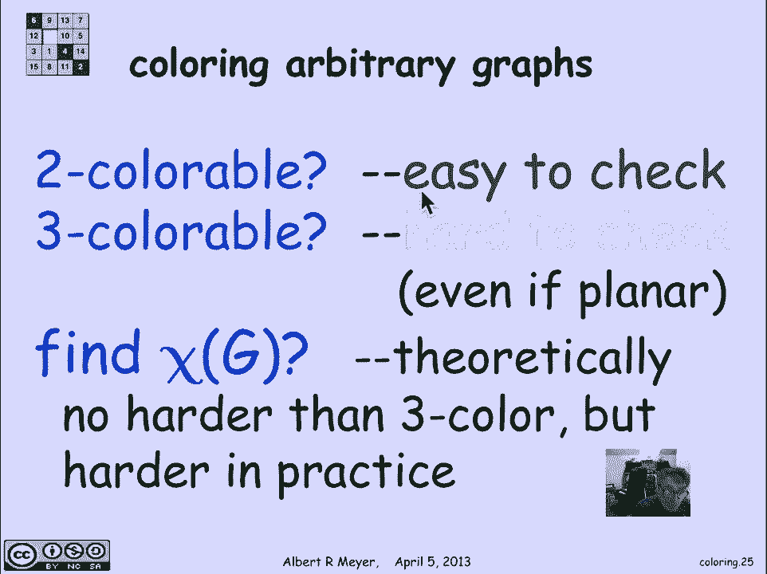
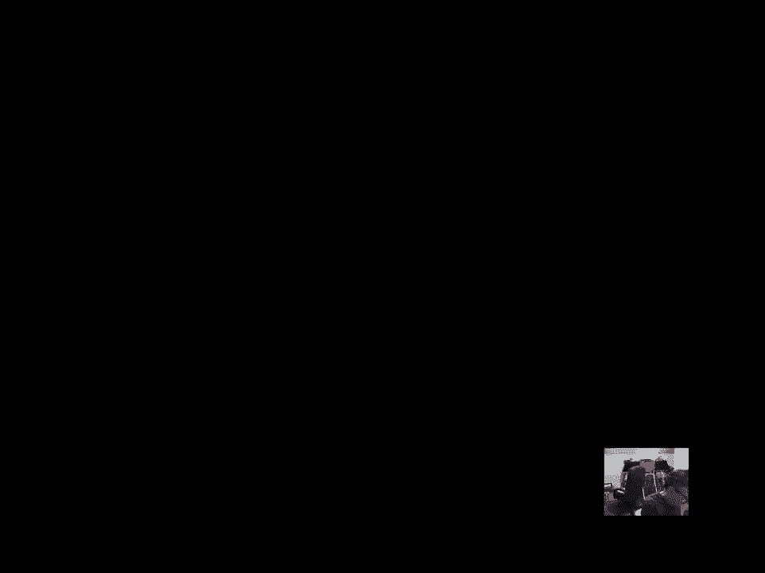

# 图论基础：2.9.1：图着色 🎨

在本节课中，我们将要学习图论中的一个核心概念——图着色。图着色是许多现实世界冲突调度问题的抽象模型，例如飞机登机口调度、考试时间安排等。我们将通过具体例子来理解其定义、应用和基本性质。

## 从实际问题到抽象模型

上一节我们介绍了图的基本概念，本节中我们来看看如何用图来建模冲突问题。图着色是多种冲突调度情况的抽象版本。让我们先看一个例子，然后定义问题。

设想有一批飞机需要在地面机场的登机口进行调度。如果两架飞机同时在地面，它们需要被分配到不同的登机口，因为一个登机口一次只能服务一架飞机。我们需要解决的问题是：为了服务所有可能同时在地面的飞机，最少需要多少个登机口？

让我们看一个示例日程表。这里有六个航班，编号从120到145，以及99。水平条表示一天中的时间，蓝色块表示航班在地面的时间段。例如，航班122从凌晨3点到7点在地面。航班145在地面的时间段则完全不同且不重叠。航班67到57从午夜到大约早上6点在地面，它与航班122的时间有重叠。根据这些信息，我们需要确定需要多少个登机口。

我们可以想象一条垂直的绿线在时间条上滑动，观察绿线在任何时刻穿过的蓝色区间的最大数量。在这个例子中，最大数量是3。这意味着在任何给定时刻，最多有3架飞机在登机口，因此我们只需要3个登机口就能应对冲突。

## 构建冲突图

抽象地，我们将每架飞机视为图的一个顶点。我们将在两个顶点之间添加一条边，来表示它们之间的**冲突**（而非兼容性）。这与之前匹配例子中寻找兼容性不同。这里的边意味着两架飞机同时在地面，它们发生冲突，需要不同的登机口。

例如，航班306和145同时在地面，它们之间有一条边。同样，航班99和145也同时在地面。这三架飞机（306、145、99）在某个时刻同时在地面，这反映在图中它们构成了一个三角形。如果我为所有其他顶点填充这个图，并在两架飞机同时在地面时画一条边，最终会得到一个小图。

## 图着色问题定义

现在我们可以抽象地讨论着色问题：为图的顶点分配颜色，使得**任何两个相邻的顶点不具有相同的颜色**。相邻的顶点必须有不同的颜色。

从我们如何根据航班日程表推导出这个图的描述中可以清楚地看出，为图着色所需的最少不同颜色数量，对应于服务这些飞机所需的最少登机口数量。

让我们尝试为这个图着色。我从为航班257涂红色、122涂黄色、99涂绿色开始。这里没有一般性的损失，因为这三架飞机同时在地面（反映在它们构成一个三角形的事实上），我必须使用三种不同的颜色，因为每架飞机都与其他两架相邻。

接下来，我为145涂黄色。既然它不与任何黄色顶点相邻，我可以重用黄色。然后，这里又有一个三角形。如果我不想使用额外的颜色，合理的做法是将它涂成红色。但这里我用了红色。还有一个三角形，这允许我涂色。然后我将这个顶点涂成黑色，因为我被卡住了：它同时与黄色、黑色和绿色顶点相邻，所以我必须想出第四种颜色。

我们用了四种颜色完成着色，这意味着我们本可以用四个登机口应付。颜色告诉我们哪架飞机分配到哪个登机口。例如，257和67可以分配到红色登机口，因为它们不同时在地面（它们之间没有边）。122和145可以分配到黄色登机口，依此类推。

然而，这不是最聪明的着色方式。这里展示了一种更好的着色方案。你可以检查每两个相邻顶点都有不同的颜色，现在我只用了三种颜色：红、黄、绿。这意味着只需要三个登机口，我得到了一个更好的调度方案。

## 更多应用场景

这种冲突建模的情况经常出现。另一个例子是安排期末考试。如果有一个学生同时选修两门课程，那么这两门课就存在冲突，因为它们的期末考试不能安排在同一时间。因此，我需要为有共同学生的课程对分配不同的考试时间段。问题在于，给定关于哪些课程对有共同学生的数据，我们想知道最短的考试周期可以是多长。这又变成了一个简单的图模型和着色问题。

这里我们画了一个图，包含一些示例课程。6042和1802有一条边，表示它们有共同的学生，因此期末考试需要安排在不同时间。同样，802和6042也有共同学生，所以需要安排在不同时间。另一方面，6042和1802（此处应为3091和1802）之间没有边，这意味着它们可以安排在同一时间，至少根据此图中的数据，没有学生同时选修3091和1802。

让我们尝试着色。同样，这里有一个三角形，我必须为三角形使用三种不同的颜色。这里有另一个三角形，为了节省颜色，让我们重用绿色。现在，这里有一个顶点与三个不同颜色的顶点相邻，因此它必须用第四种颜色着色。这次，四种颜色被证明是最佳可能方案。你可以检查这一点，它对应于一个调度方案。

这种冲突建模情况无处不在。另一个会出现这类兼容性图或不兼容性图（你需要为其着色）的地方是管理动物园。你必须为某些不能混在一起的动物物种准备独立的栖息地。在大鱼吃小鱼的水族馆世界里，你需要将大鱼和小鱼分开。你也不希望老虎和黑猩猩住在一起。我们可以再次将此问题建模为：我们需要多少个笼子？我们为每个物种创建一个顶点，并在两个不能共享栖息地或笼子的物种之间画一条边。

另一个例子是为广播电台分配不同频率。如果两个广播电台彼此靠近，它们会相互干扰，因此必须分配不同的颜色或频率。现在，我们将广播电台作为顶点，将距离近到会相互干扰的广播电台用边连接起来，表示它们需要分配不同的频率。

一个经典的例子是字面意义上的地图着色。如果你试图为美国地图着色，使得任何两个共享边界的州不具有相同的颜色。这是一个用四种颜色着色的示例。问题是，如果我给你某种平面地图，最少需要多少种颜色？如果两个国家只在一个点相接，允许它们共享颜色；但如果它们共享一段正长度的边界，则必须使用不同颜色。

## 地图着色与四色定理

将这个问题转化为顶点着色问题的方法是：如果你有一个像这样的平面图（这里只是一个任意的例子），我感兴趣的是用不同颜色为区域（国家）着色。但我会用顶点替换每个区域。我将在每个区域的中间放置一个顶点。注意这里有一个外部区域，它也得到了一个顶点。所以有六个区域，六个顶点。然后，我只需在两个区域共享一段正长度边界时连接对应的两个顶点。

例如，这条边对应于这个区域和那个区域共享的这段边界。如果你看这个相同的三角形区域，它与外部区域共享边界，因此会有一条从这里到代表外部区域的顶点的边。其余的边也是如此：当两个区域共享边界时，它们之间就有一条边。现在，问题是为国家着色对应于为顶点着色，我们希望用尽可能少的颜色为图着色。

一个在七十年代被证明的著名结论是：**每个平面图实际上都是四色可着色的**。这个结论在19世纪50年代首次被声称证明，但事实上发表的证明是错误的。它在期刊文献中搁置了十年，才有人发现了一个错误。也就是说，证明是错的，但结论本身可能没错。证明中存在一个未被充分论证的大漏洞。该证明确实为五色定理提供了正确的论证，而四色问题则悬而未决。

后来，两位数学家提出了四色定理的证明，但这个证明非常有争议，因为其大部分内容需要一个计算机程序来遍历数千个需要验证是否为四色可着色的样本图。他们有一个论证表明，如果存在任何不能被四着色的图，那它将是这几千个图中的一个。然后他们着手为这几千个图着色，这些图是在计算机的帮助下生成的，着色也是在计算机和手工的帮助下完成的。这让数学界很不满意，因为这样的证明本质上是无法人工核验的。

在20世纪90年代开发了一个改进得多的版本，但它最终仍然需要一个计算机程序来生成大约600张地图并验证它们的可着色性。因此，寻找一个无需计算机辅助、人类可以理解的**四色定理**证明，仍然是一个目标。但在数学界，对这个定理已不再有真正的怀疑。

## 色数与基本性质

如果我取一个任意图，并问为其着色所需的最少颜色数是多少，这被称为图的**色数**。所以，**χ(G)** 是为图G着色的最少颜色数。

让我们看看不同类型图的色数。

*   **偶环**：这里有一个长度为4的简单环。显然它可以用两种颜色着色，只需交替着色。这可以推广到任何偶数长度的环：偶数长度环的色数就是2，你可以交替为顶点着色。
*   **奇环**：另一方面，如果环的长度是奇数，你将需要第三种颜色。这是无法避免的，因为即使你尝试只用两种颜色，当你交替着色并绕回起点时，你会发现无法交替着色，为了避免冲突，你将需要第三种颜色。因此，一般来说，奇数长度环的色数是3。
*   **完全图**：这里展示了一个5个顶点的完全图。这是一个5顶点图，其中每个顶点都与其他四个顶点相邻。由于每个顶点都与其他四个顶点相邻，你将需要五种颜色。你无法做得更好，它们都必须有不同的颜色。因此，在n个顶点上的完全图（其中每个顶点都与其他n-1个顶点相邻）的色数是n。
*   **轮图**：另一个简单的例子是，如果我取一个环，在中间加一个轴心，称之为轮图。那么，外面有一个长度为5的环（周长为5）的轮图称为W5。我们可以用四种颜色为它着色。一般来说，奇数长度轮图的色数为4的论证是：我知道我需要三种颜色来为轮缘着色，而由于轴心与轮缘上的所有顶点都相邻，我需要为它准备第四种颜色。另一方面，如果周长是偶数，我可以用三种颜色应付。

关于色数还有一个简单的论证：如果一个图的每个顶点的度数最多为K（即任何给定顶点最多与K个其他顶点相邻），那么这意味着该图是**K+1可着色**的。证明是构造性的且非常简单：基本上，你可以以任何你喜欢的方式开始为顶点着色，但要遵守一个约束：当你为一个顶点着色时，它不能与周围任何顶点的颜色相同。但这很容易做到，因为当需要为某个顶点着色时，即使它周围的所有顶点都已着色，也最多只有K个，所以我总能找到第K+1种颜色分配给它，从而得到一个令人满意的着色。因此，我可以用K+1种颜色应付。

## 着色问题的计算复杂性

一般来说，检查一个图是否是2可着色实际上非常容易，我们可能会在一些课堂问题中讨论。但3可着色性则发生了巨大变化——我们回到了**NP完全问题**的领域。事实上，我的一位学生大约40年前的一个结果是：即使一个图是平面的（你知道它肯定可以用四种颜色着色），确定它是否可以用三种颜色着色，其难度与**可满足性问题**相当，并且实际上是一个NP完全问题。事实上，如何将可满足性问题归约为可着色性问题的证明，出现在教材的一个问题中，我们可能会将其作为习题集的问题。

因此，一般来说，即使只针对三种颜色，找到χ(G)也是困难的。从理论角度来看，检查χ(G)是否为某个非常大的数，其难度并不比检查三着色更糟。但从实际角度来看，三着色比n着色更容易检查。

---

本节课中我们一起学习了图着色的基本概念。我们了解到图着色是建模冲突调度问题的强大工具，例如飞机登机口分配和考试安排。我们定义了色数χ(G)，并探讨了不同类型图（如环、完全图、轮图）的色数。我们还简要介绍了著名的四色定理及其历史，并指出了检查图是否三着色是一个NP完全问题，这意味着在一般情况下寻找最优着色方案是计算困难的。理解这些基础是学习更高级图论算法和应用的第一步。