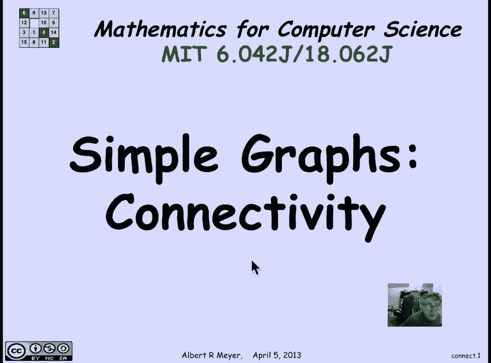
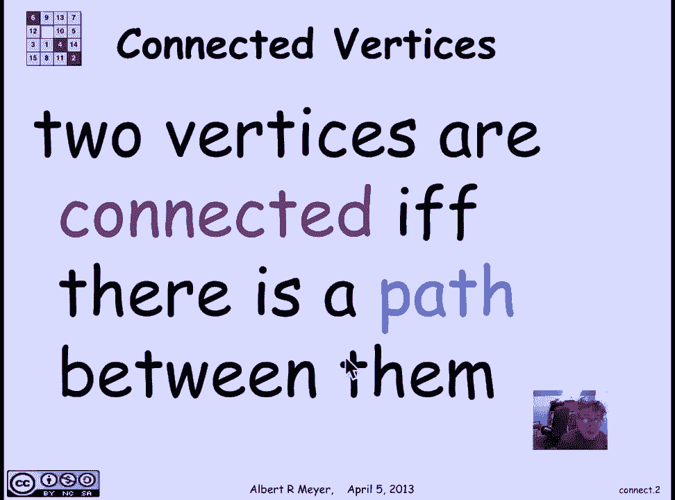
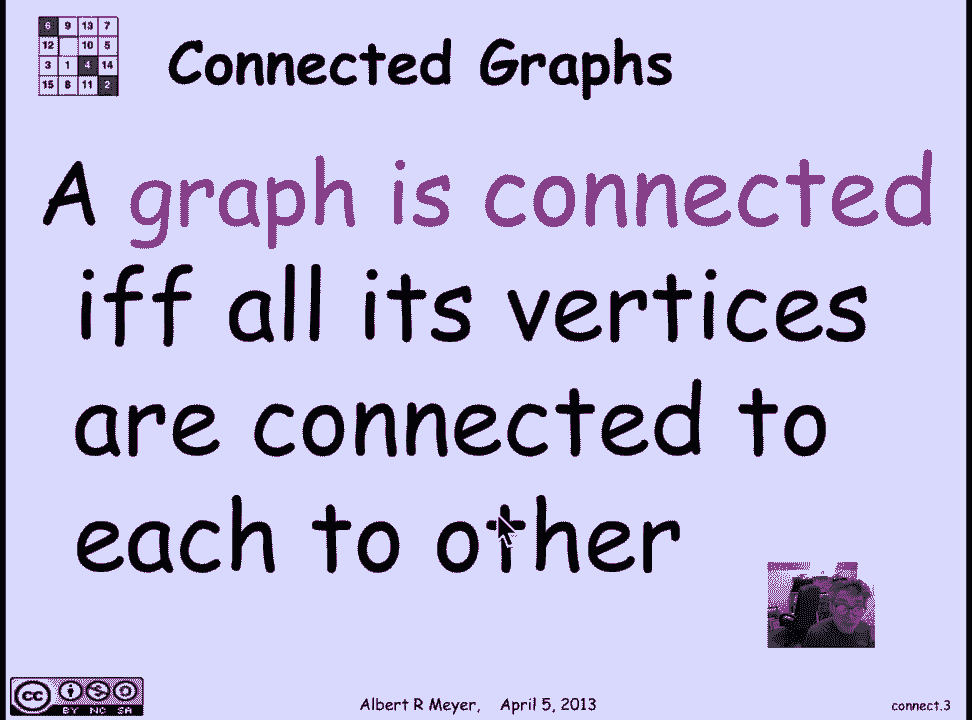
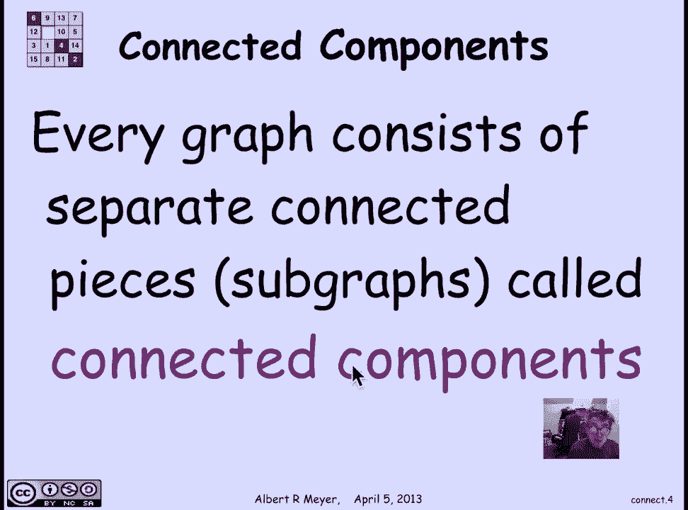
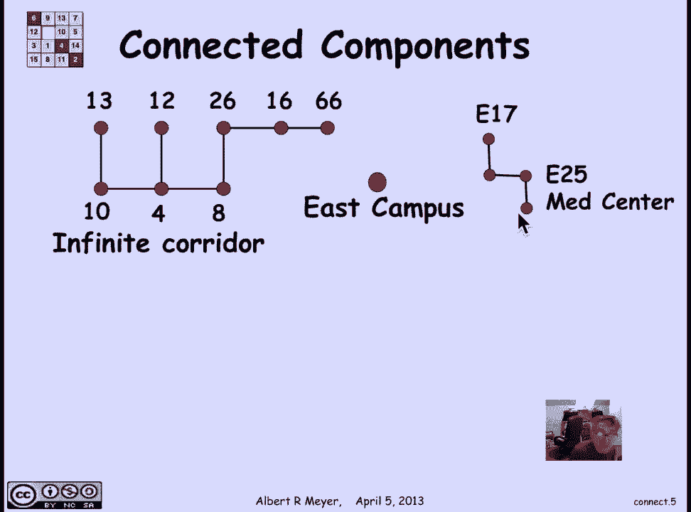
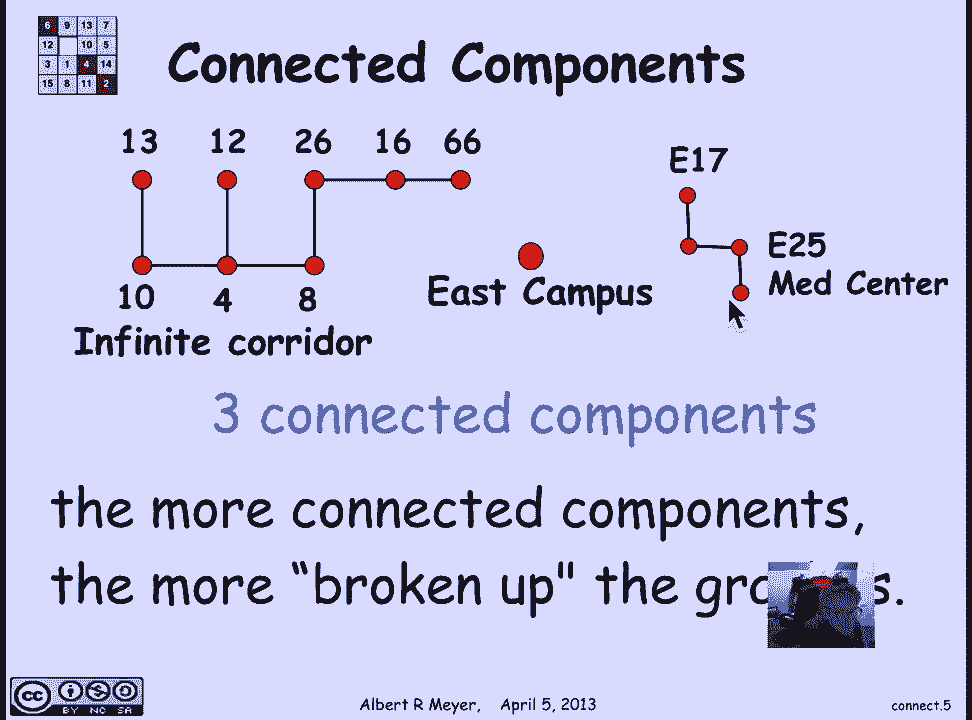
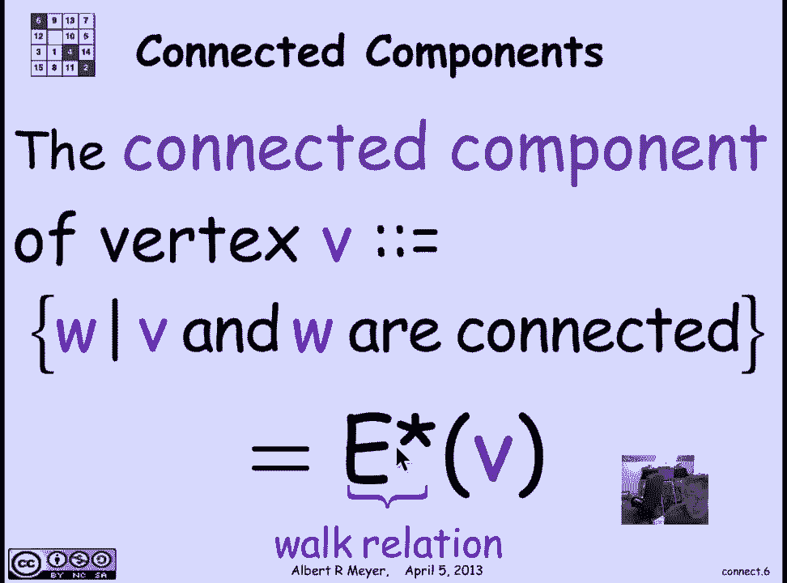
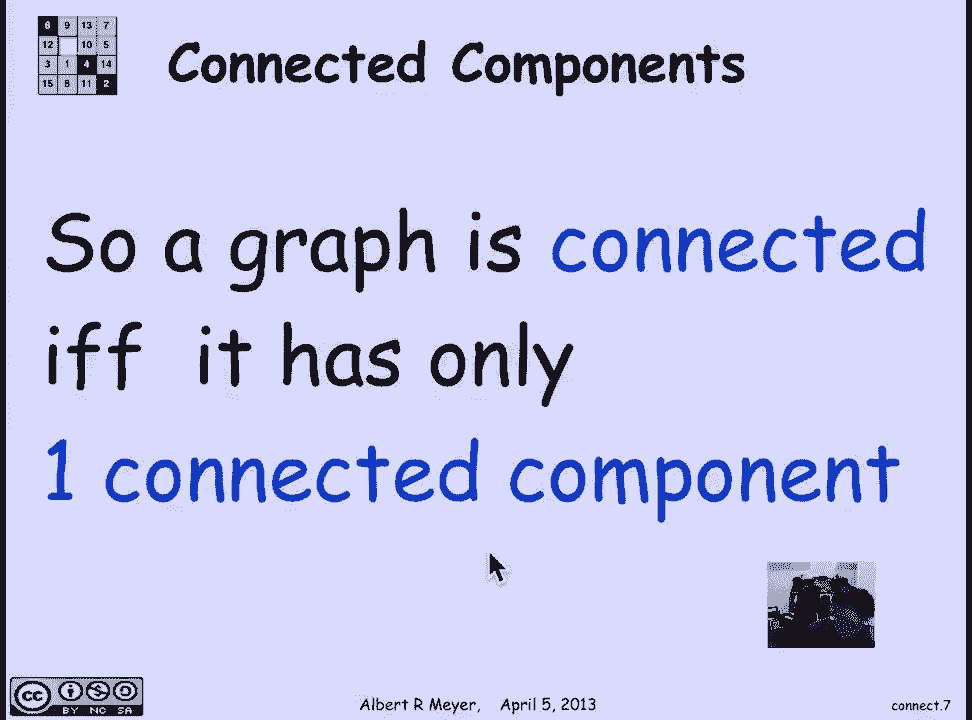

# 计算机科学的数学基础：L2.9.3：图的连通性 🔗

在本节课中，我们将要学习图论中的一个核心概念——连通性。我们将从关系语言转向图论语言，以便更好地讨论路径和连接。本节将介绍顶点和图的连通性定义，以及连通分量的概念。

## 从关系到图论

上一节我们介绍了图的基本概念。本节中我们来看看如何描述图中顶点之间的连接关系。从关系语言切换到图论语言的核心目的，是为了能够讨论路径和连通性。

## 顶点连通性

在简单图或有向图中，两个顶点被认为是连通的，当且仅当它们之间存在一条路径。在有向图中，路径具有方向；在简单图中，路径没有方向。因此，如果顶点A与顶点B连通，那么顶点B也与顶点A连通，这是一种对称关系。

**定义**：两个顶点连通当且仅当它们之间存在一条路径。这等价于说它们之间存在一条游走。我们包括长度为0的路径（即零步游走），因此每个顶点都被认为与自身连通。

## 图的连通性

一个图被称为是连通的，当且仅当它的所有顶点都彼此连通。这意味着从图中的任意一个顶点出发，都可以通过路径到达其他任何顶点。

## 连通分量

并非所有图都是连通的。任何图都可以被分解为若干个相互连通的子图，这些子图被称为它的连通分量。

以下是连通分量的一个简单示例：

考虑麻省理工学院（MIT）建筑之间的连接关系。如果两栋建筑之间有门或走廊相连，我们就在它们之间画一条边。

*   建筑10和建筑4之间有走廊。
*   建筑10和建筑12之间没有直接连接，要到达12必须经过4。
*   东校区（East Campus）与任何建筑都不相连，因此它是一个孤立的顶点。
*   医疗中心（Medical Center）的E17和E25等四栋建筑按指示连接，但与东校区或主长廊（Infinite Corridor）完全不相连。

这是一个图，但它不是三个独立的图。它是一个包含三个部分的图，因此它有三个连通分量。

一般来说，一个图的连通分量越多，它就越“破碎”。这是一个便于记忆的方式。

## 连通分量的形式化定义

顶点V的连通分量，简单地定义为所有与V连通的顶点W的集合。观察这些连通分量，它们实际上定义了顶点集上的一个等价关系。因为连通分量是该等价关系的一个块，也是与该等价关系相关的划分的一个块。

另一种定义方式是：与V连通的顶点W的集合，就是顶点V在图G的“游走关系”下的像。我们用 `E*` 表示图G的游走关系，其中边集E包括所有长度大于等于0的游走（包括长度为0的游走）。

因此，一个图是连通的，意味着它实际上只有一个连通分量。

## 总结

本节课中我们一起学习了图的连通性。我们定义了顶点之间的连通关系，并由此引出了连通图的概念。对于非连通图，我们介绍了其分解为若干连通分量的方法，并给出了连通分量的形式化定义。理解连通性是分析图结构的基础，在后续课程中，我们将利用这些概念解决更复杂的问题。