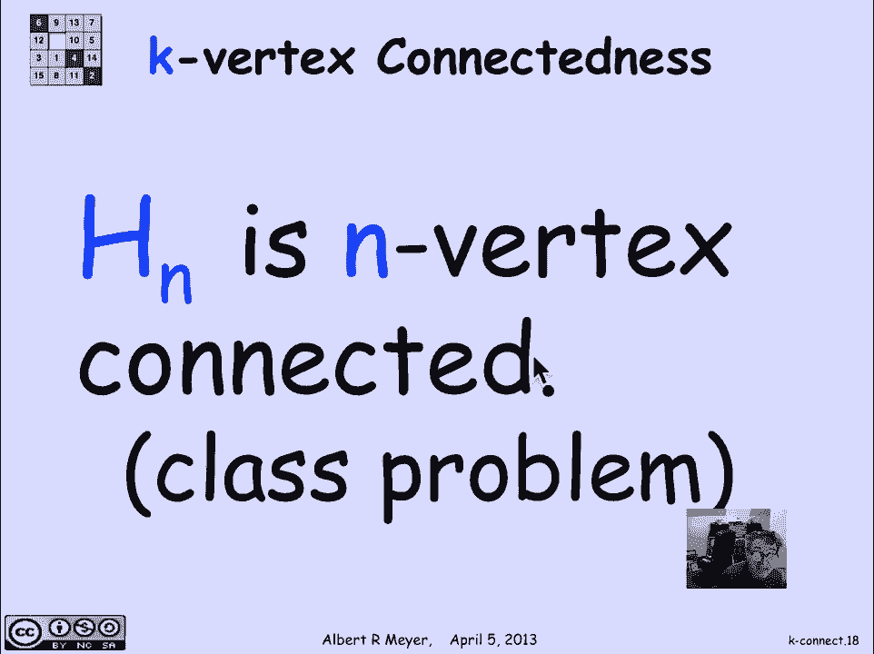
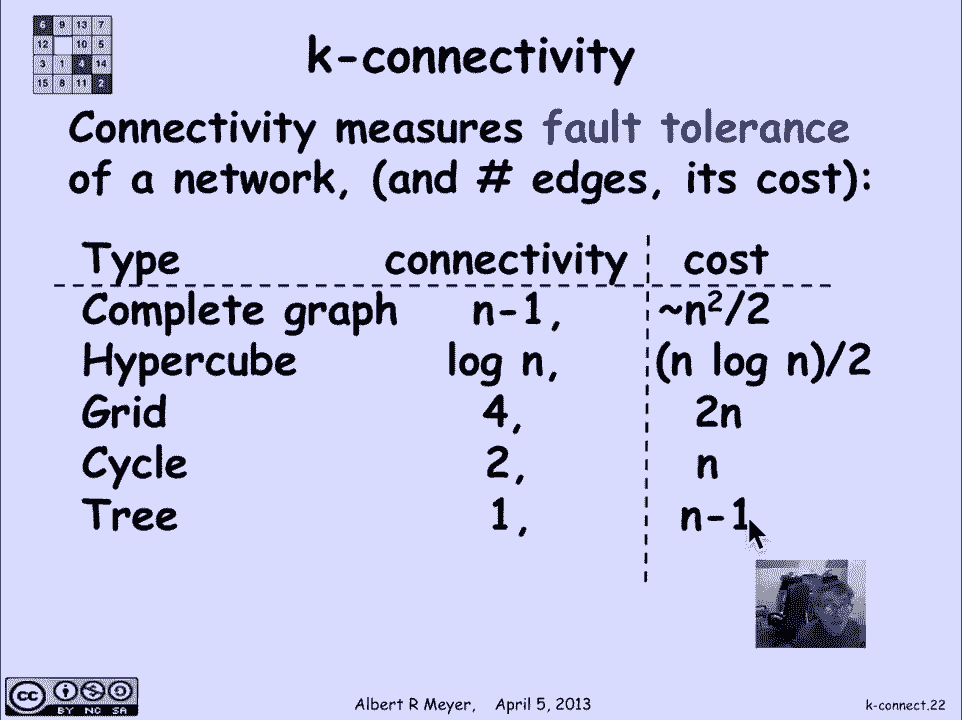

# 图论基础：2.9.4：k-连通性 📊

在本节课中，我们将要学习图连通性的量化概念——k-连通性。连通性并非简单的“连通”或“不连通”，我们可以精确地描述一个图或一对顶点之间的连接强度。本节将介绍边连通性和顶点连通性的定义，并通过实例和常见图结构来加深理解。

## 边连通性

上一节我们介绍了图的基本连通性，本节中我们来看看如何量化这种连通强度。首先，我们定义两个顶点之间的边连通性。

两个顶点被称为 **k-边连通** 的，如果从图中删除少于 `k` 条边后，这两个顶点之间仍然保持连通。

以下是几个例子，用于说明这个概念：

*   **1-边连通**：考虑图中两个品红色的顶点。它们是连通的，但如果删除特定的某一条边，它们就会变得不连通。因此，它们是1-边连通的，但不是2-边连通的。
*   **2-边连通**：考虑图中两个绿色的顶点。你可以删除任意一条边，它们之间仍然存在路径。但如果你删除特定的两条边，它们就会变得不连通。因此，它们是2-边连通的。
*   **3-边连通**：考虑图中两个紫色的顶点。你可以删除任意两条边，它们仍然保持连通。这是因为它们位于两个环中，要断开连接需要切断两个环，即至少需要删除两条边。然而，删除三条特定的边后，它们就会变得不连通。因此，它们是3-边连通的，但不是4-边连通的。

对于一个**整个图**，如果其中任意两个顶点都是 **k-边连通** 的，那么这个图就是 **k-边连通** 的。

## 顶点连通性

与边连通性相对应，我们还有顶点连通性的概念。

一个图是 **k-顶点连通** 的，如果删除图中任意少于 `k` 个顶点后，该图仍然保持连通。

需要指出的是，如果一个图是 **k-顶点连通** 的，那么它必然也是 **k-边连通** 的，但反之则不一定成立。例如，一个图可能是2-边连通的，但却是1-顶点连通的（删除某个特定顶点就会破坏连通性）。

## 连通性的意义与应用

连通性度量了网络的**容错能力**。如果将图视为一个通信网络，顶点代表信息中心，边代表连接中心的信道或电缆，那么连通性就衡量了：在多少条信道或电缆发生故障的情况下，所有信息中心之间仍然能够保持通信。

## 重要定理与图结构

在深入探讨具体图结构之前，我们先提及一个重要的定理——**门格尔定理**。该定理指出：一个图是 **k-顶点连通** 的，当且仅当图中任意两个顶点之间都存在 `k` 条**完全不相交**的路径（即路径之间没有共享的顶点）。边连通性也有一个类似的定理。这些定理直观地说明了，为了断开两个高度连通的顶点，你需要切断它们之间的每一条独立路径。

接下来，我们看看一些常见图结构的连通性。我们关心的是：要达到特定的连通级别，需要多少条边（这可以看作是构建网络的成本）。

以下是几种常见图结构的连通性与边数对比：

*   **完全图 `K_n`**：这是 `n` 个顶点上连通性最强的图。它是 **(n-1)-顶点连通** 的，但需要大约 `n^2/2` 条边。公式表示为：`边数 = C(n, 2) = n(n-1)/2`。
*   **n维超立方体 `H_n`**：它的顶点是长度为 `n` 的二进制串，两个顶点相邻当且仅当它们的二进制表示仅有一位不同。`H_n` 是 **n-顶点连通** 的。对于一个具有 `N` 个顶点的超立方体（即 `H_{log_2 N}`），其边数约为 `(N log_2 N)/2`。它比完全图的边数少得多，但连通性也显著降低。
*   **网格图**：可以想象为平面上的整数坐标点阵，每个点与上下左右四个相邻点连接。一个有限大小的网格（通常通过将边界环绕起来形成一个环面）是 **4-边连通** 的，边数约为 `2N`（`N` 为顶点数）。
*   **环 `C_n`**：一个包含 `n` 个顶点的环是 **2-边连通** 的，恰好有 `n` 条边。
*   **树**：树是边数最少的连通图。一棵有 `n` 个顶点的树恰好有 `n-1` 条边，并且是 **1-边连通** 的（删除任何一条边都会使其变得不连通）。

## 总结

本节课中我们一起学习了图连通性的量化指标——k-连通性。我们定义了**k-边连通性**和**k-顶点连通性**，理解了它们如何衡量网络在边或顶点发生故障时的**鲁棒性**。我们还通过门格尔定理了解了连通性与不相交路径数之间的等价关系，并分析比较了完全图、超立方体、网格、环和树等常见图结构的连通性水平及其所需的边数代价。掌握这些概念有助于在设计通信网络、分布式系统等需要高可靠性的结构时做出合理的选择。