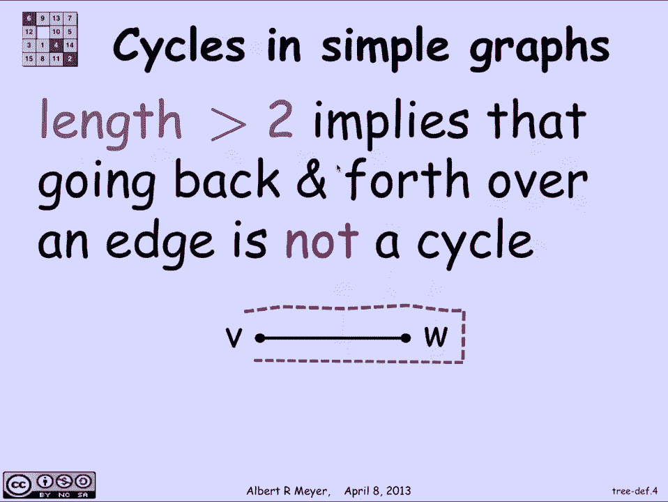
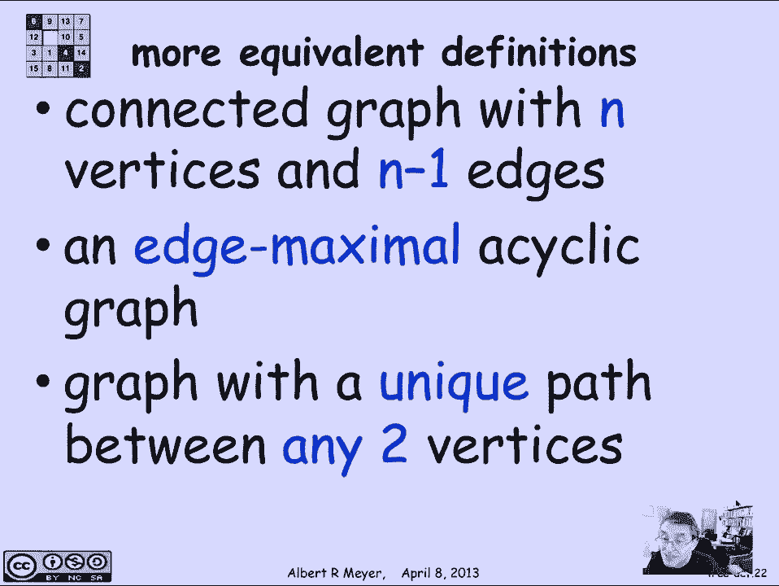

# 计算机科学的数学基础：L2.10.1：树 🌳

在本节课中，我们将要学习计算机科学中最基本的数据结构之一：**树**。树是一种连通且无环的简单图，它广泛应用于家谱、搜索算法、游戏策略和编译器技术等多个领域。本节课我们将探讨树的定义、性质以及多种等价的描述方式。

## 树的定义与基本概念

上一节我们介绍了图的基本概念，本节中我们来看看一种特殊的图——树。树的最简单定义是：**树是一个连通且没有循环（环）的简单图**。这里的“简单图”指的是无向、无自环且每对顶点之间最多只有一条边的图。

为了准确理解这个定义，我们需要明确“循环”的含义。在简单图中，一个**循环**是一条长度大于2的封闭步道，且除了起点和终点相同外，路径上的所有顶点都互不相同。长度必须大于2的规定，排除了自环和长度为2的“来回边”，这些在简单图中不被视为有意义的循环。

以下是树的几个示例：

*一个没有圈的简单图示例。*

*另一个树状结构的示例。*

## 树的性质与等价定义

理解了基本定义后，我们来看看树有哪些关键性质，以及如何用不同的方式来描述它。这些等价定义在理论和实践中都非常有用。

**切边与循环的关系**
在简单图中，一条边被称为**切边**，如果移除这条边会使图变得不连通（即原来通过这条边连接的两个顶点之间不再有路径）。切边与循环有紧密联系：**一条边不是切边，当且仅当它包含在某个循环中**。因为如果一条边在循环中，移除它后，循环上的顶点仍可通过循环的另一半保持连通。

**树的等价定义**
基于切边的概念，我们可以得到树的第一个等价定义：**树是一个连通图，其中每一条边都是切边**。这意味着从树上移除任何一条边都会破坏其连通性。

由此可以推导出第二个定义：**树是边数最少的连通图**。换句话说，它是一个“边最小连通图”。为了让所有顶点都连通，树提供了所需的最少边数。

对于有 `n` 个顶点的树，其边数恰好为 `n-1`。这引出了第三个等价定义：**树是一个具有 `n` 个顶点和 `n-1` 条边的连通图**。

从另一个角度看，树也可以被描述为**极大无环图**。一个无环图可能不连通，但你可以不断添加边将其连通而不产生循环。当它成为一棵树（即完全连通）时，你就不能再添加任何边而不形成循环了。

也许最直观有用的定义是：**树是一个在任意两个顶点之间存在唯一路径的图**。连通性保证了路径的存在，而唯一性则排除了循环的可能性，因为两个不同的路径会构成一个环。

以下是这些等价定义的总结：

*   **定义一**：连通且无环的简单图。
*   **定义二**：每条边都是切边的连通图。
*   **定义三**：具有 `n` 个顶点和 `n-1` 条边的连通图。
*   **定义四**：边数最少的连通图（边最小连通图）。
*   **定义五**：极大无环图（无法再添加边而不产生环的连通无环图）。
*   **定义六**：任意两顶点间存在唯一路径的图。

*树的结构示意图。*

## 总结

本节课中我们一起学习了**树**这一基本数据结构。我们从其核心定义——连通无环图出发，探讨了循环与切边的概念，并学习了描述树的多种等价方式。理解这些不同的视角，能帮助我们在不同场景下更灵活地识别和应用树结构。树因其简洁和高效的结构，成为组织与连接信息的基石。