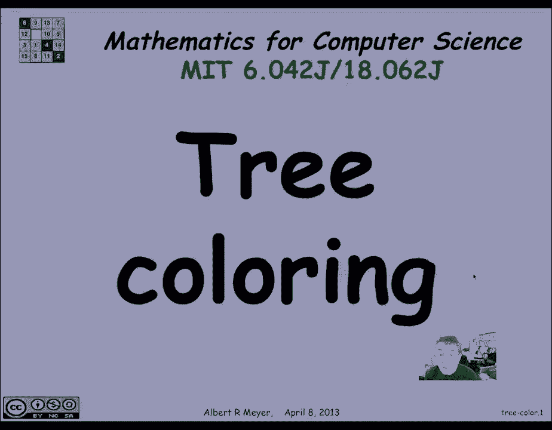
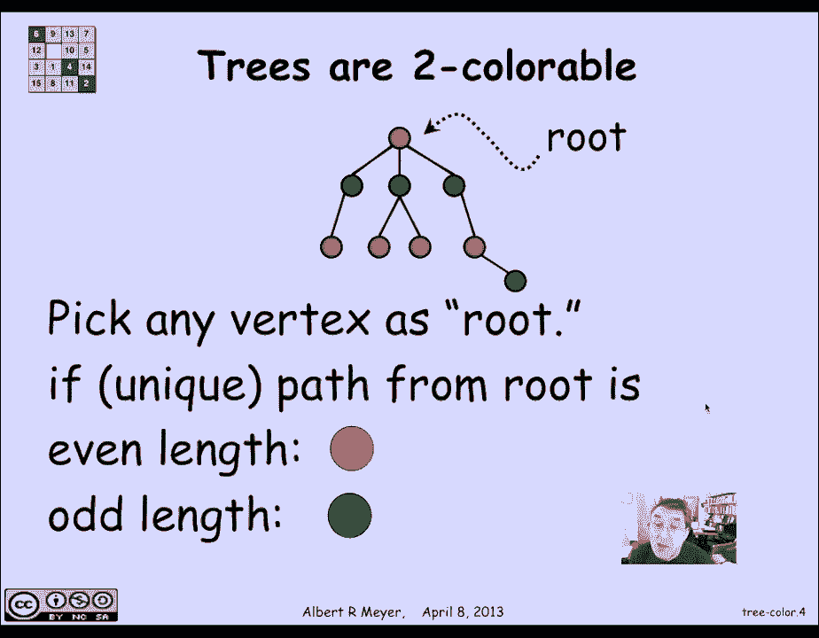

# 计算机科学的数学基础：L2.10.3：树的着色 🌳

在本节课中，我们将学习图论中一个重要的概念：树的着色。我们将看到，任何具有两个或更多顶点的树，其色数都是2。这意味着我们可以仅用两种颜色为树的所有顶点着色，并保证任何相邻的顶点颜色都不同。

## 概述

树是一种特殊的图，其特点是任意两个顶点之间都存在**唯一的一条路径**。我们将利用这个“唯一路径”的特性，来证明树的色数为2，并学习一种简单有效的着色方法。

## 树的色数为2

上一节我们介绍了树的结构特性。本节中我们来看看如何为树着色。

我们知道，树是一个图，在每对顶点之间有唯一的路径。因此，具有两个或多个顶点的树的色数为2。证明就是演示如何给它着色。

显然不能用一种颜色，因为树中至少有两个相邻的顶点。两种颜色的着色方式如下：首先选择一个任意的顶点，称之为**根**。你可以任意选择根是什么。

每个顶点都有一条从根到该顶点的**独特路径**。我们利用这种唯一的路径表征来给顶点着色。

## 基于路径长度的着色算法

以下是具体的着色步骤：

1.  选择一个顶点作为根。
2.  对于图中的每一个其他顶点，计算从根到该顶点的路径长度。
3.  如果路径长度是**偶数**，则将该顶点涂成红色。
4.  如果路径长度是**奇数**，则将该顶点涂成蓝色（或绿色）。

这样，我们最终会交替使用红色和蓝色。关键在于，任何两个相邻的节点，它们到根的路径长度之差为1。因此，一个距离是奇数，另一个距离是偶数，从而保证了它们的颜色不同。这就是这种着色方法会奏效的原因。

## 判断图是否可二着色的通用方法

两种颜色着色（即可二着色）的一个通用性质是：判断一个图是否可二着色，可以采用以下方法：

1.  开始选择一个任意的顶点，给它涂上一种颜色（例如红色）。
2.  然后把它所有相邻的顶点都涂成另一种颜色（例如绿色）。
3.  继续这个过程，始终用与相邻顶点不同的颜色给新顶点着色。
4.  如果你在着色过程中没有被“卡住”（即不会出现需要给一个顶点涂色，但其相邻顶点已使用了所有可用颜色的矛盾情况），那么这个图就是可二着色的。
5.  如果图不是可二着色的，你在着色过程中肯定会遇到矛盾而被卡住。

所以这是一个很简单的方法来计算一个图是否可二着色。

## 可二着色的另一个特征

可二着色性的另一个特征是：一个图是可二着色的，**当且仅当**它所包含的所有环（如果存在的话）的长度都是**偶数**。

当然，树没有环，这从另一个角度解释了为什么所有树都是可二着色的。

## 总结

本节课中我们一起学习了树的着色。我们了解到，利用树中“任意两顶点间路径唯一”的特性，可以通过基于根节点路径长度的奇偶性，用两种颜色为树完成有效着色。我们还学习了判断一般图是否可二着色的简单方法，以及可二着色与图中环的偶数长度之间的关系。