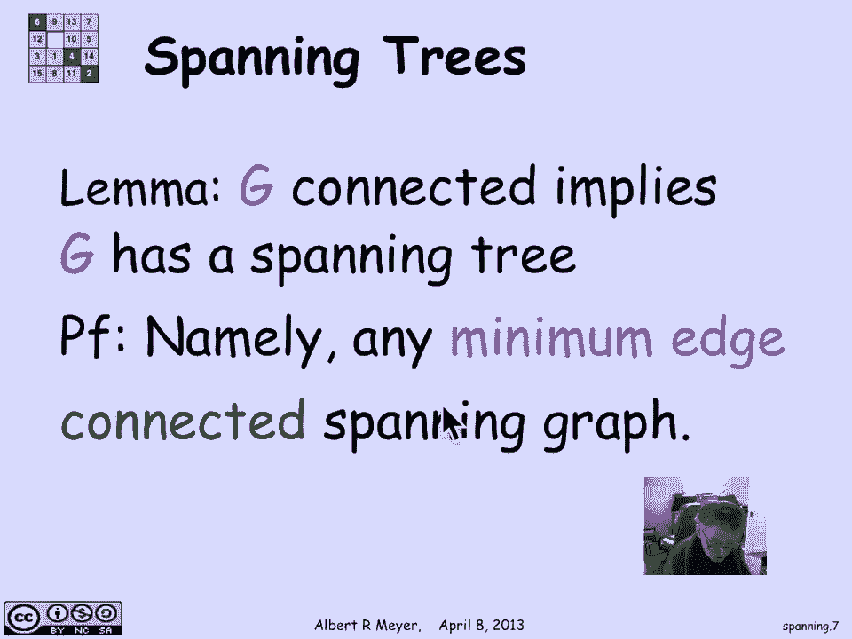
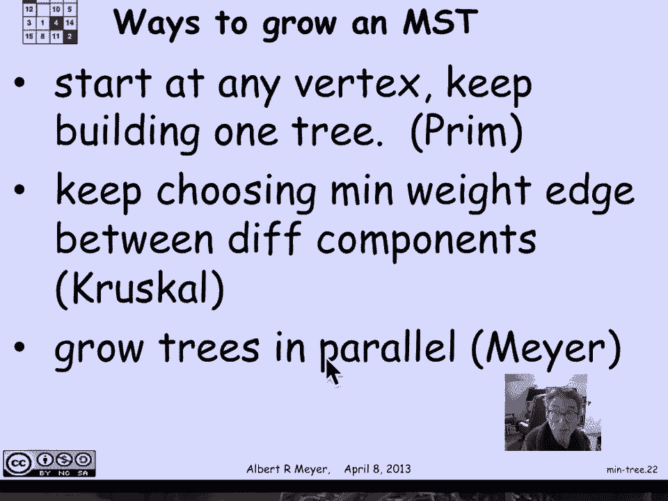

# 计算机科学的数学基础：2.10.5：生成树 🌳

在本节课中，我们将学习图论中的一个核心概念——生成树。我们将了解生成树的定义，并学习如何在带权重的图中寻找最小权重生成树。

## 生成树的定义

上一节我们介绍了树的概念。树有多种定义，其中一种定义是：树是连接一组顶点的最小边集。这引出了在简单图中寻找生成树的想法，生成树能保持原图相同的连接性。

首先，我们给出一个精确的技术定义。图 `G` 的**生成子图**，是指一个包含 `G` 所有顶点的子图。子图意味着它包含原图顶点的一个子集和边的一个子集。而生成子图则包含所有顶点，但只是边的一个子集。

**生成树**的定义是：一个本身是树的生成子图。并非所有图都有生成树，因为树必须是连通的。如果原图不连通，则无法仅使用原图中的边找到一个生成树。但可以证明，如果图是连通的，则它**保证**存在一个生成树。

让我们看一个例子。这里有一个简单图，我们想要找到一个生成树，即一个边的选择，它连接所有顶点，并且只使用原图中的边，同时这些边构成一棵树。这就是一个生成树。图中用洋红色高亮显示的边定义了一棵树，我没有使用原图中的三条边。

这个特定的生成树选择是任意的。通常，一个图会有很多生成树。这是另一个例子，这次用的是绿色边。同样，我只使用了原图中的边，省略了三条不同的边，并使用另一组边来形成树。它没有环，并且“生成”了整个图，因为图中的每个顶点都是它的一部分。当然，它是连通的，因为它是一棵树。

实际上，有一些优美的组合理论，可以让你在给定图的邻接矩阵后，不太困难地计算出简单图中生成树的数量，但我们暂时不深入探讨。

## 连通图与生成树的存在性

第一个要点是：**每个连通图都有一个生成树**。原因很简单：你只需选择一个最小边数的连通生成子图。如果图 `G` 本身是连通的，根据定义，它本身就是自己的一个生成子图，因为它包含所有自己的顶点。根据良序原理，在所有连通生成子图中，存在一个具有最小边数的子图。由于它具有最小边数，它保证是一个生成树。

## 最小权重生成树

当问题具有更多结构时，会变得更有趣。我们不只是想找一个边数最少的生成树，在实际应用中，边通常带有**权重**，而我们希望找到一个**最小权重生成树**。

这里有一个例子，我们有一个简单图，包含一些顶点和边，每条边都被赋予了一个整数权重。这种带权图的动机可以理解为：权重表示从一个顶点直接运输某种商品到另一个顶点的成本，或者表示信号通过该信道传输所需的时间。简单图常用于模拟不同地点之间的通信问题，而信道和连接通常具有不同的成本。一个很自然的问题是：在所有能让我以相同方式将所有事物连接起来的树结构中，哪种树结构的总体成本最低？即使某些边失效，我仍然希望拥有最便宜的树来连接所有顶点。

## 构建最小权重生成树的算法

有一种相当简单的方法来构建这样的最小权重生成树，这就是我们现在要讨论的：如何找到它？其思想是使用**灰色边**来构建它。

这意味着，从顶点开始，我们将开始构建一棵树。在任何时刻，我们都有一组将成为我们生成树一部分的边。这些边之间没有环，它们被称为**森林**，但尚未完全连通。在这个过程的每个阶段，我们将查看当前图（即我们已选择的边集）的连通分量，并将它们涂成黑色或白色，然后查看灰色边。

**灰色边**的定义是：一个端点为黑色，另一个端点为白色的边。在构建生成树的过程中，我将查看所有灰色边，并选择一条权重最小的灰色边。

让我们通过一个例子来弄清楚这个过程。

*   **初始状态**：开始时，我没有任何边，只有孤立的顶点。这意味着我有六个连通分量，每个分量都是一个没有边的单个顶点。我可以任意将它们涂成黑色和白色。唯一的限制是必须至少有一个黑色分量和一个白色分量。这里我选择了一种任意的着色：两个顶点为白色，其他四个为黑色。
*   **识别灰色边**：在这个特定着色下，灰色边被加粗显示。例如，连接黑色和白色顶点的边是灰色边；连接两个白色或两个黑色顶点的边则不是。
*   **选择最小权重灰色边**：在我的灰色边中，权重分别是 4, 4, 9, 7 和 2。权重 2 是最小的灰色边权重，所以我选择那条边开始构建我的树。
*   **更新状态并重新着色**：一旦我选择了那条洋红色边，我现在有一个包含五个分量的图：由这条边定义的两个顶点的分量，以及其他四个仍然没有边连接的孤立顶点。根据规则，我可以对这五个分量重新着色，只要这个新分量内的所有顶点颜色相同。这里我将这个新分量内的两个顶点都涂成黑色，其他四个孤立顶点可以任意着色。这是我的新着色。
*   **重复过程**：有了这个新的着色，我可以继续识别灰色边。这次只有两条灰色边，因为我选择只有一个白色顶点。两条灰色边的权重分别是 3 和 4。最小权重是 3，所以这将是我正在构建的最小权重生成树中的下一条边。
*   **继续迭代**：我继续这个过程：识别当前森林的连通分量，为每个分量分配一种颜色（同一分量内所有顶点颜色相同），找出连接不同颜色分量的所有边（灰色边），选择其中权重最小的边加入森林，然后更新状态。最终，我会得到一棵最小权重生成树。

我还没有讨论为什么这个算法有效，这在课程笔记中有解释，但我们暂时搁置，先专注于应用这个算法。

## 生成树算法的变体

现在有几种方法来“生长”一棵最小权重生成树。

以下是几种常见的方法：

*   **Prim算法**：一种方法是从任意一个顶点开始，然后围绕该顶点不断构建。你从该顶点开始，将其涂黑，其他所有顶点涂白。这意味着所有灰色边都将连接到该顶点。选择一条权重最小的灰色边。现在你有一个包含两个顶点的分量，将其涂黑，其他所有顶点涂白。通过这种方式，你始终处理一个分量，总是将其涂成一种颜色，而其他所有顶点涂成另一种颜色，从而使其不断增长。这种方法被称为**Prim算法**。
*   **Kruskal算法**：另一种方法是在所有不同的连通分量中全局地找到一条权重最小的边。这意味着你在所有连通分量之间找到权重最小的边。确定该最小权重边后，你可以将其一个端点所在分量涂黑，另一个端点所在分量涂白。这将符合我们在不同颜色分量之间选择最小权重边的过程。这就是**Kruskal算法**。
*   **并行生长**：最后，你可以并行地生长多棵树。你可以从每个连通分量开始，选择连接该分量的最小权重边，因为你可以总是将一个连通分量涂成一种颜色，而将其他边涂成另一种颜色，这样所有接触给定分量的边在该着色下都是灰色的，你可以选择其中权重最小的边来增长该分量。如果这些分量彼此距离不太近，以至于边的选择不会冲突，你就可以并行地生长这些树。我开玩笑地称之为“Myers过程”。

## 总结

本节课中，我们一起学习了生成树的概念。我们了解到，生成树是包含原图所有顶点且本身是一棵树的子图，并且每个连通图都至少有一个生成树。当图中的边带有权重时，寻找最小权重生成树是一个重要问题。我们介绍了一种通用的构建算法，其核心思想是迭代地选择连接不同颜色分量的最小权重边（灰色边），并讨论了该算法的几种具体实现，包括Prim算法和Kruskal算法。