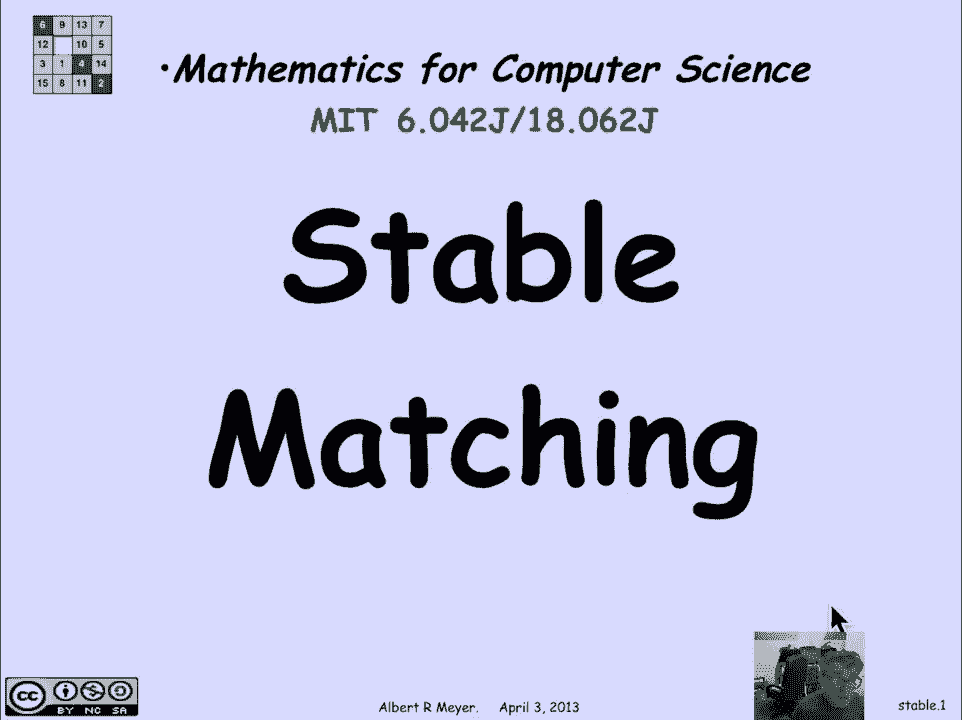
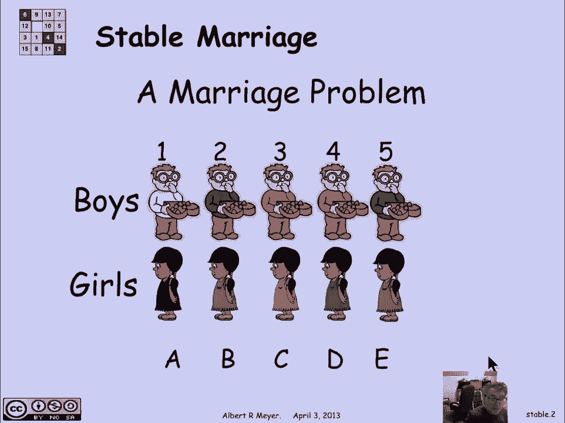
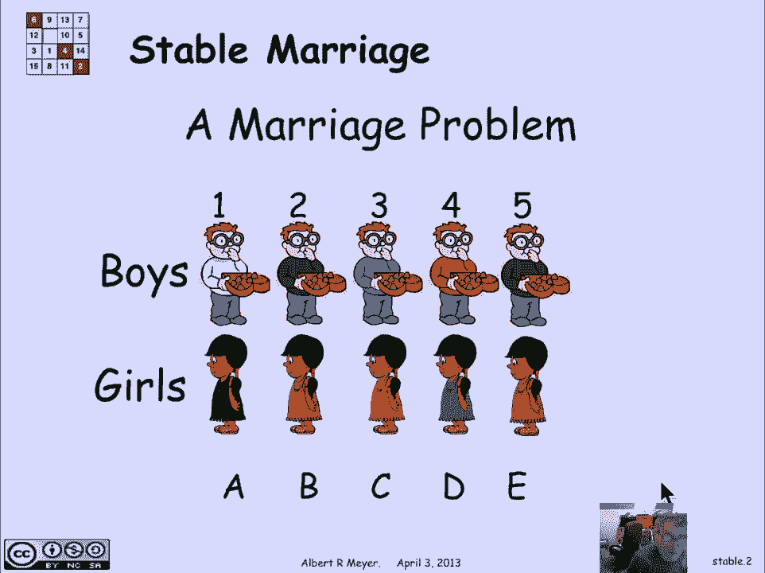
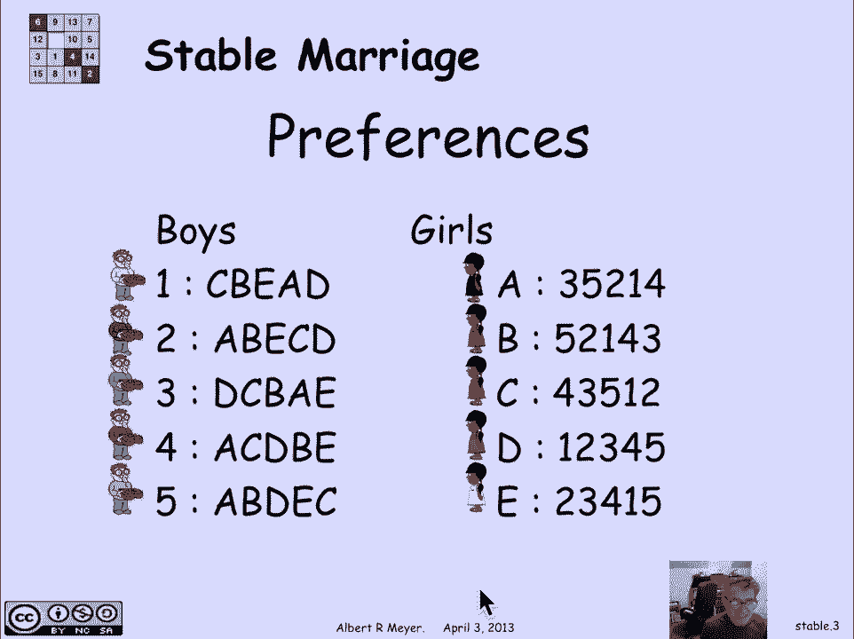
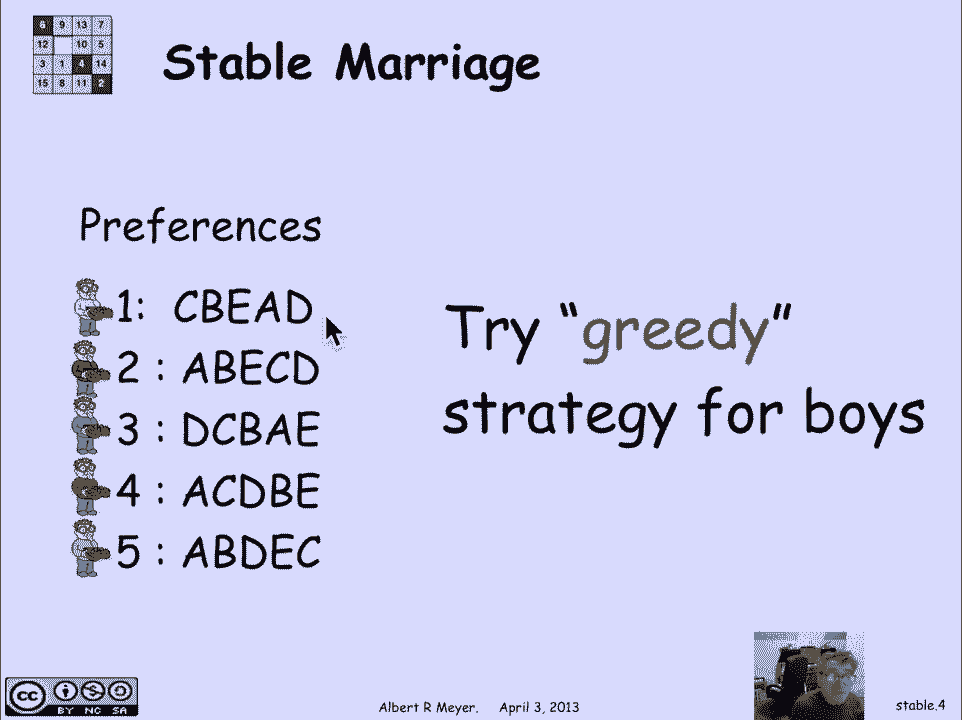
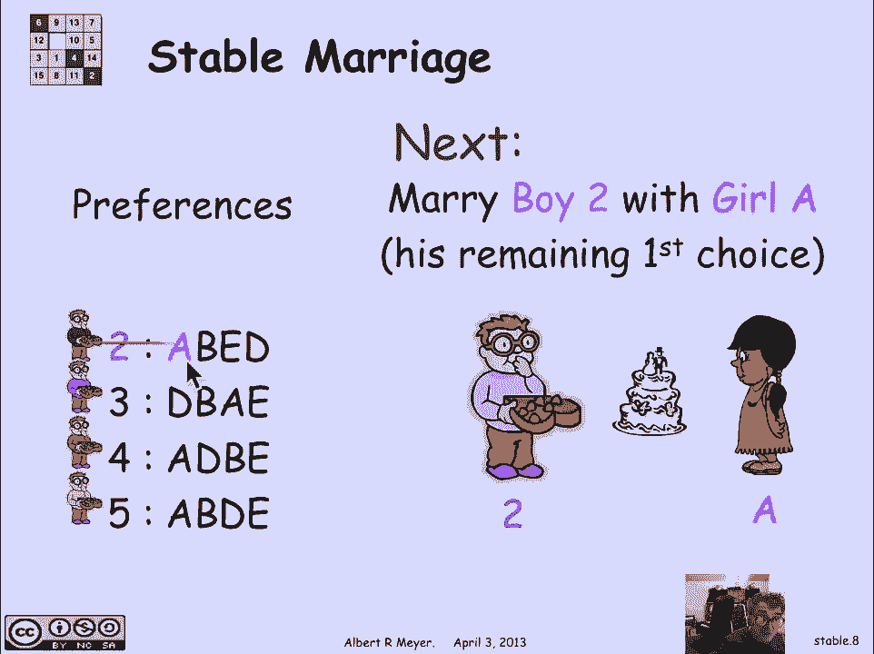
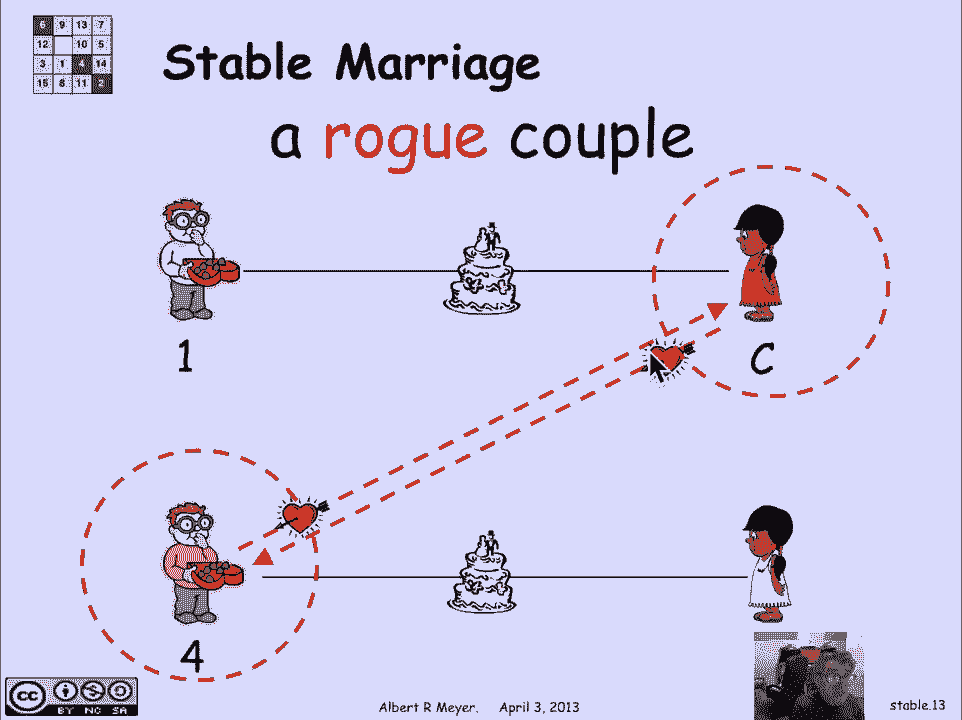
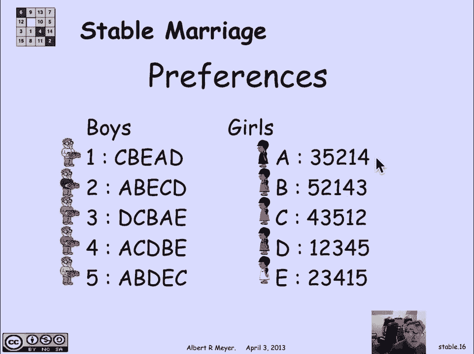
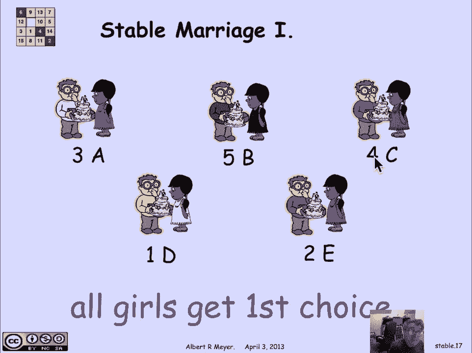
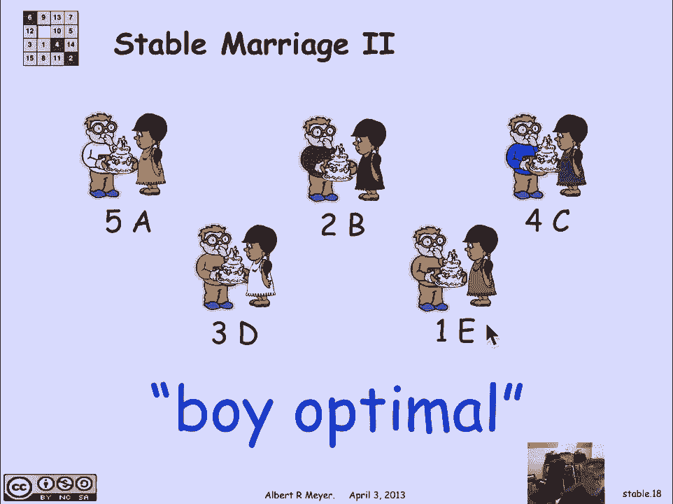

# 计算机科学的数学基础：L2.11.1：稳定匹配问题 🎯

在本节课中，我们将学习一个经典的组合优化问题——**稳定匹配问题**。我们将了解其定义、一个直观但不稳定的贪心匹配示例，以及该问题在现实世界中的广泛应用。

---

## 问题定义与动机

我们之前已经见过涉及男孩和女孩及其之间连接的图。在人口统计计算的背景下，一个类似的问题出现了，即**稳定匹配**。这同样是一个根据某些约束条件，以特定方式将男孩和女孩进行配对的问题。

事实证明，这个问题拥有许多实际应用，我们将在课程末尾讨论。

让我们先看看问题是什么。设定如下：有一定数量的男孩（本例中为5个，编号1至5）和同等数量的女孩（标记为A至E）。每个男孩对女孩有一个偏好排序（不同男孩的排序不同），同样，每个女孩对男孩也有一个偏好排序（不同女孩的排序不同）。

例如，女孩A最喜欢男孩3，其次喜欢男孩5；而男孩1最喜欢女孩C，最不喜欢女孩D。

问题的核心是：我们希望让所有男孩与所有女孩结婚，形成五对一夫一妻制的婚姻。我们希望以一种模糊的方式考虑这些偏好，并尽可能满足它们。稍后我们会更具体地定义“满足”。

---

## 一个不稳定的贪心匹配尝试

让我们先尝试一个简单的想法来满足人们的偏好。一种方法是这次**优先考虑男孩**。我们尝试一个贪心策略：我们将尝试给每个男孩他可能做出的最佳选择。

我们从男孩1开始，给他他的第一选择——女孩C。我们让他们结婚，然后就不再考虑男孩1和女孩C了。现在我们有一个简化的问题：剩下4个男孩和4个女孩。

我们继续以这种贪心的方式为男孩们配对：接下来给男孩2他剩余选择中的最佳选择，即女孩A，让他们结婚。同样，男孩2和女孩A被排除在考虑之外。

我们继续这个过程，最终得到以下五对婚姻：
*   男孩1 - 女孩C
*   男孩2 - 女孩A
*   男孩3 - 女孩D
*   男孩4 - 女孩B
*   男孩5 - 女孩E

现在，如果我们审视这组婚姻，会发现一个问题，这也正是推动我们研究稳定婚姻问题的动机。

男孩1娶了他的第一选择女孩C，他应该很高兴，但女孩C可能不高兴。同时，男孩4娶了女孩B。这里的一个困难是，如果我们查看偏好，女孩C对男孩4来说比女孩B更有吸引力。换句话说，男孩4喜欢别人的妻子胜过喜欢自己的妻子。

更糟糕的是，女孩C（别人的妻子）喜欢男孩4胜过喜欢她的丈夫（男孩1）。他们俩如果私奔，都会过得更好。无论他们是否真的私奔，他们都承受着巨大的压力。这使得这组婚姻**不稳定**。

---

## 稳定匹配的核心概念

在一组婚姻中，如果一个男孩和一个女孩**彼此喜欢对方胜过喜欢自己当前的配偶**，他们就被称为一对**私奔情侣**，是**不稳定**的根源。

因此，**稳定婚姻问题**的目标是：看看我们是否能将所有人配对，并且**没有私奔情侣**。这样得到的就是一组**稳定的婚姻**。人们可能并不完全满意，但这没关系，因为他们永远找不到一个同样不满意、并且愿意和他们私奔从而让他们更幸福的人。所以它是稳定的。

事实证明，**总是存在一种方法可以找到一组稳定的婚姻**，甚至不止一种方法。

---

## 寻找稳定匹配的练习

以下是偏好列表的再次展示。你可以暂停视频，在纸上尝试，看看是否能想出一组男孩和女孩之间的稳定婚姻组合。

在课堂上，我们会实时进行这个练习：给5个不同的男孩一张女孩的偏好表，给5个不同的女孩一张男孩的偏好表。他们不应该告诉对方自己的偏好是什么，但女孩们应该面试男孩，男孩们同时面试女孩，试图达成婚约，看看他们最终形成的婚姻组合是否稳定。大多数时候他们确实能得到一组稳定的婚姻，但并非总是如此。这是一个有趣的练习，它也说明了我们将要介绍的寻找稳定婚姻的程序如果并行执行会非常有效。

无论如何，在这个特定的偏好集合中，我们至少可以找到两组稳定的婚姻。

最容易理解的一组是：**所有女孩都得到了她们的第一选择**。如果你查看图表，恰好所有女孩的第一选择男孩都不同。如果我们简单地给她们第一选择，没有女孩会想成为私奔情侣的一部分，因为她已经得到了第一选择。这绝对是稳定的。当然，这是一种非常特殊的情况，所有女孩的第一选择都不同（或所有男孩的第一选择都不同）是不常见的。但如果确实如此，你立刻就能得到一组稳定的婚姻。

另一组稳定的婚姻不那么明显，如下所示：
*   男孩5 - 女孩A
*   男孩1 - 女孩E
*   男孩2 - 女孩B
*   男孩3 - 女孩D
*   男孩4 - 女孩C

你可以检查这些配对中没有不稳定性，这里没有私奔情侣。这是一组所谓的**男孩最优**婚姻。在这组婚姻中，**每个男孩都得到了在所有可能的稳定婚姻中，他能得到的最佳配偶**。没有一组稳定婚姻能让男孩5得到比女孩A更合意的女孩，也没有一组稳定婚姻能让男孩1得到比女孩E更合意的女孩。

令人遗憾的是，这对女孩们来说**同时是最差的**。也就是说，**每个女孩都得到了在所有可能的稳定婚姻中，她们能得到的最差配偶**。我们稍后会进一步探讨这一点。

---

## 稳定匹配的现实应用

这不仅仅是一个谜题。虽然它很有趣，是一个很好的谜题，但它远不止于此。

最初研究并发表这个问题的是Gale和Shapley在1962年的一篇论文。他们处理的是**大学招生**问题：学生对他们申请的大学有偏好排序，大学对申请他们的学生也有排序。我们试图在大学录取和学生偏好之间进行匹配。在那种情况下，大学发出录取通知，学生接受了，但后来学生又收到了更喜欢的学校的录取通知，于是改变主意、撤回接受，等等，这让所有人都抓狂——无论是管理者还是学生自己。大家的愿望是得到一个稳定的录取方案。Gale和Shapley提出了一种获得稳定婚姻的协议，可以应用于大学招生。

有趣的是，尽管Gale和Shapley因我们即将讨论的稳定婚姻解决方案而受到赞誉（他们是第一个发表的），但实际上，这个方案至少早20年就被一个全国性委员会发现并投入实践了，该委员会的工作是**匹配实习医生和医院**。即将开始临床培训（现代语言中称为住院医师）的医学院毕业生需要与医院匹配。住院医师有他们想去的首选医院，医院也有符合他们标准的住院医师排名。同样，问题是如何以稳定的方式将住院医师分配到医院。在他们发现这个稳定性算法之前，情况也是一团糟。

另一个真正的计算机科学应用由Tom Leighton（本教材的合著者，现为Akamai公司的CEO）描述。Akamai是一家拥有大量服务器（2010年约65,000台）的互联网基础设施公司，主要提供缓存的网页以便更快地本地响应。他们面临的问题是：如何将海量的网络请求（类似于“男孩”）分配给服务器（类似于“女孩”或“医院”），以便高效地完成任务。网络请求基于距离和服务器速度有偏好，服务器基于其位置和请求量也有偏好。事实证明，**稳定婚姻方法**为完成这种匹配提供了一种令人满意的方式。特别是由于涉及的数量非常庞大，我们即将描述的稳定婚姻仪式非常适合并行运行。

另一个出现的应用是**匹配舞伴**。大约十年前我教授这门课程时，一位合作讲师是印度舞蹈队的成员，她说她们可以用到这个方法。因为在舞蹈中同样有男孩和女孩舞伴，经常出现一个男孩更喜欢另一个男孩的舞伴，反之亦然的情况，然后他们开始重新配对，让其他人落单，导致关系紧张，成为团队中的破坏性来源。

---

## 总结

本节课中，我们一起学习了**稳定匹配问题**。我们首先通过一个贪心匹配的例子，看到了因“私奔情侣”导致的**不稳定**问题。然后，我们定义了稳定匹配的核心目标：找到一组没有私奔情侣的完美匹配。我们还了解到，对于任何给定的偏好列表，**总是存在至少一个稳定匹配**，并且存在“男孩最优”（同时是“女孩最差”）等特殊性质的匹配。最后，我们探讨了该问题在大学招生、医疗实习匹配、网络服务器分配乃至舞伴配对等多个现实领域的广泛应用，说明了这不仅仅是一个理论谜题，更是一个具有深远实践价值的算法问题。