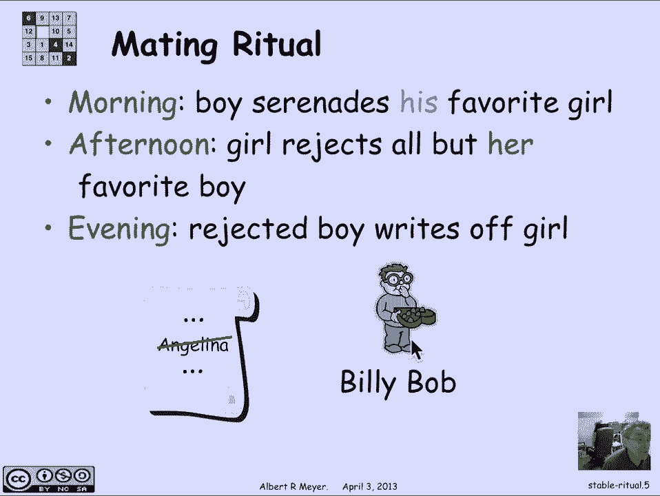
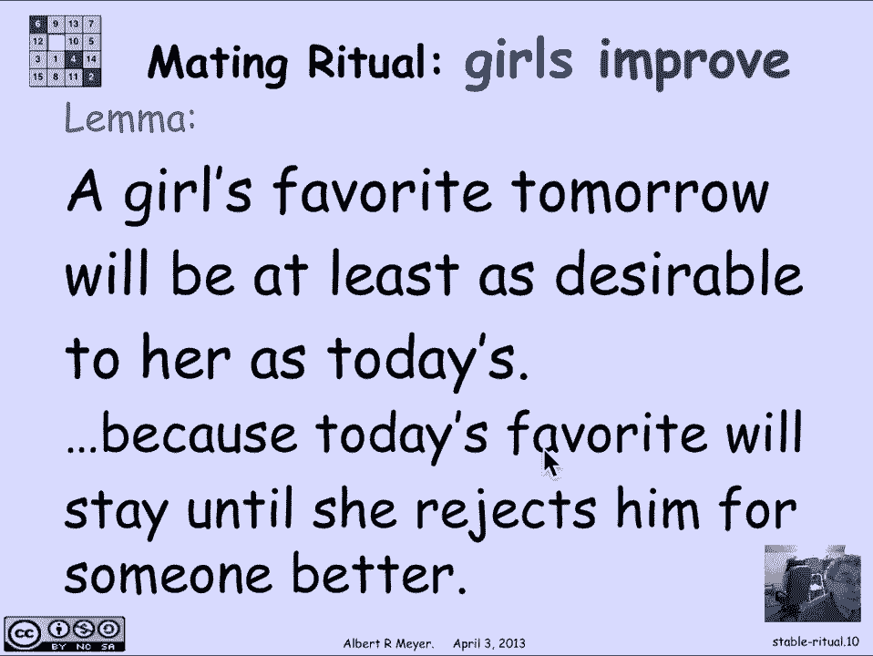
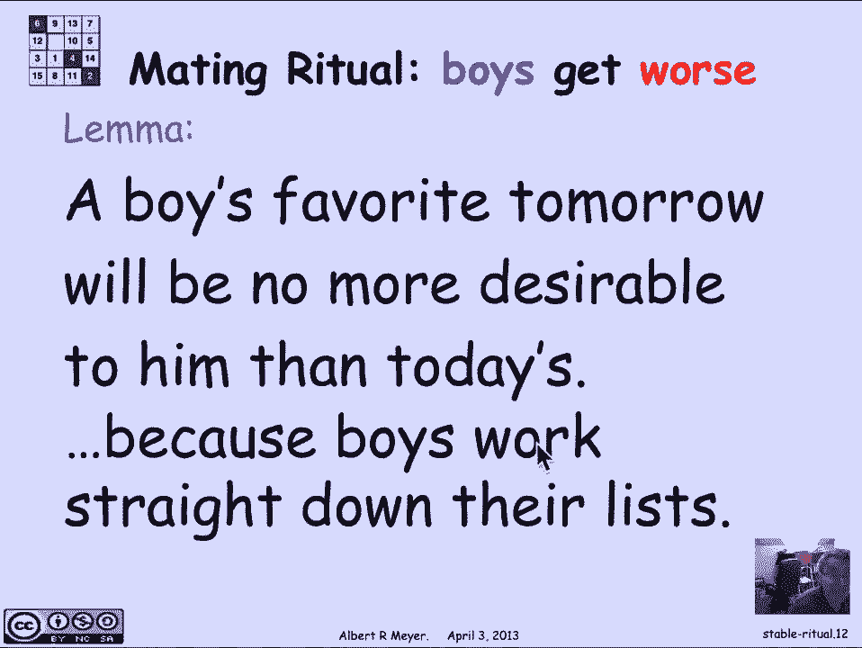
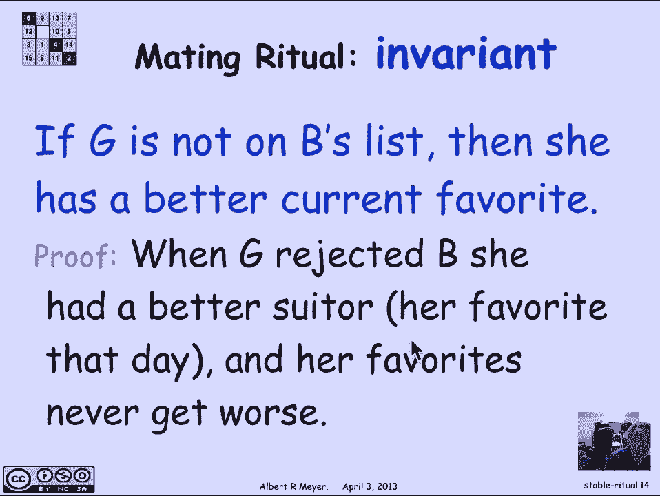
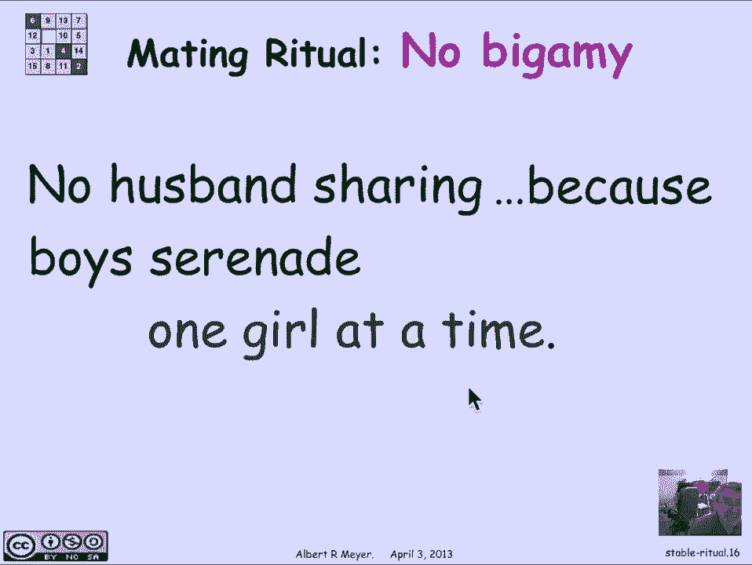
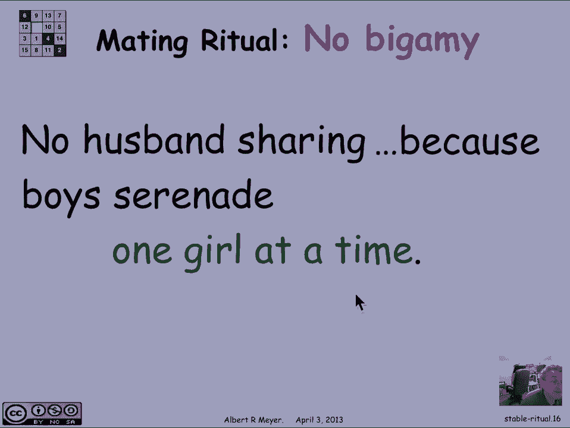
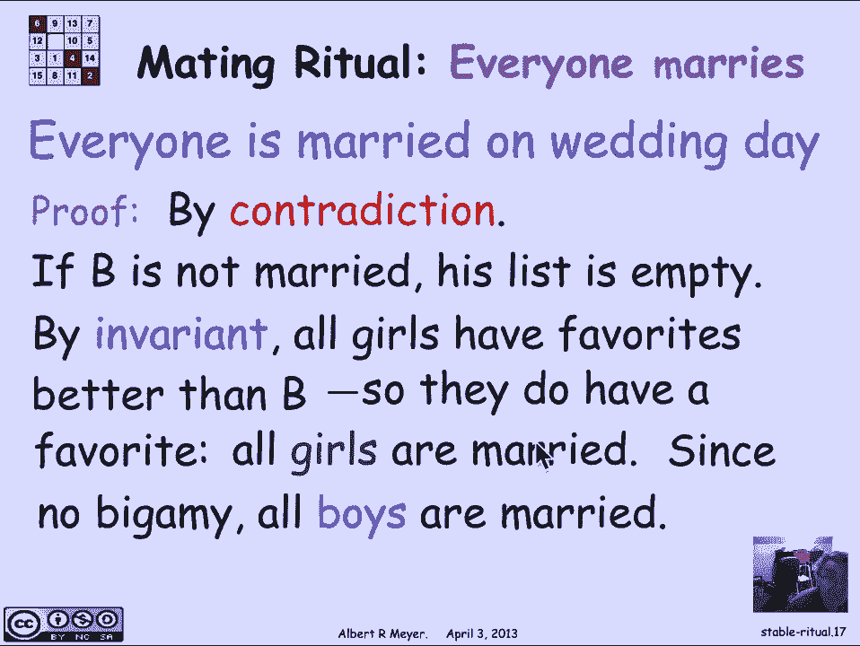
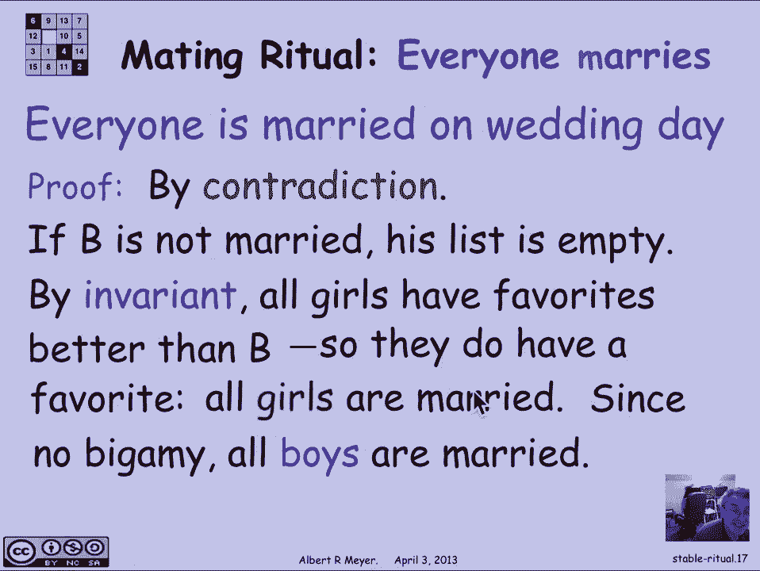
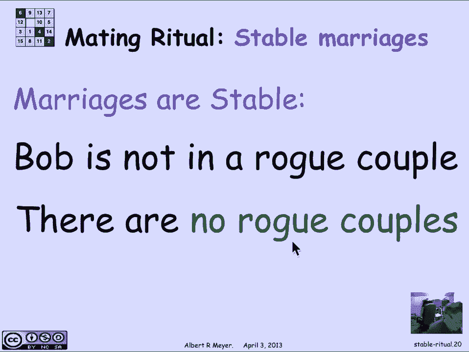

# 计算机科学的数学基础：L2.11.2：匹配仪式

## 概述

在本节课中，我们将学习一个用于寻找稳定婚姻匹配的优雅算法，即“匹配仪式”。我们将详细描述这个仪式的步骤，并使用状态机、不变量和推导变量等概念来证明该算法总能终止，并产生一个稳定的婚姻匹配。

## 匹配仪式流程

上一节我们介绍了稳定婚姻问题。本节中我们来看看一个具体的求解算法——匹配仪式。这是一个按天进行的仪式，男孩和女孩共同参与。

以下是仪式每一天的具体步骤：

1.  **早晨**：每个男孩查看自己的偏好列表，并向排在第一位的女孩“求婚”（或献唱小夜曲）。
2.  **下午**：每个女孩审视所有向她求婚的男孩，拒绝除她最喜欢的那位之外的所有人。
3.  **晚上**：被拒绝的男孩将拒绝他的女孩从自己的偏好列表中划掉。

第二天早晨，仪式重复进行，但男孩们将向各自更新后的列表中的第一位女孩求婚。

这个过程会一直持续，直到某一天没有任何变化发生。根据定义，当每个女孩最多只有一位求婚者时，仪式停止。在这一天，每个女孩将与她唯一的求婚者结婚。我们声称这样产生的婚姻是稳定的。

## 仪式作为状态机

如果我们思考这个过程，它本质上是一个状态机。状态就是每个早晨男孩们的偏好列表集合。晚上的“划掉”操作后，状态会演变为第二天早晨的新列表。我们可以运用状态机的概念来分析它。

我们的证明任务分为两部分：
1.  证明这个状态机**终止**，即存在一个“婚礼日”。
2.  证明这个状态机是**部分正确**的，即当机器停止时，每个人都已结婚，并且婚姻是稳定的。

## 证明终止性

终止性的证明很简单。状态是每个早晨男孩列表上剩余的名字总数。由于男孩被拒绝后会划掉女孩的名字，这个总数是一个严格递减的非负整数值变量。

根据良序原理，这个严格递减的变量必然会达到一个最小值。根据定义，当它达到最小值时，算法必须停止，因为它无法再递减。因此，必然存在一个婚礼日。

## 证明正确性

现在我们来检查这个程序的正确性，分析婚礼日会发生什么。我们需要证明每个人都结婚了，并且婚姻是稳定的。为此，我们将观察一些推导变量和一个关键的不变量。

**第一个观察：女孩的处境逐日改善（或至少不会变差）**。对于任何给定的女孩，她明天的“最爱”（即向她求婚者中她最喜欢的）至少会和今天的一样好。原因在于，今天的“最爱”会持续向她求婚，直到他被拒绝；而他只会在女孩得到一个更好的求婚者时才会被拒绝。

用状态机的语言来说，**女孩“最爱”的排名（在她自己的偏好列表中的位置）是一个弱递增变量**。

**第二个观察：男孩的处境逐日变差（或至少不会变好）**。一个男孩明天的求婚对象不会比今天的更称心。如果他没被拒绝，明天会继续向同一位女孩求婚；如果被拒绝了，他将转向列表中排名更低（即不那么喜欢）的女孩。

因此，**男孩求婚对象的排名（在他自己偏好列表中的位置）是一个弱递减变量**。

这些观察引出了匹配仪式的一个关键不变量。

## 关键不变量

这个不变量表述如下：
对于任意女孩 `G` 和任意男孩 `B`，如果 `G` 不在 `B` 的列表中（即 `G` 曾被 `B` 划掉），那么女孩 `G` 拥有的“最爱”比男孩 `B` 更优。

**原因**：当 `G` 拒绝 `B` 时，她就已经有了一个比 `B` 更好的求婚者。根据女孩“最爱”排名弱递增的性质，她的求婚者会一直保持比 `B` 更好。因此，对于任何其列表上已没有 `G` 的男孩 `B`，`G` 总会有一个她更喜欢于 `B` 的求婚者。

这个性质在仪式的每一天都成立。

## 婚礼日的分析

现在，我们利用这个不变量来分析婚礼日，证明每个人都已婚且婚姻稳定。

**首先，证明每个人都已婚**。根据婚礼日的定义，每个女孩最多有一位求婚者。我们需要证明每个男孩也都结婚了。

一个男孩要么已婚（因为他正在向他列表首位的女孩求婚），要么他的列表上所有女孩都已被划掉，从而没有求婚对象。这是他不结婚的唯一可能情况。

证明采用反证法。假设存在一个男孩 `B` 没有结婚。这等价于他的偏好列表为空（否则他会向某人求婚并可能结婚）。如果他的列表为空，根据上述不变量，**每个女孩都有一个她比喜欢 `B` 更喜欢的求婚者**，这意味着每个女孩都将与一个她认为比 `B` 更好的人结婚。

由于男孩和女孩数量相同，且不存在重婚（一夫多妻或一妻多夫），所有男孩都必须结婚。这与存在未婚男孩 `B` 的假设矛盾。因此，在婚礼日每个人都已婚。

**其次，证明婚姻是稳定的**。我们需要证明不存在“私奔对”。考虑任意一个男孩 `Bob`，我们断言他不会与任何女孩构成私奔对。分两种情况讨论，两者都直接由不变量得出：

1.  **对于仍在 `Bob` 最终列表上的任何女孩 `G`**：`Bob` 已经与他自己列表上最靠前的女孩结婚。因此，他不会为了列表上其他女孩而想要私奔。
2.  **对于不在 `Bob` 最终列表上的任何女孩 `G`**：根据不变量，`G` 已经与一个她比喜欢 `Bob` 更喜欢的人结婚。因此，`G` 不会愿意与 `Bob` 私奔。

由于 `Bob` 是任意男孩，以上论证表明没有男孩会处于私奔对中。因此，产生的所有婚姻都是稳定的。

## 总结

本节课中，我们一起学习了用于解决稳定婚姻问题的“匹配仪式”算法。我们详细描述了其按天进行的步骤，并将其建模为一个状态机。通过分析男孩列表总长度这一严格递减的推导变量，我们证明了算法必然终止。更重要的是，我们发现并利用了一个关键不变量——**被男孩划掉的女孩，总拥有一个比该男孩更优的求婚者**。基于这个不变量，我们证明了在算法终止的婚礼日，每个人都能够结婚，并且最终形成的所有婚姻都是稳定的。这个优雅的算法展示了如何运用不变量和状态机思想来清晰地证明算法的正确性。