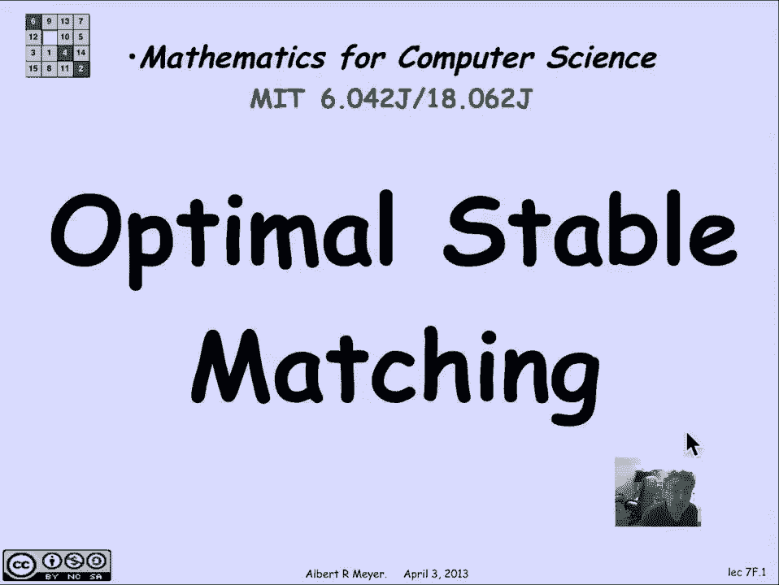
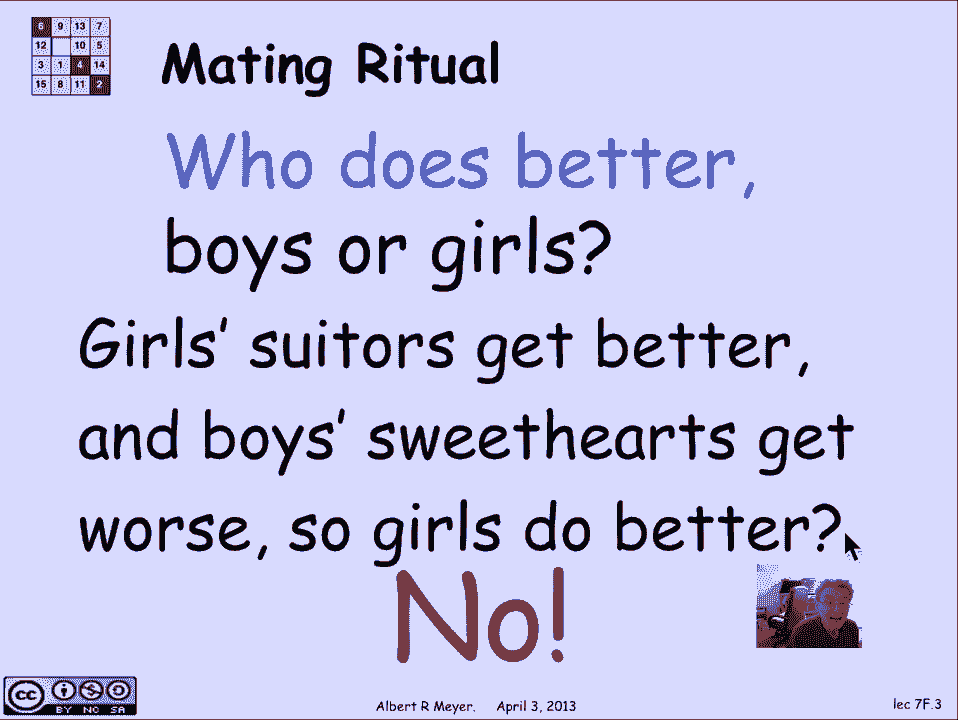
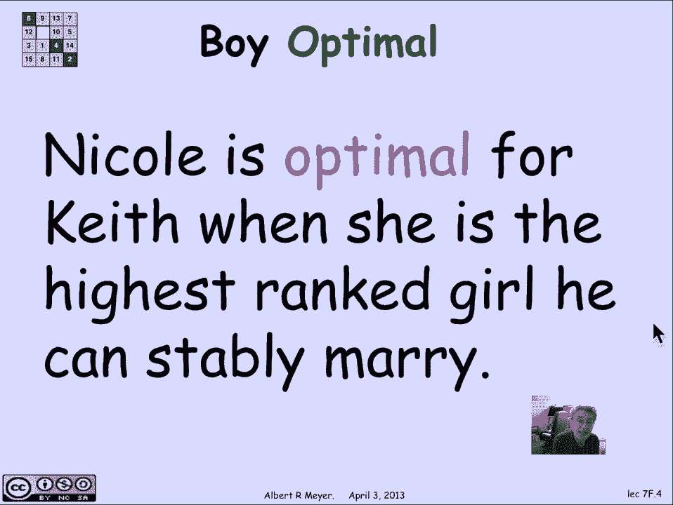
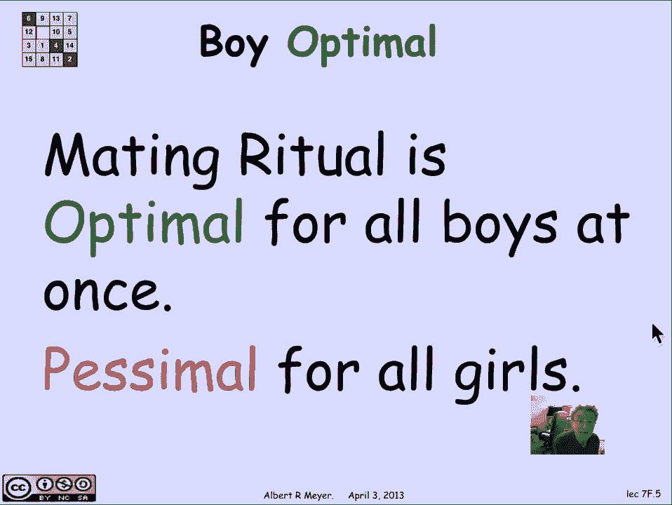
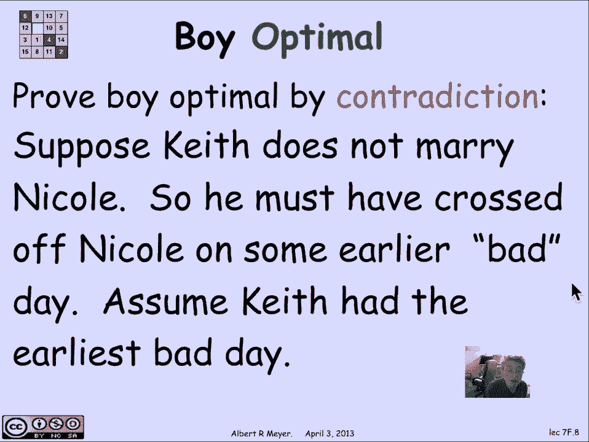
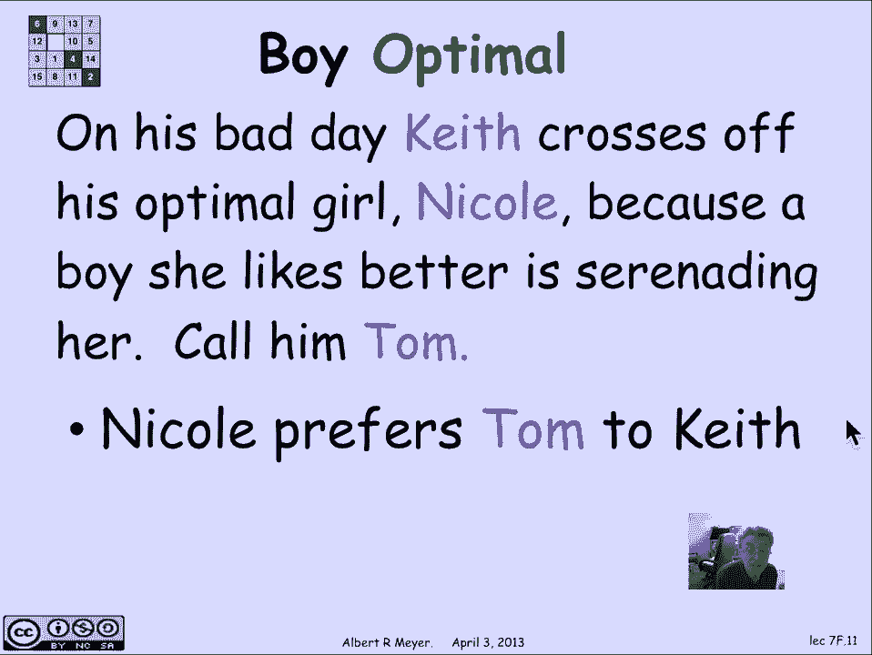
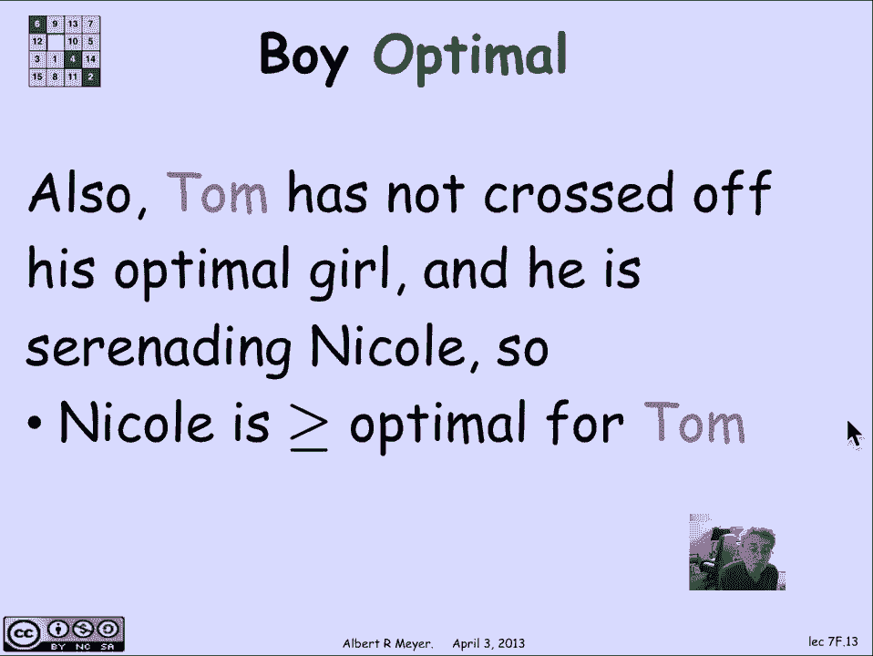
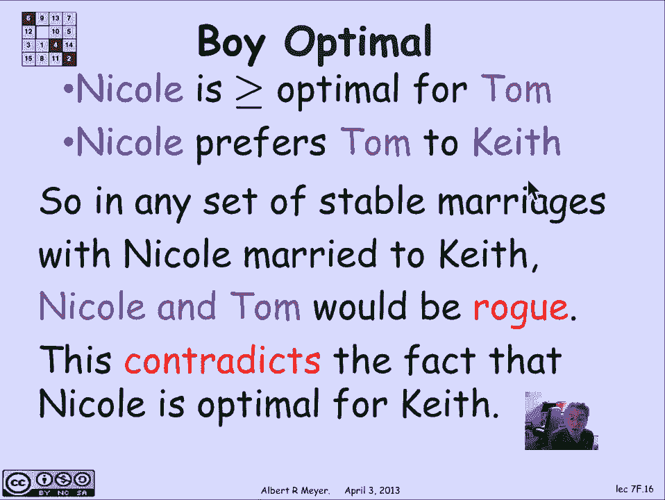
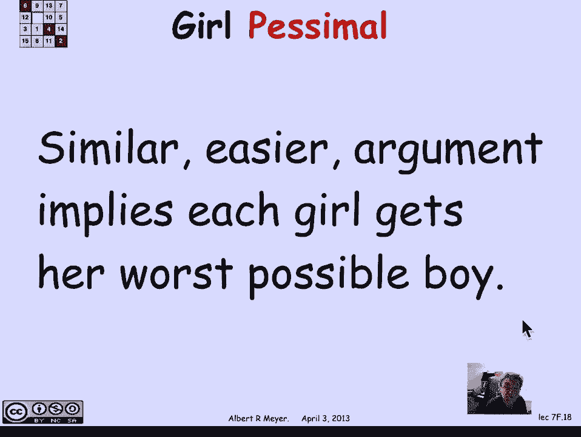
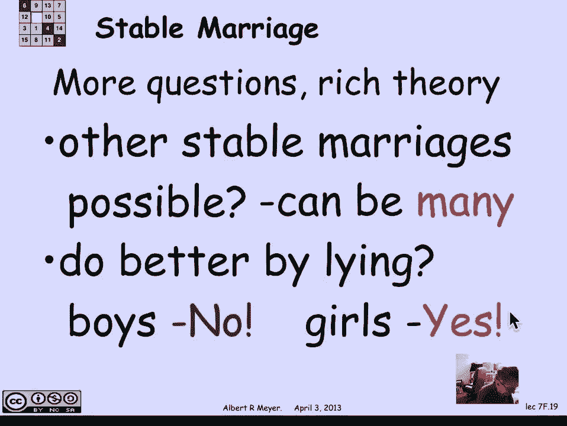

# 计算机科学的数学基础：L2.11.5：最优稳定匹配 🎯

在本节课中，我们将要学习稳定婚姻问题中的一个重要概念——**最优稳定匹配**。我们将探讨在交配仪式中，男孩和女孩各自获得的配偶质量，并证明该算法为所有男孩同时找到了他们可能的最佳稳定配偶。

上一节我们介绍了稳定婚姻的概念及其价值。本节中我们来看看，在交配仪式中，参与者们最终获得的配偶质量如何。

## 概述：最优配偶的定义

首先，我们需要定义一个关键概念：**最佳可能配偶**。对于一个男孩基思而言，在所有他能以稳定方式结婚的女性中，排名最高的那位女性妮可，就被称为基思的**最佳可能配偶**。这意味着，在**所有**可能的稳定婚姻方案中，妮可是基思能娶到的最理想的妻子。

## 核心主张：男孩最优与女孩最差

交配仪式产生了一个特定的稳定婚姻匹配。我们提出的核心主张是：**这个匹配对所有的男孩来说同时是最优的**。也就是说，每个男孩都娶到了他所有可能稳定配偶中的最佳人选。

这听起来有些不同寻常，因为通常优化一个人的利益会牺牲其他人的利益。但在这个算法中，所有男孩都同时达到了他们的最优状态。相应地，一个悲观的结论是：**所有的女孩都得到了她们在所有可能的稳定婚姻中，可能得到的最差配偶**。

## 证明：男孩最优性

让我们来证明交配仪式导致男孩最优的婚姻。我们将使用反证法。

1.  **假设存在矛盾**：假设妮可是男孩基思的最佳可能配偶，但在某次交配仪式的结果中，基思并没有和妮可结婚。
2.  **推导矛盾点**：既然妮可是最佳可能配偶，而基思没有娶她，那么基思一定是娶了一个他认为不如妮可受欢迎的女孩。这意味着在仪式过程中的某一天，基思被妮可拒绝了，并将她从自己的名单上划掉。我们把这一天称为基思的“糟糕日”。
3.  **寻找最早的“糟糕日”**：在所有男孩中，必然有一个最早经历“糟糕日”的男孩。我们不妨假设这个男孩就是基思。
4.  **分析“糟糕日”当天**：在基思的糟糕日，妮可因为有了一个更喜欢的追求者汤姆而拒绝了基思。因此我们知道：
    *   **公式**：`妮可偏好：汤姆 > 基思`
5.  **利用“最早”的性质**：因为基思的糟糕日是所有人中最早的，所以汤姆此时还没有经历过糟糕日（即还没有划掉自己的最佳可能配偶）。这意味着，汤姆当时正在追求的妮可，至少和他自己的最佳可能配偶一样好（甚至更好）。
    *   **公式**：`汤姆偏好：妮可 ≥ 汤姆的最佳可能配偶`
6.  **构造不稳定对**：现在考虑一个**假设的**稳定婚姻方案，其中妮可嫁给了基思（因为妮可是基思的最佳可能配偶，这样的方案应该存在）。在这个方案中，汤姆会与某人结婚（可能是他的最佳可能配偶，也可能不是）。但根据我们上面的分析：
    *   妮可更喜欢汤姆（而不是基思）。
    *   汤姆认为妮可至少和他的配偶一样好。
    *   这意味着妮可和汤姆构成了一个**私奔对**，破坏了该婚姻方案的稳定性。
7.  **得出矛盾**：这与“存在一个妮可嫁给基思的稳定婚姻方案”的假设矛盾。因此，最初的假设（基思在交配仪式中没有娶到妮可）是错误的。**所以，基思在交配仪式中必然娶到了他的最佳可能配偶妮可**。

类似的、且更简单的论证可以表明，交配仪式也让所有女孩得到了她们**最差的可能稳定配偶**。

## 延伸问题与讨论

这个结论引出了一系列有趣的问题：

以下是关于其他稳定匹配可能性的问题：
*   除了交配仪式产生的匹配，还有其他可能的稳定婚姻吗？答案是肯定的。一个简单的方法是**交换男孩和女孩的角色**重新进行仪式，这样会产生一个对女孩最优、对男孩最差的稳定匹配。
*   是否存在既不是男孩最优也不是女孩最优的其他稳定匹配？一般来说，**可能存在指数级数量**的稳定婚姻。
*   如何在这些不同的稳定匹配中做出“更好”或“更公平”的选择？

以下是关于参与者策略的问题：
*   **撒谎是否有益**？既然男孩已经获得了最优结果，他们撒谎无法获得更好收益。但**女孩可以通过合谋撒谎**，来迫使交配仪式产生一个对女孩最优的稳定匹配。这引出了是否存在能防止撒谎的协议等问题。

这些深入的问题我们不再展开，但它们展示了稳定婚姻理论丰富的内涵。如果你想了解更多，可以参考Gusfield和Irving的相关著作。

## 总结

本节课中我们一起学习了稳定婚姻问题中的**最优稳定匹配**概念。我们证明了经典的**交配仪式（Gale-Shapley算法）** 会产生一个独特的稳定匹配，其性质是：
*   **对男孩最优**：每个男孩都获得了他所有可能稳定配偶中的最佳人选。
*   **对女孩最差**：每个女孩都获得了她所有可能稳定配偶中的最差人选。

这个结论揭示了算法中隐含的倾向性，并为进一步研究不同稳定匹配的性质和参与者的策略行为奠定了基础。