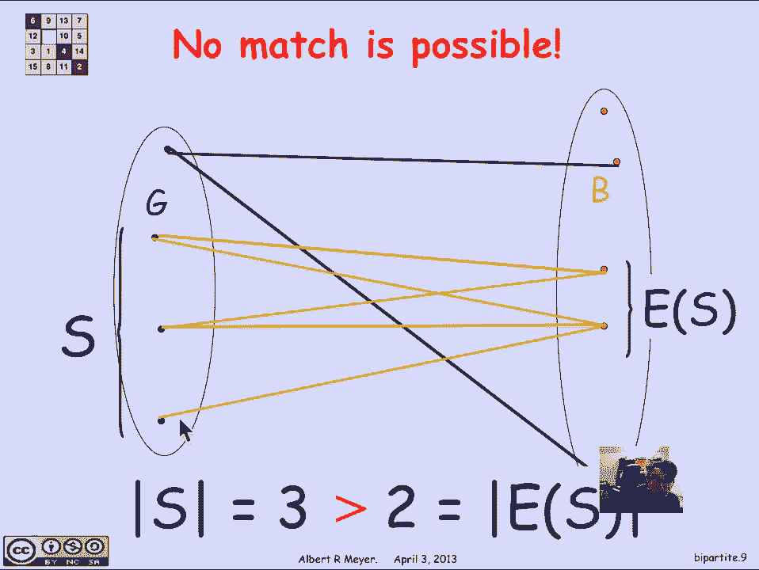
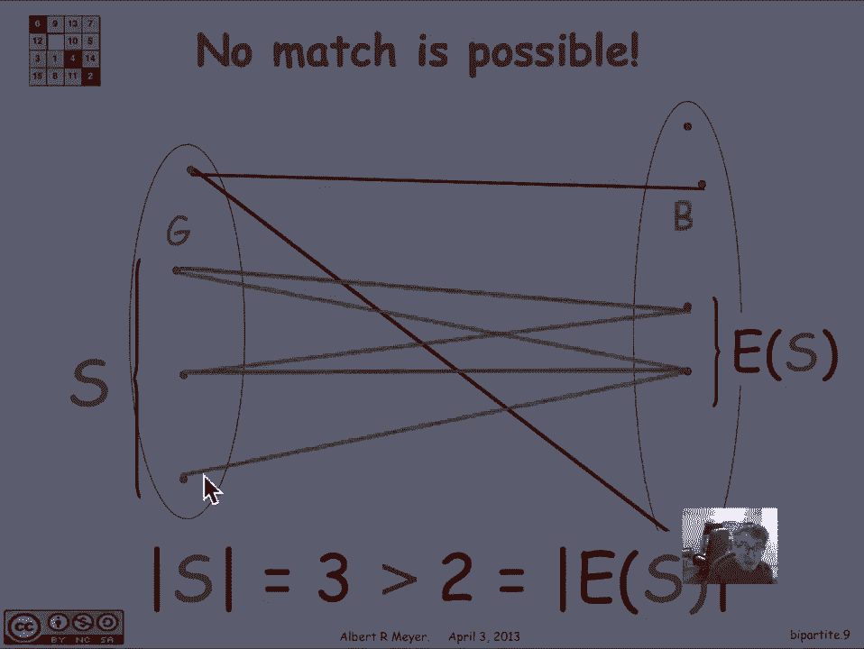
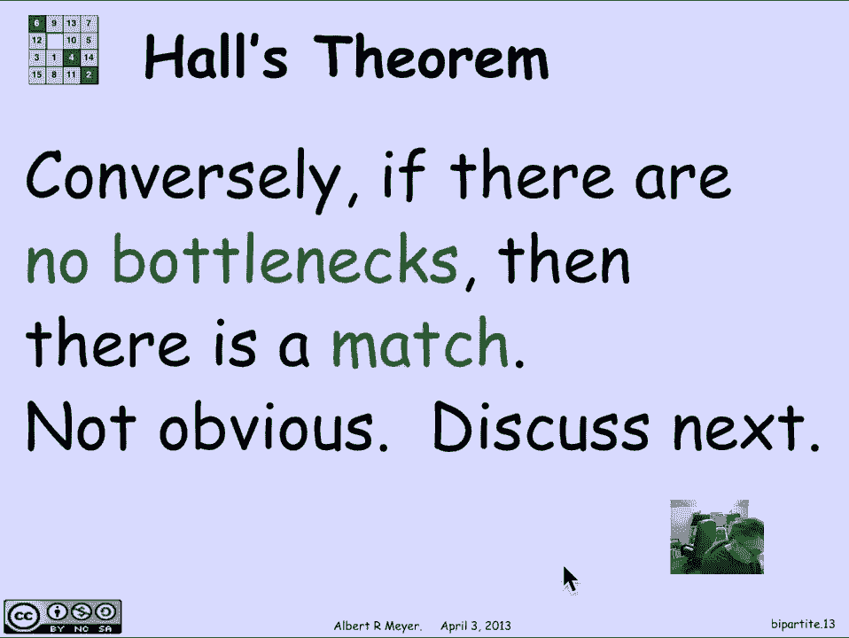

# 计算机科学的数学基础：L2.11.7：二部图匹配 🧩

在本节课中，我们将要学习二部图匹配问题。这是一个在图论中非常重要的问题，它可以帮助我们理解如何将两组不同的对象进行有效配对。我们将从稳定匹配问题出发，引出二部图匹配的一般定义，并探讨匹配存在的条件。

## 二部图与匹配问题

上一节我们介绍了稳定匹配问题，它是二部匹配问题的一个具体例子。本节中我们来看看二部匹配问题的一般设置。

二部匹配问题的场景是：你有一个简单的图，其顶点被分成两组。就像在稳定匹配问题中一样，我们可以称这两组为女孩（G）和男孩（B）。

二部图的定义如下：它是一个图，其中顶点被分为两组不相交的集合，称为左顶点和右顶点。每个顶点要么属于左集，要么属于右集。图中的边只存在于左顶点和右顶点之间。

在匹配问题中，我们有一个规范：每个女孩都愿意与某些男孩配对，但不是所有男孩。我们可以通过添加边来表示这种意愿。例如，如果第一个女孩愿意与第二个男孩和最后一个男孩配对，那么图中就会有从她指向这两个男孩的边。因此，边代表了女孩和男孩之间的兼容性。

## 匹配的目标与定义

对女孩和男孩进行匹配的限制是：我们试图让所有女孩都与一个独特的、兼容的男孩配对。也就是说，每个女孩都被分配一个独特的、与她兼容的男孩。

以下是一个匹配的例子，其中每个女孩都通过一条突出的洋红色边连接到一个不同的男孩：

我们正式地想要一个从女孩到男孩的双射（一一对应），并且这个对应关系要遵循图中的边。

## 匹配的瓶颈

让我们看一个找不到匹配的案例。假设我们移除了上图中的一条边。

现在，我们发现最后一个女孩无法与第二个男孩（即我们之前匹配给她的男孩）配对了。让我们尝试寻找其他匹配方案，但发现不存在任何匹配。

原因是：如果你看左边的三个女孩，再看右边所有与她们兼容的男孩，你会发现这三个女孩总共只与两个男孩兼容。这意味着只有两个男孩可供三个女孩分享，这就是所谓的“瓶颈”。

更一般地说，如果你有一组左边的女孩集合 **S**，那么 **S** 在边关系下的“像”记作 **E(S)**，它是所有与 **S** 中至少一个女孩兼容的男孩的集合。

在我们之前的例子中，**S** 的大小是 3，而 **E(S)** 的大小是 2。因为 **3 > 2**，所以我们遇到了瓶颈，不可能找到匹配。

瓶颈的定义是：如果存在一个左边的女孩集合 **S**，使得 **|S| > |E(S)|**，那么就存在一个瓶颈。

我们可以做的第一个观察是“瓶颈引理”：如果一个瓶颈存在（即存在集合 **S** 使得 **|S| > |E(S)|**），那么匹配是不可能的。原因很明显，因为女孩的数量超过了她们共同兼容的男孩数量。

## 霍尔定理

现在，一个相当深刻的定理是，反过来也成立：**如果没有瓶颈，那么就一定存在一个匹配**。这就是著名的**霍尔定理**。

霍尔定理的表述是：在一个二部图中，存在一个覆盖所有左顶点的匹配，当且仅当对于左顶点的每一个子集 **S**，都有 **|E(S)| ≥ |S|**。

这个结论并不那么显而易见，但我们可以找到一个易于理解的证明。

## 总结

本节课中我们一起学习了二部图匹配问题。我们首先回顾了稳定匹配问题作为二部匹配的特例，然后给出了二部图和匹配的正式定义。我们探讨了导致匹配不可能的“瓶颈”现象，并最终引出了保证匹配存在的关键定理——霍尔定理。理解瓶颈条件和霍尔定理是解决许多实际配对问题的基础。