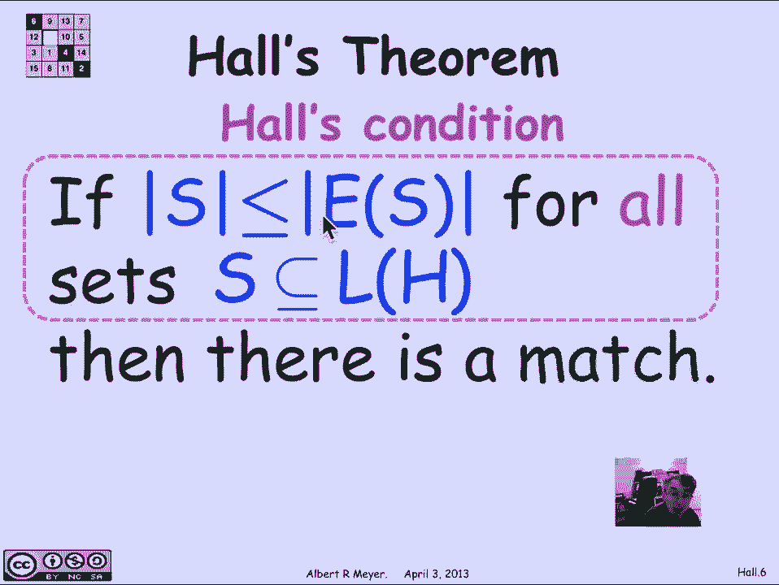
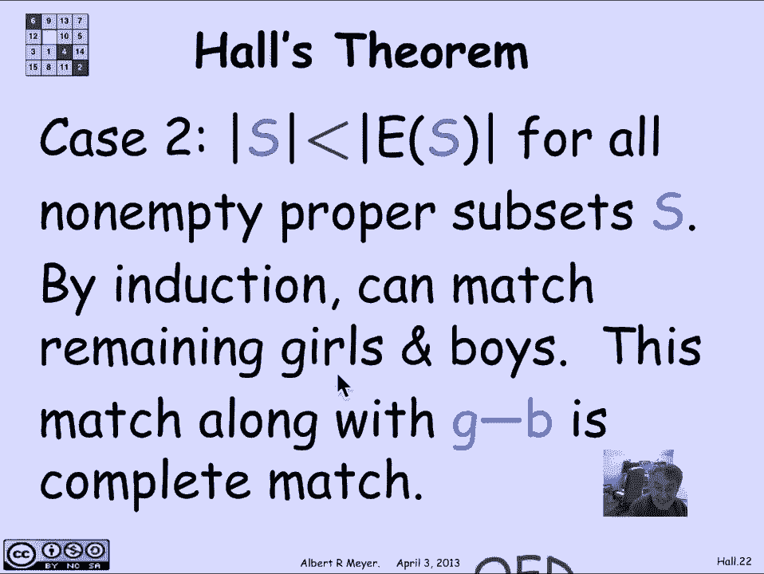

# 计算机科学的数学基础：L2.11.9：霍尔定理 🧩

在本节课中，我们将学习图论中的一个核心定理——霍尔定理。该定理为判断二分图中是否存在完美匹配提供了一个充要条件。我们将从定义开始，逐步理解定理的陈述、一个实用的充分条件，并最终探讨其证明思路。

## 二分图与匹配的正式定义

上一节我们介绍了二分图在“男孩-女孩”配对问题中的直观背景。现在，我们将其形式化。

一个**二分图** `H` 包含两个互不相交且非空的顶点集合：左顶点集 `L(H)` 和右顶点集 `R(H)`。图 `H` 的所有边都只连接 `L(H)` 中的顶点和 `R(H)` 中的顶点。

在二分图中，一个**匹配**（或完美匹配）是一个从 `L(H)` 到 `R(H)` 的**全单射函数** `M`。这意味着：
*   **全射性**：`L(H)` 中的每一个顶点（女孩）都有一个匹配对象 `M(L)`，该对象位于 `R(H)`（男孩）中。
*   **单射性**：没有两个左顶点匹配到同一个右顶点。
*   **遵循边**：对于每个左顶点 `l`，边 `(l, M(l))` 必须是图 `H` 中实际存在的一条边。用数学语言描述，即匹配函数 `M` 的图是 `H` 的边集的一个子集。

## 霍尔定理的陈述

有了以上定义，我们可以正式陈述霍尔定理，而无需提及男孩和女孩。

**霍尔定理**：对于一个二分图 `H`，如果对于左顶点集 `L(H)` 的**每一个**子集 `S`，都满足以下**霍尔条件**（或称“无瓶颈条件”）：
`|S| ≤ |N(S)|`
其中 `N(S)` 是 `S` 中所有顶点在图 `H` 中的邻居集合（即与 `S` 中任意顶点相连的右顶点集合）。
那么，图 `H` 中就存在一个从 `L(H)` 到 `R(H)` 的完美匹配。

简而言之：**当且仅当不存在“瓶颈”集合时，完美匹配存在。**

## 一个实用的充分条件：度约束图

直接验证霍尔条件需要检查左顶点集的所有子集，这在计算上是困难的（指数级复杂度）。不过，存在一个常见且易于验证的充分条件。

如果一个二分图 `H` 满足以下**度约束条件**：
*   每个左顶点（女孩）的度（喜欢的男孩数）**至少**为 `d`。
*   每个右顶点（男孩）的度（被喜欢的次数）**至多**为 `d`。
那么，该图一定满足霍尔条件，从而存在完美匹配。

**证明如下**：
1.  任取一个左顶点子集 `S`。
2.  从 `S` 出发的边总数 `E` 满足：`d * |S| ≤ E`（因为每个左顶点至少有 `d` 条边）。
3.  所有这些边都指向 `N(S)` 中的顶点。由于每个右顶点至多有 `d` 条边，因此 `E ≤ d * |N(S)|`。
4.  结合以上两点，得到 `d * |S| ≤ d * |N(S)|`。
5.  两边同时除以 `d`，得到 `|S| ≤ |N(S)|`。
6.  由于 `S` 是任意选取的，霍尔条件成立。

因此，**度约束条件是霍尔条件的一个充分条件**，它保证了完美匹配的存在。请注意，这不是必要条件；许多存在完美匹配的图并不满足度约束。

## 霍尔定理的证明思路

现在，我们来探讨霍尔定理本身的证明。证明的核心思想是**强归纳法**：假设定理对顶点数较少的所有二分图成立，来证明它对当前图也成立。证明分为两种情况。

**情况一：存在一个“恰好饱和”的真子集**
假设存在一个非空且非全集的左顶点子集 `S`，使得 `|S| = |N(S)|`。这是一个关键情况。
*   可以证明，在原图没有瓶颈的条件下，由 `S` 和 `N(S)` 诱导出的子图，以及由剩余顶点 `L\S` 和 `R\N(S)` 诱导出的子图，也都满足霍尔条件（即没有瓶颈）。
*   由于这两个子图的规模都小于原图，根据归纳假设，它们内部各自存在完美匹配。
*   将这两个子图的匹配合并起来，就得到了原图的一个完美匹配。

**情况二：所有真子集都“严格更小”**
假设对于所有非空且非全集的左顶点子集 `S`，都有 `|S| < |N(S)|`。
*   此时，我们可以任意选取一个左顶点 `g` 和她的一个邻居 `b` 进行匹配。
*   将 `g` 和 `b` 从图中移除。由于之前所有子集 `S` 的邻居集大小都严格大于 `S` 本身，移除一个顶点后，剩余图依然满足霍尔条件。
*   剩余图的顶点数减少，根据归纳假设，存在完美匹配。
*   将 `(g, b)` 这对匹配加回去，就得到了原图的完美匹配。

通过以上两种情况的讨论，我们完成了对霍尔定理的归纳证明。

## 总结

本节课中我们一起学习了：
1.  **霍尔定理的正式定义**：完美匹配存在的充要条件是对于左部的所有子集 `S`，其邻居集大小不小于 `S` 本身的大小（`|S| ≤ |N(S)|`）。
2.  **一个实用的充分条件**：如果二分图是度约束的（每个左顶点度≥d，每个右顶点度≤d），则完美匹配必然存在。这为快速判断许多场景下的匹配存在性提供了便利。
3.  **定理的证明思路**：证明采用了强归纳法，通过分析图中是否存在一个大小等于其邻居集大小的真子集，将问题分解为两个更小的子问题或直接构造匹配，从而完成证明。

霍尔定理是组合数学与图论中一个优美而强大的工具，它在任务分配、调度、网络流等众多计算机科学领域有着广泛的应用。