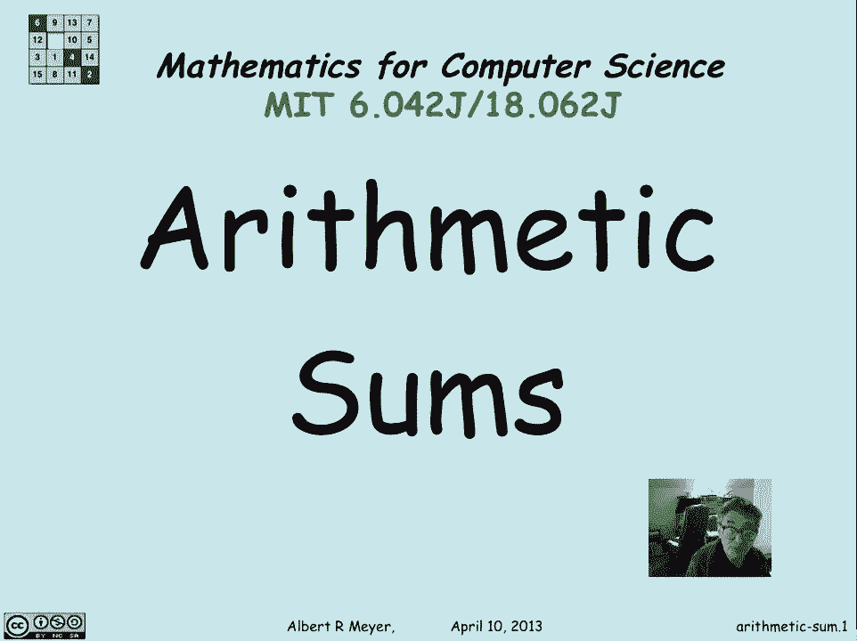
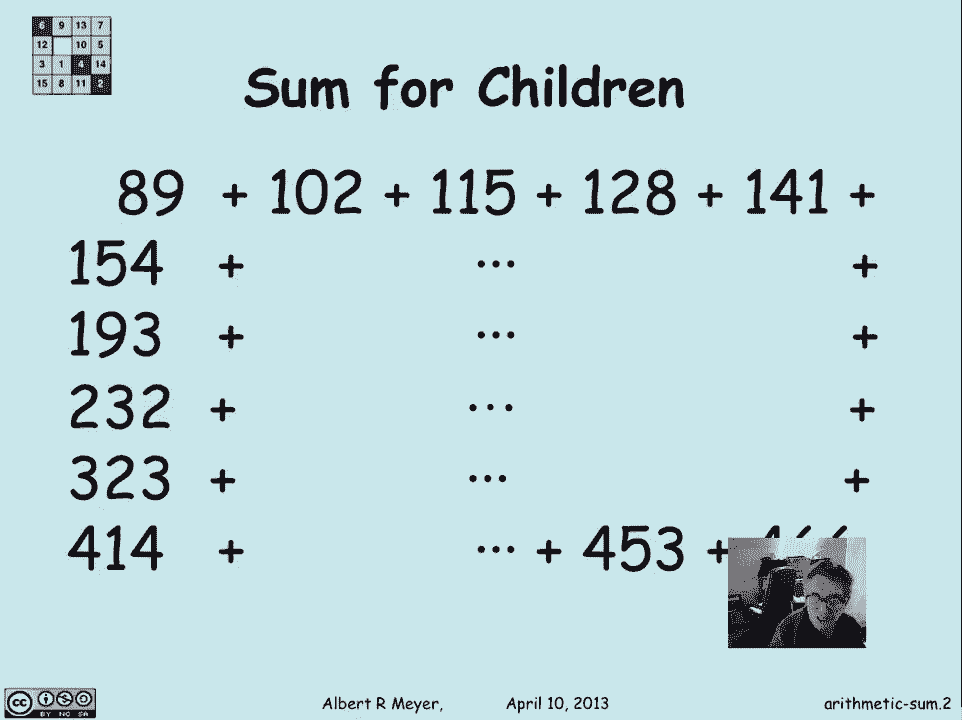
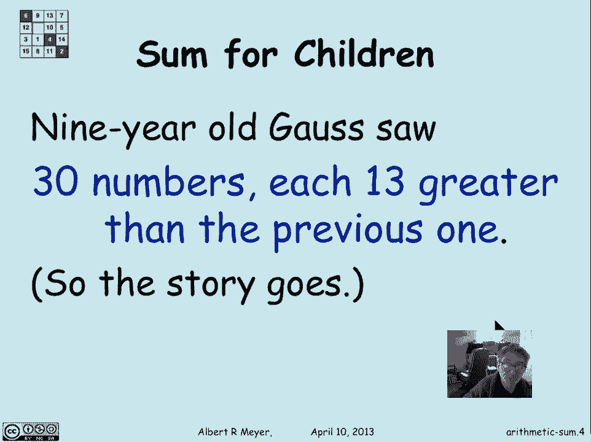
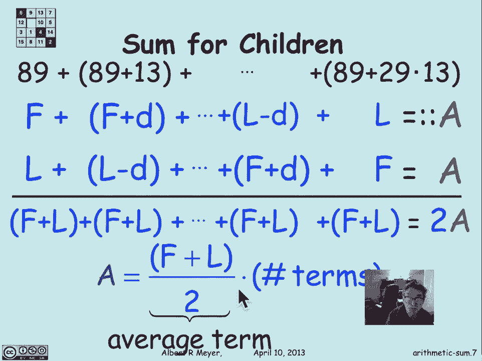
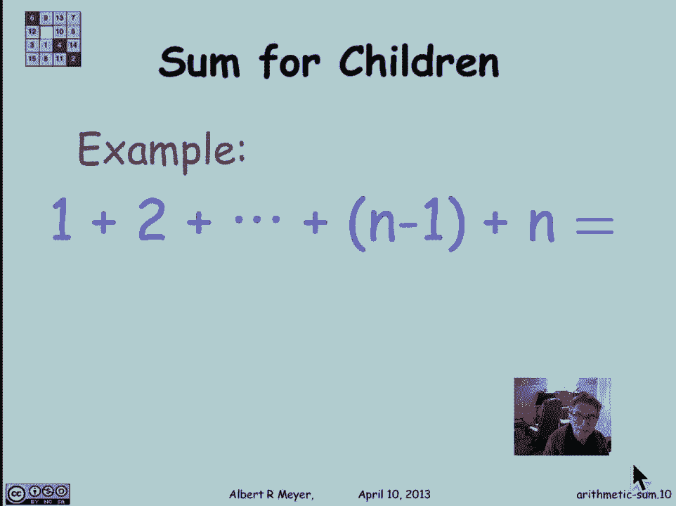
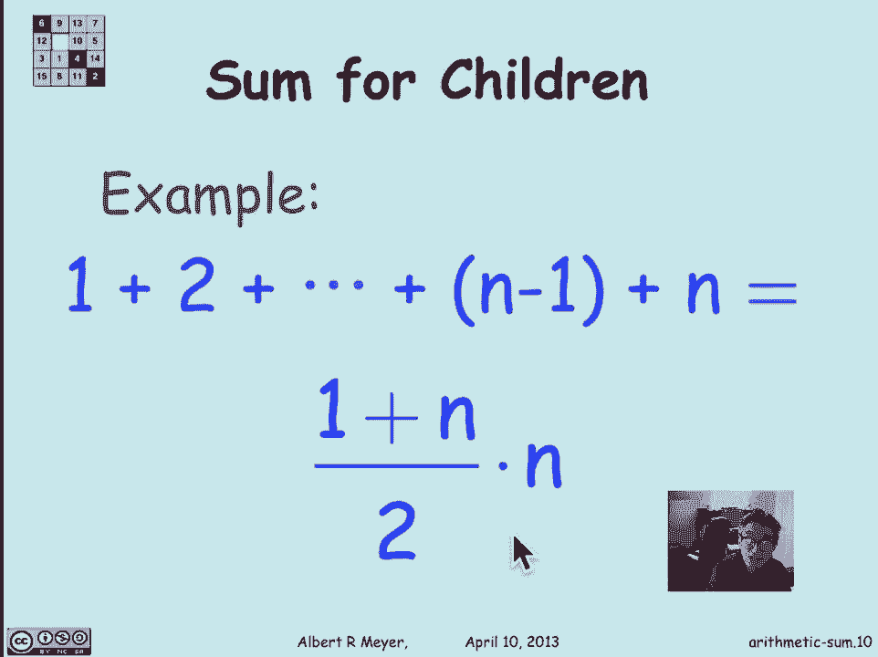

# 计算机科学的数学基础：L3.1.1：算术和 📊

在本节课中，我们将要学习计数与组合学的基础知识。当我们进行计数时，常常需要将一系列数字相加。因此，掌握如何高效地求和至关重要。本节课，我们将从最简单的求和类型——**算术和**开始。

## 算术和的起源故事 📖

算术和有一个著名的历史故事。在18世纪，一位老师为了让学生们在课堂上保持忙碌，提出了一个求和问题：计算从89开始，以13为公差递增的30个数字的总和。



伟大的数学家卡尔·弗里德里希·高斯在九岁时就展现了他的天赋。据说他当时就发现了快速计算此类和的方法，而没有像其他同学一样进行繁琐的逐项相加。



## 算术和的通用公式推导 🔍

上一节我们介绍了算术和的背景，本节中我们来看看如何推导其通用求和公式。

假设我们有一个算术序列：
*   第一项为 **f**。
*   公差为 **d**。
*   最后一项为 **l**。
*   总项数为 **n**。

那么，这个序列的和 **A** 可以表示为：
```
A = f + (f + d) + (f + 2d) + ... + l
```



高斯的关键技巧是将这个和倒序书写：
```
A = l + (l - d) + (l - 2d) + ... + f
```

现在，将这两个等式相加：
```
2A = (f + l) + (f + l) + (f + l) + ... + (f + l)
```

因为总共有 **n** 项，所以等式右边是 **n** 个 **(f + l)** 的和。因此：
```
2A = n * (f + l)
```

由此，我们得到算术和的通用公式：
```
A = n * (f + l) / 2
```

这个公式可以理解为：**总和 = 项数 × (首项 + 末项) / 2**。其中 `(首项 + 末项) / 2` 恰好是整个序列的**平均值**。所以，算术和也等于**项数乘以序列的平均值**。

## 经典示例：从1到n的整数和 🧮

现在，让我们应用这个公式来解决一个最经典的算术和问题：求从1到n的所有整数之和。

在这个序列中：
*   首项 **f = 1**
*   末项 **l = n**
*   项数 **n = n** (注意：这里的n既是项数，也代表末项的值)



根据我们的公式：
```
总和 = n * (1 + n) / 2
```

用代码表示这个公式可以是：
```python
def sum_of_integers(n):
    return n * (1 + n) // 2
```



这就是著名的求和公式。例如，1到100的和是 `100 * 101 / 2 = 5050`。

---



本节课中我们一起学习了**算术和**。我们了解了它的历史背景，推导了其通用求和公式 **`A = n * (f + l) / 2`**，并应用该公式解决了从1到n求和的经典问题。掌握这个公式是学习后续更复杂求和与计数技巧的重要基础。