# 计算机科学的数学基础：L3.1.3：几何和 📐

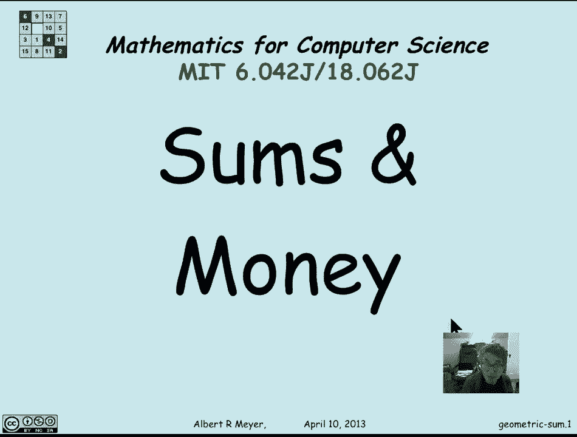

在本节课中，我们将要学习几何和与几何级数。我们将了解它们的定义、推导其封闭形式的公式，并探讨一个在金融领域（如计算货币未来价值）的典型应用。

上一节我们介绍了算术和，其中每一项都比前一项大一个固定的加量。本节中我们来看看另一种重要的和——几何和，其中每一项都是前一项的固定倍数。这种和在许多不同的环境中都会出现。

## 几何和的定义与推导

几何和的标准形式如下：

**公式：**
\[
G_n = 1 + x + x^2 + \dots + x^n = \sum_{k=0}^{n} x^k
\]

注意，1 可以看作是 \(x^0\)。我们的目标是找到一个不包含省略号“...”的、关于项数 \(n\) 的**封闭形式**表达式。

推导算术和公式时，我们使用了颠倒相加的技巧。对于几何和，我们将使用一种称为**扰动法**的技巧。其核心思想是：将总和 \(G_n\) 乘以公比 \(x\)，然后观察它与原式的关系。

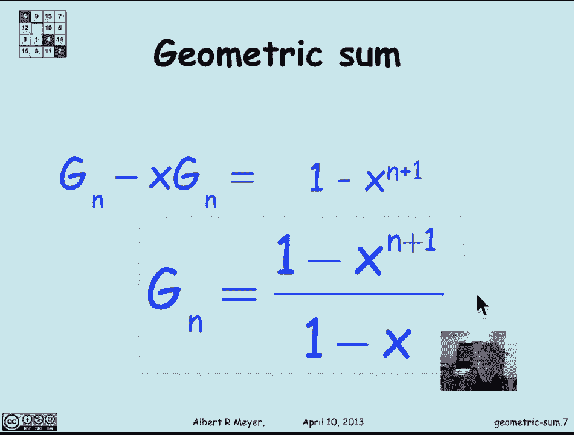

**推导过程：**
1.  将 \(G_n\) 乘以 \(x\)：
    \[
    x \cdot G_n = x + x^2 + x^3 + \dots + x^{n+1}
    \]
2.  用原式 \(G_n\) 减去这个新式子：
    \[
    G_n - x \cdot G_n = (1 + x + x^2 + \dots + x^n) - (x + x^2 + \dots + x^{n+1})
    \]
3.  观察等式右边，从 \(x\) 到 \(x^n\) 的所有项都相互抵消了，只剩下第一项 1 和最后一项 \(-x^{n+1}\)：
    \[
    G_n - xG_n = 1 - x^{n+1}
    \]
4.  提取公因式 \(G_n\)，并求解：
    \[
    G_n(1 - x) = 1 - x^{n+1}
    \]
    \[
    G_n = \frac{1 - x^{n+1}}{1 - x}
    \]

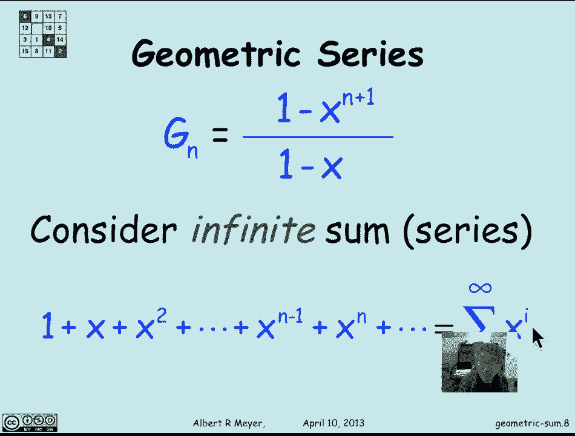

这样，我们就得到了几何和的封闭形式公式。这个推导过程清晰地展示了“聪明人”是如何发现这个公式的。

## 从几何和到几何级数

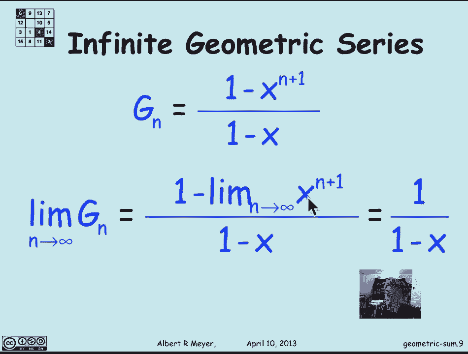

当我们考虑无限项相加时，就得到了**几何级数**。

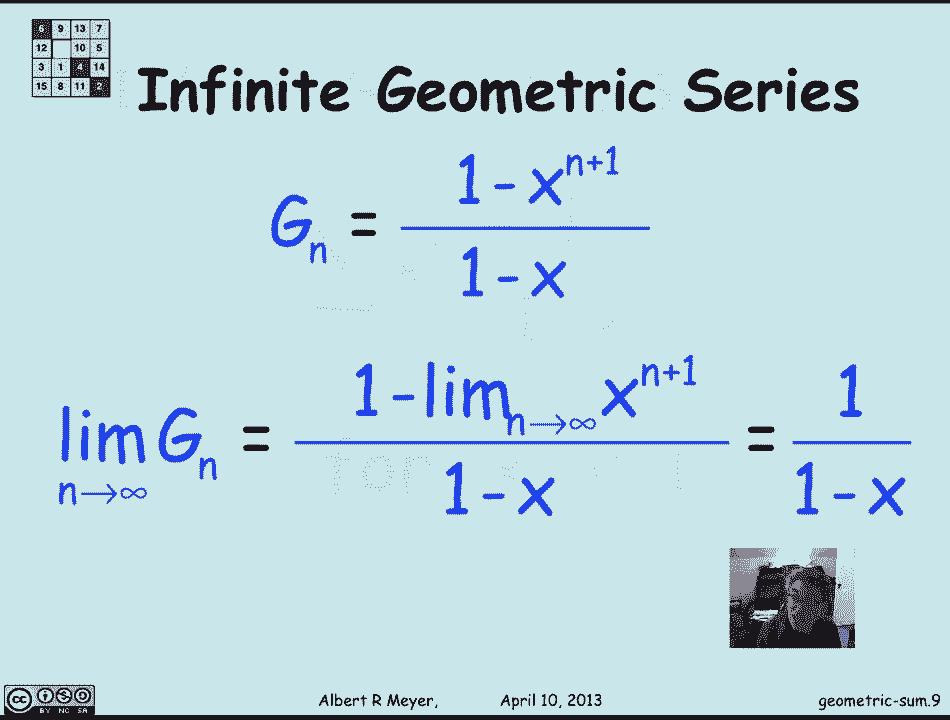

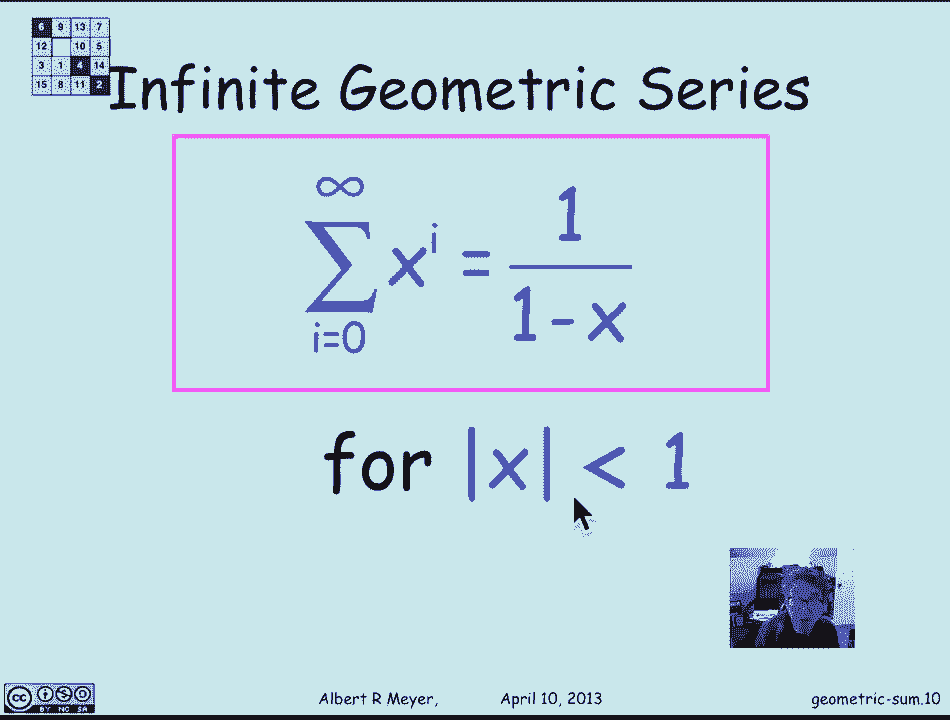

**公式：**
\[
S = 1 + x + x^2 + x^3 + \dots = \sum_{i=0}^{\infty} x^i
\]

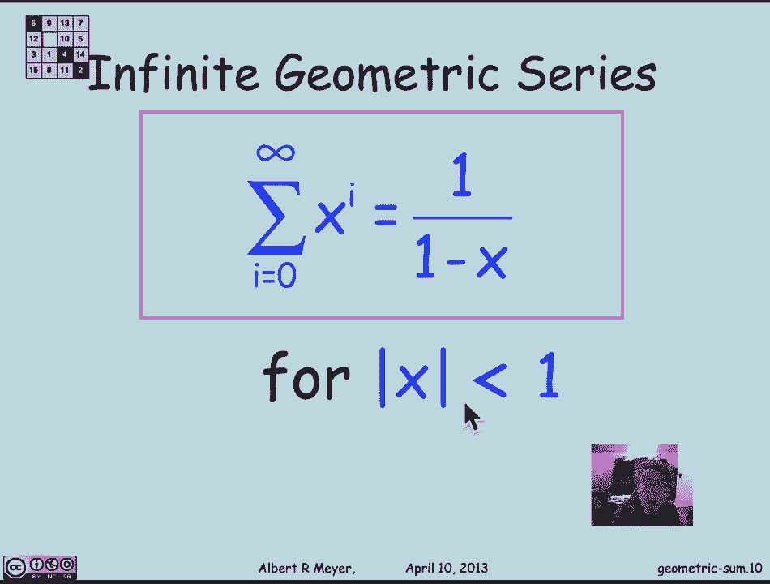

无限和定义为前 \(n\) 项部分和 \(G_n\) 在 \(n\) 趋于无穷大时的极限（假设该极限存在）。

**推导过程：**
1.  根据几何和的公式，部分和 \(G_n = \frac{1 - x^{n+1}}{1 - x}\)。
2.  几何级数 \(S\) 是 \(G_n\) 的极限：
    \[
    S = \lim_{n \to \infty} G_n = \lim_{n \to \infty} \frac{1 - x^{n+1}}{1 - x}
    \]
3.  当 \(|x| < 1\) 时，随着 \(n\) 增大，\(x^{n+1}\) 会趋近于 0。
4.  因此，在 \(|x| < 1\) 的条件下，我们得到：
    \[
    S = \frac{1}{1 - x}
    \]

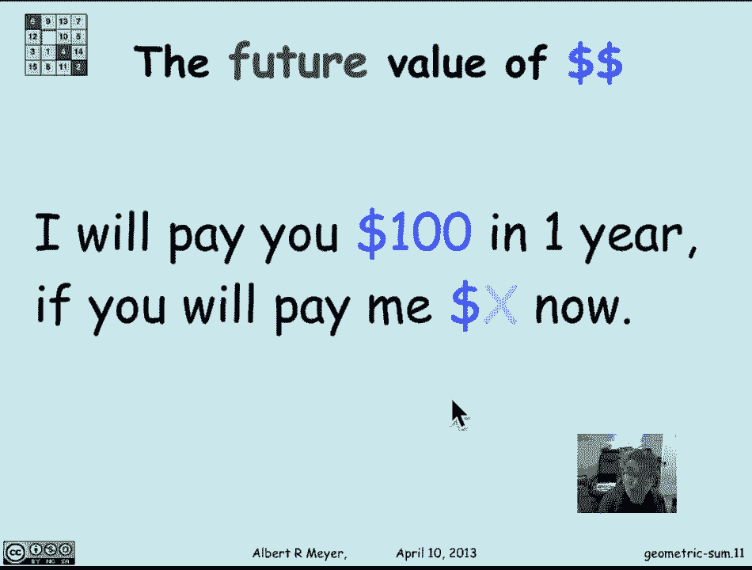

这个公式比有限几何和的公式更加简洁。

## 应用：货币的未来价值 💰

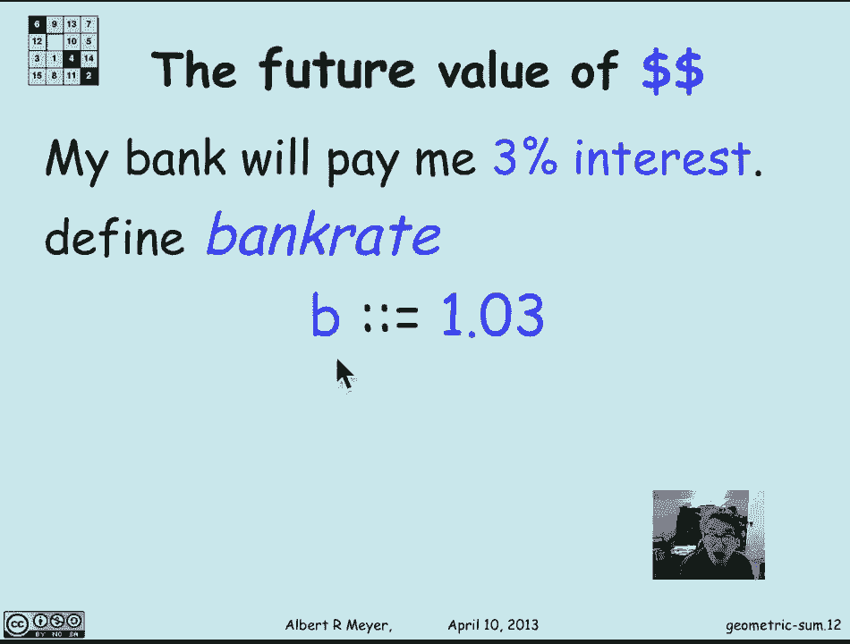

几何和在金融领域有直接的应用，例如评估货币在不同时间点的价值。其核心原理基于一个假设：资金可以存入银行获得无风险利息。

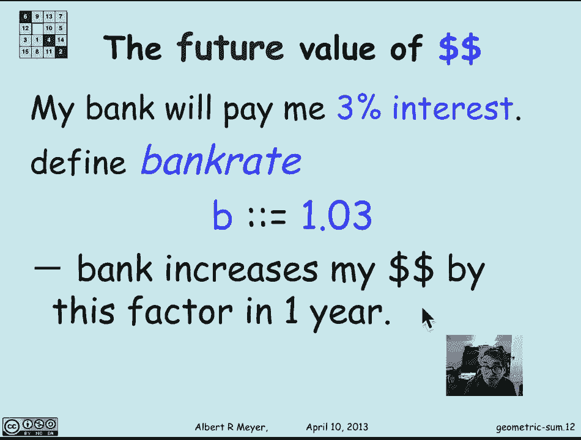

**基本概念：**
- 设银行年利率为 3%，则**银行利率因子** \(b = 1.03\)。这意味着现在存入 1 美元，一年后将变为 \(b\) 美元。
- 反过来，为了在一年后获得 1 美元，现在需要存入的金额称为**现值**。设现值为 \(r\) 美元，则有 \(b \cdot r = 1\)，解得 \(r = 1/b\)。这里 \(r\) 就是**折现因子**。

**公式：**
- \(k\) 年后支付的 \(m\) 美元，其今天的现值是 \(m \cdot r^k\)，其中 \(r = 1/b\)。

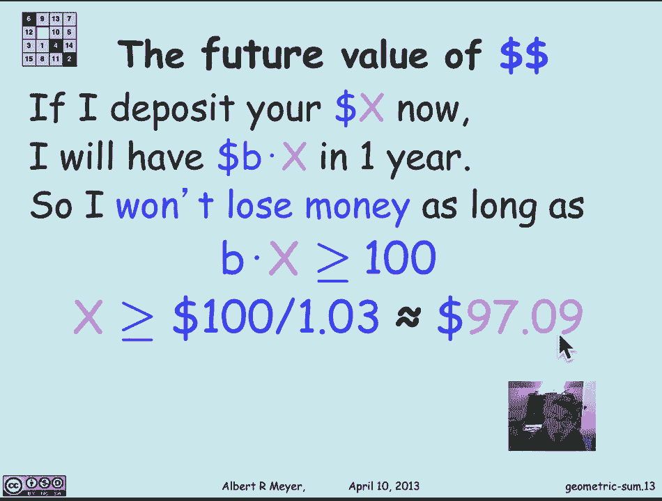

### 年金估值示例

年金是一种金融合约：投保人现在支付一笔保费，以换取未来一系列定期收入。让我们分析一个具体例子：

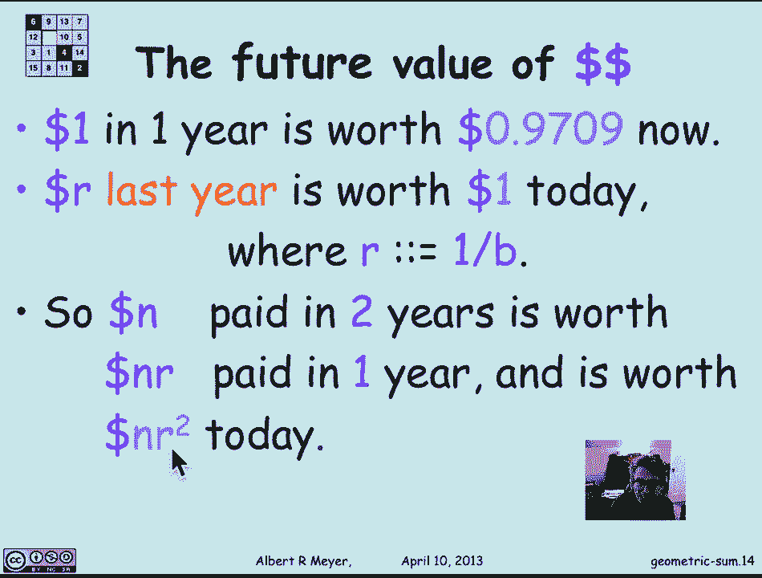

**问题：** 我（保险公司）承诺在未来10年内，每年末支付给你100美元。假设年利率固定为3%，你现在应该支付多少保费 \(Y\) 才公平？

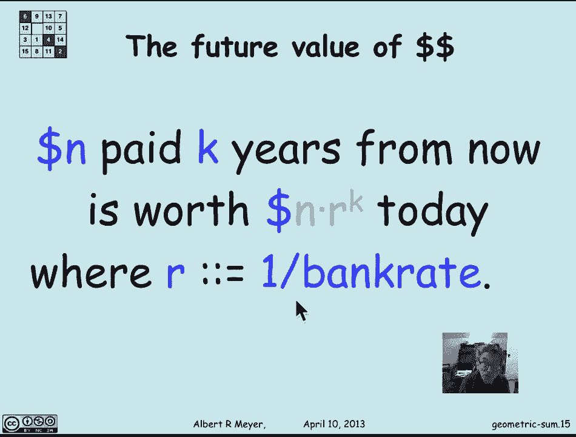

**分析：**
- 第1年末的100美元，现值 = \(100 \cdot r^1\)
- 第2年末的100美元，现值 = \(100 \cdot r^2\)
- ...
- 第10年末的100美元，现值 = \(100 \cdot r^{10}\)

公平的保费 \(Y\) 应等于所有这些现值之和：
\[
Y = 100r + 100r^2 + \dots + 100r^{10} = 100r (1 + r + r^2 + \dots + r^9)
\]

括号内是一个几何和，公比为 \(r\)，项数为10（从 \(r^0\) 到 \(r^9\)）。应用几何和公式：

**计算：**
\[
Y = 100r \cdot \frac{1 - r^{10}}{1 - r}
\]
代入 \(b=1.03, r=1/b \approx 0.9709\)，进行计算：
\[
Y \approx 100 \times 0.9709 \times \frac{1 - 0.9709^{10}}{1 - 0.9709} \approx 853.02
\]

因此，这份年金的公平保费约为 **853.02 美元**。虽然未来支付总额是1000美元，但由于货币的时间价值，其当前价值更低。

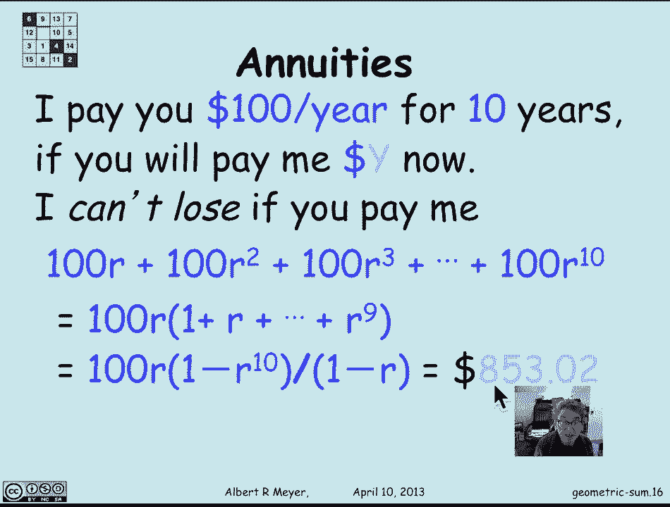

**思考：** 如果签订合约后，银行利率上升到5%（即 \(r\) 变小），这份合约对谁更有利？答案是**支付保费的你**。因为计算现值时使用的折现因子变小了，未来支付的100美元“更不值钱”了，这意味着保险公司（我）当初收取的853.02美元保费，相对于新的利率环境显得过高了，所以你占了便宜。

---

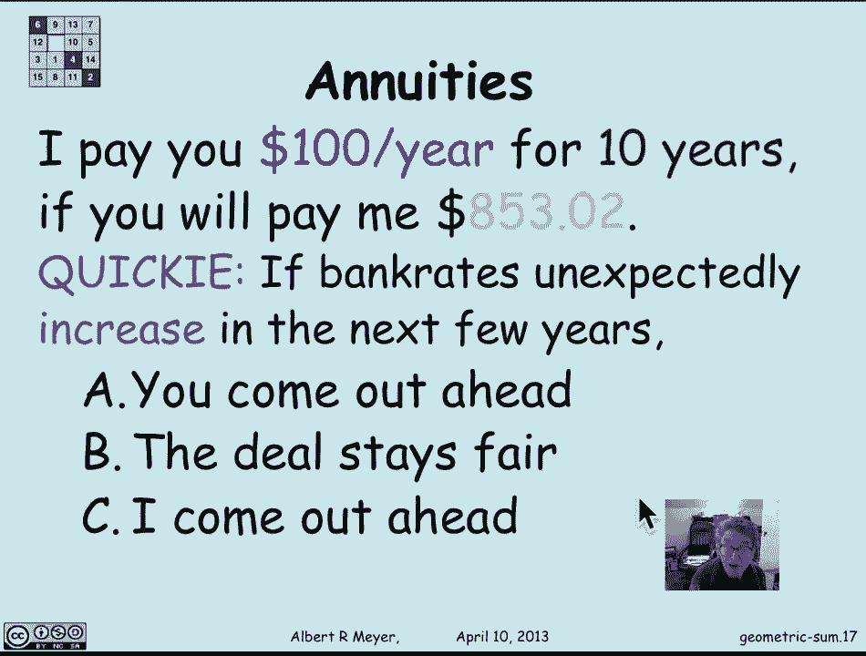

本节课中我们一起学习了：
1.  **几何和**的定义及其封闭形式公式：\(G_n = \frac{1 - x^{n+1}}{1 - x}\)，并通过**扰动法**推导了它。
2.  **几何级数**在 \(|x| < 1\) 条件下的求和公式：\(S = \frac{1}{1 - x}\)。
3.  几何和的一个典型**应用**：利用折现因子 \(r\) 计算**货币的未来价值**，并以此分析了**年金**的公平定价问题。