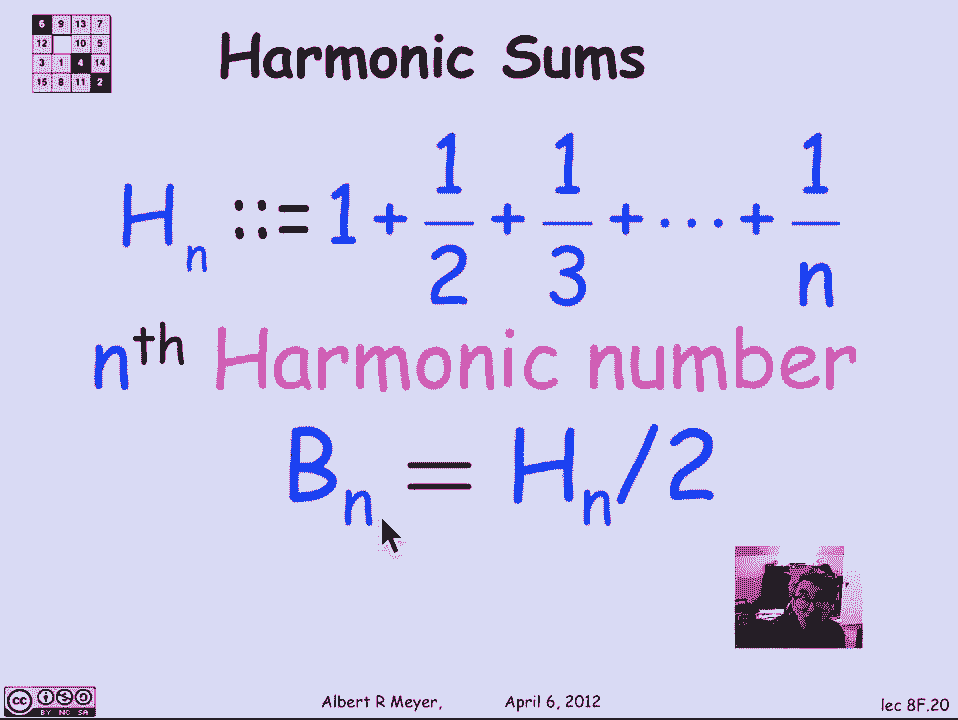
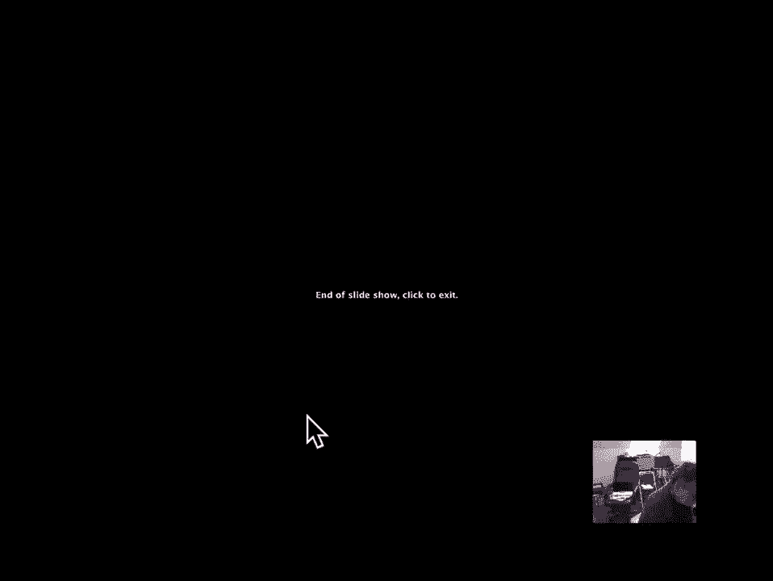

# 计算机科学的数学基础：L3.1.5：书本堆叠问题 📚

在本节课中，我们将学习一种在计算机科学中频繁出现的求和类型——**调和和**。我们将通过一个具体的例子来探讨它：如何将一堆书本堆叠在桌子边缘，并使其尽可能向外延伸而不掉落。

---

## 概述

我们将从最简单的情况开始分析，逐步推导出使用 `n` 本书时能达到的最大悬垂距离。这个过程将自然地引出**调和数**的概念。我们将看到，最大悬垂距离 `B_n` 与调和数 `H_n` 直接相关，其公式为 `B_n = (1/2) * H_n`。

---

## 单本书的情况

首先，我们考虑最简单的情况：只有一本书。

假设书本是均匀的，长度为1单位。其质心位于书本的正中央，即距离两端各 `1/2` 的位置。为了使书本在桌子边缘保持平衡而不掉落，书本的质心必须恰好位于桌子边缘的正上方。因此，一本书能伸出的最大距离是 `1/2`。

由此，我们得到单本书的悬垂公式：
`B_1 = 1/2`

---

## 从 `n` 本书到 `n+1` 本书

上一节我们介绍了单本书的平衡原理。本节中，我们来看看如何递归地构建一个更大的稳定书堆。

假设我们已经知道如何将 `n` 本书堆叠成一个稳定的结构（即其整体质心位于支撑点上方）。现在，我们想在第 `n` 本书的下方再添加一本书（第 `n+1` 本），并使整个新堆叠的悬垂距离最大化。

关键思路如下：
1.  整个 `n+1` 本书堆叠的质心必须位于桌子边缘，这是获得最大悬垂的条件。
2.  顶部的 `n` 本书作为一个整体，其质心必须位于底部那本书（第 `n+1` 本）的右边缘，这样才能在底部书本上获得最大延伸。
3.  底部书本自身的质心在其中心，距离其右边缘 `1/2`。

因此，问题转化为：顶部 `n` 本书（质心在底部书本右边缘）和底部一本书（质心在其中心）如何在桌子边缘达到平衡？这就像一个杠杆，两端重量分别为 `n` 和 `1`，支点（桌子边缘）位于它们之间。

设 `Δ` 为从顶部 `n` 本书的质心到整个 `n+1` 本书质心（即桌子边缘）的距离。根据杠杆平衡原理（力矩相等），我们有：
`n * Δ = 1 * (1/2 - Δ)`

解这个方程：
`nΔ = 1/2 - Δ`
`nΔ + Δ = 1/2`
`Δ(n + 1) = 1/2`
`Δ = 1 / (2(n + 1))`

这个 `Δ` 就是增加一本书所带来的悬垂增量。

---

## 悬垂距离的通项公式

根据上面的推导，我们可以建立悬垂距离 `B_n` 的递归关系。

已知：
`B_1 = 1/2`
`B_{n+1} = B_n + Δ = B_n + 1/(2(n+1))`

将这个递归式展开：
`B_n = 1/2 + 1/(2*2) + 1/(2*3) + ... + 1/(2*n)`
`B_n = (1/2) * (1 + 1/2 + 1/3 + ... + 1/n)`

括号内的求和 `1 + 1/2 + 1/3 + ... + 1/n` 被称为第 `n` 个**调和数**，记作 `H_n`。

因此，`n` 本书能达到的最大悬垂距离公式为：
`B_n = (1/2) * H_n`

---

## 核心概念总结

以下是本节课的核心公式与概念：

*   **单本书悬垂**：`B_1 = 1/2`
*   **悬垂增量**：添加第 `n+1` 本书时，悬垂增加 `Δ = 1/(2(n+1))`
*   **递归关系**：`B_{n+1} = B_n + 1/(2(n+1))`
*   **调和数**：`H_n = 1 + 1/2 + 1/3 + ... + 1/n`
*   **通项公式**：`n` 本书的最大悬垂 `B_n = (1/2) * H_n`

---

## 总结

本节课中，我们一起学习了**书本堆叠**这一经典问题。我们从简单的物理平衡原理出发，通过递归的思想，推导出了使用 `n` 本书时能获得的最大悬垂距离公式。这个公式揭示了一个有趣的现象：最大悬垂距离与调和数 `H_n` 成正比。虽然调和数随着 `n` 增大会增长，但增长非常缓慢（对数级），这意味着即使堆叠很多书，悬垂距离的增长也极其有限。这个例子巧妙地展示了递归思维和调和和在分析算法与结构问题中的应用。