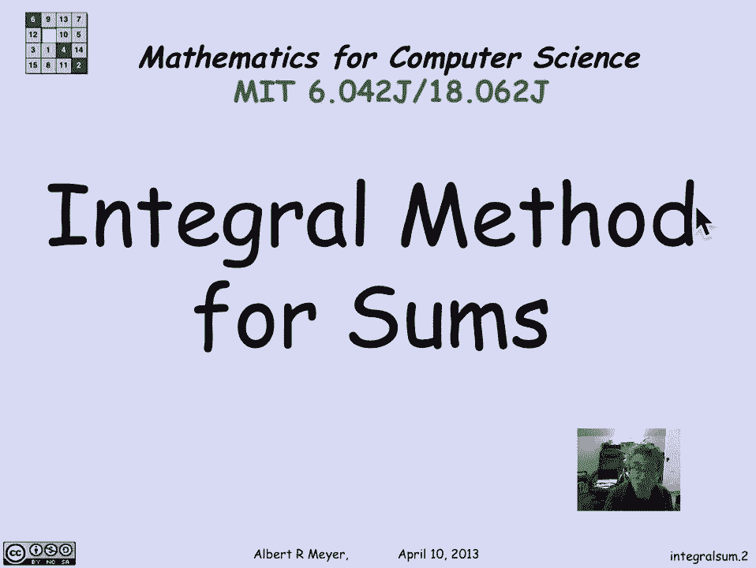
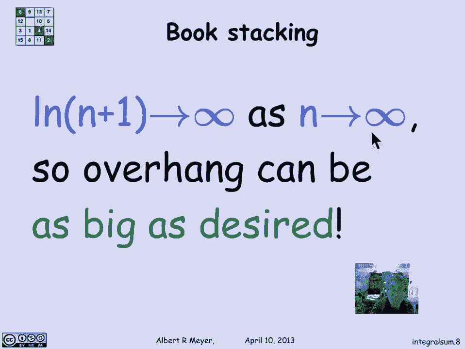
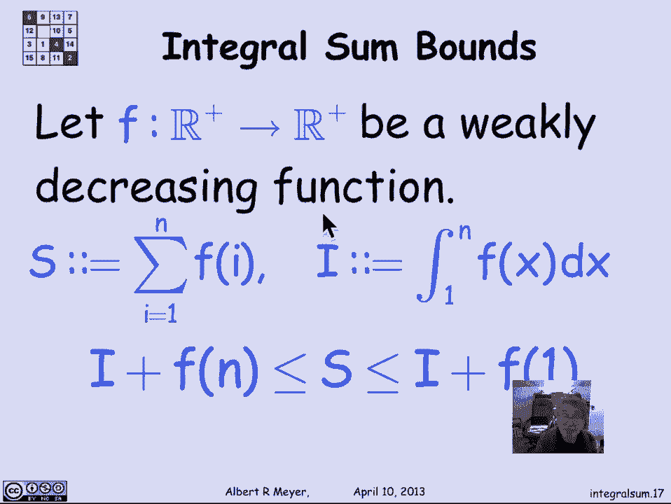

# 计算机科学的数学基础：P70：L3.1.7 - 积分法 📐

在本节课中，我们将学习如何使用**积分法**来估计和计算**调和数**。我们将通过一个有趣的“书本堆叠”问题引入，并推导出调和数的上下界，最终理解**渐近等价**的概念。



---

## 问题引入：书本堆叠

上一节我们讨论了书本堆叠问题。我们发现，当有 `N` 本书时，最上层书的悬垂距离是**调和和**的一半。这个调和和 `H_N` 定义为：
```
H_N = 1 + 1/2 + 1/3 + ... + 1/N
```
问题在于，没有简单的公式能精确计算这个和。但是，我们可以使用**积分法**来得到一个非常准确的估计。

## 使用积分法求下界

为了估计 `H_N`，我们将其与一个积分进行比较。

想象一系列宽度为1的矩形，第一个矩形高度为1，第二个为1/2，第三个为1/3，以此类推。这些矩形的总面积就等于我们想求的调和数 `H_N`。

我们关心 `H_N` 的下界，因为它能告诉我们至少需要多少本书才能达到某个悬垂距离。为了找到下界，我们观察一条穿过矩形左上角的曲线 `y = 1/(x+1)`。

这条曲线严格位于所有矩形的下方。因此，曲线 `y = 1/(x+1)` 从 `0` 到 `N` 下方的面积，就是矩形总面积（即 `H_N`）的一个下界。

计算这个积分：
```
∫(0 to N) 1/(x+1) dx = ln(N+1)
```
因此，我们得到下界：
```
H_N > ln(N+1)
```
这个下界告诉我们，要使悬垂距离达到3本书的长度（即 `H_N >= 6`），需要满足 `ln(N+1) >= 6`。解这个不等式，得到 `N >= e^6 - 1 ≈ 403`。这意味着，理论上大约需要403本书。



## 实际应用与上界推导

在实际实验中，使用较轻且坚硬的物体（如CD盒）可以更好地验证这个模型。一个由43个CD盒堆成的塔，其顶层可以伸出桌子边缘约1.8到1.9个盒子的长度，这与我们的理论预测相符。

接下来，我们用类似的逻辑推导 `H_N` 的上界。这次，我们观察一条穿过矩形右上角的曲线 `y = 1/x`。

这条曲线严格位于所有矩形的上方。因此，曲线 `y = 1/x` 从 `1` 到 `N` 下方的面积，就是 `H_N` 的一个上界。


计算这个积分：
```
∫(1 to N) 1/x dx = ln(N)
```
同时，我们需要加上第一个矩形的高度 `1`。因此，我们得到上界：
```
H_N < 1 + ln(N)
```

## 综合上下界与渐近等价

结合我们得到的上下界，可以将调和数 `H_N` 约束在以下范围内：
```
ln(N+1) < H_N < 1 + ln(N)
```
随着 `N` 增大，`ln(N+1)` 和 `1 + ln(N)` 的值会越来越接近。这意味着，`H_N` 的增长行为主要由 `ln(N)` 主导。

在数学中，我们用**渐近等价**（Asymptotic Equivalence）来描述这种关系，记作 `~`。其精确定义为：
```
f(N) ~ g(N)  当且仅当   lim (N→∞) [f(N) / g(N)] = 1
```
因此，我们可以说：
```
H_N ~ ln(N)
```
这意味着当 `N` 非常大时，`H_N` 近似等于 `ln(N)`，低阶项的影响可以忽略。

## 积分法的一般形式

让我们总结一下积分法的一般步骤。假设 `f(x)` 是一个正的、单调递减的函数。

定义：
*   `S = f(1) + f(2) + ... + f(N)` （我们想求的和）
*   `I = ∫(1 to N) f(x) dx` （对应的积分）

那么，我们可以得到和的上下界：
```
I + f(N) <= S <= I + f(1)
```
这个定理为我们提供了一种通用的、通过积分来估计求和的方法。

---

## 总结



本节课中，我们一起学习了**积分法**。我们从书本堆叠问题出发，通过将求和与积分比较，推导出了**调和数 `H_N`** 的上下界，并得出结论：`H_N` **渐近等价**于 `ln(N)`。最后，我们概括了积分法对于单调递减函数求和估计的一般形式。掌握这个方法，对于分析算法复杂度等领域中的求和问题非常有帮助。