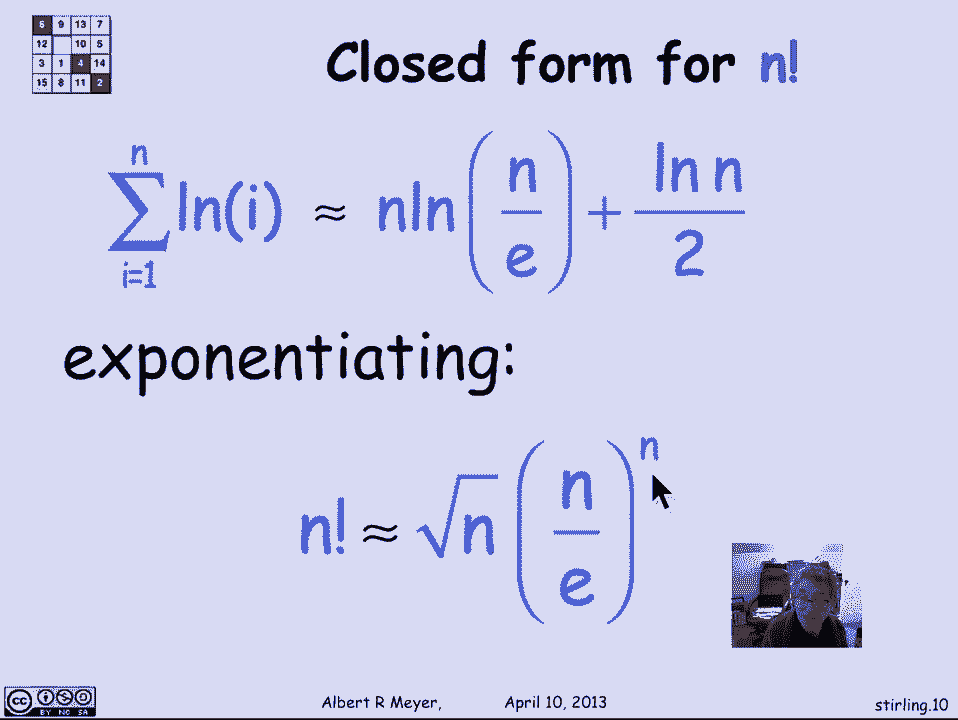
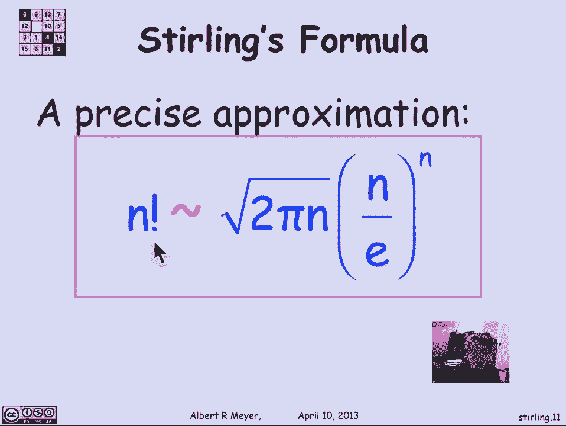

# 计算机科学的数学基础：L3.1.9：斯特林公式 📊

在本节课中，我们将学习如何估算乘积，特别是**n的阶乘**（n!）。我们将通过取对数将乘积转化为求和，并利用积分方法，最终推导出估算n!的著名公式——斯特林公式。

## 从乘积到求和 🔄

估算乘积的一种通用方法是先取对数，将其转化为求和问题。对于n的阶乘，其定义为前n个正整数的乘积：

**公式：** `n! = 1 × 2 × ... × (n-1) × n`

在乘积符号中，可以表示为：

**公式：** `n! = ∏_{i=1}^{n} i`

为了估算这个乘积，我们首先计算其自然对数：

**公式：** `ln(n!) = ln(1) + ln(2) + ... + ln(n) = ∑_{i=1}^{n} ln(i)`

现在，我们的目标变成了估算这个求和式。

## 应用积分方法 📐

上一节我们介绍了积分方法，本节中我们来看看如何用它来估算对数求和。我们关注函数 `f(x) = ln(x)`，这是一个在正实数域上单调递增的函数。

根据积分方法定理，对于一个单调递增函数 `f`，其求和 `S = ∑_{i=1}^{n} f(i)` 满足以下不等式：

**公式：** `∫_{1}^{n} f(x) dx + f(1) ≤ S ≤ ∫_{1}^{n} f(x) dx + f(n)`

将 `f(x) = ln(x)` 代入，我们得到：

**公式：** `∫_{1}^{n} ln(x) dx ≤ ∑_{i=1}^{n} ln(i) ≤ ∫_{1}^{n} ln(x) dx + ln(n)`

接下来，我们需要计算这个积分。根据微积分知识，`ln(x)` 的不定积分为：

**公式：** `∫ ln(x) dx = x ln(x) - x + C`

因此，定积分的计算结果为：

**公式：** `∫_{1}^{n} ln(x) dx = [x ln(x) - x]_{1}^{n} = n ln(n) - n + 1`

将这个结果代回不等式，我们得到对数求和的边界：

**公式：** `n ln(n) - n + 1 ≤ ln(n!) ≤ n ln(n) - n + 1 + ln(n)`

## 推导斯特林公式（启发式）🧪

上面的边界已经相当紧凑。为了得到一个更简洁的近似，我们可以取上下界的“中间值”。一种启发式的做法是，将 `ln(n!)` 近似为积分值加上边界项 `ln(n)` 的一半：

**公式：** `ln(n!) ≈ n ln(n) - n + (1/2) ln(n)`

现在，我们对等式两边取指数（以e为底），将求和转换回乘积：

**公式：** `n! ≈ e^{n ln(n) - n + (1/2) ln(n)} = e^{ln(n^n)} * e^{-n} * e^{ln(√n)} = n^n * e^{-n} * √n`

由此，我们得到一个初步的近似公式：

**公式：** `n! ≈ √n * (n/e)^n`

这个启发式推导虽然不严格，但给出了一个非常接近真实值的估计。

## 精确的斯特林公式 🎯

实际上，存在一个更精确的渐近公式来描述n的阶乘，这就是著名的**斯特林公式**：

**公式：** `n! ~ √(2πn) * (n/e)^n`

符号 `~` 表示“渐近等于”，即当n趋向于无穷大时，公式两边的比值趋近于1。

以下是关于斯特林公式的几个关键点：
*   它提供了一个极其精确的、无需计算大量乘积即可估算巨大数值n!的方法。
*   公式中的常数 `√(2π)` 是通过更深入的数学分析（如瓦利斯公式）得出的，本课程不展开证明。
*   这个公式在概率论、组合数学和算法分析中会频繁出现，用于估算二项式系数等。

## 总结 📝

本节课中我们一起学习了如何估算乘积，特别是n的阶乘。
1.  我们首先通过取对数，将 `n!` 的乘积问题转化为 `ln(i)` 的求和问题。
2.  接着，我们应用积分方法，得到了 `ln(n!)` 的上下界。
3.  通过启发式的平均处理和对数还原，我们推导出了 `n!` 的近似形式 `√n * (n/e)^n`。
4.  最后，我们介绍了更精确的最终版本——**斯特林公式**：`n! ~ √(2πn) * (n/e)^n`。这个公式是计算机科学中估算阶乘大小的一个强大工具。