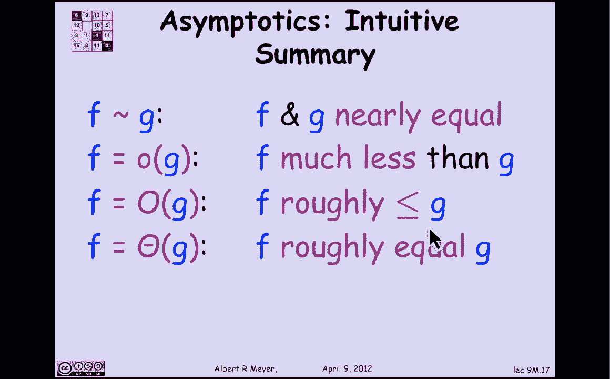

# 计算机科学的数学基础：L3.2.1：渐近符号

在本节课中，我们将学习描述函数增长率之间关系的四种渐近符号。这些符号是分析算法效率的核心工具，能帮助我们理解算法运行时间或空间需求随输入规模增长的变化趋势，而忽略掉具体的常数因子和低阶项。

## 渐近相等 (Asymptotically Equal)

上一节我们介绍了分析增长率的需求，本节中我们首先来看最简单的渐近关系：**渐近相等**。

符号 `f(n) ~ g(n)` 读作“f(n) 渐近等于 g(n)”。其定义是：当 `n` 趋于无穷大时，`f(n)` 与 `g(n)` 的比值的极限为 1。

**公式**：
```
f(n) ~ g(n)  ⇔  lim (n→∞) [f(n) / g(n)] = 1
```

让我们看一个例子：`n²` 渐近等于 `n² + n`。原因如下：
计算极限 `lim (n→∞) [(n² + n) / n²]`。通过代数简化，该极限等于 `lim (n→∞) [1 + 1/n]`。当 `n` 趋于无穷大时，`1/n` 趋于 0，因此极限为 1。所以，这两个函数是渐近相等的。

从定义可以直接推导出渐近相等的一些简单性质。

以下是其主要性质：
*   **对称性**：如果 `f ~ g`，那么 `g ~ f`。证明思路是考虑极限 `lim (g/f)`，它等于 `1 / lim (f/g)`，而后者为 1。
*   **传递性**：如果 `f ~ g` 且 `g ~ h`，那么 `f ~ h`。证明可通过极限的代数运算完成。

综上所述，渐近相等是一个**等价关系**。需要强调的是，这是函数之间的关系。当我们写 `f(n) ~ g(n)` 时，我们的意思是函数 `f` 渐近等于函数 `g`。

## 渐近小于 (Asymptotically Smaller Than)

理解了渐近相等后，我们接下来看一个表示严格大小关系的符号：**渐近小于**。

符号 `f(n) = o(g(n))` 读作“f(n) 是 g(n) 的小 o”。其定义是：当 `n` 趋于无穷大时，`f(n)` 与 `g(n)` 的比值的极限为 0。

**公式**：
```
f(n) = o(g(n))  ⇔  lim (n→∞) [f(n) / g(n)] = 0
```

例如，`n² = o(n³)`，因为 `lim (n→∞) [n² / n³] = lim (n→∞) [1/n] = 0`。

类似于渐近相等，可以证明“小 o”关系构成了函数集上的一个**严格偏序**。

## 渐近上界 (Big O Notation)


现在，我们来看计算机科学中 arguably 最重要、也最复杂的渐近关系：**大 O 符号**。


符号 `f(n) = O(g(n))` 读作“f(n) 是 g(n) 的大 O”。其定义是：`f(n)` 与 `g(n)` 比值的**上极限**是一个有限数（即不为无穷大）。这粗略地意味着 `f` 的增长速度不超过 `g` 的某个常数倍。

**公式**：
```
f(n) = O(g(n))  ⇔  lim sup (n→∞) [f(n) / g(n)] < ∞
```

（注：`lim sup` 表示上极限，目前我们可以先简单理解为“增长速率的上界是有限的”）。

例如，`3n² = O(n²)`，因为比值 `3n² / n² = 3`，是一个有限常数。大 O 符号的关键在于它忽略了常数因子。这在计算机科学中非常有用，因为算法运行的具体时间依赖于硬件，但增长率是算法本身的属性。

## 渐近紧确界 (Theta Notation)

最后，我们介绍结合了“不超过”和“不低于”概念的符号：**Θ 符号**。

符号 `f(n) = Θ(g(n))` 读作“f(n) 是 g(n) 的 Θ”。其定义是：`f(n) = O(g(n))` 且 `g(n) = O(f(n))`。这意味着 `f` 和 `g` 的增长速率处于同一数量级。

**公式**：
```
f(n) = Θ(g(n))  ⇔  f(n) = O(g(n)) 且 g(n) = O(f(n))
```

从定义可以直接得出，Θ 关系也是一个**等价关系**。

## 总结

本节课中我们一起学习了四种描述函数增长率关系的渐近符号：

*   **`f ~ g` (渐近相等)**：意味着 `f` 和 `g` 的增长率**几乎完全相同**（比值的极限为1）。
*   **`f = o(g)` (渐近小于)**：意味着 `f` 的增长率**远小于** `g`（比值的极限为0）。
*   **`f = O(g)` (大O)**：意味着 `f` 的增长率**粗略地小于或等于** `g`（忽略常数因子）。
*   **`f = Θ(g)` (Θ)**：意味着 `f` 和 `g` 的增长率**粗略地相等**（处于同一数量级）。



这些符号是分析算法复杂度、比较算法效率的基础语言。在接下来的课程中，我们将更详细地探讨这些符号的性质和应用。