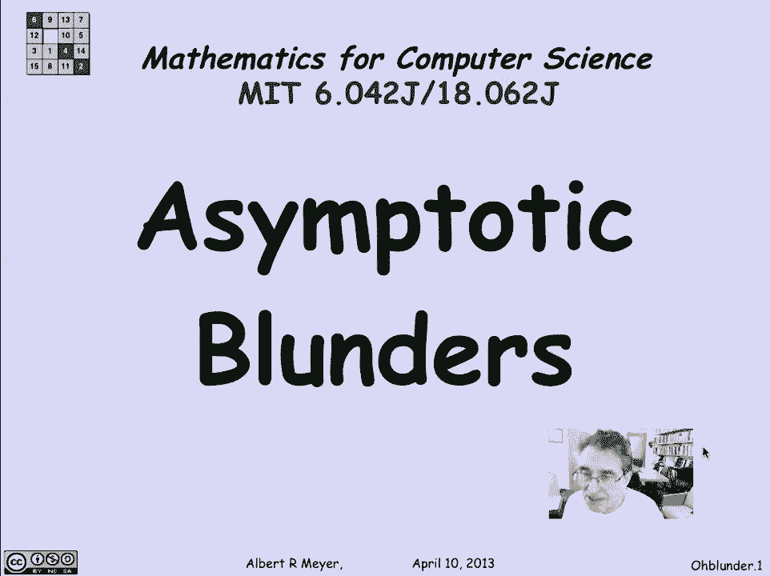
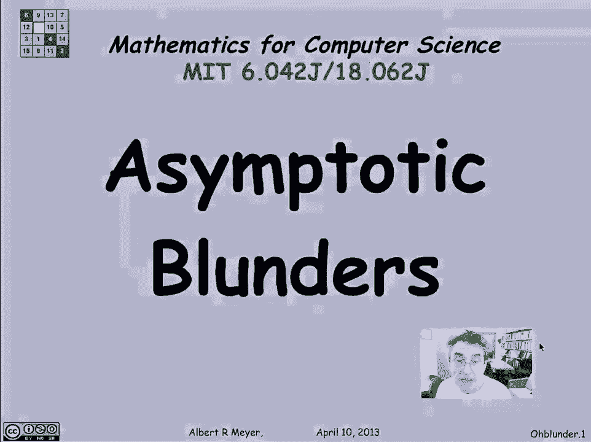
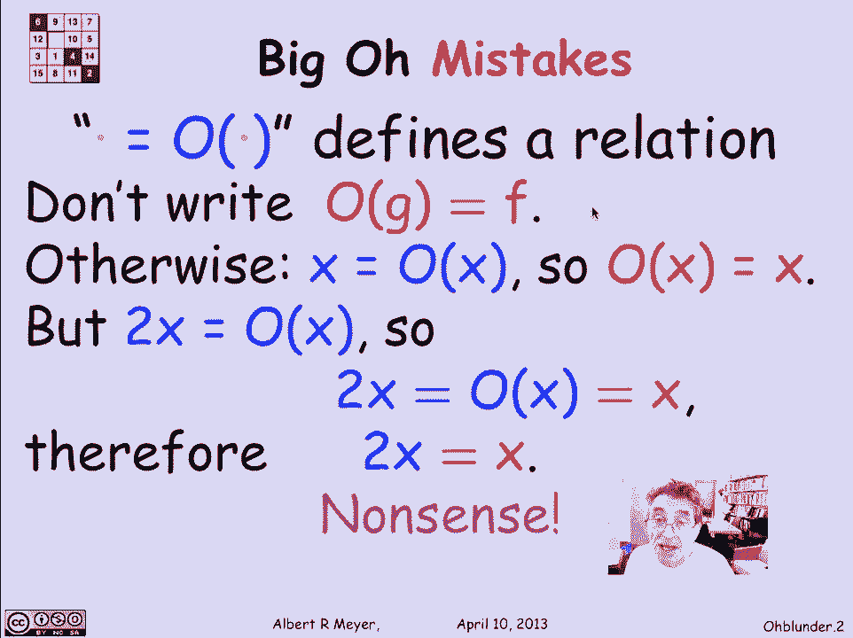
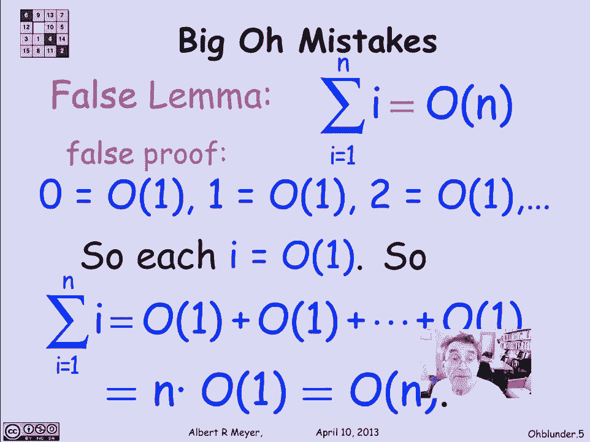

# 计算机科学的数学基础：P74：L3.2.6- 渐近符号常见错误 🚫

在本节课中，我们将学习在使用渐近符号，特别是大O符号时，人们常犯的一些错误。理解这些错误有助于我们更准确、更严谨地分析算法的复杂度。

## 概述

大O符号是描述函数增长率的强大工具，但它的表示法有时会让人产生误解。本节我们将剖析几个典型的误用案例，并解释其背后的正确概念。

---

## 大O符号的本质：一种关系，而非数量

首先，最重要的一点是理解大O符号的本质。像 **1/x = O(1)** 这样的表达式，其等号 `=` 实际上表示的是一种**二元关系**，而非两个数量之间的相等关系。

大O符号 `O(f)` 本身**不是一个数量**，因此不能将其当作一个数学对象进行常规的代数运算。历史上，曾有人建议用集合属于符号 `∈` 来替代等号，这样更能体现“函数f属于由函数g定义的集合”这一本质。但由于大O表示法已在多个数学社区根深蒂固，这一改变未能实现。

### 对称性的陷阱

一个常见的错误源于对等号的误解，即认为关系具有对称性。例如，如果 `f = O(g)`，就错误地写出 `O(g) = f`。

**以下是这种推理为何错误的分析：**

1.  我们知道 `x = O(x)` 显然成立。
2.  如果错误地认为 `O(x) = x` 也成立（即对称性），那么 `O(x)` 就被当作了一个等于 `x` 的数量。
3.  同时，根据大O定义，`2x = O(x)` 也成立。
4.  将 `2x = O(x)` 和 `O(x) = x` 结合起来，就会推导出 `2x = x` 的荒谬结论。

这清楚地表明，将 `O(g)` 视为一个数量并进行代数替换会导致矛盾。我们必须始终记住，`f = O(g)` 是一个整体，表示“f的增长率不超过g的常数倍”。

---

## 大O表示上界，而非下界

另一个虽不严重但不够严谨的错误，是误用大O来表达下界。

人们有时会说：“`f` 至少是 `O(n²)`”。这种说法的问题在于，“至少是 `O(n²)`” 试图将 `O(n²)` 当作一个可以比较大小的数量。

*   **正确的理解**：`f = O(n²)` 意味着 `n²` 是 `f` 的一个**渐近上界**（在常数因子内）。
*   **如何表达下界**：如果你想直观地说 `n²` 是 `f` 的一个下界，正确的表述是 `n² = O(f)`。这表示 `f` 的增长率**不低于** `n²` 的增长率（即 `f` 至少和 `n²` 增长得一样快）。

---

## 一个“错误证明”的案例分析

最后，我们来看一个更具迷惑性的错误示例，它错误地“证明”了前n个自然数之和是 `O(n)`。我们知道，实际上 `1 + 2 + ... + n = n(n+1)/2`，它是 `Θ(n²)`。

**以下是这个错误的证明过程：**

1.  首先注意到，任何常数都是 `O(1)`。例如，0, 1, 2 都是 `O(1)`。这是正确的。
2.  在求和式 `∑_{i=1}^n i` 中，每一项 `i` 都是一个具体的数（如1, 2, 3...）。根据上一点，每个 `i` 都可以写成 `O(1)`。
3.  因此，原求和式被写成：`O(1) + O(1) + ... + O(1)` （共n项）。
4.  这等于 `n * O(1)`。
5.  由此得出结论：总和是 `O(n)`。

**这个证明错在哪里？**
证明过程中隐含地使用了未经证实的“算术规则”。关键错误在于第二步：虽然每个单独的 `i`（视为常数函数）是 `O(1)`，但这里的 `i` 并不是一个固定的常数，它随着循环索引变化。大O符号描述的是函数在输入趋于无穷时的整体行为，不能这样逐项替换并求和。`O(1)` 隐藏的常数因子可能各不相同，且可能依赖于 `n`，因此将它们简单相加的推理是无效的。这是初学者容易落入的思维陷阱。

---

## 总结

本节课我们一起学习了使用渐近符号时的三个常见错误：
1.  **切勿将大O视为数量**：记住 `f = O(g)` 表示一种增长率上的比较关系，而非等式。不要对 `O(g)` 进行代数运算。
2.  **明确上下界**：大O (`O`) 描述的是**渐近上界**。若想描述下界，应使用 `Ω` 符号，或通过 `g = O(f)` 来表达 `f` 是 `g` 的下界。
3.  **避免滥用算术**：不要随意对包含大O的表达式进行加、乘等算术运算，除非你严格遵循其数学定义。分析求和式或复杂表达式时，应回归定义进行整体判断。

理解并避免这些错误，能帮助我们在算法分析中更准确、更专业地使用渐近符号。