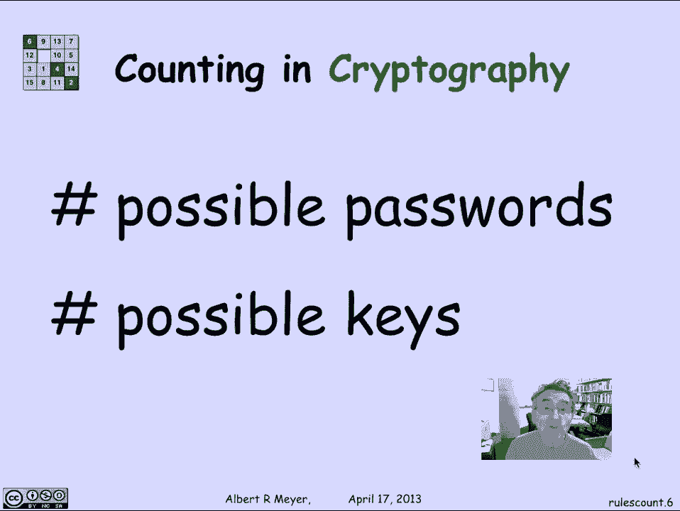
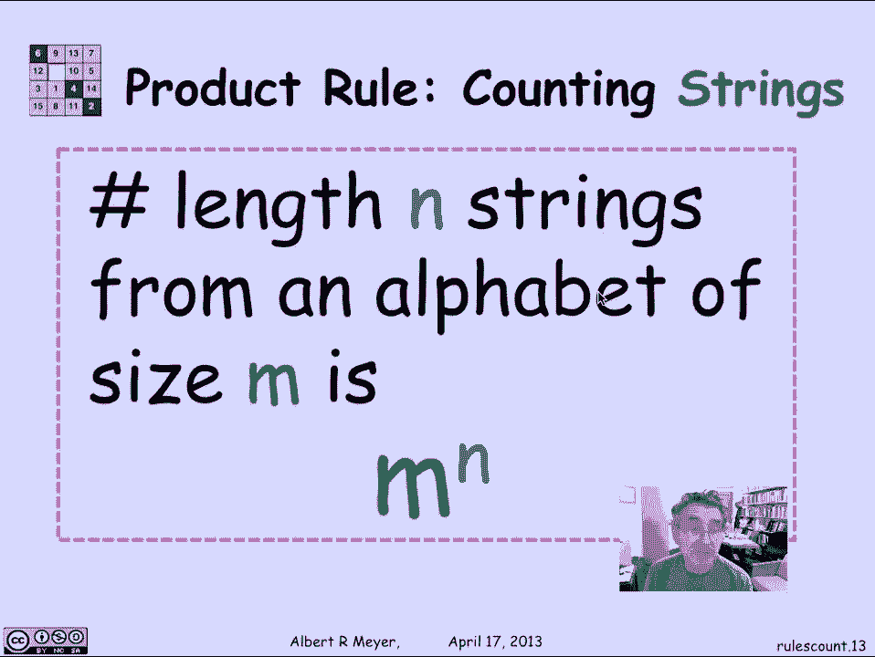
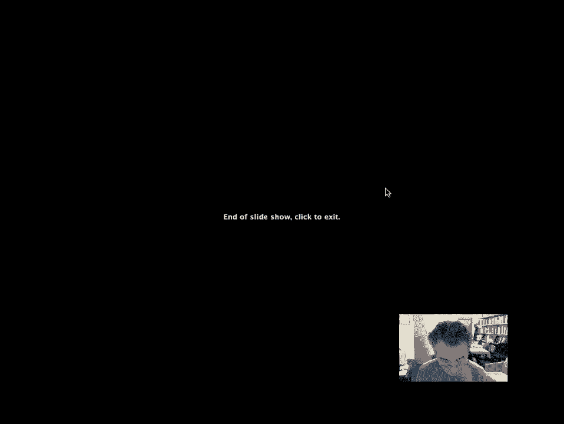

# 计算机科学的数学基础：L3.3.1：求和与乘积规则 📊

在本节课中，我们将要学习组合学中最基础的两个计数规则：求和规则与乘积规则。组合学是计算机科学等多个领域的重要数学基础，其起源与计算概率和可能性密切相关。掌握这些基本规则，是理解更复杂计数问题（如算法分析、密码学强度评估等）的第一步。

## 组合学的起源与应用 🎲

组合学与计数的起源与历史上的赌博研究有关，人们通过计算各种事件发生的次数来确定下注策略。一个典型的问题是计算在扑克游戏中，拿到特定手牌（如“一对J”）的概率。这需要计算所有可能的五张牌手牌总数中，属于该类别的手牌所占的比例。

在计算机科学中，组合学同样至关重要。例如，在编写棋类游戏程序时，需要估算为了向前预测，程序需要搜索多少种可能的棋局位置。解决魔方问题也涉及计算从给定状态可以到达多少种不同的位置。

在算法分析中，我们经常需要计算对数据结构进行操作所需的步骤数，例如对n个数字进行排序所需的比较次数，其典型的下界是 `n log n`。此外，在密码学领域，为了确保加密的安全性，密钥空间必须足够大，使得对手无法通过穷举搜索所有可能的密钥来破解。

## 基本计数规则：求和规则 ➕

上一节我们介绍了组合学的背景，本节中我们来看看第一个基本计数规则——求和规则。这条规则非常直观。



**求和规则**指出：如果两个集合A和B没有重叠（即互斥），那么它们的并集 `A ∪ B` 中的元素数量，等于集合A的元素数量加上集合B的元素数量。


用公式表示为：
```
|A ∪ B| = |A| + |B|， 其中 A ∩ B = ∅
```

以下是求和规则的两个简单例子：
*   假设一个班级有43名女生和54名男生，且没有学生性别模糊。那么班级总人数就是女生与男生人数之和：`43 + 54 = 97`。
*   考虑由26个小写英文字母、26个大写英文字母和10个数字（0-9）组成的字符集。该字符集的总字符数为：`26 + 26 + 10 = 62`。

## 基本计数规则：乘积规则 ✖️

了解了如何对互斥集合进行计数后，我们来看看另一种常见场景——对有序组合进行计数的乘积规则。

**乘积规则**指出：如果一个任务可以通过两个连续的步骤完成，第一步有 `m` 种方法，第二步有 `n` 种方法，那么完成整个任务总共有 `m × n` 种方法。从集合角度看，如果集合A的大小为 `m`，集合B的大小为 `n`，则从A和B中各取一个元素构成有序对 `(a, b)` 的所有可能组合数为 `m × n`。

用公式表示为：
```
|A × B| = |A| × |B|
```

以下是乘积规则的一个例子：
*   假设有4个男孩和3个女孩，要组成一对男女搭档。选择男孩有4种方法，对于每个被选中的男孩，选择女孩都有3种方法。因此，总共可以组成 `4 × 3 = 12` 对不同的搭档。

更一般地，我们可以用乘积规则来计算字符串的数量。例如，考虑长度为4的二进制字符串（由0和1组成）。我们可以将构造这样一个字符串的过程，视为依次为4个位置中的每一个选择数字（0或1）。每个位置都有2种选择。根据乘积规则，总的字符串数量为：
```
2 × 2 × 2 × 2 = 2^4 = 16
```

推广到一般情况：如果一个字符串的长度为 `n`，且每个字符都来自一个大小为 `m` 的字母表，那么可能的字符串总数为：
```
m^n
```

## 总结 📝

本节课中我们一起学习了组合学中最基础的两个计数工具。
*   **求和规则**用于计算多个**互斥**事件或集合的总可能性数量，其核心是**加法**。
*   **乘积规则**用于计算多个**连续选择**步骤产生的总可能性数量，其核心是**乘法**。





这两个规则虽然简单，但它们是解决更复杂计数问题的基石，在算法分析、概率计算以及密码学等领域都有广泛应用。理解并熟练运用它们是深入学习计算机科学数学基础的关键一步。