# 计算机科学的数学基础：L3.3.3：用双射计数 📊

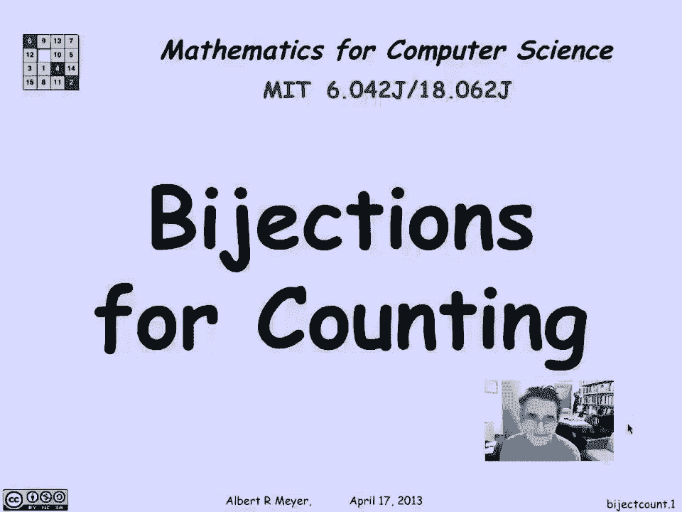

在本节课中，我们将学习组合学中的一个核心技巧——**双射计数**。我们将通过几个具体的例子，展示如何通过建立两个集合之间的双射关系，将一个难以直接计算的问题转化为一个更容易计算的问题。

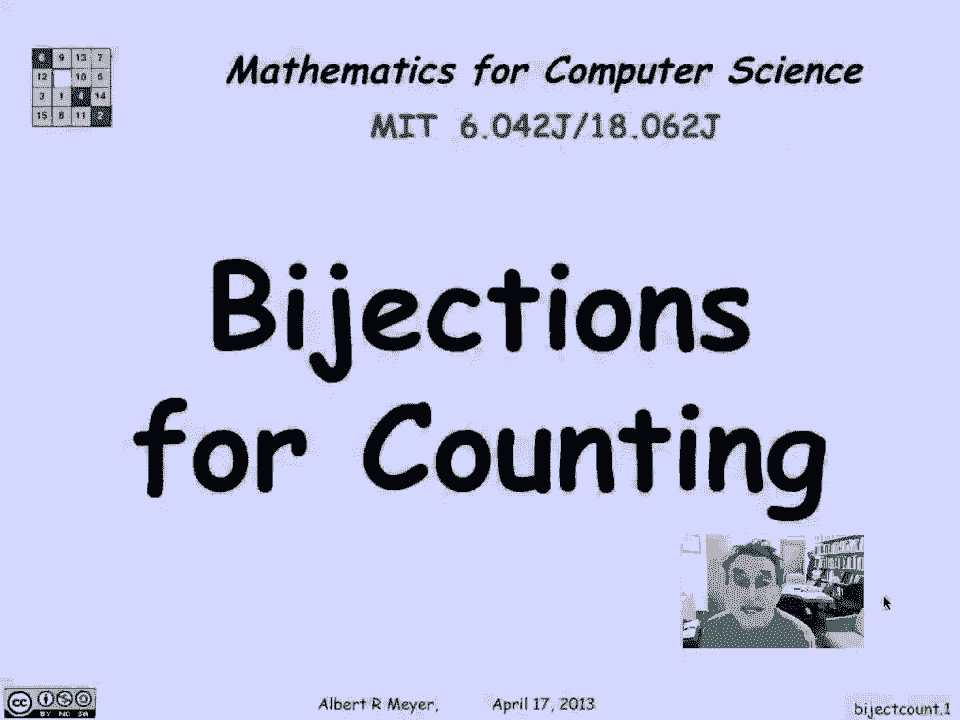

---

## 概述

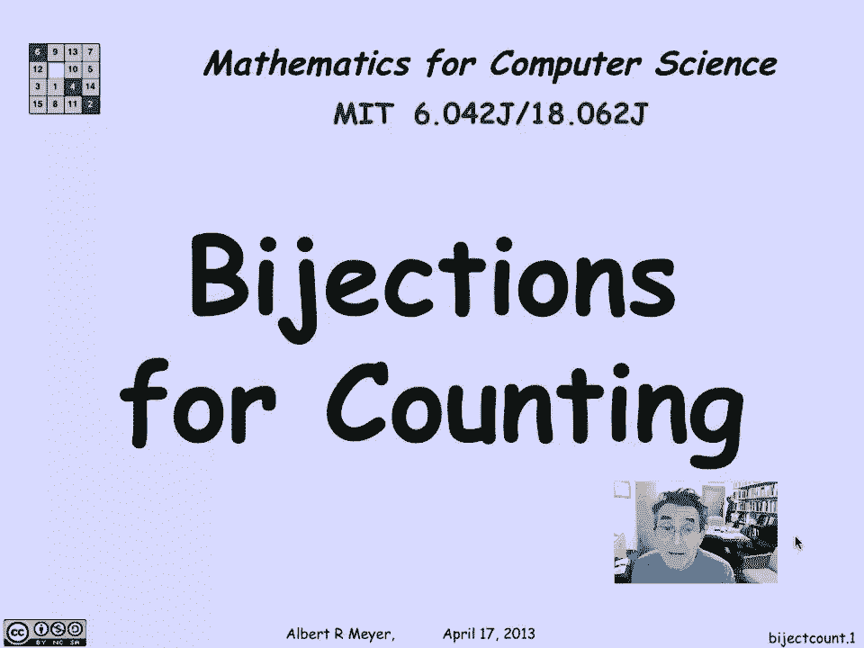

双射计数的基本思想是：**通过计算一个已知或更易计算的集合的大小，来推断另一个与之存在一一对应关系的集合的大小**。这是一种非常强大的工具，可以简化许多计数问题。

---

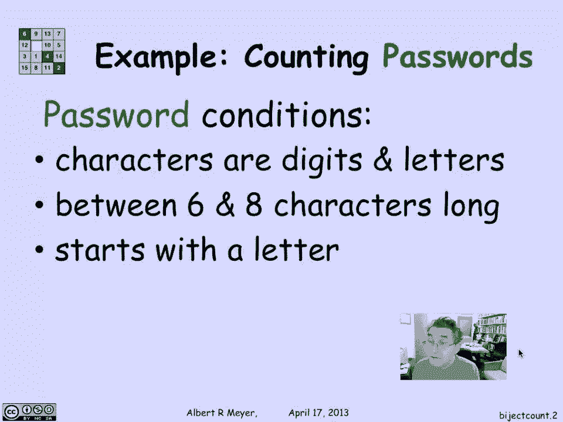

## 从简单计数开始

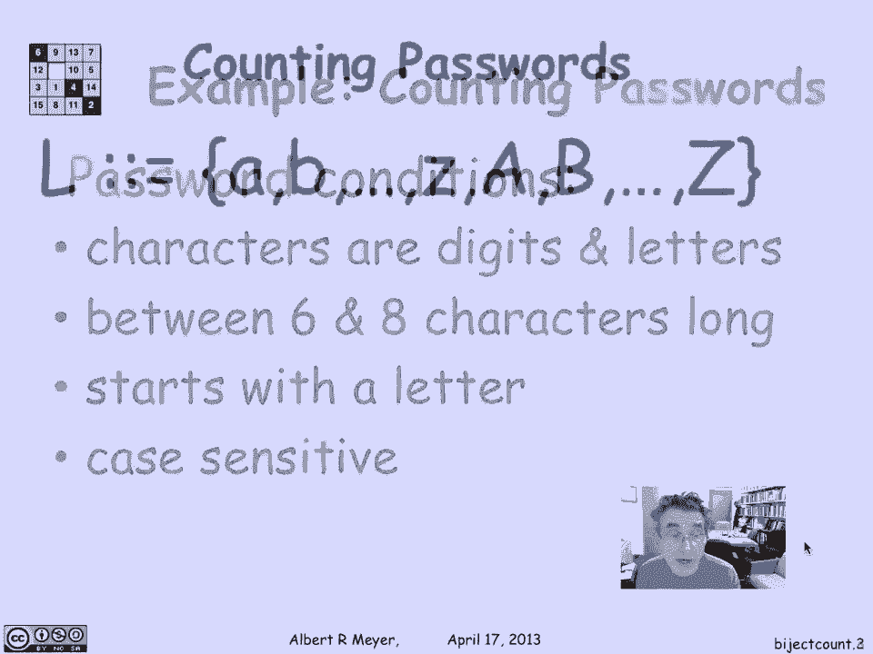

上一节我们介绍了基本的和规则与积规则。本节中，我们来看看如何应用这些规则解决一个简单的密码计数问题。

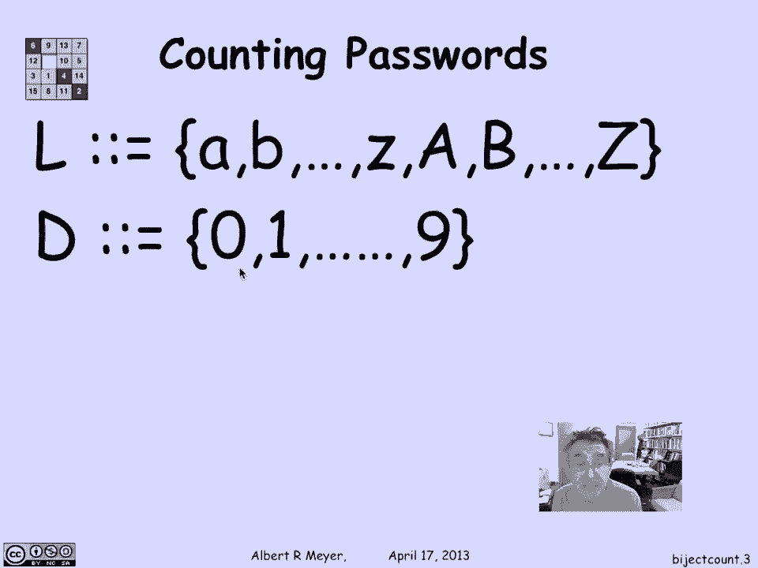

假设我们要计算符合特定规则的密码数量。密码定义如下：
*   密码是字母或数字组成的字符序列。
*   长度在6到8个字符之间。
*   必须以一个字母开头。
*   区分大小写（即大小写字母视为不同字符）。

我们定义：
*   字母集合 **L**（包含大小写字母，共52个）。
*   数字集合 **D**（0-9，共10个）。

首先，我们考虑长度为 `n` 的密码集合 **P_n**。根据规则，密码的第一个字符必须是字母，其余 `n-1` 个字符可以是字母或数字。

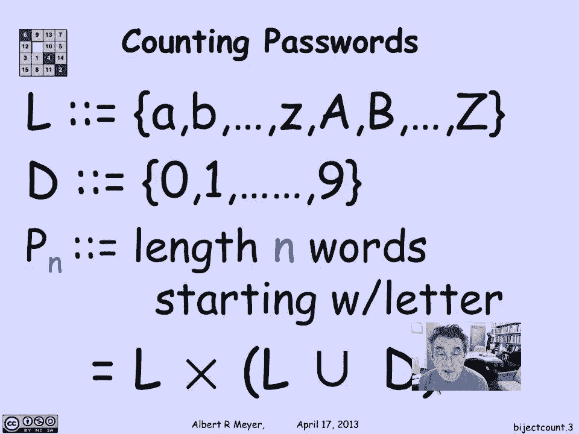

因此，一个长度为 `n` 的密码可以表示为：
**P_n = L × (L ∪ D)^{n-1}**

根据乘积规则，**P_n** 的大小为：
**|P_n| = |L| × |L ∪ D|^{n-1}**

由于字母和数字集合不相交，根据和规则，`|L ∪ D| = |L| + |D|`。

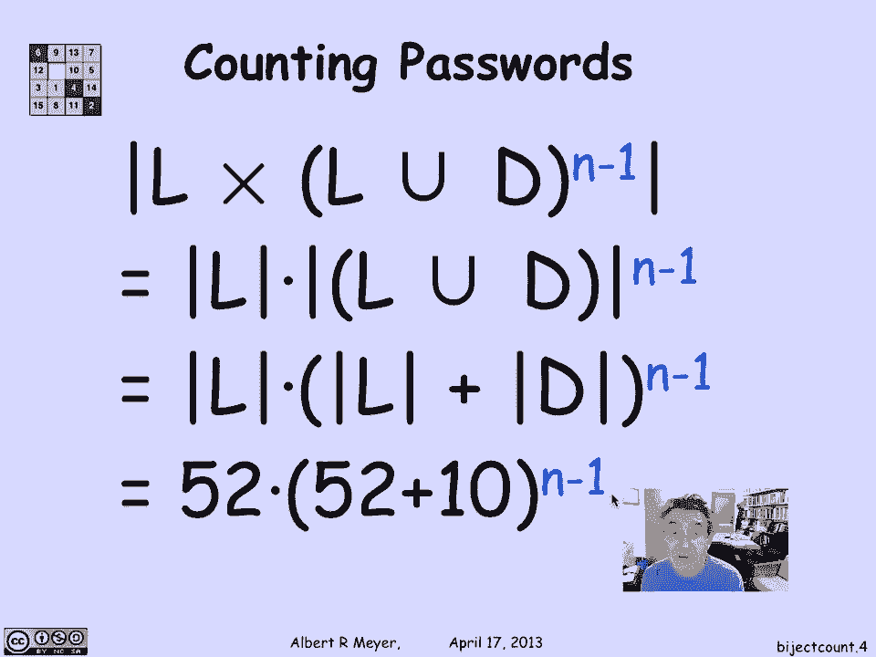

代入数值（`|L|=52`, `|D|=10`），我们得到公式：
**|P_n| = 52 × 62^{n-1}**

接下来，所有有效密码的集合 **P** 是长度为6、7、8的密码集合的**不相交并集**：
**P = P_6 ∪ P_7 ∪ P_8**

根据和规则，总密码数为：
**|P| = |P_6| + |P_7| + |P_8| = 52 × (62^5 + 62^6 + 62^7)**

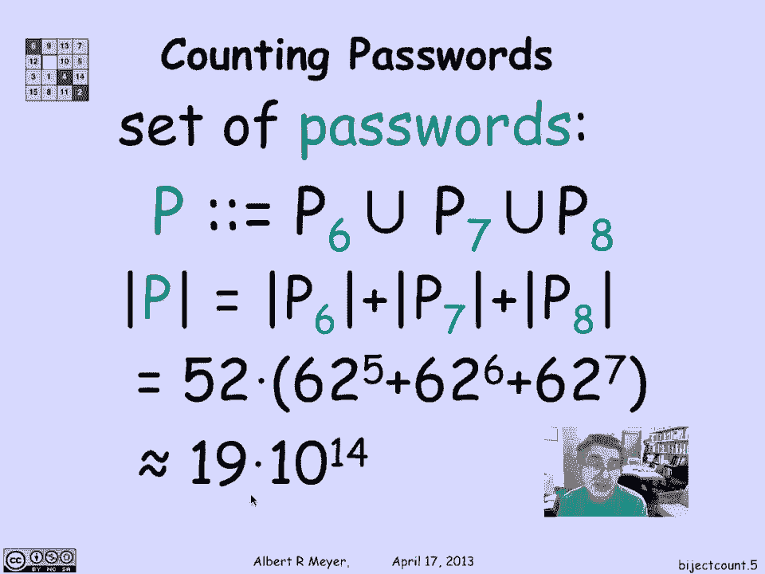

计算可得总数约为 `1.9 × 10^{14}`。这是一个直接应用和与积规则的典型例子。

---

## 计数技巧：补集与直接分解

现在，我们考虑另一个问题：**有多少个四位数字（序列）至少包含一个数字7？**

**方法一：直接分解（按第一个7出现的位置）**

我们可以根据“第一个7”出现在序列中的位置（第1、2、3或4位）来分类计数。令：
*   **7** 代表数字7。
*   **X** 代表任意数字（0-9，共10种可能）。
*   **O** 代表除7以外的任意数字（0-6, 8-9，共9种可能）。

以下是所有可能模式及其计数：
1.  模式 **7XXX**：第一个是7，后三位任意。计数为 `1 × 10 × 10 × 10 = 10^3`。
2.  模式 **O7XX**：第一个不是7，第二个是7，后两位任意。计数为 `9 × 1 × 10 × 10 = 9 × 10^2`。
3.  模式 **OO7X**：前两个不是7，第三个是7，最后一位任意。计数为 `9 × 9 × 1 × 10 = 9^2 × 10`。
4.  模式 **OOO7**：前三个不是7，第四个是7。计数为 `9 × 9 × 9 × 1 = 9^3`。

由于这些模式通过“第一个7的位置”区分，它们互不相交。根据和规则，总数为：
**10^3 + (9 × 10^2) + (9^2 × 10) + 9^3 = 3439**

**方法二：使用补集计数**

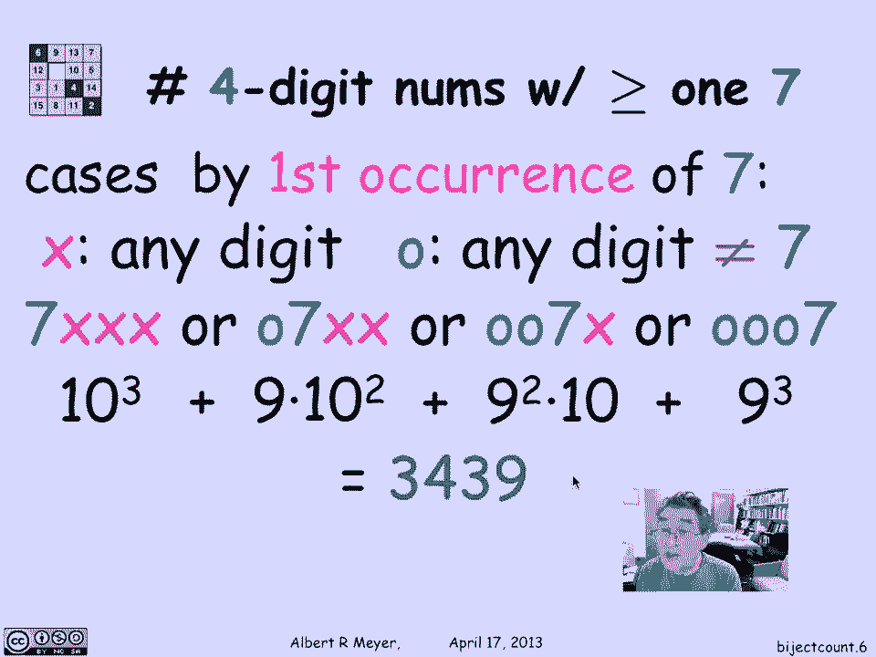

一个更巧妙的方法是先计算其补集。所有四位数字序列的总数是 `10^4`。其中“不包含任何数字7”的序列，每一位只能从9个数字（0-6, 8-9）中选择，共有 `9^4` 个。

因此，至少包含一个7的序列数为：
**10^4 - 9^4 = 10000 - 6561 = 3439**

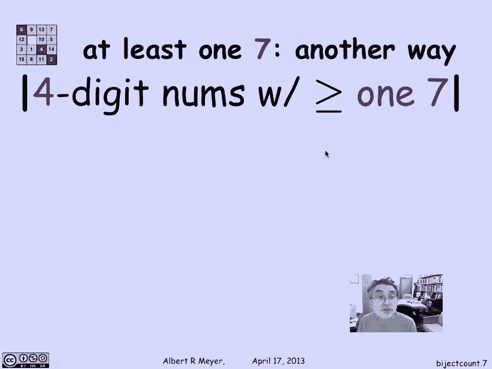

两种方法得到了相同的结果。补集法通常更简洁。

---

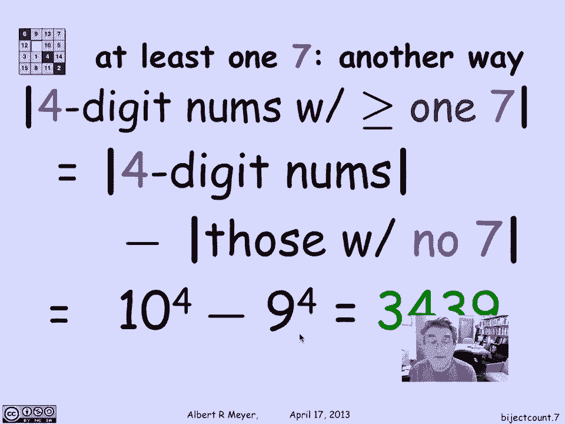

## 引入双射规则 🧩

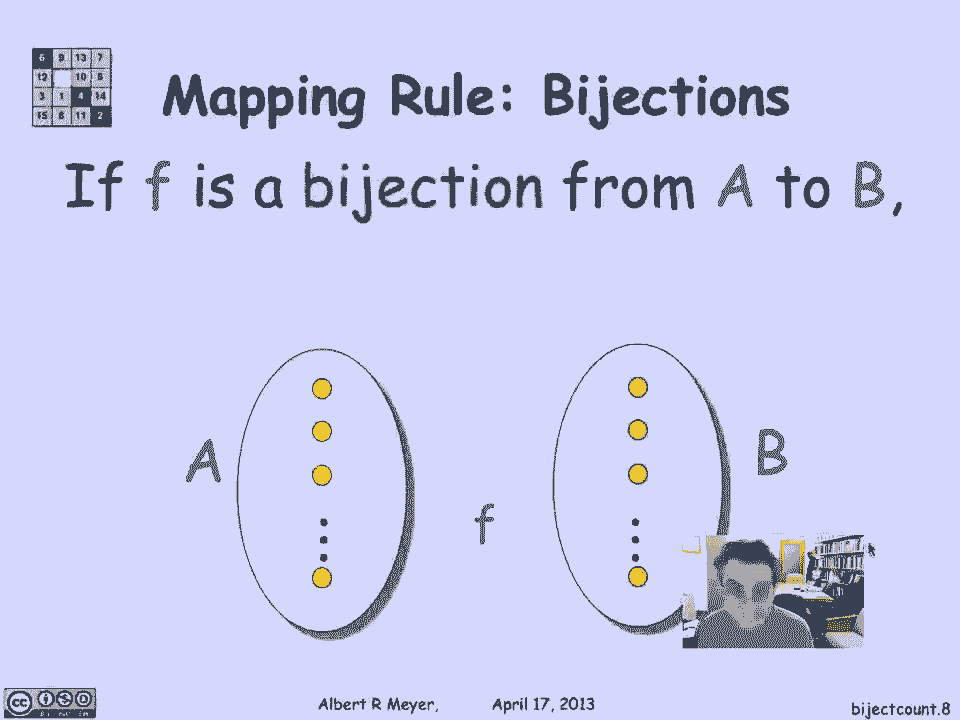

以上我们使用了基本的和与积规则。现在，我们引入并应用**双射规则**。

双射规则指出：**如果存在两个有限集合 A 和 B 之间的一个双射（一一对应），那么这两个集合的大小相等**。即，若 `f: A ↔ B` 是双射，则 `|A| = |B|`。

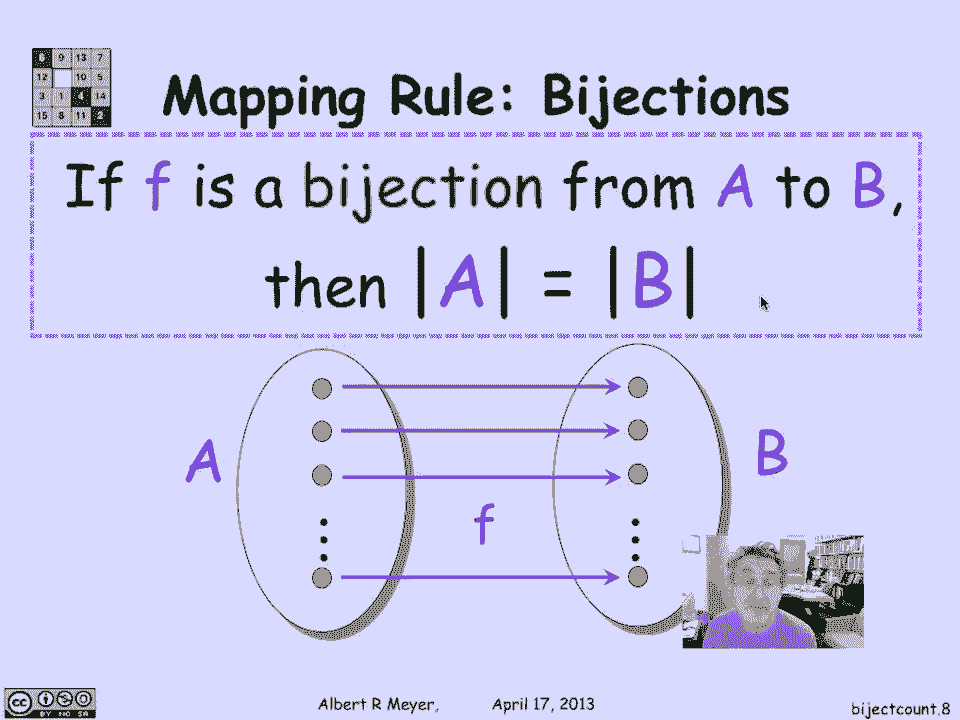

---

### 示例1：子集的数量

问题：**一个包含 n 个元素的集合，总共有多少个子集？**

设集合 **A = {a1, a2, ..., an}**。我们希望计算 A 的所有子集构成的集合（称为幂集）的大小。

我们可以在 **A 的子集** 和 **长度为 n 的二进制字符串** 之间建立一个双射。
*   对于一个给定的子集 S，我们构造一个二进制字符串 `b1b2...bn`，其中：
    *   如果 `ai ∈ S`，则 `bi = 1`。
    *   如果 `ai ∉ S`，则 `bi = 0`。
*   反之，给定任何一个长度为 n 的二进制字符串，我们可以唯一地确定它对应的子集。

这建立了一个一一对应关系（双射）。我们知道，长度为 n 的二进制字符串共有 `2^n` 个（每位有2种选择，根据乘积规则）。

因此，根据双射规则，集合 A 的子集总数也是：
**|P(A)| = 2^n**

这个结论可以优雅地表述为：**一个集合的幂集的大小是 2 的该集合大小次方**。

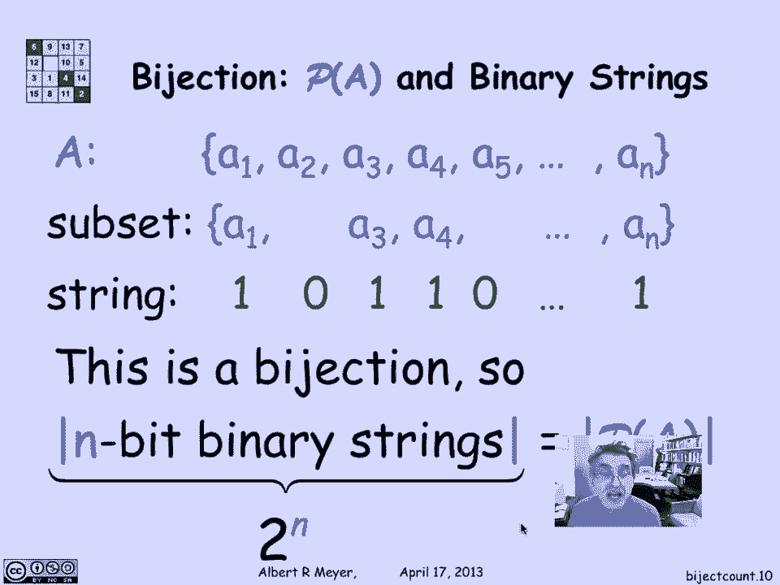

---

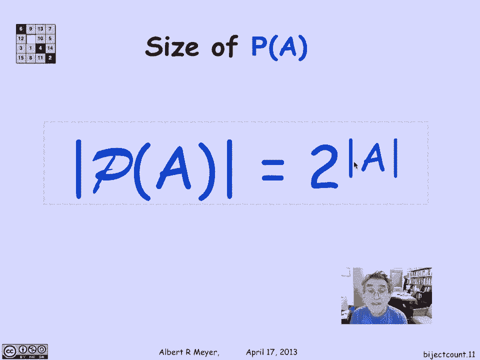

### 示例2：甜甜圈选择问题 🍩

这是一个更有趣的例子，它展示了即使我们暂时不知道如何计算双方，双射也能告诉我们两个集合大小相等。

问题：**有5种不同口味的甜甜圈（巧克力、柠檬、糖霜、原味釉面等）。要选择一打（12个）甜甜圈，共有多少种不同的选择方式？**（同一种口味的甜甜圈被视为无区别的）。

设集合 **A** 为所有可能的“12个甜甜圈选择”的集合。

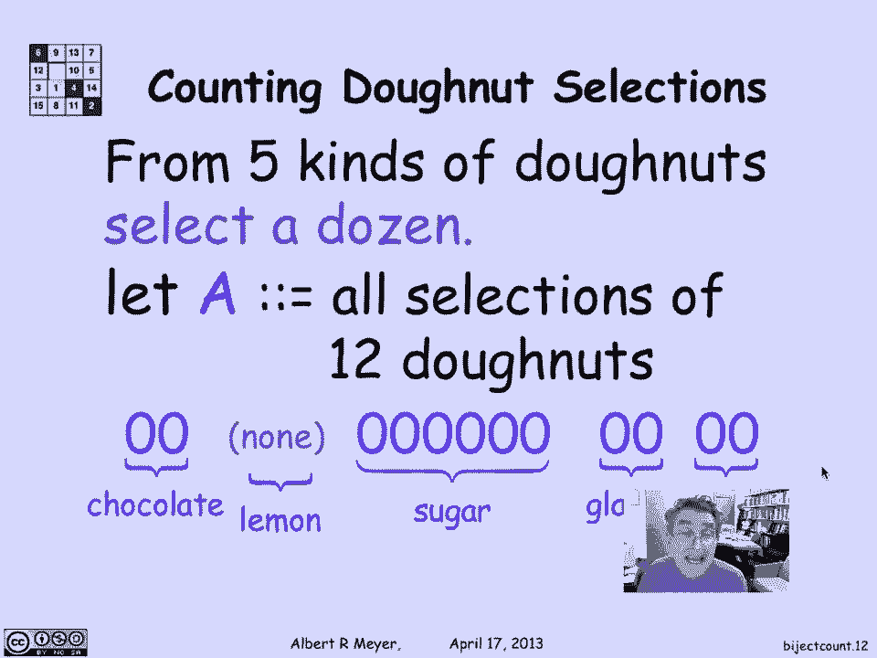

我们可以在集合 **A** 和另一个集合 **B** 之间建立双射。集合 **B** 定义如下：
*   **B** 是所有包含 **恰好4个‘1’** 的 **16位二进制字符串** 的集合。

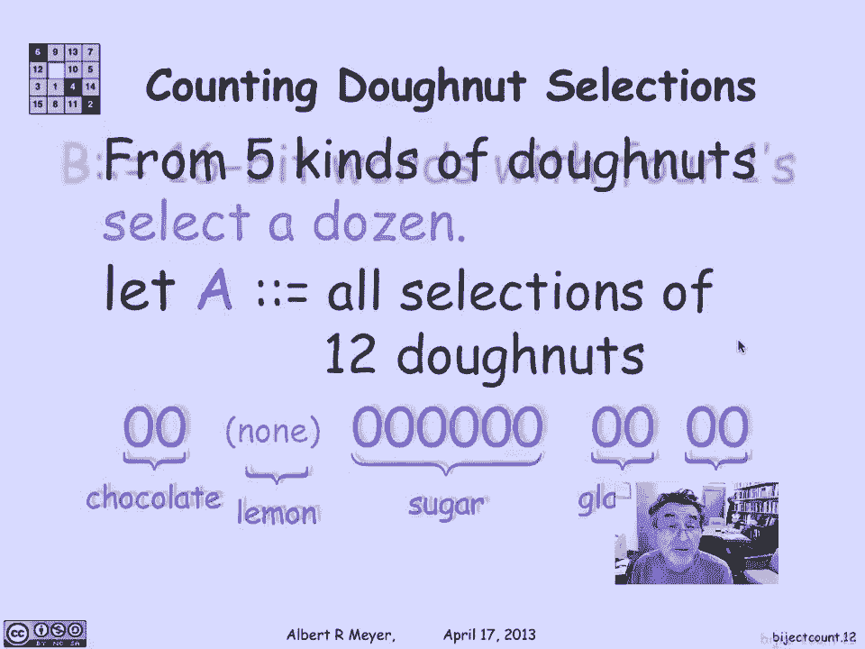

**双射的建立方法如下：**
1.  想象我们将12个甜甜圈（用‘0’表示）排成一排。
2.  我们需要用4个‘1’作为“分隔符”，将这12个‘0’分成5个组（对应5种口味）。
3.  第一个‘1’之前的‘0’的数量代表第一种口味（如巧克力）的甜甜圈数。
4.  第一个和第二个‘1’之间的‘0’的数量代表第二种口味（如柠檬）的甜甜圈数。
5.  依此类推，直到最后一个‘1’之后的‘0’的数量代表第五种口味的甜甜圈数。

**例如：** 选择 `2巧克力, 0柠檬, 6糖霜, 2釉面, 2原味`。
*   对应的二进制字符串为：`00 1 1 000000 1 00 1 00`
*   简化表示为：**0011000000100100**（共12个0，4个1）。

反之，给定任何一个恰好包含4个‘1’的16位字符串，我们可以唯一地还原出每种口味甜甜圈的数量，从而确定一个甜甜圈选择方案。

因此，我们成功地在 **甜甜圈选择方案集合 A** 和 **恰好包含4个‘1’的16位字符串集合 B** 之间建立了一个双射。

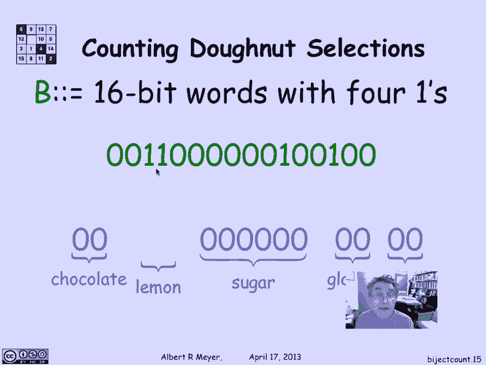

根据双射规则，我们得出结论：
**|A| = |B|**

尽管我们现在还不知道如何计算 `|B|`（我们将在后续课程中学到），但我们已经通过双射将原问题转化为了一个标准且易于后续处理的问题。

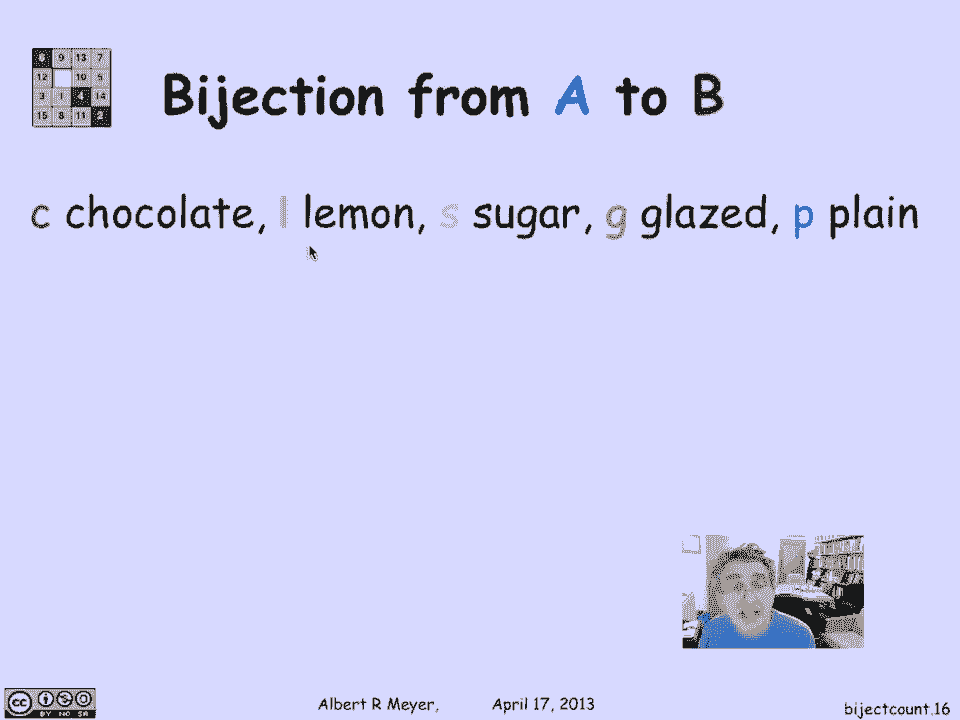

---

## 总结

本节课中我们一起学习了：
1.  **双射计数**的核心思想：通过建立两个集合间的一一对应，将未知的计数问题转化为已知或更易计算的问题。
2.  回顾并应用了**和规则**与**积规则**来解决基础的计数问题（如密码计数）。
3.  学习了**补集计数**这一实用技巧。
4.  通过两个经典例子（**子集计数**和**甜甜圈选择**）深入理解了如何构造双射，并利用双射规则得出计数结论。

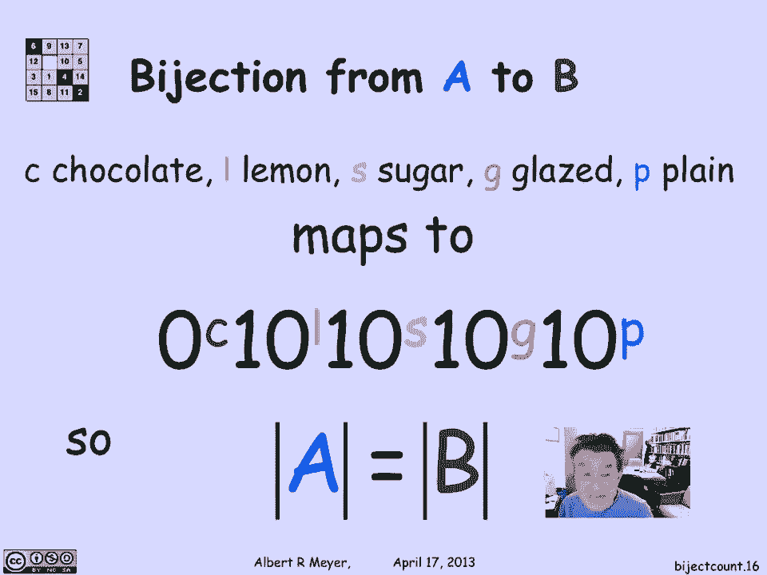

双射是组合数学中一个非常基本且强大的工具，它能够揭示不同数学对象之间深刻的数量联系。掌握这一技巧，将为解决更复杂的计数问题打下坚实的基础。