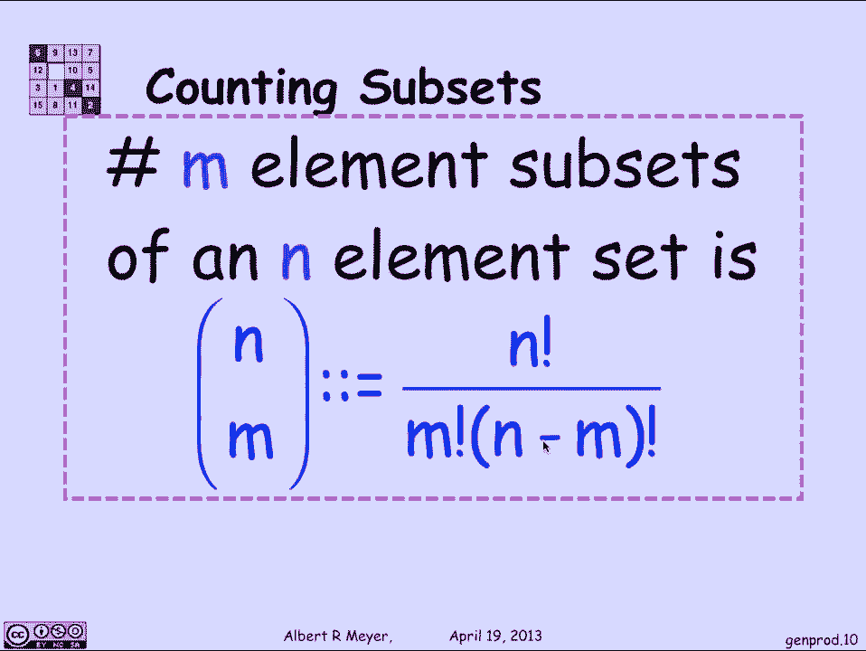

# 计算机科学的数学基础：L3.4.1：广义计数规则 📊

在本节课中，我们将学习计数规则的两个重要推广：广义乘积规则和广义双射规则（除法规则）。这些规则是组合数学中的核心工具，对于计算各种情况下的可能性数量至关重要。

## 广义乘积规则 ✖️

上一节我们介绍了基本的计数规则，本节中我们来看看其推广形式。广义乘积规则用于计算**无重复**的序列数量。

假设我们要计算从91名学生中选出5名学生进行排队（即一个序列）的方法数。如果同一个学生可以出现多次，那么根据普通乘积规则，方法数为 `91^5`。然而，在实际排队中，一个学生不能出现两次，即序列中不能有重复元素。

广义乘积规则可以解决这个问题。计算过程如下：
*   选择第一名学生有91种方法。
*   选择第二名学生时，只剩下90名可选。
*   选择第三名学生时，剩下89名可选。
*   以此类推，选择第五名学生时，剩下87名可选。

因此，长度为5的不同学生序列总数为：
`91 × 90 × 89 × 88 × 87`

这个结果可以用阶乘简洁地表示为 `91! / 86!`。

现在，让我们一般性地陈述广义乘积规则。

设 `Q` 是一组长度为 `k` 的序列，并满足以下属性：
*   有 `n1` 种可能的选择作为序列的第一个元素。
*   对于每一个确定的第一个元素，都有 `n2` 种可能的选择作为序列的第二个元素。
*   同样，对于每一对确定的前两个元素，都有 `n3` 种可能的选择作为第三个元素。
*   此规律持续到第 `k` 个元素。

那么，满足这些属性的不同序列的总数为：
`n1 × n2 × n3 × ... × nk`

## 广义双射规则（除法规则） ➗

接下来，我们探讨双射规则的推广，它被称为**除法规则**。一个简单易懂的类比是：如果你想数清一个班级的学生人数，你可以先数所有学生的手指总数，然后除以10（假设每个学生都有10根手指）。当然，这假设了每个学生的手指数量是恒定且已知的。

更形式化地说，除法规则如下：

如果存在一个从集合 `A` 到集合 `B` 的**满射函数** `f`，并且这个函数是 **`k` 对 1** 的映射（即 `B` 中的每一个元素都恰好被 `A` 中的 `k` 个元素映射到），那么两个集合的大小关系为：
`|A| = k × |B|`
由此可得：
`|B| = |A| / k`

## 关键应用：二项式系数 🔑

除法规则的一个关键且基础的应用是计算**组合数**，即从一个集合中选出指定大小子集的方法数。我们会反复使用这个结果。

**问题**：从数字 `{1, 2, ..., 13}` 中，有多少种方法可以选出一个大小为4的子集？

**解决方法**：
1.  设集合 `A` 为数字1到13的所有排列（即顺序序列）。我们知道 `|A| = 13!`。
2.  设集合 `B` 为我们想要计数的对象，即所有大小为4的子集。`|B|` 是未知的。
3.  我们构造一个从 `A` 到 `B` 的函数 `f`：对于一个排列，取其前四个元素，并忽略顺序，将它们视为一个集合。例如，排列 `(3, 1, 4, 2, 5, 6, ..., 13)` 被映射到集合 `{1, 2, 3, 4}`。
4.  现在，我们需要确定这个映射是“几对1”的。考虑一个特定的4元素子集，例如 `{1, 2, 3, 4}`。哪些排列会被映射到这个集合？
    *   前四个位置必须是1,2,3,4的某种排列，共有 `4!` 种方式。
    *   后九个位置可以是剩余数字 `{5, ..., 13}` 的任意排列，共有 `9!` 种方式。
    *   因此，总共有 `4! × 9!` 个不同的排列会被映射到同一个子集 `{1, 2, 3, 4}`。这意味着函数 `f` 是 `(4! × 9!)` 对 1 的映射。
5.  根据除法规则：
    `|A| = (4! × 9!) × |B|`
    `13! = (4! × 9!) × |B|`
    所以：
    `|B| = 13! / (4! × 9!)`

这个结果极其重要，它定义了**二项式系数**，记作：
`C(13, 4)` 或 `(13 choose 4)`，其计算公式为 `13! / (4! × 9!)`。

将其推广：从一个 `n` 元素集合中选出 `m` 个元素的子集的方法数，即**组合数**，由以下二项式系数公式给出：
`C(n, m) = n! / (m! × (n-m)!)`
这个公式需要牢记。

---

**本节课总结**：
本节课我们一起学习了两个核心的广义计数规则。
1.  **广义乘积规则**：用于计算具有特定约束（如无重复）的序列总数，公式为各阶段选择数的乘积。
2.  **除法规则**：是双射规则的推广，通过建立一个 `k` 对 1 的满射，利用已知集合大小来求解未知集合大小。
我们还将除法规则应用于一个经典问题，推导出了计算组合数的**二项式系数公式** `C(n, m) = n! / (m! × (n-m)!)`，这是组合数学中最基本和最重要的公式之一。