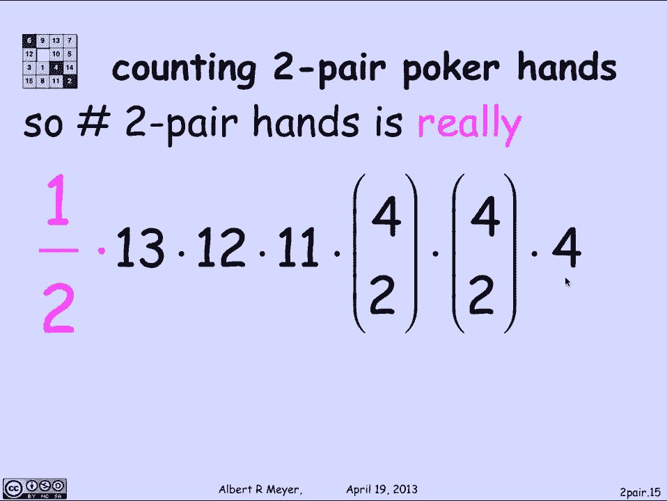

# 计算机科学的数学基础：L3.4.3：双对扑克手牌计数 🃏

在本节课中，我们将学习一个计数问题的基本示例，它展示了广义除法规则和广义乘积规则的应用。我们将具体计算一种被称为“双对”的扑克手牌数量。

扑克是一种游戏，每位玩家会从一副52张的牌中获得5张牌。双对手牌的定义是：手牌中包含两对相同点数的牌（即两个“对子”），以及一张与这两对点数都不同的第五张牌。

## 理解双对手牌

首先，我们来明确一下扑克牌的基本构成。一副牌有52张，分为13个**点数**（A, 2, 3, ..., 10, J, Q, K）和4个**花色**（♦ 方块, ♥ 红心, ♠ 黑桃, ♣ 梅花）。

一个双对手牌的结构如下：
1.  一个由两张相同点数牌组成的“对子”。
2.  另一个由两张相同点数牌组成的“对子”，但其点数必须与第一个对子不同。
3.  一张点数与上述两个对子都不同的第五张牌。

例如，一手双对牌可能是：两张K（K♦ 和 K♥），两张A（A♦ 和 A♠），以及一张3（3♣）。

## 初步计数尝试

上一节我们定义了双对手牌。本节中，我们来看看如何系统地计算其总数。一个直观的思路是，通过一系列选择来构建一手牌。

以下是构建一手双对牌的步骤：
1.  **选择第一个对子的点数**：有13种可能（A到K）。
2.  **选择第二个对子的点数**：必须与第一个不同，因此有12种可能。
3.  **选择第五张牌的点数**：必须与前两个都不同，因此有11种可能。
4.  **为第一个对子选择花色**：从4种花色中选2种，组合数为 `C(4, 2)`。
5.  **为第二个对子选择花色**：同样，组合数为 `C(4, 2)`。
6.  **为第五张牌选择花色**：有4种可能。

根据广义乘积规则，将每一步的选择数相乘，似乎就能得到总数。其计算公式为：
`13 * 12 * 11 * C(4, 2) * C(4, 2) * 4`

## 发现并修正错误

然而，这个计算存在一个**错误**。问题在于，我们的步骤序列（第一个对子、第二个对子）人为地为两个对子指定了“第一”和“第二”的顺序。

但实际上，一手双对牌中的两个对子是没有顺序之分的。“一对K和一对A”与“一对A和一对K”描述的是同一手牌。在我们的计数过程中，我们却将它们计为了两种不同的构建序列。

具体来说，我们构建的六元组 `(第一个点数, 第二个点数, 第五张牌点数, 第一个花色组合, 第二个花色组合, 第五张牌花色)` 与双对手牌之间的映射关系是 **2对1** 的。对于同一手牌（如K对和A对），我们有两种构建它的六元组：一种把K对当作“第一个对子”，另一种把A对当作“第一个对子”。

## 应用除法规则修正

既然我们已经正确地计算了所有可能的六元组数量，并且知道每个双对手牌都恰好对应 **2个** 这样的六元组，那么根据**除法规则**，双对手牌的实际数量就是六元组总数除以2。

因此，正确的计算公式为：
`(13 * 12 * 11 * C(4, 2) * C(4, 2) * 4) / 2`

让我们计算一下：
*   `C(4, 2) = 6`
*   分子部分：`13 * 12 * 11 * 6 * 6 * 4 = 247,104`
*   最终结果：`247,104 / 2 = 123,552`

所以，一副标准扑克牌中，总共有 **123,552** 种不同的双对手牌。

## 总结

本节课中我们一起学习了如何计算扑克牌中“双对”手牌的数量。我们首先尝试用广义乘积规则直接计算，但发现由于忽略了两个“对子”之间的无序性，导致了重复计数。然后，我们通过识别映射关系是2对1的，并应用除法规则，成功地修正了公式，得到了正确的计数结果 `123,552`。这个例子清晰地展示了在计数问题中，仔细分析被计数对象之间映射关系的重要性。