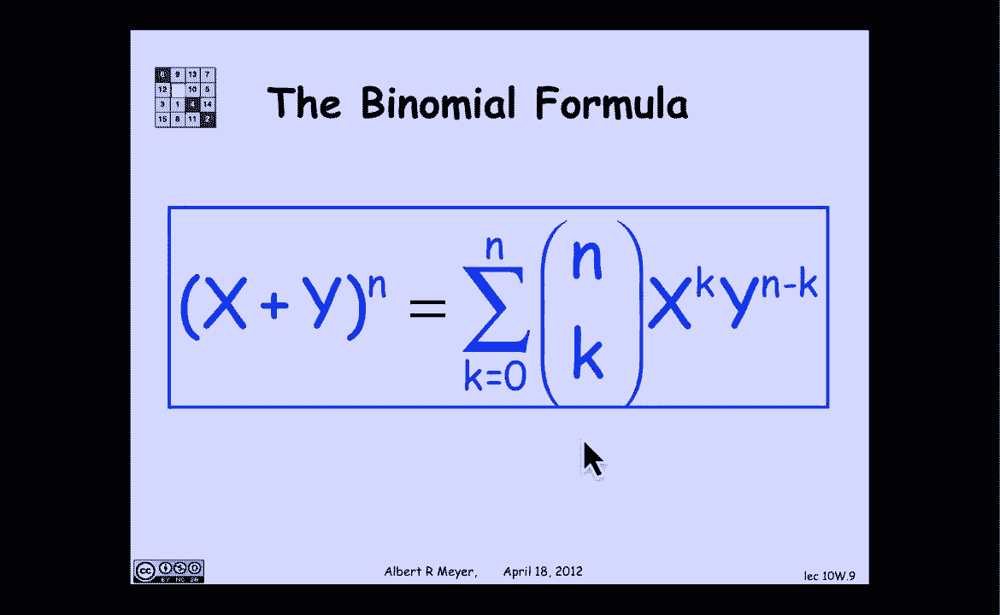

# 计算机科学的数学基础：P79：L3.4.4- 二项式定理 📚

在本节课中，我们将要学习二项式定理。这是一个在高中代数中可能已经接触过的概念，但它也是代数与组合计算之间联系的绝佳例证。我们将从分配律这一基础思想出发，逐步推导出二项式定理的公式，并理解其背后的组合意义。

## 从分配律到乘积之和

上一节我们介绍了分配律的基本思想，本节中我们来看看它如何扩展到多个项。分配律的核心思想是：和的乘积可以转化为乘积的和。

为了直观说明，考虑一个简单的例子：`(a + b) * (c + d)`。应用分配律，我们得到：
```
(a + b) * (c + d) = a*c + a*d + b*c + b*d
```
我们看到，最终的和包含了从第一个括号和第二个括号中各选一项进行相乘的所有可能组合。

当我们将这个规则扩展到 `n` 个 `(1 + x)` 相乘时，情况是类似的。表达式 `(1 + x)^n` 的展开，本质上就是反复应用分配律的结果。

## 二项式定理的推导

现在，让我们具体看看 `(1 + x)^n` 的展开式。我们知道这将是一个 `n` 次多项式，可以写成以下形式：
```
(1 + x)^n = C0 + C1*x + C2*x^2 + ... + Ck*x^k + ... + Cn*x^n
```
我们的目标是找出系数 `Ck` 的表达式。

以 `(1 + x)^4` 为例，其展开式为：
```
(1 + x)^4 = 1 + 4x + 6x^2 + 4x^3 + x^4
```
系数模式为 `1, 4, 6, 4, 1`。这个模式是如何产生的？

关键在于理解 `(1 + x)^n` 是 `n` 个 `(1 + x)` 因子的乘积。展开时，我们需要从每一个因子 `(1 + x)` 中选择 `1` 或者 `x` 进行相乘，然后将所有可能的乘积相加。

*   如果从所有 `n` 个因子中都选择 `1`，则得到项 `1^n = 1`。
*   如果从所有 `n` 个因子中都选择 `x`，则得到项 `x^n`。
*   更一般地，如果从 `n` 个因子中恰好选择 `k` 个 `x`（那么剩下的 `n-k` 个因子自然选择 `1`），则得到项 `x^k * 1^(n-k) = x^k`。

那么，在最终的展开式中，`x^k` 项会出现多少次呢？这等价于问：**从 `n` 个因子中，选出 `k` 个因子令其贡献 `x`（其余贡献 `1`），有多少种不同的选法？**

根据组合数学的定义，这个数量正是 **二项式系数**，记作：
```
Ck = C(n, k) = n choose k
```
因此，我们得到了二项式定理的标准形式：
```
(1 + x)^n = Σ_{k=0}^{n} C(n, k) * x^k
```
其中 `Σ` 表示求和，`k` 从 `0` 到 `n`。

## 更一般的形式

我们之前使用了 `(1 + x)` 是为了简化推导，让结构更清晰。二项式定理可以推广到更一般的形式 `(x + y)^n`。

在 `(x + y)^n` 的展开中，我们需要从每个因子 `(x + y)` 中选择 `x` 或 `y`。如果一项包含了 `k` 个 `x`，则必然包含 `n-k` 个 `y`，该项为 `x^k * y^(n-k)`。而得到这样一项的方法数，同样是从 `n` 个因子中选择 `k` 个来取 `x`（剩下的取 `y`），即 `C(n, k)` 种。

因此，二项式定理的一般形式为：
```
(x + y)^n = Σ_{k=0}^{n} C(n, k) * x^k * y^(n-k)
```
这个公式完美地展示了代数展开与组合选择之间的深刻联系：展开式中每一项的系数，正对应着取得该项所有可能方式的数量。



## 总结


本节课中我们一起学习了二项式定理。我们从基础的分配律出发，理解了多个二项式因子相乘时，展开式是**所有可能选择方式的乘积之和**。进而，我们推导出 `(1 + x)^n` 和更一般的 `(x + y)^n` 的展开公式，并认识到其中的系数 `C(n, k)`（即二项式系数）具有明确的组合意义：它代表了在 `n` 次独立选择中，恰好进行 `k` 次特定选择的方案总数。这一定理是连接多项式代数与组合计数的一个重要桥梁。