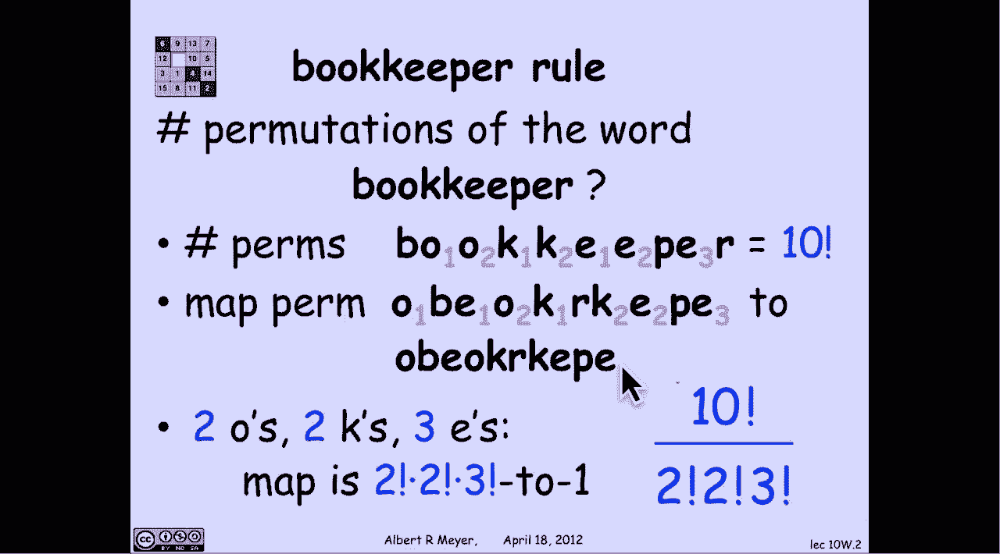
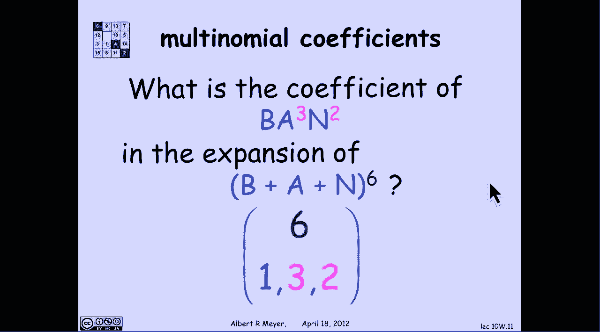
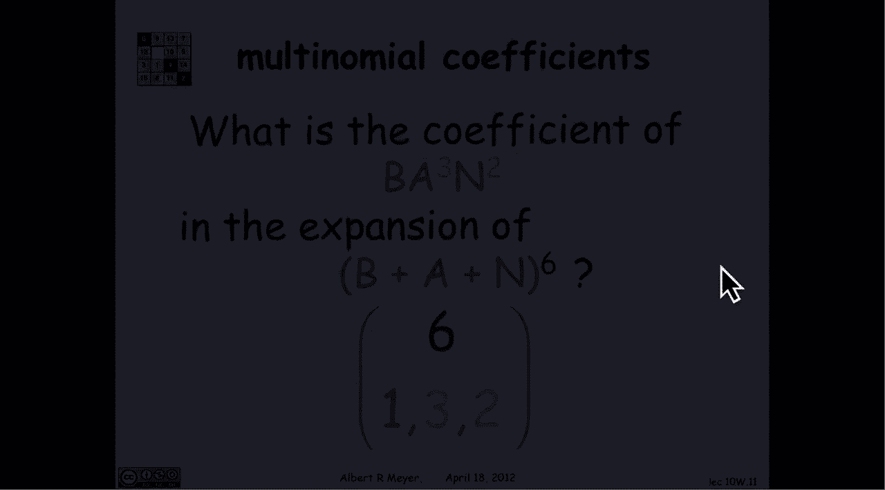

# 计算机科学的数学基础：P80：L3.4.5- 多项式定理 📚

在本节课中，我们将要学习二项式定理的扩展——多项式定理。我们将从一个有趣的“簿记员规则”开始，理解如何计算包含重复元素的排列数，并最终推导出多项式定理的一般形式。

---

## 从二项式到多项式

上一节我们介绍了二项式定理，它处理的是两个项之和的幂次展开。本节中我们来看看它的扩展形式，即多项式定理。多项式定理处理的是**多个项之和的幂次展开**。

二项式定理扩展为一种称为多项式定理的形式。其核心区别在于，我们不再处理两个项之和的乘积，而是处理**K个项之和的乘积**。

---

## 簿记员规则 📖

理解多项式定理的基础是一个我们称之为“簿记员规则”的计数规则。这个名称源于一个具体的例子。

以下是簿记员规则要解决的问题：观察单词“bookkeeper”，并问**有多少种不同的方式可以打乱这个单词中的字母，使其成为可区分的排列**？关键在于，两个字母“O”是不可区分的，它们出现的顺序无关紧要。同样，三个字母“E”和两个字母“K”也是如此。

我们如何回答这个问题？一个简单的方法是，首先给所有不可区分的字母加上下标，使它们变得可区分。

*   我给两个“O”加上下标1和2。
*   给两个“K”加上下标1和2。
*   给三个“E”加上下标1、2和3。

现在，这十个字母都是可区分的了。如果我问有多少种方式排列这十个字母，根据广义乘积规则，答案显然是 **10!**。

我的策略是使用除法规则来计算**没有下标**的字母排列模式的数量。具体做法是：取一个带下标的单词排列，然后擦掉下标。我将它映射到同一个没有下标的字母排列。

例如，我取一个带下标单词的任意排列，然后擦掉下标并合并字母，最终得到这个排列。现在，如果我想计算没有下标的排列数量，我只需要计算出这个映射是“多对一”的。

具体来说，有多少个带下标的单词会映射到给定的无下标模式？答案是：
*   “O”的下标顺序无关紧要，所以下标有 **2!** 种可能的排列顺序。
*   “K”的下标顺序无关紧要，所以下标有 **2!** 种可能的排列顺序。
*   “E”的下标顺序无关紧要，所以下标有 **3!** 种可能的排列顺序。

因此，对于两个“O”、两个“K”和三个“E”，这个映射是 **2! × 2! × 3!** 对 1。根据除法规则，单词“bookkeeper”的字母排列总数是：

**10! / (2! × 2! × 3!)**

更一般地，通过同样的推理，如果我观察一个由n个字母组成的序列，其中有n₁个A，n₂个B，……，nₖ个Z，那么这些包含重复A、B、Z的字母的排列数是：

**n! / (n₁! × n₂! × … × nₖ!)**

这个公式出现得非常频繁，因此它有一个名字，叫做**多项式系数**。其记法为：

**n choose (n₁, n₂, …, nₖ)**

约定是，所有nᵢ的和等于分子n。二项式系数是多项式系数的一个特例。如果我们把它写成多项式系数，就是 **n choose (k, n-k)**。

---

## 应用：展开多项式

我们可以应用这个规则来思考多于二项式的展开式中的系数。

让我们看一个展开五元式的例子：一个包含五个项(E, M, S, T, Y)的和的七次方。

**(E + M + S + T + Y)⁷**

这意味着，在这七个项的乘积中，我得到的是长度为七的“单词”，其组成部分是字母E, M, S, T, Y。如果我应用分配律将其乘开，最终会得到 **5⁷** 个项，每个项都是由字母E, M, S, T, Y组成的一个排列。

如果我问，在这个展开式中，项 **E M S³ T Y** 的系数是多少？它恰好就是**排列这五个字母的方式数量**——一个由这五个字母组成、长度为七、其中S出现三次的单词。换句话说，在这个乘积中，E M S³ T Y 的系数就是**重新排列这个由七个字母组成的序列的方式数量**。我们选择的这个序列是单词“systems”。

根据簿记员规则，重新排列单词“systems”中字母的方式数量是：

**7 choose (1, 1, 3, 1, 1)**

让我们做另一个例子。如果我展开这个三项式 **(B + A + N)⁶**，项 **B A³ N²** 的系数是多少？

现在，我有 **3⁶** 个项。其中有多少项包含一个B、三个A和两个N？根据簿记员规则，它就是**重新排列单词“banana”中字母的方式数量**。根据簿记员规则，那就是：

**6 choose (1, 3, 2)**

---

## 多项式定理的一般形式

更一般地，这就是多项式定理所说的内容：如果我在一个K项之和（K个不同变量的和）的n次幂展开式中，寻找项 **∏ Xᵢ^(rᵢ)** 的系数（即X₁出现r₁次，X₂出现r₂次，……，Xₖ出现rₖ次）。

如果我使用分配律展开而不合并同类项，我会得到 **Kⁿ** 个项，每个项都是X₁到Xₖ的一个排列（允许重复）。然后，如果我问，在这些K个变量的乘积中，有多少个具有这么多X₁、这么多X₂……这么多Xₖ？我再次问了一个簿记员问题，答案是：

**n choose (r₁, r₂, …, rₖ)**

现在，我们准备好记录下一般的多项式公式了。如果我取一个K项之和（一个K项式）的n次幂，那么用简洁的符号表示，其展开式为：

**∑_{(r₁+…+rₖ=n)} [ n choose (r₁, …, rₖ) × (X₁^(r₁) … Xₖ^(rₖ)) ]**

这个公式本身不需要特别记忆，它充满了下标，显得有些复杂。但尽管如此，有时记录下来是有益的。

---

## 总结

本节课中我们一起学习了：
1.  **簿记员规则**：用于计算包含重复元素的排列数，公式为 `n! / (n₁! × n₂! × … × nₖ!)`。
2.  **多项式系数**：记作 `n choose (n₁, n₂, …, nₖ)`，是上述公式的简记法，二项式系数是其特例。
3.  **多项式定理**：将二项式定理推广到多个项之和的幂次展开，展开式中特定项的系数由对应的多项式系数给出。

下周我们将继续探讨计数与代数之间的联系，不仅限于我们在这里看到的普通多项式（和的乘积），事实上还包括无限多项式或无穷级数。