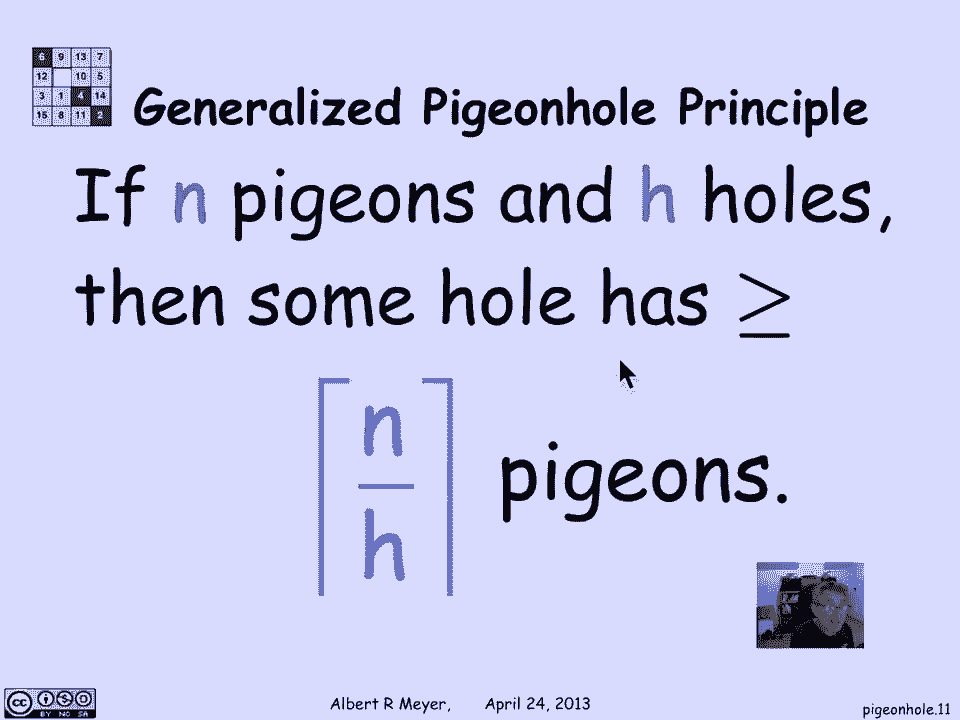

# 计算机科学的数学基础：L3.5.1：鸽子洞原理 🐦

在本节课中，我们将学习一个在计算机科学和数学中都非常基础且强大的计数原理——鸽子洞原理。这个原理看似简单，却能帮助我们解决许多有趣的问题。

## 概述

鸽子洞原理是一种基本的计数原理。它以一种非常直观的方式描述了当物品数量超过容器数量时必然出现的现象。我们将学习它的基本形式、正式表述以及如何应用它来解决一些简单问题。

## 鸽子洞原理的基本形式

上一节我们介绍了计数的基本概念，本节中我们来看看鸽子洞原理。

鸽子洞原理的基本形式非常明显：如果鸽子数量多于鸽子洞的数量，那么至少有一个鸽子洞里会有两只或更多的鸽子。

这实际上是对一个我们已经知道的映射规则的**非正式说法**。从集合论的角度，我们可以这样正式描述：

*   如果存在一个从集合 **A** 到集合 **B** 的**完全单射**，那么意味着集合 **A** 的大小小于或等于集合 **B** 的大小。
*   反之，如果集合 **A** 的大小大于集合 **B** 的大小，那么从 **A** 到 **B** 的完全单射就是不可能的。

“没有完全单射”意味着在映射关系中，**B** 中的至少一个元素会对应 **A** 中的两个或更多元素。这就像至少有两“只”鸽子飞进了同一个“洞”。

## 原理的应用

我们已经知道了这个规则，唯一令人惊讶的是如何利用它。我们不打算在本视频中进行复杂的应用，但你可以在课程资料中读到一些有趣的例子，例如证明波士顿地区一定有三个人拥有完全相同数量的头发，或者证明在九十个由两个五位数组成的数字中，一定存在和相同的两个数。

下面，我们将更温和地应用鸽子洞原理。

### 示例：扑克牌的花色

假设我手上有五张牌。那么我**至少**拥有两张同一花色的牌。为什么？因为只有四种花色（红心、黑桃、梅花、方块）。

如果你有五张牌（鸽子），但只有四个花色（洞），那么当你把牌分配到花色中时，鸽子（牌）必须聚集在一起。因此，至少有一个花色里会有两只或更多的鸽子，也就是说至少有两张同一花色的牌。

### 原理的推广

让我们进一步推广。假设我有十张牌。我**保证**至少拥有多少张同一花色的牌？

现在有四个“插槽”（花色），我需要分发十张卡片。有没有可能每个花色里都少于三张牌？不可能。

因为如果每个花色最多只有两张牌，那么我最多只能分配 **4 * 2 = 8** 张牌。但我有十张牌需要分配到四个花色中，所以我必须把一些牌“捆”在一起，导致至少有一个花色拥有三张或更多的牌。

你可以验证，这里的推理是：同一花色的最少牌数，是将你的牌数除以花色数，并意识到至少有一个花色必须拥有**不低于平均数**的牌数。

更一般地，如果我们有 **n** 只鸽子（物品）要分配到 **h** 个独特的洞（类别）中，那么某个洞里鸽子的数量**至少**是 **n / h** 向上取整的值。

**n / h** 可以理解为每个洞里鸽子的平均数量。因此，鸽子洞原理可以表述为：**至少有一个洞必须容纳大于或等于平均数的鸽子**。

用公式表示这个推广形式：
> 设鸽子数为 `n`，洞数为 `h`，则至少有一个洞包含不少于 `⌈n / h⌉` 只鸽子。

## 总结

本节课中，我们一起学习了鸽子洞原理。我们从其直观的基本形式（鸽子多于洞则必有共享）开始，然后看到了它在集合论中的正式对应关系（完全单射的不可能性）。最后，我们通过扑克牌的例子学习了如何应用这个原理，并将其推广为一个可以计算“至少有多少”的通用公式 `⌈n / h⌉`。这个简单而强大的原理是解决许多计数和存在性问题的基石。