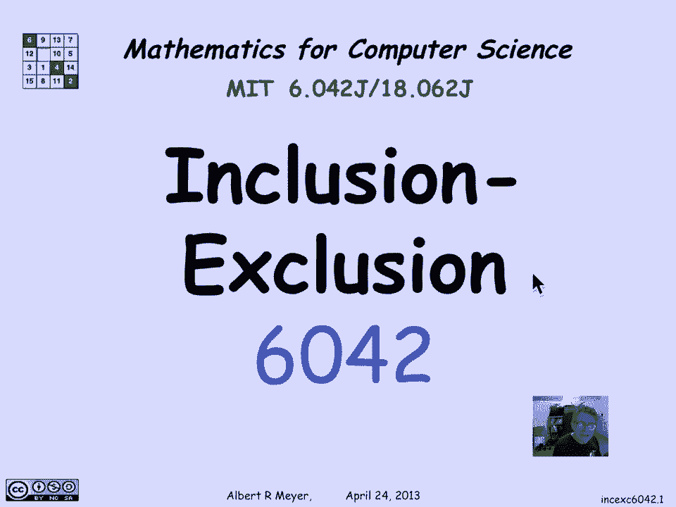
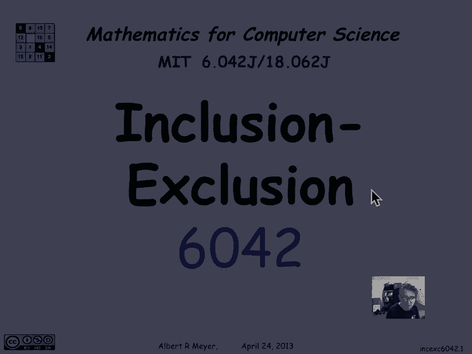
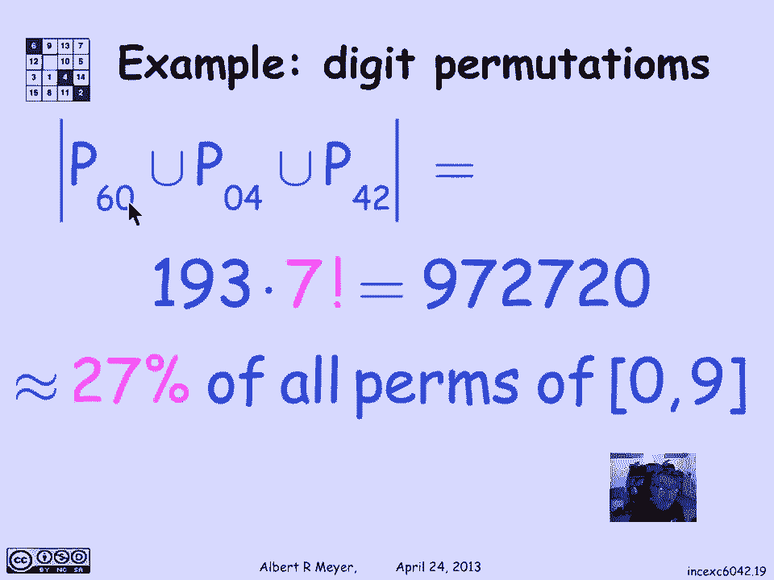

# 计算机科学的数学基础：L3.5.3：容斥原理示例 📊

在本节课中，我们将学习一个重要的计数规则——容斥原理。我们将从一个简单的两集合情况开始，然后将其推广到三个集合，并通过一个具体的数字排列示例来应用这个原理。

## 概述

容斥原理是加法法则的推广，用于计算多个集合的并集大小，尤其适用于这些集合之间存在重叠的情况。我们将首先理解其基本形式，然后通过一个包含特定数字模式的排列计数问题来实践应用。

## 两集合的容斥原理

上一节我们介绍了加法法则，它适用于互不相交的集合。本节中我们来看看当集合存在重叠时，如何计算并集的大小。

加法法则指出，如果两个集合 **A** 和 **B** 互不相交（即 **A ∩ B = ∅**），那么它们的并集大小为：
**|A ∪ B| = |A| + |B|**

然而，如果 **A** 和 **B** 存在重叠，直接相加会将重叠部分计算两次。因此，我们需要减去一次重叠部分。容斥原理的公式为：
**|A ∪ B| = |A| + |B| - |A ∩ B|**

直观解释是：当我们计算 **|A| + |B|** 时，属于交集 **A ∩ B** 的元素被计算了两次。为了得到正确的总数，我们必须减去一次交集的大小，确保每个元素只被计数一次。

## 三集合的容斥原理

理解了两个集合的情况后，我们现在将其推广到三个集合。计算 **A ∪ B ∪ C** 的大小需要更复杂的公式。

对于三个集合 **A**、**B** 和 **C**，容斥原理的公式为：
**|A ∪ B ∪ C| = |A| + |B| + |C| - |A ∩ B| - |A ∩ C| - |B ∩ C| + |A ∩ B ∩ C|**

这个公式的逻辑是：先加上所有单个集合的大小，这会使得两两重叠的区域被计算两次，三重重叠的区域被计算三次。然后，减去所有两两交集的大小，这会使得三重重叠的区域被减去三次，从而未被计数。最后，再加上三重重叠区域的大小，以确保每个元素都被精确计数一次。可以总结为：奇数个集合的交集项为正号，偶数个集合的交集项为负号。

## 应用示例：数字排列计数

现在，让我们应用三集合的容斥原理来解决一个具体的计数问题。我们将计算数字0到9的所有排列中，包含特定连续数字模式的排列数量。

我们考虑以下三个模式：
1.  连续出现“6 0”。
2.  连续出现“0 4”。
3.  连续出现“4 2”。

定义集合：
*   **P₆₀**：包含“6 0”模式的排列集合。
*   **P₀₄**：包含“0 4”模式的排列集合。
*   **P₄₂**：包含“4 2”模式的排列集合。

我们的目标是计算 **|P₆₀ ∪ P₀₄ ∪ P₄₂|**，即至少包含其中一个模式的排列总数。

根据容斥原理：
**|P₆₀ ∪ P₀₄ ∪ P₄₂| = |P₆₀| + |P₀₄| + |P₄₂| - |P₆₀ ∩ P₀₄| - |P₆₀ ∩ P₄₂| - |P₀₄ ∩ P₄₂| + |P₆₀ ∩ P₀₄ ∩ P₄₂|**

接下来，我们分别计算公式中的每一项。

以下是各项的计算过程：

1.  **计算单个集合的大小（如 |P₆₀|）**
    将“6 0”视为一个整体对象。那么我们需要排列的对象包括：这个“6 0”对象，以及剩下的8个独立数字（1, 2, 3, 4, 5, 7, 8, 9）。总共有9个对象，排列方式为 **9!**。
    因此，**|P₆₀| = |P₀₄| = |P₄₂| = 9!**。

2.  **计算两两交集的大小**
    *   **|P₆₀ ∩ P₄₂|**：排列包含“6 0”和“4 2”。将这两个模式视为两个独立对象。需要排列的对象包括：“6 0”对象、“4 2”对象，以及剩下的6个独立数字（1, 3, 5, 7, 8, 9）。总共有8个对象，排列方式为 **8!**。
    *   **|P₆₀ ∩ P₀₄|**：排列同时包含“6 0”和“0 4”，这等价于包含连续模式“6 0 4”。将这个“6 0 4”视为一个对象。需要排列的对象包括：这个“6 0 4”对象，以及剩下的7个独立数字（1, 2, 3, 5, 7, 8, 9）。总共有8个对象，排列方式为 **8!**。
    *   **|P₀₄ ∩ P₄₂|**：排列同时包含“0 4”和“4 2”，这等价于包含连续模式“0 4 2”。将这个“0 4 2”视为一个对象。需要排列的对象包括：这个“0 4 2”对象，以及剩下的7个独立数字（1, 3, 5, 6, 7, 8, 9）。总共有8个对象，排列方式为 **8!**。
    因此，所有两两交集的大小均为 **8!**。

3.  **计算三重重集的大小**
    **|P₆₀ ∩ P₀₄ ∩ P₄₂|**：排列同时包含“6 0”、“0 4”和“4 2”，这等价于包含连续模式“6 0 4 2”。将这个“6 0 4 2”视为一个对象。需要排列的对象包括：这个“6 0 4 2”对象，以及剩下的6个独立数字（1, 3, 5, 7, 8, 9）。总共有7个对象，排列方式为 **7!**。

## 代入公式并计算

现在，我们将计算出的值代入容斥原理公式：
**|P₆₀ ∪ P₀₄ ∪ P₄₂| = 9! + 9! + 9! - 8! - 8! - 8! + 7!**
**= 3 × 9! - 3 × 8! + 7!**

进行具体计算：
*   9! = 362880
*   8! = 40320
*   7! = 5040

代入：
**= 3 × 362880 - 3 × 40320 + 5040**
**= 1088640 - 120960 + 5040**
**= 967680 + 5040**
**= 972720**

因此，在0到9的所有 **10! = 3,628,800** 种排列中，有 **972,720** 种排列至少包含“6 0”、“0 4”或“4 2”中的一个模式，这大约占总排列数的 **26.8%**。

## 总结

本节课中我们一起学习了容斥原理。我们从两集合的基本形式开始，理解了为何需要减去交集以避免重复计数。然后，我们将其推广到更复杂的三集合情况，并掌握了相应的公式：**|A ∪ B ∪ C| = |A| + |B| + |C| - |A ∩ B| - |A ∩ C| - |B ∩ C| + |A ∩ B ∩ C|**。最后，我们通过一个数字排列计数的具体示例，完整地应用了该原理，将复杂问题分解为多个易于计算的子问题，并成功得出了答案。容斥原理是解决重叠集合计数问题的强大工具。